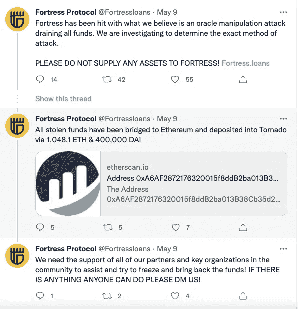
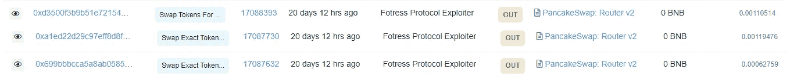
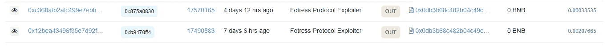
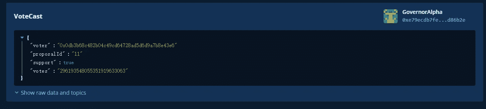
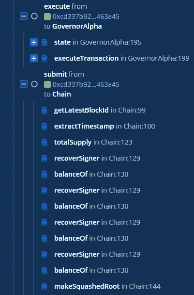
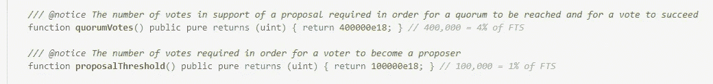
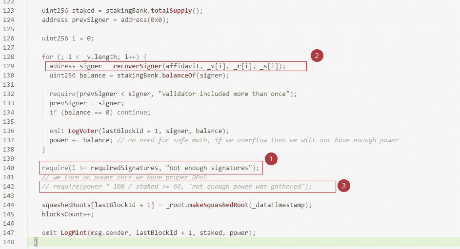

# 堡垒攻击事件分析

> 原文：<https://medium.com/coinmonks/fortress-attack-event-analysis-bd30157e7dc9?source=collection_archive---------25----------------------->

## 0x01 事件背景

2022 年 5 月 9 日堡垒贷款遇袭。Fortress 是一个基于 BSC 的分散金融借贷和稳定协议。目前该项目已损失约 1048.1 ETH，40 万 DAI(总价值约 298 万美元)。

## 0x02 攻击信息

*   攻击者的主要利用交易

0x13d 19809 b 19 AC 512 da 6d 6d 110764 caee 75 e 2157 ea 62 CB 70937 c 8d 9471 afcb 061 BF

*   攻击者的主要利用交易

0 xa 6 af 2872176320015 F8 DDB 2 ba 013 b 38 CB 35d 22 ad

*   攻击者创建的合同地址

0x CD 337 b 920678 cf 35143322 ab 31 ab 8977 c 3463 a 45(自毁)

0x 0 db 3 b 68 c 482 b 04 c 49 CD 64728 ad 5d 6d 9 a 7 b 8 e 43 e 6((提案与表决工具合同)

0x 39 e 7 fc 9 f 6565 c 68104 b 01689 fcf 0487 afbf 06656(攻击者预先测试的工具契约)

*   Oracle 相关合同地址

0xc 11 b 687 CD 6061 a 6516 e 23769 e 4657 b 6 EFA 25d 78 e

*   与治理相关的合同地址

0 xe 79 ecdb 7 fedd 413 e 697 f 083982 BAC 29 e 93d 86 B2 e

## 0x03 攻击分析

1.  攻击者通过 PancakeSwap: Router v2 用大约 11.126 个 ETH 交换了大约 400413.3278 个 FTS 令牌

2.攻击者在正式攻击前进行了大量的测试，向要塞总督阿尔法发起了恶意提案№11(更改贷款合同中 FTS 令牌的抵押系数)，然后攻击者用兑换的 FTS 令牌对自己的提案投了赞成票。同时，将 FTS 代币存入借款合同作为抵押。

3.提案通过后，攻击者使用攻击契约执行提案，并使用 oracle 相关契约中的 **submit()** 函数更新贷款契约使用的价格。通过更新抵押系数，攻击者的抵押品(FTS)的价值被改变。大幅增长；

4.攻击者使用 FTS 令牌交换大量其他令牌，并最终将所有其他令牌转换为 ETH 和 DAI 令牌。

## 0x04 漏洞详细信息

通过对攻击交易的分析可以看出，攻击者通过治理契约执行恶意提议，通过恶意提议篡改了堡垒贷款项目中价格甲骨文的相关参数，导致 FTS 币价格暴涨，最终获利；

恶意提案的成功执行是由于 Fortress Loans 使用的治理合同中存在设计缺陷；根据治理契约源代码中的相关配置(同意提案的最低票数)小于攻击者持有的数量，提案通过。

成功投票所需的最低 FTS 令牌为 40 万，但由于 FTS 令牌价格低廉，攻击者仅用约 11 ETH 换取了 40 多万 FTS 令牌。

通过分析 oracle contract 的源代码，可以发现用于更新价格的 **submit()** 函数可以被任何角色调用，如下所示:

①仅验证签名的数量，但不判断在②获得的签名地址的有效性，从而可以使用任意数量的地址签名来绕过。③必要的验证语句被注释掉，所以不验证票数。这些问题共同导致了任何人都可以调用的提交函数。

## 0x05 总结

根据此次攻击事件，安全风险是链条上治理相关函数的设计缺陷，oracle 契约中更新价格的函数可以任意调用。从攻击者的交易可以看出，攻击者蓄谋已久，一个月前甚至更早就开始测试项目。制造了一系列攻击契约或者攻击辅助契约，主攻击契约在完成攻击后自毁，攻击的利润也通过 **cBridge** ( **Celer** 网络)等跨链桥转移到以太坊。系列中的后续交易被发送到 Tornado Cash mixer。

> 加入 Coinmonks [电报频道](https://t.me/coincodecap)和 [Youtube 频道](https://www.youtube.com/c/coinmonks/videos)了解加密交易和投资

# 另外，阅读

*   [3 商业评论](/coinmonks/3commas-review-an-excellent-crypto-trading-bot-2020-1313a58bec92) | [Pionex 评论](https://coincodecap.com/pionex-review-exchange-with-crypto-trading-bot) | [Coinrule 评论](/coinmonks/coinrule-review-2021-a-beginner-friendly-crypto-trading-bot-daf0504848ba)
*   [莱杰 vs Ngrave](/coinmonks/ledger-vs-ngrave-zero-7e40f0c1d694) | [莱杰 nano s vs x](/coinmonks/ledger-nano-s-vs-x-battery-hardware-price-storage-59a6663fe3b0) | [币安评论](/coinmonks/binance-review-ee10d3bf3b6e)
*   [Bybit Exchange 审查](/coinmonks/bybit-exchange-review-dbd570019b71) | [Bityard 审查](https://coincodecap.com/bityard-reivew) | [Jet-Bot 审查](https://coincodecap.com/jet-bot-review)
*   [3 commas vs Cryptohopper](/coinmonks/3commas-vs-pionex-vs-cryptohopper-best-crypto-bot-6a98d2baa203)|[赚取加密利息](/coinmonks/earn-crypto-interest-b10b810fdda3)
*   最好的比特币[硬件钱包](/coinmonks/hardware-wallets-dfa1211730c6) | [BitBox02 回顾](/coinmonks/bitbox02-review-your-swiss-bitcoin-hardware-wallet-c36c88fff29)