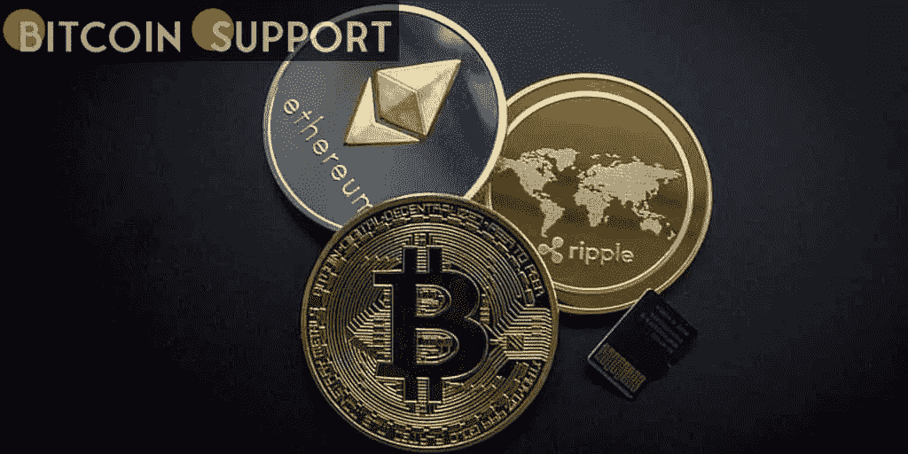
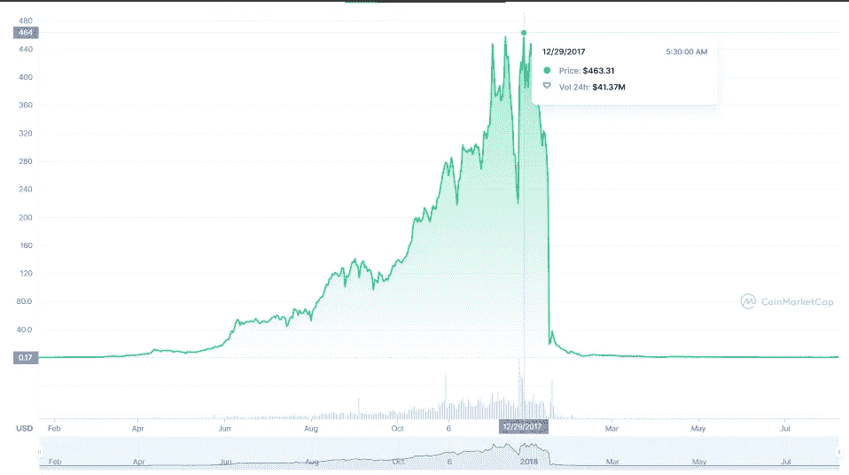

# BitConnect 创始人因 24 亿美元加密庞氏骗局被起诉

> 原文：<https://medium.com/coinmonks/founder-of-bitconnect-indicted-for-2-4b-crypto-ponzi-67ed41bf3930?source=collection_archive---------37----------------------->

**Visit our website:-** [**https://bitcoinsupports.com/**](https://bitcoinsupports.com/)

Kumbhani 被圣地亚哥的一个联邦大陪审团起诉，罪名是通过 BitConnect 的“贷款计划”实施所谓的庞氏骗局，以及其他罪行。著名加密交易所 BitConnect 的创始人 Satish Kumbhani 被指控欺诈全球投资者，涉嫌欺骗和抢劫他们 24 亿美元。

圣地亚哥的一个联邦大陪审团专门起诉 Kumbhani 通过 BitConnect 的“贷款计划”指挥所谓的庞氏骗局，据 DOJ:

“BitConnect 是一个庞氏骗局，用后来 BitConnect 投资者的钱支付早期 bit connect 投资者。Kumbhani 和他的合伙人总共从投资者那里筹集了 24 亿美元。

**Visit our website:-** [**https://bitcoinsupports.com/**](https://bitcoinsupports.com/)

根据 DOJ 的数据，在 2017 年的热潮中，BitConnect 的交易价格创下了 463.31 美元的历史新高，市值为 34 亿美元。然而，如上图所示，价格在几个月内暴跌，导致投资者遭受重大损失。根据 BitConnect 的“贷款计划”，住在印度古吉拉特邦的 Kumbhani 据称向投资者承诺“可观的收入和有保证的回报”。根据起诉书，Kumbhani 在突然关闭该计划之前，用新投资者的现金部分偿还了现有投资者，犯下了典型的庞氏骗局。DOJ 进一步声称 Kumbhani 及其同伙操纵市场，为 BCC 制造虚假需求。据称，这些钱是通过“BitConnect 的比特币钱包集群和不同的国际加密货币交易所”隐藏和转移的。前 BitConnect 发起人格伦·阿卡罗(Glenn Arcaro)于 2021 年 9 月承认了与他在现已停业的加密交易和借贷平台中的角色有关的欺诈指控，证实了 DOJ 的说法。起诉书称，Kumbhani 涉嫌违反美国法规，没有按照《银行保密法》的要求向金融犯罪执法网络(FinCEN)注册。总的来说，DOJ 的新闻稿称“Kumbhani 被控串谋电信诈骗、电信诈骗、串谋操纵商品价格、经营未经注册的汇款业务以及串谋国际洗钱。”

联邦调查局克利夫兰办事处和国税局刑事调查部目前正在调查此事(CI)。如果所有罪名成立，Kumbhani 将面临最高 70 年的监禁。此外，DOJ 建议所有 BitConnect 投资者登记为潜在受害者。2 月 20 日提交的一项新的集体诉讼寻求陪审团对知名名人和有影响力的人进行审判，因为他们涉嫌参与涉及 SafeMoon tokens 的经典泵和转储操作。根据诉讼，SafeMoon 及其子公司被指控模仿现实生活中的庞氏骗局，以无法实现的利润为幌子，欺骗投资者购买 SafeMoon 代币。

[https://Twitter . com/WoofManCapital/status/1384866533927800837](https://twitter.com/WoofManCapital/status/1384866533927800837)

该诉讼由原告比尔·梅雷瓦德尔、克里斯多夫·普莱德和蒂姆·维亚尼撰写，旨在代表并赔偿所有在 2021 年 3 月 8 日之前购买 SafeMoon 代币的人，以及所谓的地毯拉票行为的受害者。

**访问我们的网站:-**[**https://bitcoinsupports.com/**](https://bitcoinsupports.com/)

**免责声明:以上为作者观点，不应视为投资建议。读者应该自己做研究。**

> *加入 Coinmonks* [*电报频道*](https://t.me/coincodecap) *和* [*Youtube 频道*](https://www.youtube.com/c/coinmonks/videos) *了解加密交易和投资*

# 另外，阅读

*   [Bookmap 评论](https://coincodecap.com/bookmap-review-2021-best-trading-software) | [美国 5 大最佳加密交易所](https://coincodecap.com/crypto-exchange-usa)
*   最佳加密[硬件钱包](/coinmonks/hardware-wallets-dfa1211730c6) | [Bitbns 评论](/coinmonks/bitbns-review-38256a07e161)
*   [新加坡十大最佳加密交易所](https://coincodecap.com/crypto-exchange-in-singapore) | [购买 AXS](https://coincodecap.com/buy-axs-token)
*   [红狗赌场评论](https://coincodecap.com/red-dog-casino-review) | [Swyftx 评论](https://coincodecap.com/swyftx-review) | [CoinGate 评论](https://coincodecap.com/coingate-review)
*   [投资印度的最佳密码](https://coincodecap.com/best-crypto-to-invest-in-india-in-2021)|[WazirX P2P](https://coincodecap.com/wazirx-p2p)|[Hi Dollar Review](https://coincodecap.com/hi-dollar-review)
*   [加拿大最佳加密交易机器人](https://coincodecap.com/5-best-crypto-trading-bots-in-canada) | [库币评论](https://coincodecap.com/kucoin-review)
*   [用于 Huobi 的加密交易信号](https://coincodecap.com/huobi-crypto-trading-signals) | [HitBTC 审查](/coinmonks/hitbtc-review-c5143c5d53c2)