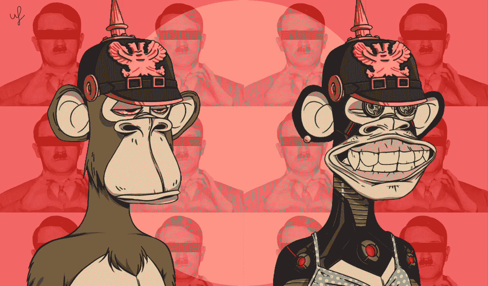

# 无聊猿的创始人反驳了纳粹主义的指控，并解释了他们的标志的灵感来源

> 原文：<https://medium.com/coinmonks/founders-of-bored-ape-refute-allegations-of-nazism-and-explain-what-inspired-their-logos-d040ce81f43d?source=collection_archive---------3----------------------->

## 无聊猿雅赫特俱乐部的创始人说，他们是“疯狂造谣运动的目标。”在周五发表的一篇媒体文章中，他们驳斥了艺术家 Ryder Ripps 和 YouTuber Filion 的说法，他们在一个长达一小时的 YouTube 视频中指责他们与纳粹有联系。

**This preview will be included in the NFT collection called “**[**Uncle Fibonacci News**](https://opensea.io/collection/uncle-fibonacci-news)**”**

> “我们已经成为疯狂的造谣运动的目标，指责我们——一群犹太人、土耳其人、巴基斯坦人和古巴人的朋友——是绝密的纳粹分子。即使为了保护世界各地的犹太人免受这种仇恨和诽谤而存在的 ADL 已经证实这不是真的，但巨魔仍然在网上传播荒谬的阴谋论，并利用它们来销售 NFT 的假冒产品(惊讶！)该组织在一份声明中表示。

本周早些时候，Filion channel 上一个长达一小时的 YouTube 视频包括一系列关于创始人涉嫌纳粹联系的说法，并敦促 Twitter 用户使用#BURNBAYC 标签反对该组织。目标是鼓励已知的猿主人销毁他们的非传染性非典型肺炎。

在过去的几个月里，BAYC 面临着一系列批评，其中以美国艺术家 Ryder Ripps 为首，他在自己的网站上表示，自 12 月以来，他一直在“调查 BAYC 和颠覆性的纳粹巨魔文化之间的广泛联系”。

在 5 月中旬，他发布了 RR/BAYC，这是一个 NFT 集合，复制了最初 BAYC NFTs 的设计。

瑞普斯和菲利翁主张推广这样一种观点，即 BAYC 系列充满了对纳粹意识形态的微妙点头，只有那些深深沉浸在互联网亚文化中的人才会明显看出这一点。他们指出了大量所谓的证据，包括 BAYC 标志和纳粹图腾科夫(头骨和交叉骨图像)之间的明显相似性，创始人选择的在线名称，家庭成员社交媒体个人资料上的短语，以及收藏中可能对右翼极端主义社区具有重要意义的数字。

BAYC response 概述了他们对为什么选择某些名称和设计的解释，包括详细说明标志开发过程的电子邮件，他们说这是朋克灵感、街头服装和滑板参考、航海旗和三角旗的混合。还有旧游艇俱乐部的旗帜。

> “我们从来不想把自己看得太重，所以这个俱乐部看起来破旧不堪，毫无特色。关于 BAYC 的一切都应该传达一种天真和荒谬的气氛…总的来说，我们认为这些阴谋论能够扩散是疯狂的。它真正展示了一个疯狂的网络巨魔可以拥有的力量，”创始人说。

📰 ***订阅*** [***斐波那契***](/@unclefibonacci) ***我来保持最新***

☕️eth:0x40a 8443813 e 8 fa 4a 9 f 88 f 18 b 77442 aa 4ed 91 fd4c

☕️BTC:1kkekcmdrghajztfxjoq 5 otg bv 1 mgucwdj

> 加入 Coinmonks [电报频道](https://t.me/coincodecap)和 [Youtube 频道](https://www.youtube.com/c/coinmonks/videos)了解加密交易和投资

# 另外，阅读

*   [Bookmap 点评](https://coincodecap.com/bookmap-review-2021-best-trading-software) | [美国 5 大最佳加密交易所](https://coincodecap.com/crypto-exchange-usa)
*   [加密交易机器人](/coinmonks/crypto-trading-bot-c2ffce8acb2a) | [硬币门评论](https://coincodecap.com/coingate-review)
*   最佳加密[硬件钱包](/coinmonks/hardware-wallets-dfa1211730c6) | [Bitbns 评论](/coinmonks/bitbns-review-38256a07e161)
*   [新加坡十大最佳加密交易所](https://coincodecap.com/crypto-exchange-in-singapore) | [购买 AXS](https://coincodecap.com/buy-axs-token)
*   [红狗赌场评论](https://coincodecap.com/red-dog-casino-review) | [Swyftx 评论](https://coincodecap.com/swyftx-review)
*   [投资印度的最佳密码](https://coincodecap.com/best-crypto-to-invest-in-india-in-2021)|[WazirX P2P](https://coincodecap.com/wazirx-p2p)|[Hi Dollar Review](https://coincodecap.com/hi-dollar-review)