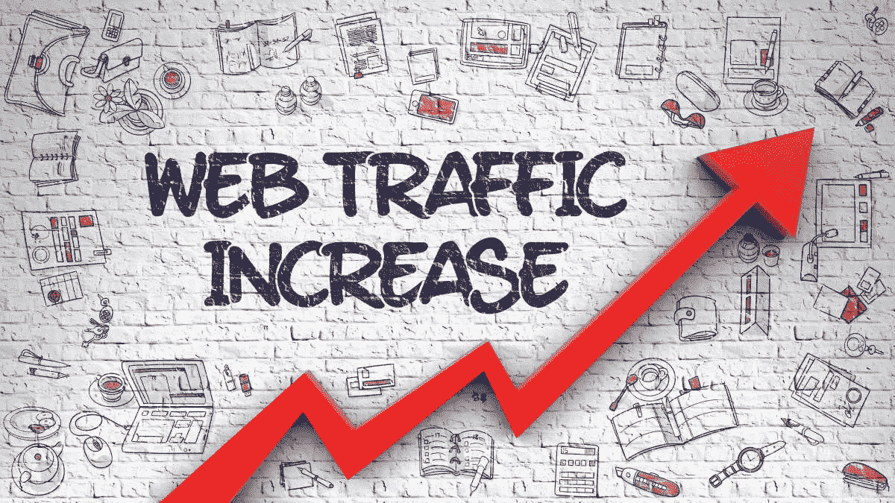
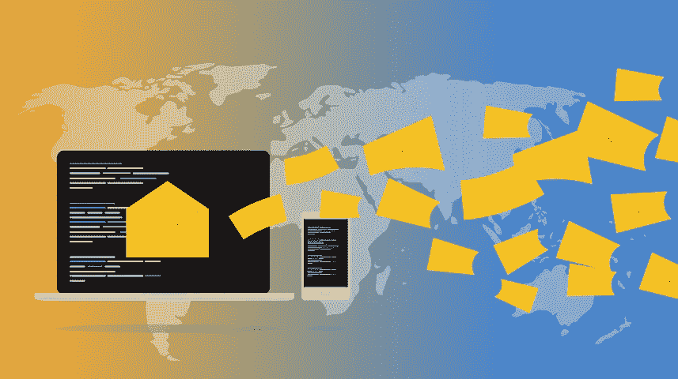
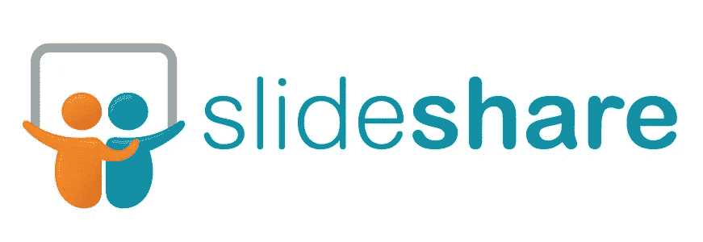
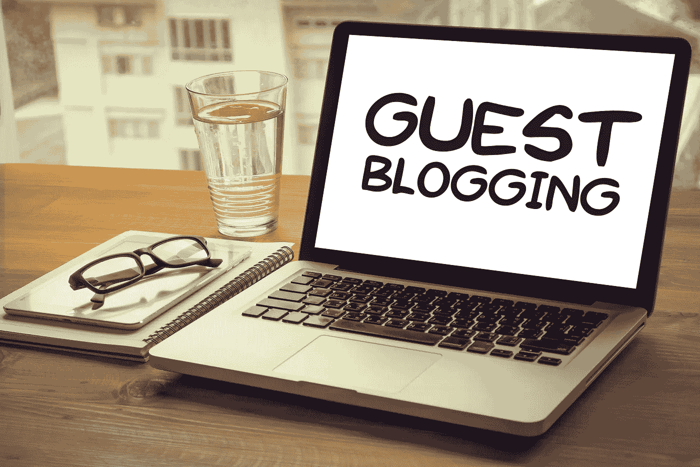
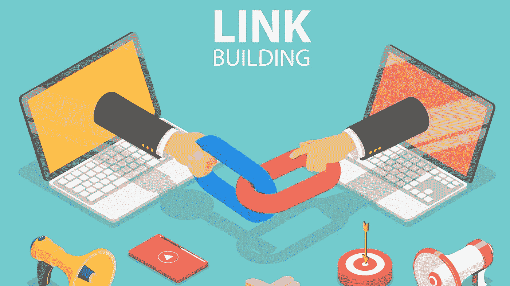

# 如何获得大流量的 14 个实用步骤

> 原文：<https://medium.com/coinmonks/fourteen-practical-steps-on-how-to-gain-massive-traffic-4b4d2ac9ed22?source=collection_archive---------41----------------------->

**Gain Massive Traffic**

博客最重要的组成部分之一是为你的网站输送流量，最好是好的流量，因为不好的流量只会激怒你。你还必须通过恰当地吸引他们来保持他们的到来。

**你为什么渴望流量？**

1.  流量转化为更多的意见
2.  如果管理得当，更多的浏览量会带来更多的收入。

**网络流量可以分为四种主要类型，主要是:-**

**直接流量:-** 这些流量来自那些已经知道你的品牌并通过在他们的网络浏览器中输入你的网站名称直接访问你的网站的人

**推荐流量:-** 这是通过其他网页的外部链接到达你网站的流量。

**有机流量:-** 这些流量是通过搜索引擎优化辅助的在线搜索获得的。

**社交流量:-** 人们通过 Instagram、脸书、Twitter 等社交媒体上的链接访问你的网站。

**付费流量:-** 这些是由 Adwords、再营销等构成的。

那么，你现在如何驱动你的网站流量呢？好吧，我们将着眼于一系列因素的组合，这些因素共同作用才能产生预期的结果。

## 1.吸引流量的引人注目的话题

**Attention-Grabbing Topic**

为什么某些话题比其他话题更吸引你？你正在向下滚动一页，这时你突然停下来，悬停在一个标题或主题上，点击它可以了解更多信息。

它很可能吸引了你的注意力，因为它有趣又吸引人。这是他们应该被组织的方式。你还应该确定它代表了什么是需求，人们在寻找什么。这就是谷歌趋势派上用场的地方，这就引出了我们的第二点。

## 2.分析你的标题

“平均而言，阅读标题的人数是阅读正文的 5 倍。当你写下你的标题时，你已经花掉了 1 美元中的 80 美分”——大卫·奥格威

这是相当准确的。当你在搜索引擎中输入一个搜索词，搜索结果就会出现，在进入下一部分之前，你可以浏览标题，寻找有趣或值得注意的内容。

标题分析器可以帮助解决这个问题。Coschedule 是一个很好的选择，因为它快速有效。它会彻底分析你的标题，并为你提供一些改进的建议。

术语“如何做”、“列表”和“问题”非常有用，应该使用。如果你想在你的标题中点燃一把火，你需要使用情绪化和强有力的术语。

## 3.细致的关键词研究

**Meticulous Keywords Research**

做足功课并选择与你的内容相关的关键词是很重要的。如果对你的网站有大量的访问是至关重要的，这是必须的。如果没有人搜索你在文章中使用的词语，你的网站就不太可能获得很高的流量。

你的文章应该用它们来点缀，但不要到了影响阅读和流畅的程度。这只会激怒你的读者。它必须完美地执行。谷歌关键词工具和类似的网站是你可以利用的两个工具。

**您将会看到的内容包括:-**

1.  有多少人真的在搜索这个词？
2.  它会吸引合适的观众吗？
3.  你的排名会和你的竞争对手一样好或者更好吗？

## 4.基石内容

这些是你网站上最重要的文章。它们是组织其他一切的基础，它们展示了你的网站的全部内容。常青树内容是一个用来描述基石内容的术语。

这种类型的内容应该围绕你想在搜索引擎中排名的关键词产生，并且应该出现在你网站最初的几页上。

你的基础文章必须深入全面，涵盖主题的每个方面。随着时间的推移，以下与你的基础文章相关的文章应该链接到这些包罗万象的文章。

## 5.令人惊叹的图像

**Stunning Images**

是的，我是说非常漂亮。图像、图片和图片都为你的帖子提供了视觉吸引力。我们人类在网上的注意力是有限的，所以你需要一些能立刻抓住他们兴趣的东西，让他们想了解更多。

你必须利用图像正迅速成为通用语言这一事实。人们还发现，有图片的出版物比没有图片的出版物获得的总浏览量多 95%。

然而，为了避免违反版权规则，一定要为所使用的照片提供适当的信用，或者搜索和使用免版税的图像。

## 6.页面加载时间

谷歌在对网站进行排名时会考虑很多因素，页面加载时间是其中之一。如果你的网站加载时间太长，你会损失流量。

缩短加载时间的方法:-

1.  删除不需要的插件
2.  优化您的图像
3.  使用 CDN(内容交付网络)
4.  减少主页上的帖子数量

你可以使用 Google PageSpeed Insight 和 GTmetrix 这样的工具来分析你的博客页面加载速度。

## 7.电子邮件活动

**Email Campaign**

统计数据显示，电子邮件的转化率是社交媒体的三倍。电子邮件活动是对你的博客的一项值得的投资。

你现在所要做的就是确保你包含了相关或相关的内容，并以电子邮件简讯的形式发送出去。获得电子邮件注册可能具有挑战性，但你可以利用这些尝试和真正的方法。

1.  提供订阅表单
2.  建立你的电子邮件列表
3.  选择活动的类型—时事通讯、优惠、公告等。
4.  创建您的活动
5.  衡量你的结果

## 8.上在线论坛

论坛，人们提问和回答问题的地方，是一个很好的闲逛和建立追随者的地方。留意与你的文章相关的主题和问题，你会很快拥有一大批追随者。

例如，Quora 和 Reddit 可能会让你很快接触到每月超过 100 万的访问者。通过在论坛上给出的回复中包含您的博客条目的链接，观察您的受众的增加。

## 9.利用幻灯片共享

**Make Use Of SlideShare**

Slideshare 对于补充你的博客内容和吸引大量访问者来说非常有用。如果做得正确，你的幻灯片可能会比博客文章更受欢迎。确保你的演示文稿包含一个指向你的博客的链接。

## 10.帖子的频率和长度

你提交的文章越多，你获得的流量就越多，我们不是在谈论任何旧帖子；我们谈论的是高质量、经过充分研究的作品。

如果你觉得自己无法跟上，你可以从自由职业者、Guru 或 Upwork 等网站雇佣作家来帮你。

较长的材料(至少 1000 字)通常比较短的材料在搜索引擎中排名更高。它们也更容易被分享和链接，所以多做一些，让它们更长。

## 11.利用内容监管网站

**Make Use Of Content Curation Sites**

如果你确定你的文章的质量，你可以把它们提交给这些网站，这些网站不断地寻找好的内容给他们的读者，并期待一些好的流量。

您可以提交的网站包括:-

1.  博客互动
2.  特里伯
3.  BizSugar

## 12.易于共享

在你的页面上，或者更好的是在你的帖子上，社交媒体分享按钮的出现是必须的。它让读者很容易快速分享和传播你的帖子。脸书，领英。Twitter，Instagram，Pinterest，还有其他的都有用。

## 13.客座博文

**Guest Post**

将你的博客放在其他网站上，以迎合你的目标人群，这将有助于增加读者群和品牌曝光率。你可以利用他人的善意来吸引访问者回到你的博客。

确保包含一个链接回到你的博客，并写下优秀的条目。反向链接是挣来的，你拥有的越多，你就越有可能在搜索引擎排名中排名靠前。

客人网站也将受益，因为他们将从不同的角度接收新的和原始的信息。你可以称之为生命的新生。对大家来说都是双赢。

## 14.链接

**Link Building**

从你的文章链接到另一个网站的页面，被称为出站链接，有助于谷歌提高你的排名。更重要的是，你链接到的网站也可能链接回你。

出站链接为读者提供了额外的资源和材料，帮助他们寻找答案和信息。

您还可以在博客中从一篇文章链接到另一篇文章，这被称为内部链接。上面已经提到了反向链接。

## 我的看法

流量的主题——获得流量、保持流量、扩大流量——已经成为任何有抱负、严肃或注重结果的博客作者都不能忽视的焦点。

毕竟，写博客或任何其他在线活动的主要目的是收集数据。

如果没有人看到或阅读，发布一个优秀的帖子有什么意义？

只有当我们的受众扩大，我们收到大量的评论、提及和分享，我们才会有动力产生更好的内容，更不用说来自所有流量的潜在金钱了。

我希望你喜欢这个博客。如果你每天都想要这种类型的博客，那就跟着我吧。

获得免费培训学习 [***如何在不制作视频的情况下在 YouTube 上赚钱***](https://bit.ly/youtube-earning) 。

> 加入 Coinmonks [电报频道](https://t.me/coincodecap)和 [Youtube 频道](https://www.youtube.com/c/coinmonks/videos)了解加密交易和投资

# 另外，阅读

*   [5 款最佳免费加密货币制图工具](https://coincodecap.com/crypto-charting-tools)
*   [最佳比特币保证金交易](/coinmonks/bitcoin-margin-trading-exchange-bcbfcbf7b8e3) | [萝莉点评](/coinmonks/lolli-review-e6ddc7895ad8) | [比特币保证金交易](https://coincodecap.com/bityard-margin-trading)
*   创造并出售你的第一个 NFT | [密码交易机器人](https://coincodecap.com/best-crypto-trading-bots)
*   [如何在 CoinDCX 上购买柴犬(SHIB)币？](https://coincodecap.com/buy-shiba-coindcx)
*   [CBET 评论](https://coincodecap.com/cbet-casino-review) | [库科恩 vs 比特币基地](https://coincodecap.com/kucoin-vs-coinbase) | [拜比特 vs 比特币基地](https://coincodecap.com/bybit-vs-coinbase)