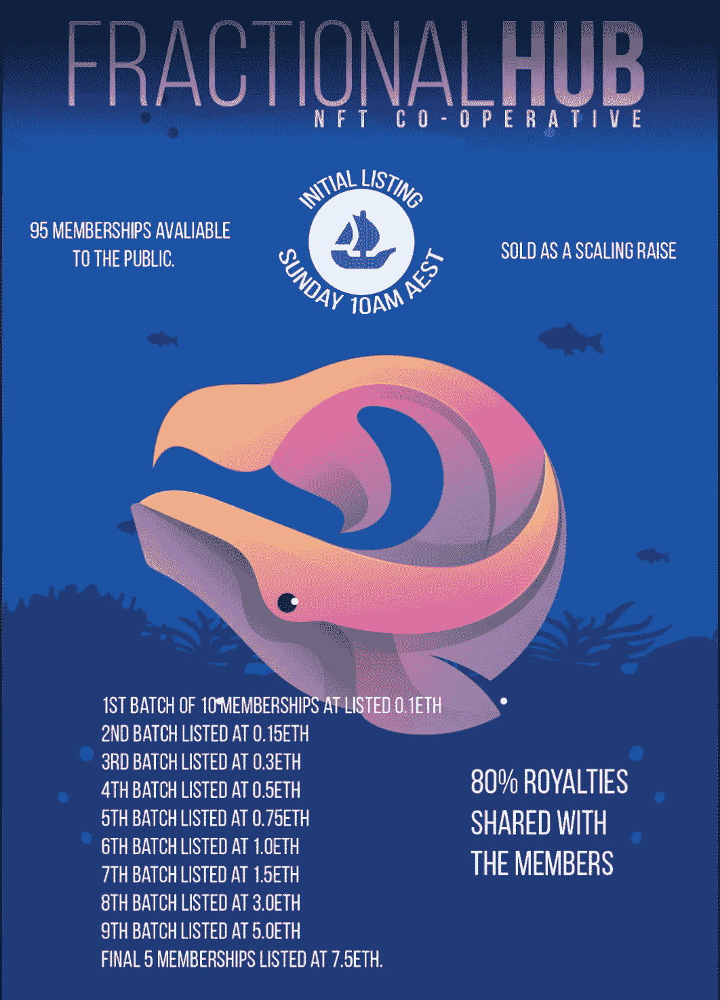
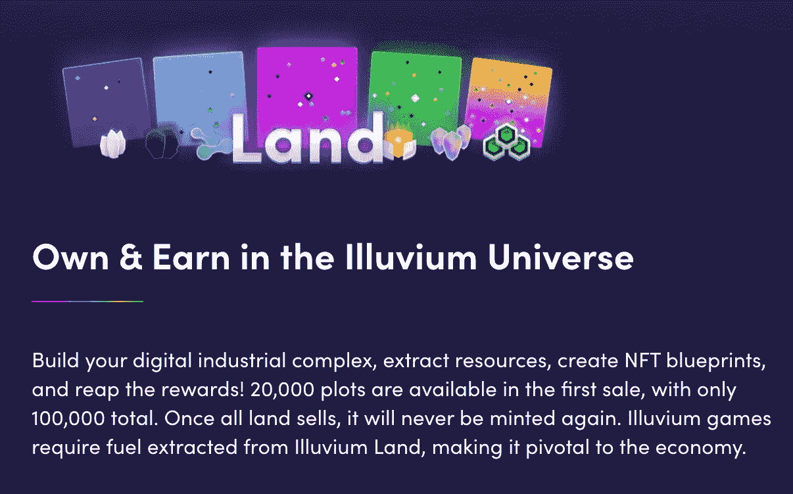
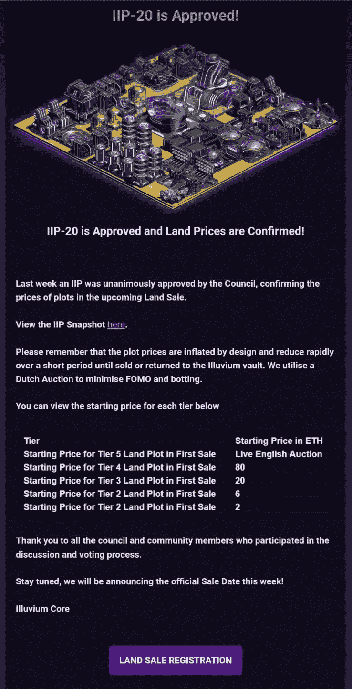
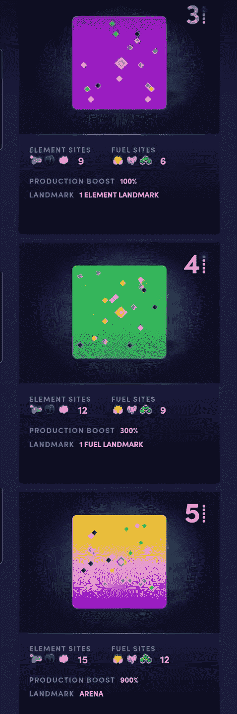

# 部分集线器成员资格 NFTs

> 原文：<https://medium.com/coinmonks/fractional-hub-membership-nfts-72153a3a3a30?source=collection_archive---------22----------------------->

## 如何访问我们的合作中心，并确保您在所有未来合作筹款活动中的地位，以及在协商一致决策中的发言权。

## 该社区将只有 150 个部分中心会员资格。

FractionalHub

# 为了感谢我们现有的社区与我们站在一起，使这些细分的蓝筹基金成为现实，我们将从以前的募集活动中向现有的 CoOp 社区成员空投 55*份会员资格！

## 这将是一个选择加入空投，并要求现有成员加入我们的 FractionalHub 频道不和谐。
[https://discord.gg/ukaNwW78tk](https://discord.gg/ukaNwW78tk)

## Justin 将很快与 CoOp-communities 的现有贡献者联系，以协调您未来活动的独家 FractionalHub 会员空投...

空投包括来自 CloneX-CoOp、GNSS-CoOp、Satoshi-island-CoOp 和 Otherside-Land-CoOp 的贡献者。

# 剩余的 95* FractionalHub 会员资格将在 Opensea 上列出，面向更广泛的社区销售。

## 会员资格将以 10 英镑的间隔按比例定价列出。

## 第一批 x 10 个会员将于 0.1 日上市
第二批 10 个将于 0.15 日上市
第三批 10 个将于 0.3 日上市
第四批将于 0.5 日上市
第五批将于 0.75 日上市
第六批将于 1.0 日上市
第七批将于 1.5 日上市
第八批将于 3.0 日上市
第九批上市

[Sunday 8th of May — 10 am AEST](https://discord.gg/ukaNwW78tk)

从会员销售中筹集的资金将用于基础设施的扩展，运营费用，活动和其他进一步发展的酷想法。

## FractionalHub 会员资格的 Opensea 版税将设定为 7.5%。

-二级 ETH 版税收入的 80%将与所有 FractionalHub NFT 持有者分享。

- 20%将捐给 FractionalHub 团队，用于扩张、基础设施、运营开支、会员活动和其他酷点子。

# 为什么要扩大销售？为什么是会员？为什么选择分数集线器？

## 作为一个优质社区，质量高于数量是我们的目标，所以我们将保持它的 150 个合作者的独家。

缩放销售允许一个缩放底价和一个新的和早期的合作者快乐的媒介。

随着时间的推移，合作社证明了自己及其服务是一个值得加入的俱乐部，随着我们扩大到最多 150 名成员，俱乐部的成功反映在所有持有人的会员价值上。

更重要的是，提高销售价格允许社区有机会在销售批次之间进出，创造交易机会或随着时间的推移兑现资本收益，如果他们希望在底价攀升时传递他们的独家访问 NFT。

## 保持 it 质量和令牌门。

代币门是建立一个提供优质服务的独家合作俱乐部的绝佳方式。

## “持有此令牌，获得访问权限和好处”

FractionalHub 令牌持有人将可以通过我们的 FractionalHub 私人筹款渠道 Discord 参与所有未来的合作筹款活动。这些合作筹款活动需要相当多的协调，因此为了确保质量控制，最多有 150 名关系紧密的成员可以参加。

## 这些位置将只提供给持有 NFT 会员资格的 FractionalHub 会员。

# 那么，我们为什么要推出 FractionalHub 呢？

## 随着我们推出更多细分的 NFT 基金，我们看到我们的社区被分割开来。

虽然我们必须确保所有额外的加注活动都是自愿加入的，但每个合作基金一个聊天组的策略有其局限性。

随着我们向外扩张并一起建立更多的基金，我们的 1 渠道 1 合作变得越来越难以管理。

因此，在 FractionalHub 生态系统中，需要一个单一的一站式商店来跟踪合作社的所有新闻事件。

## Discord 非常适合这一点，我们可以在 1 FractionalHub 组中拥有所有聊天组、新闻频道、管理频道和私人募集活动。

## 这只是排除了 SICFund，它有自己的 token contract，opensea page 和 discord 治理频道。

SICFund 是几个月前在这个浓缩的社区被想象出来之前制定的。

虽然 SICFund.io 将有自己的频道，但欢迎 SICFund 成员在所有 FractionalHub 合作聊天中分享社区讨论，并且 FractionalHub 内将有一个 SICFund 频道，供所有其他 FractionalHub 合作基金的成员了解 SICFund 新闻和活动。

目标是提高多个合作社之间的意识，并提高 FractionalHub 社区建立和共同管理的所有令牌化蓝筹基金的兼容性和投资能力。

# 我们的眼睛在寻找下一部大戏，看起来就是《冲积地》了。

## 去中心化的金融、非金融交易和游戏在这里相遇。

[https://www.illuvium.io](https://www.illuvium.io)

计划正在进行中，以走到一起，拉我们的签名合作举动，以获得一个高价值的地块或两个三级土地在即将到来的 Illuvium 土地销售。

[https://www.illuvium.io](https://www.illuvium.io)

卖地日期尚未公布…

但这是一个我已经关注了一段时间的项目，有澳大利亚的创始人和 SNX 的 Kain Warwick 的大力支持，这个游戏对我来说代表了 Play2earn 的五角星。

## 土地出售将是荷兰式拍卖，因此预计土地价格将开始上涨，随着时间的推移，随着交易量的下降而下降。

三级土地似乎是我们的正确选择。在 20ETH 的起始价格，目标将是得到至少 1 个这样的收益风险资产作为一个合作伙伴分享。

作为一个任何人都可以玩的免费游戏，但土地在第一次销售中的上限是 20K，土地的收益可以每周分配给合作社成员，要么在他们的游戏内帐户中使用，要么在 ILV 游戏内 DEX for ETH 中出售并兑现他们的收益。

[https://illuvium.io](https://www.illuvium.io)

关于 Illuvium 合作社的更多细节将很快公布。

# 在那之前，请加入我们的不和谐俱乐部，关注我们生态系统中的所有新闻！

# [https://discord.com/channels/970923923812274236](https://discord.com/channels/970923923812274236)

# 推特:

https://twitter.com/FractionalH

# Opensea Marketplace 系列:

# 分数集线器

【https://opensea.io/collection/fractionalhub 

# 佐藤岛合作社

[https://opensea.io/collection/sicfund](https://opensea.io/collection/sicfund)

[Fractional Hub Members](https://discord.gg/ukaNwW78tk)

> 加入 Coinmonks [电报频道](https://t.me/coincodecap)和 [Youtube 频道](https://www.youtube.com/c/coinmonks/videos)了解加密交易和投资

# 另外，阅读

*   [如何购买 Monero](https://coincodecap.com/buy-monero) | [IDEX 评论](https://coincodecap.com/idex-review) | [BitKan 交易机器人](https://coincodecap.com/bitkan-trading-bot)
*   [CoinDCX 评论](/coinmonks/coindcx-review-8444db3621a2) | [加密保证金交易交易所](https://coincodecap.com/crypto-margin-trading-exchanges)
*   [红狗赌场评论](https://coincodecap.com/red-dog-casino-review) | [Swyftx 评论](https://coincodecap.com/swyftx-review) | [CoinGate 评论](https://coincodecap.com/coingate-review)
*   [Bookmap 评论](https://coincodecap.com/bookmap-review-2021-best-trading-software) | [美国 5 大最佳加密交易所](https://coincodecap.com/crypto-exchange-usa)
*   [如何在 FTX 交易所交易期货](https://coincodecap.com/ftx-futures-trading) | [OKEx vs 币安](https://coincodecap.com/okex-vs-binance)
*   [CoinLoan 评论](https://coincodecap.com/coinloan-review) | [YouHodler 评论](/coinmonks/youhodler-4-easy-ways-to-make-money-98969b9689f2) | [BlockFi 评论](https://coincodecap.com/blockfi-review)
*   [XT.COM 评论](https://coincodecap.com/profittradingapp-for-binance) | [币安评论](https://coincodecap.com/xt-com-review)