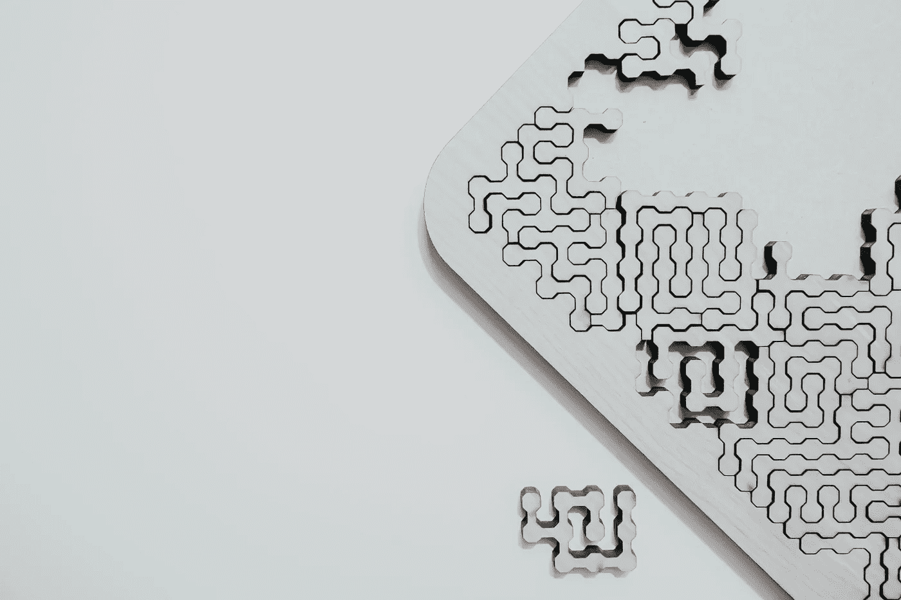

# 房产所有权的分数 NFT:铸造代币

> 原文：<https://medium.com/coinmonks/fractional-nft-for-property-ownership-minting-the-token-9d74d348ee9c?source=collection_archive---------1----------------------->

分数 NFT 是表示财产共有的一种可行技术。本文演示了如何结合使用 ERC721 和 ERC20 令牌来实现这一点。

*Photo by* [*Clark Van Der Beken*](https://unsplash.com/@snapsbyclark?utm_source=unsplash&utm_medium=referral&utm_content=creditCopyText) *on* [*Unsplash*](https://unsplash.com/s/photos/jigsaw?utm_source=unsplash&utm_medium=referral&utm_content=creditCopyText)

什么是分数 NFT？

一个[不可替代的令牌](https://www.theverge.com/22310188/nft-explainer-what-is-blockchain-crypto-art-faq) (NFT)是所有权的证明。为了证明你拥有一只来自[无聊猿游艇俱乐部](https://boredapeyachtclub.com/#/home#buy-an-ape)的猿，你只需拿出你的…