# 财产所有权的部分 NFT:转移资产

> 原文：<https://medium.com/coinmonks/fractional-nft-for-property-ownership-transferring-the-asset-cce9567c5fce?source=collection_archive---------2----------------------->

分数 NFT 是表示财产共有的一种可行技术。本系列文章的第二部分描述了当 NFT 转让给新的所有者时，如何确保部分所有者对其财产份额的权利。

*Photo by* [*Olav Ahrens Røtne*](https://unsplash.com/@olav_ahrens?utm_source=unsplash&utm_medium=referral&utm_content=creditCopyText) *on* [*Unsplash*](https://unsplash.com/s/photos/puzzle?utm_source=unsplash&utm_medium=referral&utm_content=creditCopyText)

**重述&简介**

在本系列的第一篇文章[中，针对财产所有权的部分 NFT:铸造令牌](/coinmonks/fractional-nft-for-property-ownership-minting-the-token-9d74d348ee9c)，我们展示了如何将代表财产所有权的 [NFT](https://www.theverge.com/22310188/nft-explainer-what-is-blockchain-crypto-art-faq) 细分为多个共有人，并使用 [ERC-20](https://ethereum.org/en/developers/docs/standards/tokens/erc-20/) 令牌来表示。

本文主要讨论分割房产的共有人如何在房产出售时要求获得他们的收益份额。本项目中使用的[部分索赔合同的源代码在这里](https://github.com/jacksonng77/Fractional-NFT)。

**寻找买家**

场景是这样的——房产所有者通过另外两个部分所有者为房产共有者寻找买家。从第一条起，该房产由三人共有:

1.  财产所有者:持有 NFT，与其在 IPFS 的地契和 1 个分数代币相关联，代表 1 份财产
2.  分数所有者 1:持有 2 个分数代币，代表 2 份财产
3.  分数所有者 2:持有 1 个分数令牌，代表 1 份财产

潜在买家走过来，要求查看代表该房产的 FNFT 令牌，该令牌与 IPFS 的地契相关联。

他阅读了 FNFT 令牌合同，并注意到有 4 个 FNT 令牌与 FNFT 令牌相关联。

他拒绝继续购买该房产，因为以目前的状态购买该房产意味着与所有现有的部分所有人共同拥有该房产。

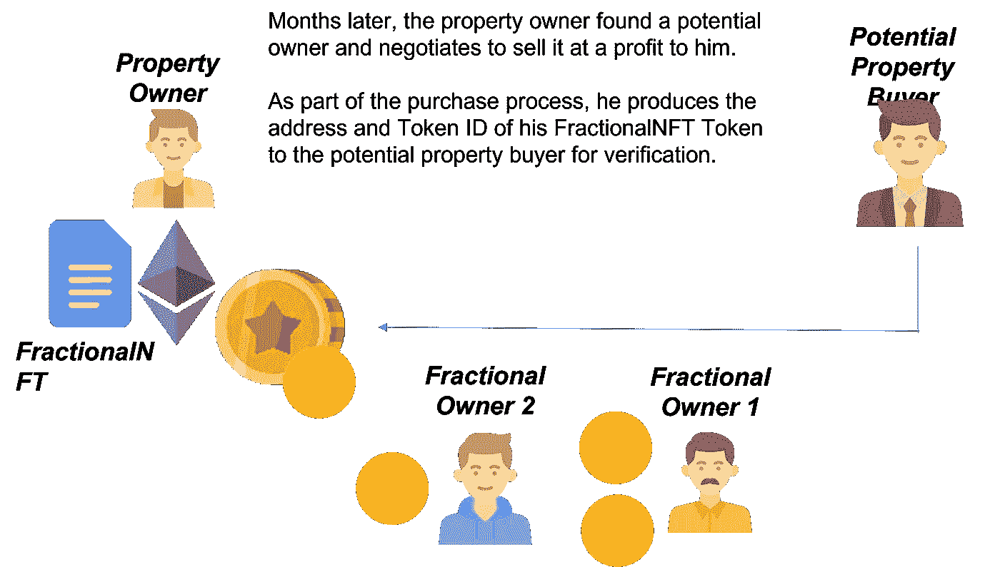

谈判可能会这样进行。

***财产所有人:*** *这是代表我财产的***和*[*【FNFT】*](https://ropsten.etherscan.io/token/0x628E055d8ad209eC15aBaD0B1EC0529B45FCc2fa?a=0#inventory)*令牌。你愿意以 1 英镑的价格购买它吗？**

****潜在买家:*** *稍等，让我看看以太网上的合同和令牌。嘿，我注意到有 4 个* [*FNT*](https://ropsten.etherscan.io/token/0xfBc0120197DA5Aa78e6336feC2790F767645e53c?a=0x02d4806b89913ed833010ac3282be2eaac2d2bae) *代币与你的财产相关联。这些是什么？**

*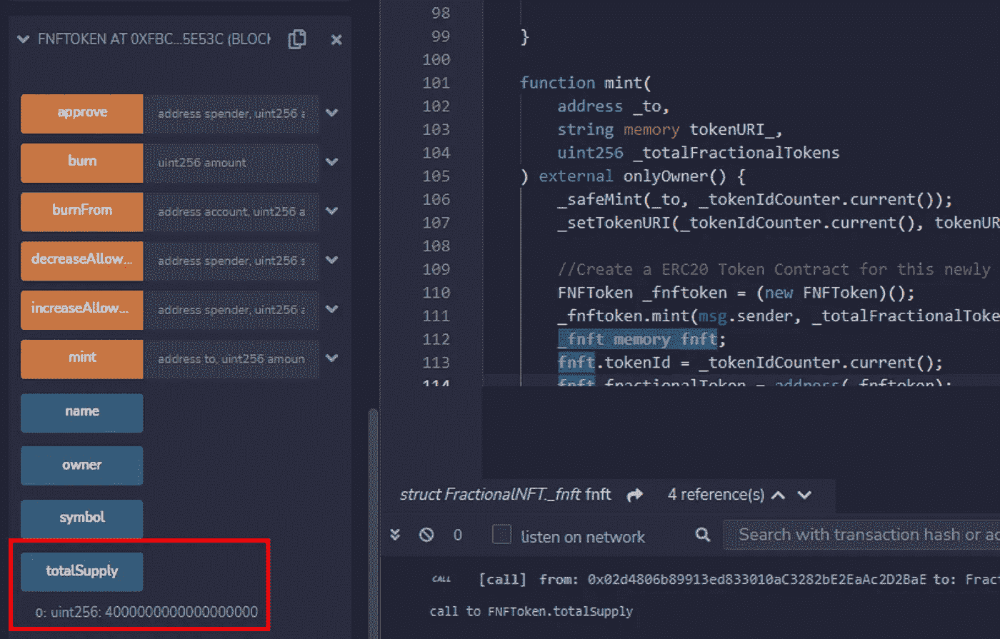*

****产权人*** *:哦，那些是我的共有人。我拥有 1 辆 FNT，另外 3 辆 fnt 由另外 2 个人拥有。你可以在 Etherscan 上找到他们的钱包地址，注册为其他 3 个 FNT 的 FNT 所有者。根据我们每个人拥有的 FNT，我拥有 25%的股份，另外两个人合起来拥有剩下的 75%。**

*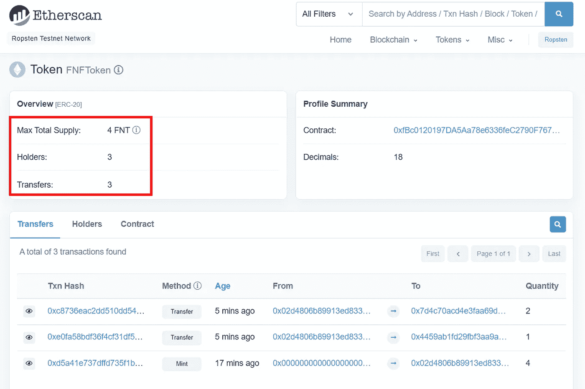*

*潜在买家: *呃，那你和他们谈过这笔交易了吗？**

****财产*** ***所有人*** *:我可以在你付给我钱之后，把这个 NFT 转让给你。那你去和他们谈谈。**

******买家*** *:我绝不会以目前的状态购买该房产，因为如果我这样做，我将继承你对你的共同所有人的责任。例如，如果我想拆除建筑或重新出售，我需要他们的许可。****

*****业主:*** *那么你想让我做什么？***

****潜在买家:去和他们谈，让他们把他们的房产股份卖给你。我们会再谈的。****

*****产权人:*** *Hokay！***

****请求兑换 FNT 代币****

**财产所有人回去与财产的另外两个部分所有人谈判回购他们的 FNT 代币。**

**他解释说，他在 1 ETH 有一个潜在的买家，如果他们都同意，那么他将开始部分索赔过程。**

**让我们假设他们对房产的售价感到满意。**

**然后，财产所有者部署部分索赔智能合同。**

**[部分索赔合同的源代码在这里](https://github.com/jacksonng77/Fractional-NFT/blob/main/fractionalClaim.sol)。**

**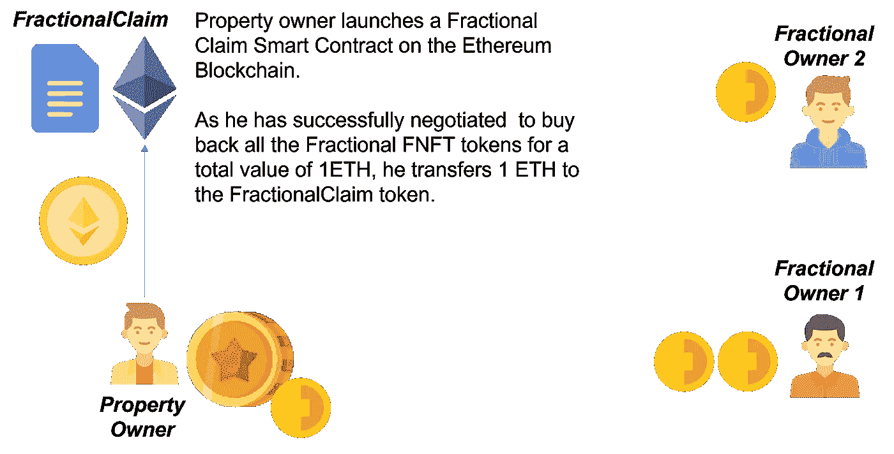**

**[fractionalClaim.sol](https://github.com/jacksonng77/Fractional-NFT/blob/main/fractionalClaim.sol) 合同编制完成。**

**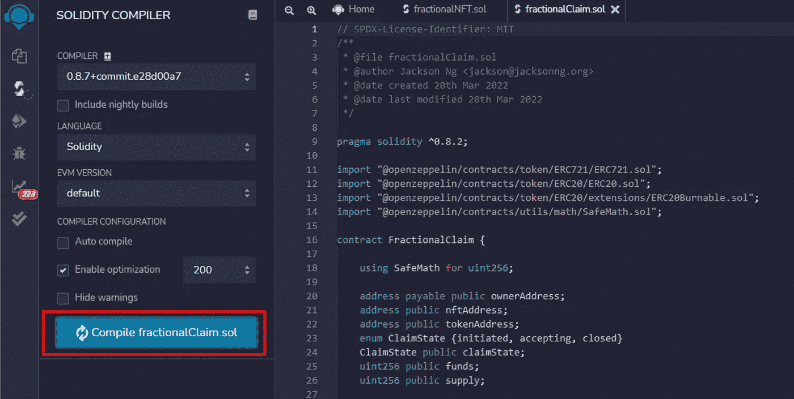**

**输入代表资产的[部分 NFT 智能合同地址](https://ropsten.etherscan.io/address/0x628E055d8ad209eC15aBaD0B1EC0529B45FCc2fa)和[令牌 ID](https://ropsten.etherscan.io/token/0x628E055d8ad209eC15aBaD0B1EC0529B45FCc2fa?a=0#inventory) 。单击[交易]。**

**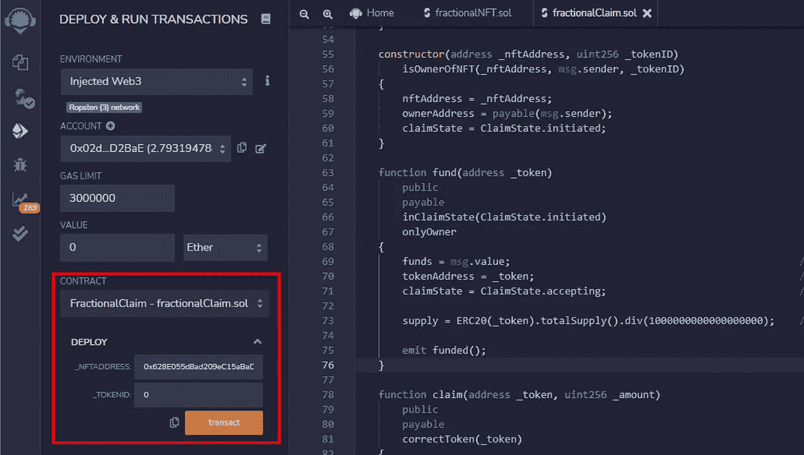**

**财产所有者将从分数所有者手中*“购买”FNT 代币。***

***为此，他将 1 ETH 存入部分索赔智能合同。这样，他提供了要索赔的 FNT 令牌的[智能合约地址。单击[交易]。](https://ropsten.etherscan.io/token/0xfBc0120197DA5Aa78e6336feC2790F767645e53c?a=0x02d4806b89913ed833010ac3282be2eaac2d2bae)***

***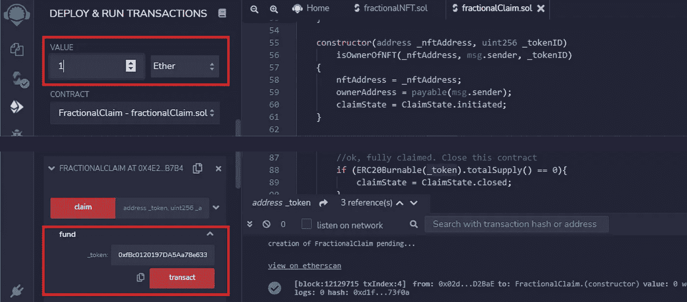***

*****为 ETH 兑换 FNT 代币*****

***然后，财产所有者通知他的部分所有者，他已经激活了[部分债权智能合同](https://ropsten.etherscan.io/address/0x4e2b56ed0c31fc11ef336f57d618261446ab7b45)，他们现在可以使用智能合同将他们的 FNT 代币兑换成他们的 ETH 份额。***

***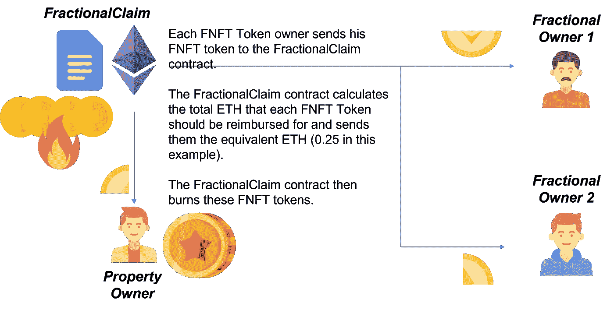***

***为此，每个部分所有者必须首先给予[部分索赔智能合同](https://ropsten.etherscan.io/address/0x4e2b56ed0c31fc11ef336f57d618261446ab7b45)与他的 [FNT 令牌](https://ropsten.etherscan.io/token/0xfBc0120197DA5Aa78e6336feC2790F767645e53c?a=0x02d4806b89913ed833010ac3282be2eaac2d2bae)交互的许可。***

***他转到 FNT 令牌智能合同，并输入[部分索赔智能合同](https://ropsten.etherscan.io/address/0x4e2b56ed0c31fc11ef336f57d618261446ab7b45)地址。他还输入了他将要兑换的 FNT 代币总数。***

***在本例中，部分所有者兑换 1 FNT，因此他在`amount`字段中输入 1 x 1018。单击[交易]。***

***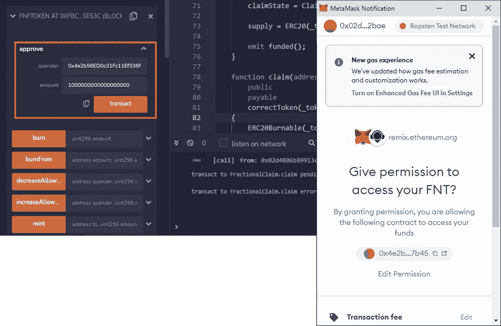***

***在部分索赔智能合约中，他输入 FNT 代币的[智能合约地址](https://ropsten.etherscan.io/token/0xfBc0120197DA5Aa78e6336feC2790F767645e53c?a=0x02d4806b89913ed833010ac3282be2eaac2d2bae)和他正在赎回的`amount`。***

***部分索赔智能合同拿走他的 FNT 代币并烧掉。它计算他有权得到的总 ETH，并将其发送给他。***

***以下是每位共有人兑换 FNT 代币时将获得的金额:***

1.  ***业主:0.25 埃特兑换 1 FNT 币***
2.  ***分数所有者 1: 0.5 ETH 兑换 2 个 FNT 代币***
3.  ***部分所有者 2: 0.25 ETH 兑换 1 个 FNT 代币***

*****回到与买方的谈判桌上*****

***业主又去找买家谈话。谈判可能会这样进行:***

******财产所有者:*** *我已经赎回了所有的 FNT 代币。这里的* [*分数 NFT 契约*](https://ropsten.etherscan.io/token/0x628E055d8ad209eC15aBaD0B1EC0529B45FCc2fa?a=0x02d4806b89913ed833010ac3282be2eaac2d2bae) *和*[*FNFT*](https://ropsten.etherscan.io/token/0x628E055d8ad209eC15aBaD0B1EC0529B45FCc2fa?a=0#inventory)*令牌再次代表我的财产。****

*****潜在买家:*** *让我看看以太网上的合同和令牌。我还会看看与你的财产相关的 FNT 代币。啊，没有 FNT 代币了！***

**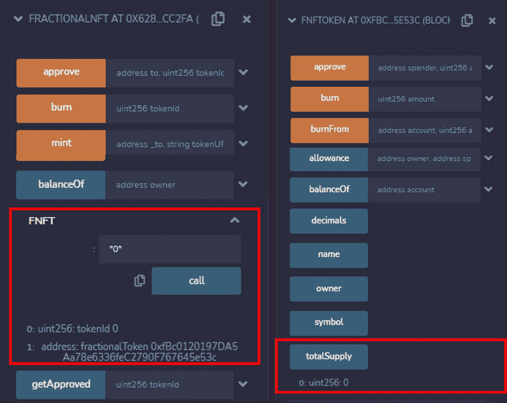**

*****产权人*** *:对，我都赎了。现在我是这处房产的唯一所有人。现在除了我之外，没有其他人需要处理。***

**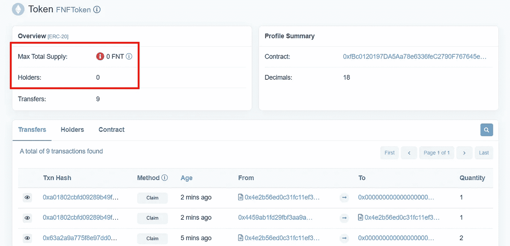**

*****潜在买家:*** *好了，让我们着手处理一份* [*NFT 代管智能合同*](/coinmonks/nft-based-escrow-service-business-logic-3dfc5be85a03) *。***

*****产权人:*** *Hokay！***

****验尸****

**在这篇文章中，我们展示了一个潜在的买家将如何检查财产的 NFT，使他不会无意中购买了一个仍然是其他人共有的财产。我们还展示了财产所有者如何使用部分索赔智能合同来促进其财产的部分所有者为 ETH 赎回他们的财产份额。**

**熟悉股票市场[股票](https://www.investopedia.com/terms/e/equity.asp)的读者会注意到这与传统的上市公司私有化[过程的相似之处。在一家上市公司退市的过程中，该公司会协商一个价格，回购其所有公开交易的股票，从而重新获得该公司的全部所有权，可以为所欲为。](https://sias.org.sg/qa/when-a-company-gets-delisted-what-will-happen-to-my-shares-which-i-am-still-holding-on-to/)**

**这同样适用于[集体财产销售](https://www.99.co/singapore/insider/en-bloc-sales-how-does-it-work-2/#:~:text=A%20collective%20sale%2C%20also%20known,come%20across%20in%20newspaper%20headlines.)(也称为整体销售)。**

**甚至为[债券赎回](https://www.investor.gov/introduction-investing/investing-basics/glossary/callable-or-redeemable-bonds)！**

**事实上，区块链上的智能合约只不过是流程的自动化，否则这些流程将必须由证券交易所、经纪人和投资银行等中介机构以(有时非常高昂的)费用进行管理！**

****下一步是什么？****

**在下一部分中，我们将研究这一过程背后的 Solidity Smart 契约代码，以及其逻辑如何迎合各种假设，如“如果部分所有者拒绝出售怎么办？”以及*“没有部分业主的同意，房产不能出售吗？*。**

**敬请期待！**

1.  **[房产所有权的分数 NFT:铸造令牌](/coinmonks/fractional-nft-for-property-ownership-minting-the-token-9d74d348ee9c)**
2.  **财产所有权的部分 NFT:转移资产(这一部分)**
3.  **房产所有权的分数 NFT:实体代码解释**

**敬请期待！**

**如果您喜欢本教程，也许您也希望阅读:**

*   **[NFT 托管服务](/coinmonks/nft-based-escrow-service-business-logic-3dfc5be85a03):NFT 如何在各方之间进行买卖。**
*   **[NFT 高档手表认证](/coinmonks/nft-based-luxury-watch-certificate-how-it-works-71d715914006?source=user_profile---------0-------------------------------):NFT 高档手表认证系统的实施**
*   **[介绍以太坊开发环境](/coinmonks/introducing-the-ethereum-development-environment-part-1-bed0a273e55?source=user_profile---------7-------------------------------):一个分步指南，为在以太坊中构建分散式应用程序设置开发环境。**
*   **[自由职业者智能合约](/coinmonks/the-freelancers-smart-contract-how-it-works-fda5e1fddf8d?source=user_profile---------1-------------------------------):自由职业者和他的客户之间的一个支付系统，以确保交付和支付。**
*   **[Ropsten 以太坊龙头](/coinmonks/ropsten-ethereum-faucet-how-it-works-c5703f769c2a?source=user_profile---------12-------------------------------):我做了一个以太坊龙头，在 Ropsten 网络上发出 ETH。**
*   **[在区块链上投票](/coinmonks/voting-on-a-blockchain-how-it-works-3bb41582f403?source=user_profile---------17-------------------------------):以太坊上投票 DApp 的实现。**

**[*Good Ware 创建的人图标—flat icon*](https://www.flaticon.com/free-icons/man)[*Freepik 创建的硬币图标— Flaticon*](https://www.flaticon.com/free-icons/coin)**

> **加入 Coinmonks [电报频道](https://t.me/coincodecap)和 [Youtube 频道](https://www.youtube.com/c/coinmonks/videos)了解加密交易和投资**

# **另外，阅读**

*   **最好的[加密税务软件](/coinmonks/best-crypto-tax-tool-for-my-money-72d4b430816b) | [硬币追踪评论](/coinmonks/cointracking-review-a-reliable-cryptocurrency-tax-software-5114e3eb5737)**
*   **[Stackedinvest 评论](https://coincodecap.com/stackedinvest-review) | [北海巨妖评论](/coinmonks/kraken-review-6165fc1056ac) | [bitFlyer 评论](https://coincodecap.com/bitflyer-review)**
*   **最佳[加密借贷平台](/coinmonks/top-5-crypto-lending-platforms-in-2020-that-you-need-to-know-a1b675cec3fa) | [杠杆令牌](/coinmonks/leveraged-token-3f5257808b22)**
*   **最佳[加密制图工具](/coinmonks/what-are-the-best-charting-platforms-for-cryptocurrency-trading-85aade584d80) | [最佳加密交易所](/coinmonks/crypto-exchange-dd2f9d6f3769)**
*   **[比斯勒评论](https://coincodecap.com/bitsler-review)|[WazirX vs coin switch vs coin dcx](https://coincodecap.com/wazirx-vs-coinswitch-vs-coindcx)**