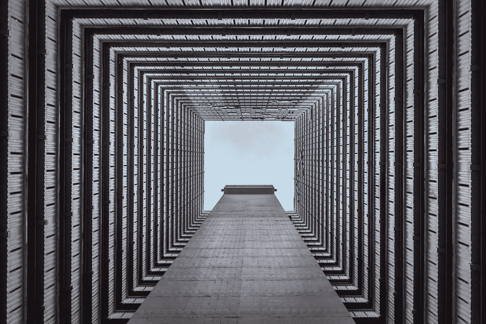

# 细分的房地产投资

> 原文：<https://medium.com/coinmonks/fractionalized-property-investment-a215bb44ad0a?source=collection_archive---------8----------------------->

## 细分的房地产投资和令牌化如何塑造房地产业的未来

虽然不是一个新概念，部分所有权已经成为近年来流行的商业风险，原因有很多。一个主要原因是它减少了单个投资者或房产所有者的财务负担。现在谁不想要呢？但是你可能想知道为什么有人会对拥有一小部分房产感兴趣。随着区块链技术在房地产行业的出现，我们现在看到了房地产投资是如何细分的。现在让我们来探讨细分房地产投资的利弊，以及为什么它在加密世界变得越来越重要。

Image by [Chor Tsang](https://unsplash.com/@chortsang) via Unsplash

## **那么，细分的房地产投资是怎么回事？**

细分所有权是指一群志同道合的人共同拥有一处商业地产，并成为部分所有者。购买一项资产并将昂贵的成本分成多个部分，可以让人们以通常所需成本的一小部分*参与新的机会。对于千禧一代来说，这是你的音乐！在这个时代，随着我们所说的房地产成本飙升，一般投资者几乎不可能在没有抵押贷款的情况下购买自己的住宅物业，更不用说自己的商业建筑了！随着所有权的细分，一个看似不可能的想法突然变得可以实现。*

部分房产投资有点像*房产众筹*。通常，一家公司会首先购买他们认为会升值的房产。然后他们会把房产的成本分成股份，卖给投资者。投资者将从向房产使用者收取的租金中获得收入，当房产被出售或他们选择出售股份时，他们也可以获得资本回报。股票的成本会随着房产价值的升值而上升或下降。

## 现在让我们来看看细分房地产投资的更多好处...

如前所述，细分的房地产投资是年轻投资者进入他们第一个家的好方法。第一次接手一处房产时，会涉及到很多问题。有了部分所有权，其他投资者可以帮助实现良好的回报前景，货币压力也会小很多。这与你在传统房地产投资中通常看不到的另一个优势联系在一起:*较低的进入成本*。通过将房产成本分成几部分，投资者可以用很少的初始费用投资房产。你不需要存一大笔存款或申请投资贷款，这对许多人来说是一个巨大的解脱。

细分房地产投资的另一个好处是它提供了流动性。与传统的房地产投资不同，投资者可以随时通过向其他人出售股份来套现。他们甚至可以获得与财产增值成比例的回报！如果股票是在区块链系统中以代币的形式发行，投资者可以选择在相关的受监管的交易平台上出售。

> ……(令牌化)为普通投资者打开了分一杯羹的大门

*多元化*是细分化房产投资的另一大好处。当你分散投资时，它限制了你对任何一种资产的敞口。分散投资旨在帮助降低投资组合的潜在波动性，并允许投资者将资金分散到更广泛的房地产投资组合中。对于那些希望参与其中的人来说，以相对较小的初始投资购买各种房地产股票的想法可能会改变游戏规则。

这给我们带来了另一个好处:获得*机构级资产*。“机构级”房地产通常指的是具有足够规模和地位的物业，这些物业获得了大型国内或国际投资者的关注。这些房产通常只留给最优秀的投资者，也称为“机构”投资者。然而，如果这些机构级资产的所有者决定将它们令牌化，这就为普通投资者打开了大门，他们可以从中分一杯羹，投资于他们以前永远买不起的资产。随着所有权的细分和令牌化，人们只需点击一下鼠标，就可以购买代表世界各地部分房产的负担得起的令牌。

> 房地产的符号化有点像数字地细分财产

细分房地产投资的另一个好处是，由于使用了区块链技术，这是一种相对省事的投资。房地产的符号化有点像数字地细分财产。令牌化包括将一项实际资产转换成若干数字令牌，并在数字平台或市场上出售。购买这些代币的人就“拥有”了一部分资产(后面会详细介绍)。这些资产可以是房地产的一部分、拥有房地产的公司的股份、参与房地产投资基金等等。通过使用区块链系统，增加了数据的可信度、安全性、透明度、速度和可追溯性。

Image by [Austin Poon](https://unsplash.com/@austinpoon?utm_source=unsplash&utm_medium=referral&utm_content=creditCopyText) via Unsplash

## 当然，也有一些缺点…

其中之一是费用。为了支付向投资者展示房产所需的大量启动成本和管理费用，赞助商收取费用是正常的。每笔交易的费用金额和类型可能不同，但它们的存在使得部分投资比另类投资更昂贵。

另一个可能的不利因素是新市场的*不确定性。对一些人来说，区块链的概念相对较新且复杂，但并不是每个人都适应了这个新兴系统。有些人现在甚至对房地产细分或符号化有点警惕，因为他们希望首先看到更多成功案例的证据。当你从事细分的房地产投资时，要考虑的最后一件事是*没有实际所有权*。一般来说，投资者拥有房产的股份，而不是房产本身。*

> 区块链和房地产业的未来看起来一片光明

考虑到利弊，明智的做法是在参与任何投资机会之前进行彻底的研究，无论是传统的还是现代的。每个个人投资者在投入资本之前都应该对任何财产进行尽职调查。与任何事情一样，风险与回报的比率应该仔细权衡。话虽如此，区块链和房地产业的未来看起来是光明的。越来越多的公司意识到了令牌化的好处，并决定转向提供更高效率的系统。我们可能会看到国际细分房地产投资的上升，只要房地产所有者继续将其房地产标记化，并向更广泛的受众开放投资机会。

作者:Lorraine Tashjian
邮箱:lorraine@landplus.world

> 加入 Coinmonks [电报频道](https://t.me/coincodecap)和 [Youtube 频道](https://www.youtube.com/c/coinmonks/videos)了解加密交易和投资

## 另外，阅读

*   [3 商业评论](/coinmonks/3commas-review-an-excellent-crypto-trading-bot-2020-1313a58bec92) | [Pionex 评论](https://coincodecap.com/pionex-review-exchange-with-crypto-trading-bot) | [Coinrule 评论](/coinmonks/coinrule-review-2021-a-beginner-friendly-crypto-trading-bot-daf0504848ba)
*   [莱杰 vs Ngrave](/coinmonks/ledger-vs-ngrave-zero-7e40f0c1d694) | [莱杰 nano s vs x](/coinmonks/ledger-nano-s-vs-x-battery-hardware-price-storage-59a6663fe3b0) | [币安评论](/coinmonks/binance-review-ee10d3bf3b6e)
*   [Bybit 交易所评论](/coinmonks/bybit-exchange-review-dbd570019b71) | [Bityard 评论](https://coincodecap.com/bityard-reivew) | [Jet-Bot 评论](https://coincodecap.com/jet-bot-review)
*   [3 commas vs crypto hopper](/coinmonks/3commas-vs-pionex-vs-cryptohopper-best-crypto-bot-6a98d2baa203)|[赚取加密利息](/coinmonks/earn-crypto-interest-b10b810fdda3)
*   最好的比特币[硬件钱包](/coinmonks/hardware-wallets-dfa1211730c6) | [BitBox02 回顾](/coinmonks/bitbox02-review-your-swiss-bitcoin-hardware-wallet-c36c88fff29)
*   [block fi vs Celsius](/coinmonks/blockfi-vs-celsius-vs-hodlnaut-8a1cc8c26630)|[Hodlnaut 审核](/coinmonks/hodlnaut-review-best-way-to-hodl-is-to-earn-interest-on-your-bitcoin-6658a8c19edf) | [KuCoin 审核](https://coincodecap.com/kucoin-review)
*   [Bitsgap 审查](/coinmonks/bitsgap-review-a-crypto-trading-bot-that-makes-easy-money-a5d88a336df2) | [Quadency 审查](/coinmonks/quadency-review-a-crypto-trading-automation-platform-3068eaa374e1) | [Bitbns 审查](/coinmonks/bitbns-review-38256a07e161)
*   [加密复制交易平台](/coinmonks/top-10-crypto-copy-trading-platforms-for-beginners-d0c37c7d698c) | [Coinmama 评论](/coinmonks/coinmama-review-ace5641bde6e)
*   [印度加密交易所](/coinmonks/bitcoin-exchange-in-india-7f1fe79715c9) | [比特币储蓄账户](/coinmonks/bitcoin-savings-account-e65b13f92451)
*   [OKEx vs KuCoin](https://coincodecap.com/okex-kucoin) | [摄氏替代品](https://coincodecap.com/celsius-alternatives) | [如何购买 VeChain](https://coincodecap.com/buy-vechain)
*   [币安期货交易](https://coincodecap.com/binance-futures-trading)|[3 commas vs Mudrex vs eToro](https://coincodecap.com/mudrex-3commas-etoro)
*   [如何购买 Monero](https://coincodecap.com/buy-monero) | [IDEX 评论](https://coincodecap.com/idex-review) | [BitKan 交易机器人](https://coincodecap.com/bitkan-trading-bot)
*   [CoinDCX 评论](/coinmonks/coindcx-review-8444db3621a2) | [加密保证金交易交易所](https://coincodecap.com/crypto-margin-trading-exchanges)