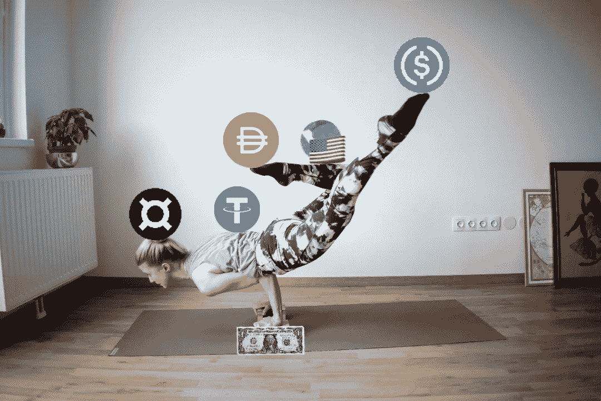

# $FRAX:革命性的稳定币还是另一个算法？

> 原文：<https://medium.com/coinmonks/frax-revolutionary-stablecoin-or-just-another-algo-3693c86f3eae?source=collection_archive---------5----------------------->

事实证明，对完全去中心化、无权限的稳定货币的追求是难以实现的。FRAX 最终破解了密码吗？

Image: PixTeller

> 经济学应该根据它是关于什么来定义。它应该是关于人们如何生产物品，人们如何交换物品，人们如何赚取收入……这个主题必须根据探究的对象来定义
> 
> —张河俊

# 算法稳定币盲点

据我所知，crypto‘maxis’(我指的是你们这些比特币制造者)和 stablecoin devs 在钱的问题上都有一些盲点。事实上，我认为存在许多加密盲点，但与本次讨论最相关的两个是:

1.  [最近偏差](https://www.investopedia.com/recency-availability-bias-5206686)倾向于在决策中发挥巨大作用；和
2.  有一种把货币和价值混为一谈的强烈倾向。

两者都完全可以理解。新近偏见发生在我们每个人身上，我们都容易受到它的影响。同样，我们中的绝大多数人使用货币来交换价值，而不太考虑它到底是什么。

## 新近偏差

如果你不是行为经济学的学生，新近偏见是一种认知扭曲，它导致人们过于强调最近发生的事情。

这往往会导致糟糕的基于风险的决策。如果你听过一个赌徒说，“我手气很好，我不会输的！”看起来是这样，至少短期内是这样。“股票最终总会上涨”是另一个长期常见的说法。

关键是，这些想法是正确的，直到他们不是。但从更长远的角度进行评估的人通常能看穿这种扭曲。这就是为什么历史很重要。

## 货币和价值

这是另一个很常见的例子。“金钱是价值储存手段”可能是最重要的。你可以感谢现代经济学领域(或者，我称之为“浸过数学的人文学科”)的这个想法。货币，或者我们今天通常所说的钱，是一种承诺。

不多不少。

事实上，我们所说的美元是美联储纸币。它就印在账单上。“承诺”是票据将被接受(授权)来支付所有公共和私人债务。

让这一承诺变得有价值的是美国政府保证(不管它值多少钱),你可以把这张钞票换成有*实际价值的东西。我说的实际价值，是指一件商品、一项服务或支付一笔债务——特别是一笔大的债务:你的税收。*

所以，一美元*类似于*储存价值。但它储存价值，就像朋友承诺开车送你去机场会“储存”那次旅程的价值一样。这个承诺是有价值的，并且完全可以挽回…直到你的朋友忘记出现。

## FRAX

FRAX 是一种分数储备算法稳定币。我知道这有点拗口，但我会尽量总结一下。就我看过的 algo stables 而言，这是我见过的最优雅、最周到的方法之一。

我要说的是，我 100%支持它，并且认为它可能会长期有效——我仍然持怀疑态度。

开发人员在改进算法稳定性不足方面做得非常出色，这些不足似乎困扰着 Basis.io 衍生的“稳定”或“钉住”方案。此外，作为一个混合系统，我认为它比当前的 algo 领导者 Terra UST 有更好的长期生存前景。

虽然这是一个独立的话题，但我相信 Terra 迟早会面临重大的稳定性问题。我可能会在以后的文章中介绍它，但肯定不会在我的锁定到期和我可以转储我的 LUNA 之前:)

是的，我刚刚伪造了我自己的袋子。

FRAX 当然比我刚才提到的两个协议更复杂。在阅读他们的文档时，我想起了我在研究生院经常听到的一句话:

> 你的论文的可读性随着你加入的每一个等式而降低 10 倍。

我想对于普通的 defi 狒狒来说，即使没有方程式，大多数单词看起来也像古希腊语。对于非狒狒(当然是我所有的读者！)，我将尽力概述 FRAX 是如何工作的。

## FRAX 稳定力学

**抵押品比率(CR):** FRAX 是一种分数准备金算法稳定币。这意味着存款价值的一部分(美元，以**的形式)被保留(总是可用于赎回)。**

**比率范围从 1:1(完全保留)到 0:1(无保留)。一种算法根据 FRAX 的市场需求动态设定比率。卖家比买家多=更高的储备；买家比卖家多=储备较低。本质上，算法会问，‘市场*相信*他们可以用 1 美元兑换 1 美元的 FRAX 吗？’**

**如果答案是肯定的，那么我们就不需要保留那么多钱。如果答案是否定的，那么我们需要手头持有更多的钱来满足需求(例如，防止 [**银行挤兑**](https://www.investopedia.com/terms/b/bankrun.asp) )。**

****套利:**从价格差异中获利的做法叫做套利。如果你见过有人拿着清单在沃尔玛四处扫描商品，他们可能是亚马逊市场套利者。**

**如果他们能在沃尔玛找到一个 1 美元的玩具(或任何东西)，但在亚马逊上的价格是 2 美元，这很容易赚钱。对于 crypto 也是如此，同样的机制也适用于 FRAX。**

**(理论上)FRAX 总是可以用 1 美元赎回。因此，如果市场价格跌至 0.98 美元，套利者可以在市场上买入，然后以 1.00 美元的价格卖回给协议。反过来也一样，如果交易所的市场价格是 1.02 美元，套利者可以以 1 美元的价格铸造一个 FRAX，然后在市场上卖出获利。**

**这听起来可能不多，但如果你说的是数百万，它可以增加很快。**

****铸造和赎回:**在创世纪 FRAX 是完全保留(1:1)。因此，要铸造(创造)一个 FRAX 代币，用户必须投入一个 USDC。USDC 被锁定为储备，然后用户得到他们的 FRAX 作为回报。**

**赎回时，USDC 被释放以换取 FRAX，FRAX 被烧毁。这就是所有全储备稳定器的工作方式(例如，**，**，[**【TUSD】**](https://coinmarketcap.com/currencies/trueusd/))。******

****这就是 FRAX 的不同之处。记住算法设置 CR(抵押品比率，如果你忘了的话)。如今，如果用户想要 FRAX，他们会存入一个 USDC。然后，该协议将预留一小部分，比如说 0.70 美元，然后燃烧一些共享令牌(我将在接下来介绍)来“支付”另外的 0.30 美元。****

****同样的 1 美元 FRAX 代币出现了。区别在于创建令牌的值来自哪里。对于用户来说，它看起来和第一个例子完全一样。一个 USDC 进去，一个 FRAX 出来。****

****对于该协议(以及整个市场)，您刚刚创建的 FRAX 令牌部分由 USDC 支持，部分通过燃烧共享令牌来支付。每一个都有多少投入到 FRAX 是由设定 CR 的算法控制的。****

****要赎回，同样的事情反过来发生。您存入一个 FRAX，您将直接从 USDC 池中获得 0.70 美元，剩余的 0.30 美元将来自创建一个股份代币。份额以当前市场价格“出售”给协议。****

****作为用户，你不会看到这些。你放一个 FRAX 进去，一个 USDC 出来。一样的交易。****

******股份代币:** FXS 是股份代币。它不与任何东西挂钩，在公开市场上“浮动”。市场参与者有购买 FXS 代币的动机，因为他们获得了对协议的投票权、交易回报，以及随着更多人使用 FRAX(理论上变得更加稀缺)而带来的价格升值。****

****请记住，每当有人买了一个新的 FRAX(在低 CR 水平)，FXS 的一部分被烧毁。如果越来越多的人使用 FRAX，这对 FXS 持有者来说是件好事。不过，如果越来越多的人抛弃 FRAX，那也没什么大不了的，因为越来越多的 FXS 将被创造出来以覆盖传播。****

****然而，CR *应该*最小化这一点，因为该协议将要求越来越多的储备抵押品来铸造 FRAX。反过来，这个*应该*减少被创造的 FXS 量，从而减少 FXS 价值的稀释。那些“*应该”*将在后面的章节中变得更加清晰。****

******算法市场操作(AMO):** 市场操作对央行来说很常见。最简单的说法是，他们买卖美国国债、纸币和票据，以提高或降低利率。国债有市场价格和赎回价格，例如，它们可以按面值的溢价或折价进行交易。****

****FRAX 基本上在做同样的事情，除了功能是由一个算法而不是一个委员会(像银行使用的)管理。AMO 是模块化的，但它们都有共同的核心功能，受到 AMO 所做的任何事情都不能打破 FRAX 盯住美元的规则的限制。****

****AMOs 可以:****

1.  ****提高 CR****
2.  ****降低 CR****
3.  ****在公开市场上买卖 FXS 和 FRAX****
4.  ****根据持有的抵押品超过 CR 的多少来确定 FXS 持有者的分配(奖励)。****

****现在已经部署了一些 amo。一个 AMO 旨在通过 Curve 和 Uniswap v3 等协议提供流动性。第二个提供了对冲头寸。****

****套期保值基本上采取跨盘交易，协议持有一项资产多头，但也持有同一项资产的综合空头头寸。换句话说，他们会做多以防资产价格上涨，但也会做空以防价格下跌。这降低了不稳定资产的下跌(损失)风险，例如*所有*密码(创建一个 [delta 中性](https://www.investopedia.com/terms/d/deltaneutral.asp)头寸)。****

****第三个 AMO 正在利用贷款平台，如 Compound 和 CREAM，来提升协议的价值，特别是 FXS 持有者。另一个正在研究匿名解决方案，还有一个正在研究分散化比率，以管理链上和链下资产的集中化风险。****

****目前还不清楚石油、黄金或其他大宗商品等链外资产是否在管理之下。但是他们在考虑这件事真的很酷！****

## ****听起来不错，有什么问题吗？****

****回到文章的开头，我会说这两个问题是:****

1.  ****新近偏差；和****
2.  ****货币与价值的融合****

****亲爱的读者，因为这篇文章已经很长了，所以我会尽量简短，简单地问你一些试探性的问题。在这里，我将选择特拉·UST。****

1.  ****你认为泰拉 UST 会在 2008 年金融危机期间保留钉住汇率制吗？****
2.  ****你认为 UST 在第二次世界大战期间会保留钉住汇率制度吗？****
3.  ****大萧条怎么样？****
4.  ****或者，一战？****
5.  ****或者，美国内战？****

****更大的问题是，你认为这样的事情不会再次发生吗？请记住，Terra 基金会最近在相对温和的市场动荡下，向 Anchor 协议注入了 4.5 亿美元。****

****我对 FRAX 的看法是，没错，自其启动以来，它一直保持着非常稳定的联系汇率(伴随着几个小嗝嗝)。但是，如果中国入侵台湾，并把美国卷入一场与合法的经济和军事对手的全球冲突，会发生什么？****

****如果朝鲜试射了一枚导弹，然后坠落在东京市中心，会发生什么？或者如果北约介入乌克兰怎么办？****

## ****是的，但是那可能不会发生****

****很公平。但想象一下，如果比特币的最大化真的得逞，比特币开始成为对美元的合法挑战。你真的认为美国政府会举起他们的手，然后说，“哦，伙计们，比特币赢了。”****

****如果比特币威胁到美元的全球使用，美国将会关闭它。他们会宣布比特币是对国家安全的威胁，他们会让比特币消失。****

## ****但比特币是去中心化的！”****

****是的。它需要网络接入才能工作。美国可以在一夜之间关闭美国矿工的网络。他们离 FISA 只有一步之遥。我向你保证，如果你是美国的一名矿工，你会注意到你从国土安全部得到的秘密信件，这封信告诉你马上拔掉插头，否则你将永远见不到阳光。****

****美国与世界上大多数国家都有安全合作伙伴和协议。他们对这些国家拥有巨大的财政和军事力量。给他们的信听起来会像这样:****

> ****亲爱的伙伴:****
> 
> ****我们已经认定比特币是对美国国家安全的威胁。请帮助我们关闭您所在国家的所有比特币挖矿网络，否则我们将切断您的银行业务。****
> 
> ****请和谢谢你，****
> 
> ****山姆大叔****

****如果你认为会有某个无赖国家竖起手指说，别担心，*我们会处理所有的采矿，我要提醒你，所有拥有常备军的国家都会分散他们的资源。*****

****他们不会把他们所有的装备、装备和弹药都存放在一个地方，因为那样很容易成为目标。你知道美国真正擅长做什么吗？****

****找到所有那些东西并把它们炸掉。****

## ****一个算法的好坏取决于你对它的投入****

****我知道比特币的例子很极端，也不太可能。但是让我们把它扩展到 FRAX 算法的 CR 函数。假设市场对 FRAX 表现出极大的兴趣，CR 比率下降到 0.2:1。****

****算法的初始假设是否考虑过我刚才提到的那些重大的“黑天鹅”事件？在将资本充足率降至 0.2:1 后，algo 能以足够快的速度进行资本重组以满足需求吗？****

****如果有，如何实现？这些资本必须来自某个地方，如果 FXS 的股票价格下跌 80%,他们就不会长期持有。****

****关键是，最近的市场已经证明了 CR 比率应该是多少。FRAX 要想真正有弹性，它需要确定一个安全的 CR 比率，在尾部概率发生之前(T3)将尾部概率的影响最小化。****

****对于真正的极端事件，任何加密技术都可能无能为力*。但是肯定有一些事件(比如另一个 2008 年)完全在概率分布之内。出于谨慎，至少应该对其进行建模和测试。*****

****也许他们已经？我真的不知道。但是[白皮书](https://docs.frax.finance/overview)似乎表明开发者可以看到协议完全基于算法的未来，没有任何保留。阅读让我想到像 2008 年这样的事情还没有被考虑进去。****

******这里有个建议:**创建一个模型，回测 100 年的协议。我跟你赌 10 美元，FRAX，CR 看起来会很不一样。****

******或者，对英镑进行回测**。你可以随意修改 1200 年的数据。可能不会非常相关，但它可以提供一些有趣的见解。****

****谁知道呢？这可能只是证明该协议比他们意识到的更有弹性。我们对协议进行了 100 多年的回溯测试，它在包括大萧条和第二次世界大战在内的所有时期都是稳定的！****

****我不是搞营销的，但对我来说，这听起来是一笔相当不错的买卖。****

## ****为价值而融合货币****

****另一个小得多的问题是 FXS 的市场风险和与美元挂钩(承诺)(另一个承诺)。FXS 从采用和使用 FRAX 的用户中获取价值。****

****反过来，FRAX 也是有价值的，因为它承诺了以美元计价的回报。反过来，美元是有价值的，因为它承诺在美国返还同等价值的应税商品、工资和生产率。****

****这些商品、工资和生产率反过来依赖于以稳定的美元支付的承诺。最近的消息表明，这种承诺不像过去那么强了。****

****那么，FXS 代币在价值链中处于什么位置呢？从我的角度来看，很低。对我五岁的孩子来说，这个例子是:****

> ****爸爸:我答应妈妈要打扫房子。因为我答应了，她答应带你去吃披萨。****
> 
> ****然后她答应从送披萨的人那里买披萨，因为她答应带你去吃披萨，因为我答应打扫房子。****
> 
> ****送披萨的人答应买披萨**配料**因为妈咪答应买披萨因为她答应你带你去吃披萨因为我答应打扫房子。****
> 
> ****小孩:如果你不打扫房子会怎么样？****
> 
> ****爸爸:没有比萨饼。****

## ****结论****

****不要误解我，我认为 FRAX 是一个很棒的主意。我超级看好这个项目，十分钟前，我拥有了 FXS。这无疑是我所见过的最强、最完善的算法稳定的想法。****

****我希望开发者们能更深入地挖掘，花更多的时间思考我提到的一些东西。参考我五岁时的想法，我认为房子会被打扫干净，但首先可能会变得更乱。****

****我只希望 FRAX 确保他们买对了配料，因为如果他们不买，我们可能就吃不到披萨了。****

****当然，这些只是我 ***的观点*。**我不是财务顾问，这不是财务建议，而且总是 [DYOR](/coinmonks/crypto-investing-how-to-dyor-1e6dabdb1de9) 。遵循这些想法中的任何一个都可能会让你失去所有的钱。我对此 100%认真。我喜欢摆弄这些东西，但我公开表现得像个彻头彻尾的狒狒。相应投资。****

****直到下一次，安全，聪明，一定要[绑骆驼](https://www.oxfordreference.com/view/10.1093/acref/9780199539536.001.0001/acref-9780199539536-e-2318)。****

> ****加入 Coinmonks [电报频道](https://t.me/coincodecap)和 [Youtube 频道](https://www.youtube.com/c/coinmonks/videos)了解加密交易和投资****

# ****另外，阅读****

*   ****[加密货币储蓄账户](/coinmonks/cryptocurrency-savings-accounts-be3bc0feffbf) | [YoBit 审核](/coinmonks/yobit-review-175464162c62)****
*   ****[Botsfolio vs nap bots vs Mudrex](/coinmonks/botsfolio-vs-napbots-vs-mudrex-c81344970c02)|[gate . io 交流回顾](/coinmonks/gate-io-exchange-review-61bf87b7078f)****
*   ****[CoinFLEX 评论](https://coincodecap.com/coinflex-review) | [AEX 交易所评论](https://coincodecap.com/aex-exchange-review) | [UPbit 评论](https://coincodecap.com/upbit-review)****
*   ****[AscendEx 保证金交易](https://coincodecap.com/ascendex-margin-trading) | [Bitfinex 赌注](https://coincodecap.com/bitfinex-staking) | [bitFlyer 审核](https://coincodecap.com/bitflyer-review)****
*   ****[Bitget 回顾](https://coincodecap.com/bitget-review) | [双子座 vs BlockFi](https://coincodecap.com/gemini-vs-blockfi) cmd| [OKEx 期货交易](https://coincodecap.com/okex-futures-trading)****
*   ****[AscendEx Staking](https://coincodecap.com/ascendex-staking)|[Bot Ocean Review](https://coincodecap.com/bot-ocean-review)|[最佳比特币钱包](https://coincodecap.com/bitcoin-wallets-india)****