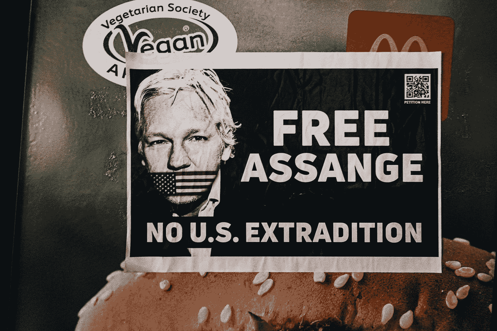

# 免费按摩-按摩岛！

> 原文：<https://medium.com/coinmonks/free-assage-assangedao-b47059a8cc26?source=collection_archive---------12----------------------->

Photo by [Samuel Regan-Asante](https://unsplash.com/@fkaregan?utm_source=medium&utm_medium=referral) on [Unsplash](https://unsplash.com?utm_source=medium&utm_medium=referral)

“赛博朋克组织的新时代”:阿桑奇道为朱利安·阿桑奇筹集了 5300 万美元

阿桑奇道的成立是为了帮助维基解密创始人朱利安·阿桑奇反对被引渡到美国。DAO 已经筹集了超过 5300 万美元，并从阿桑奇手中购买了一幅 NFT。在这方面，区块链机制似乎对筹资有着巨大的影响力。