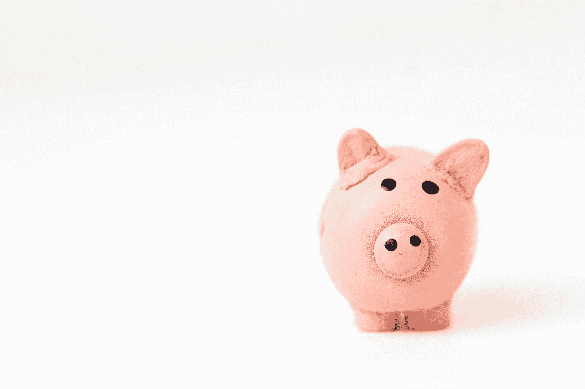
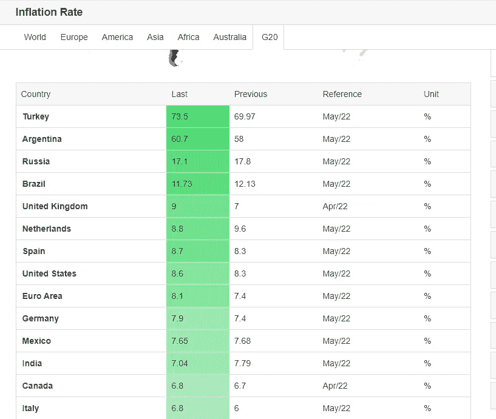

# 免费返现指南:花钱就免费？没有附加条件！

> 原文：<https://medium.com/coinmonks/free-cashback-guide-free-money-when-you-spend-money-no-strings-attached-212a897b92a5?source=collection_archive---------20----------------------->

所以，这是我写的第一篇文章，它与加密没有直接关系，但是有太多的人在消费时没有利用免费的机会赚回一点钱！

随着通货膨胀率达到自 20 世纪 80 年代以来的最高水平，包括美国的 8.6%和英国的 9.0%，收入的增长与通货膨胀不同步，这意味着我们都开始感受到价格上涨的压力。美国或英国并不是受影响最严重的国家！看看下面 G20 国家的最高通胀率就知道了。

G20 Countries — highest inflation — Source: [https://tradingeconomics.com/country-list/inflation-rate](https://tradingeconomics.com/country-list/inflation-rate)

通货膨胀率上升有许多原因，但这不是我在这篇文章中要谈的。这篇文章的目的是分享我发现的免费把一点钱放回你口袋的方法。这可以帮助你偿还一些账单、债务或者投资你拿回来的钱。就我个人而言，我喜欢投资，所以我的策略是用我用这些方法赚的钱来投资，因为我一开始就没有钱！

在某些情况下，我注册了一个英国 ISA 账户，类似于美国的 ROTH IRA，存了 3 个月的钱，一旦有了现金，就可以取出来，这样我就赚了 200 美元。我最近也换了 ISP，收到了 140 美元。如果您预订商务或休闲酒店，您可以通过使用这些网站获得每次预订的现金返还。衣服？家具？DIY？电子？保险？他们都在那里占便宜。

随着更多机会的出现，这篇文章将定期更新，所以请继续查看，如果您所在的国家有一个提供免费返现的网站，请给我发一条带有您的推荐链接的个人消息，我会检查它，如果它是合法的，我会将其添加到您的推荐代码列表中！

**万能**

Coinbase.com[——“学会赚钱”允许你通过学习一个加密项目并回答几个相关问题来获得报酬。你甚至不必第一次就得到正确的答案，所以这是完全免费的加密！](https://bit.ly/3zKqs9m)

**英国**

Topcashback.co.uk&[Quidco.com](https://bit.ly/3O7WTD2)——这两个网站都免费提供购物返现。

[通话时间奖励](https://bit.ly/3O2qYEb) —这款应用程序可以让你在店内购物获得返现，你可以用它来减少每月的手机账单！而且，如果您的提供商没有参与此活动，您可以将其存入银行，以便在您切换到参与此活动的提供商时使用！

美国&加拿大

Topcashback.com， [Hoopla Doopla](https://bit.ly/3HwP3R3) &更多——这些网站免费提供购物返现。在研究过程中，我还发现了[返现监测器](https://bit.ly/3xyoUwB)，它可以比较你可以从哪个返现网站获得最多的返现！

**欧洲**

iGraal.com——免费返现！([FR](https://bit.ly/3zLHW57)/[DE](https://bit.ly/3O2M5WP)/[ES](https://bit.ly/3xYqycf))

[Poulpeo.com](https://bit.ly/3tJJPeQ)—类似上面提到的返现网站！(法国)

**正如我之前提到的，如果你有一个网站，人们可以通过返现免费赚钱，请私信我你的推荐链接，我会审查，然后将其列入名单！**

我上个月被动地从 Crypto 赚了 1400 美元(这里是[文章](/p/3c824d798f7b)，如果你想知道如何开始在 Crypto 中建立被动收入流的一些想法，请查看我的一些其他文章[这里是](https://realisticcrypto.medium.com/)。

或者，如果你想长期投资股票或指数基金，但不知道从哪里开始，那么请关注我的媒体，因为我计划写一些关于我如何在加密之外投资的文章！

如果你准备好投身投资世界，这是我在英国使用的平台——[free trade](https://bit.ly/3OnaLcd)——当你注册时，你会得到价值 3 & 200 英镑的免费股票。他们也提供股票。

最后一件事，如果你觉得这个指南有用，请确保你分享它，这样更多的人可以利用这些好处。鉴于当前的经济形势，每个人都可以在口袋里多放几美元！或者投资账户！

**附属链接**

更多的好处你也可以在这里找到:[https://linktr.ee/RealisticCrypto](https://linktr.ee/RealisticCrypto)

还有，如果你想请我喝杯咖啡或者啤酒:) :

BTC—BC 1 qaxaq 2 q 9 js 89 gyzhr 0202 sxt 6 hgchprqjga 5 px

基于 ETH、BNB、AVAX、SOL 和 FTM 的令牌—0 x3b 7b 843d 8125 Fe 7 EBA 541 e 1d 751 a4 a 73 f 0 cfad 4c

**免责声明**

这不是财务建议，我不是财务顾问或会计或税务专家。这是我对帮助过我的软件工具的体验，以及我使用它们的经历。

我在本指南中使用了推荐链接。使用这些工具有助于以后的文章，所以如果你觉得这篇文章有用，并且想看看我提到的工具，请使用它们。我还会叫出你在哪里打折——双赢对吧？

> 加入 Coinmonks [电报频道](https://t.me/coincodecap)和 [Youtube 频道](https://www.youtube.com/c/coinmonks/videos)了解加密交易和投资

# 另外，阅读

*   [币安 vs FTX](https://coincodecap.com/binance-vs-ftx) | [最佳(SOL)索拉纳钱包](https://coincodecap.com/solana-wallets)
*   [比诺莫评论](https://coincodecap.com/binomo-review) | [斯多葛派 vs 3Commas vs TradeSanta](https://coincodecap.com/stoic-vs-3commas-vs-tradesanta)
*   [Capital.com 评论](https://coincodecap.com/capital-com-review) | [香港的加密借贷平台](https://coincodecap.com/crypto-lending-hong-kong)
*   [如何在 Uniswap 上交换加密？](https://coincodecap.com/swap-crypto-on-uniswap) | [A-Ads 审查](https://coincodecap.com/a-ads-review)
*   [WazirX vs coin dcx vs bit bns](/coinmonks/wazirx-vs-coindcx-vs-bitbns-149f4f19a2f1)|[block fi vs coin loan vs Nexo](/coinmonks/blockfi-vs-coinloan-vs-nexo-cb624635230d)
*   [本地比特币评论](/coinmonks/localbitcoins-review-6cc001c6ed56) | [加密货币储蓄账户](https://coincodecap.com/cryptocurrency-savings-accounts)