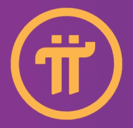

# 免费密码系列—第 1 集，Pi 网络

> 原文：<https://medium.com/coinmonks/free-crypto-series-episode-1-pi-network-6165e207bc32?source=collection_archive---------32----------------------->

我将推出一个系列，我将测试不同的工具和平台，以赚取免费加密。这些工具有用吗？它们值得你花费时间吗？了解它们是什么，然后自己决定！

欢迎来到免费加密系列，第 1 集，重点是 Pi 网络。

那么，什么是圆周率网络？