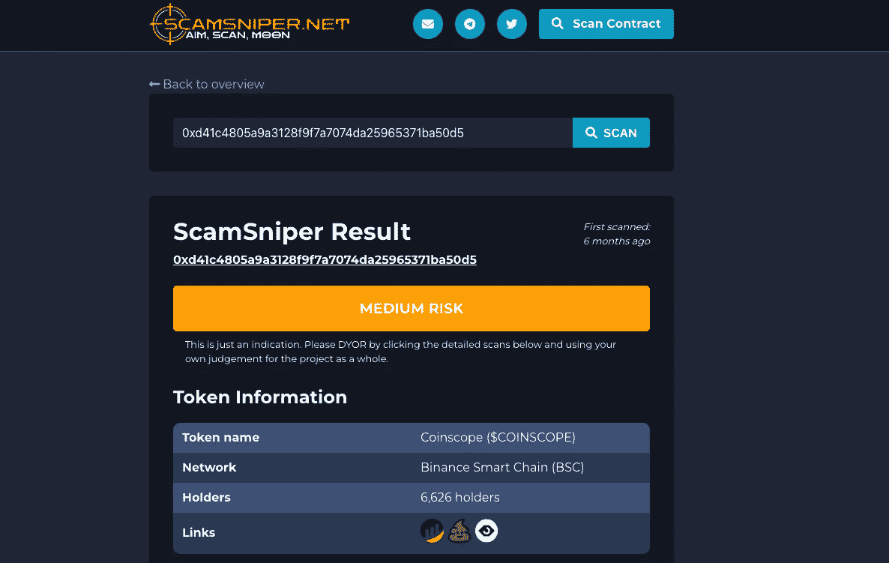
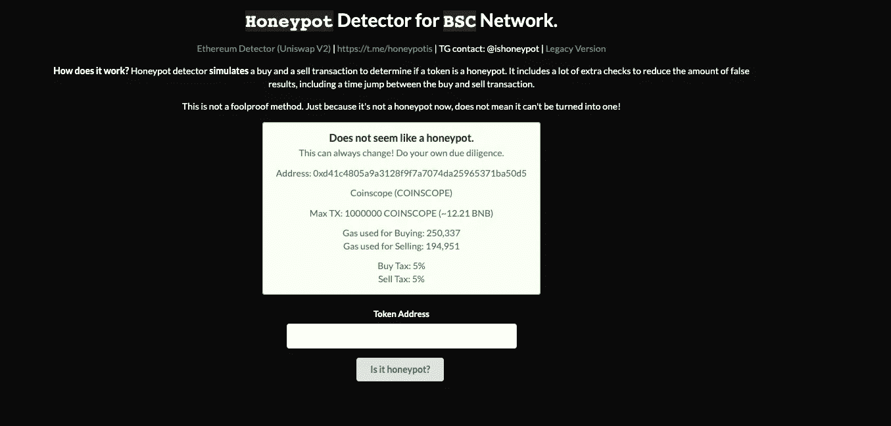

# 面向投资者的免费智能合同审计工具

> 原文：<https://medium.com/coinmonks/free-smart-contract-audit-tools-for-investors-77cdbade85e1?source=collection_archive---------3----------------------->

区块链技术和智能合约正在蓬勃发展。行业专家预测，到 2025 年，50%的交易将在区块链上进行。但是伴随着巨大的增长而来的是大量的新问题和弱点。大多数新投资者面临的一个主要问题是如何实际看待他们投资的智能合约代码，他们需要工具来帮助他们。如果你是一个想进入 ICO 市场的投资者，有一些非常强大的工具可以让你看到——毫无疑问——你在投资什么。我们汇集了顶级的免费智能合同审计工具来帮助您进行研究。

# 1.网络扫描

[Cyberscan](https://www.coinscope.co/cyberscan) 是一个方便的工具，可以帮助投资者快速洞察给定的加密货币令牌。该工具非常简单易用，你只需将智能合同地址粘贴到相关字段，从下拉列表中点击区块链网络，然后按搜索。然后，您将看到智能合同分析的完整报告，以及一些关键指标，如合同所有权是否存在或被放弃，合同是否是代理，合同是否附有审计或 KYC 等。最后，你可以看到你的契约与流行的分叉代码的相似性。这将有助于您了解它是否由特定平台铸造，以及它有多独特。

# 2.安全扫描

[Safescan](https://www.coinscope.co/safescan) 是一款针对钱包的反洗钱和 KYC 工具。这个软件非常容易使用，你所要做的就是在表格中填写地址，然后点击“搜索”。然后，该工具将开始处理并对所提供的地址进行背景检查。它将审查该地址的所有交易，以及它如何与各种可疑的其他钱包进行交互，然后将其与 CEX 热门钱包、流行桥梁、[龙卷风现金](https://tornado.cash/)和其他类似的洗钱应用进行交叉参考。Safescan 还会用包含超过 30k 个黑名单和可疑钱包的数据库交叉检查给定的钱包。

最终的分析报告向用户显示所有相关的发现，以便帮助他了解钱包的一些过去的历史。这是一个很好的工具，可以帮助投资者检查项目团队过去的交易，以确保没有任何可疑的活动。

# 3.诈骗狙击手

[Scamsniper](https://scamsniper.net/) 是由 Coinsniper 开发的一款工具，可以帮助你在投资前快速查看加密令牌。它有类似于[蜜罐](http://is just a tool to help you spot scams.)检查、流动性检查和检查是否有任何可用于令牌的审计的指示器。

# 4.CoinTool 审计合同

[CoinTool Audit Contract](https://cointool.app/audit) 对给定的智能合约运行一些自动检查，并显示任何潜在的安全风险发现。该软件检查许多事情，例如令牌是否具有反鲸机制、黑名单功能、造币功能等。用户还可以下载包含调查结果的 pdf 报告。

# 5.蜜罐. is

Honeypot.is 是另一个免费工具，它可以检查(我相信你已经猜到了)智能合约是否是一个蜜罐。

# 6.令牌嗅探器

令牌嗅探器给你一个自动化的免费审计报告与分数，这是一个衡量如何以及令牌合同和特征满足安全标准。该网站还扫描已知诈骗的合同，计算有用的令牌指标，并维护诈骗列表。

# 7.BSC 检查

BSC Check 是另一个免费软件，它为您提供关于给定智能合同地址的信息。它有关于给定令牌持有者的有用信息，这将让您很好地了解一个项目是否真的是去中心化的。

# 结论

智能合同领域是一个新的、令人兴奋的、潜在的相当有利可图的领域。但是巨大的机会伴随着巨大的风险——在加密货币的世界里，这种风险可能是财务上的，也可能是声誉上的。好消息是什么？投资者可以使用我们上面确定的资源来熟悉这项新技术，并在这个过程中做出更好的决策。

这些免费的智能合同审计工具和软件将帮助投资者做出更明智的投资决策，但绝不是实际智能合同审计的替代品。如果您正在寻找一家受人尊敬的审计公司进行全面彻底的智能合同审计，请不要犹豫，联系我们。

[*cyber scope*](https://www.cyberscope.io/)*是密码行业领先的智能合同审计& KYC 公司之一，已经审计了 500 多个区块链项目和 NFT。所有主要发射台的官方合作伙伴。*

…

*原载于*[*https://www . cyber scope . io*](https://www.cyberscope.io/)*。*

> 加入 Coinmonks [电报频道](https://t.me/coincodecap)和 [Youtube 频道](https://www.youtube.com/c/coinmonks/videos)了解加密交易和投资

# 另外，阅读

*   [用信用卡购买密码的 10 个最佳地点](https://coincodecap.com/buy-crypto-with-credit-card)
*   [加拿大最佳加密交易机器人](https://coincodecap.com/5-best-crypto-trading-bots-in-canada) | [Bybit vs 币安](https://coincodecap.com/bybit-binance-moonxbt)
*   [阿联酋 5 大最佳加密交易所](https://coincodecap.com/best-crypto-exchanges-in-uae) | [SimpleSwap 评论](https://coincodecap.com/simpleswap-review)
*   购买 Dogecoin 的 7 种最佳方式
*   [最佳期货交易信号](https://coincodecap.com/futures-trading-signals) | [流动性交易所评论](https://coincodecap.com/liquid-exchange-review)
*   [用于 Huobi 的加密交易信号](https://coincodecap.com/huobi-crypto-trading-signals) | [Swapzone 审查](/coinmonks/swapzone-review-crypto-exchange-data-aggregator-e0ad78e55ed7)