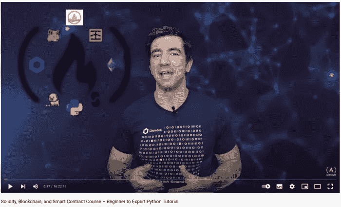

# FreeCodeCamp 的可靠性、区块链、智能合约从初学者到专家课程总结，第 10 部分

> 原文：<https://medium.com/coinmonks/freecodecamps-solidity-blockchain-smart-contracts-beginner-to-expert-course-summary-part-10-f09a843aef0f?source=collection_archive---------18----------------------->

## 让我们建立一个全栈 DeFi！

[Patrick Collins](/@patrick.collins_58673); the Author of the Course

欢迎来到我总结的第 10 部分！我很高兴你在这里。我写这些文章是为了分享我从[这门课](https://www.youtube.com/watch?v=M576WGiDBdQ)中学到的东西。

查看该系列的前几部分:

1.  [第一部分](https://kris-ograbek.medium.com/freecodecamps-solidity-blockchain-smart-contracts-beginner-to-expert-course-summary-part-1-3539606eee0e):区块链介绍【第 0 课】
2.  [第二部分](https://kris-ograbek.medium.com/freecodecamps-solidity-blockchain-smart-contracts-beginner-to-expert-course-summary-part-2-da6e642efdea):介绍 Solidity，Remix IDE，创建你的第一个智能合同。[第 1、2、3 课]
3.  [第三部分](https://kris-ograbek.medium.com/freecodecamps-solidity-blockchain-smart-contracts-beginner-to-expert-course-summary-part-3-fea146841d9a):web 3 . py 介绍。
4.  [第四部分](/coinmonks/freecodecamps-solidity-blockchain-smart-contracts-beginner-to-expert-course-summary-part-4-d9bb72a4a6bf):布朗尼简介。
5.  [第五部分](/coinmonks/freecodecamps-solidity-blockchain-smart-contracts-beginner-to-expert-course-summary-part-5-d77a8c99bfc4):区块链中的随机性。
6.  [第 6 部分](/coinmonks/freecodecamps-solidity-blockchain-smart-contracts-beginner-to-expert-course-summary-part-6-24e1aaa177e7):布朗尼混合&令牌标准。
7.  第七部分 : DeFi 协议& Aave。
8.  [第 8 部分](/coinmonks/freecodecamps-solidity-blockchain-smart-contracts-beginner-to-expert-course-summary-part-8-67a1dd76ec44):非功能性测试。
9.  [第 9 部分](/coinmonks/freecodecamps-solidity-blockchain-smart-contracts-beginner-to-expert-course-summary-part-9-b1531c54485a):智能合约升级。

如果你已经学完了前面所有的课程，你应该会很兴奋地读到最后一课。恭喜你成功了！然而，这一课的特别之处还在于另一个原因。您将最终通过将要创建的 GUI 与您的合同进行交互。在此之前，我们必须使用 Etherscan 或我们的终端来查看智能合约的输出。最后，您将构建自己的工具来完成这项工作！

第 13 课是这门课的最后一课。这意味着我正在写这个系列的最后一篇文章。我很想详细描述这一课的所有内容，但这是不可能的。如果你看了视频，我会给你一个总结。你应该去看看！

让我们开始吧！

# 第 13 课:全栈定义

## 摘要

在这一课中，你将使用三种语言编写代码: **Solidity** 、 **Python** 和 **TypeScript** 。您将为前端部分使用 **React** 框架。最后，您将利用 Material-UI 的预构建组件。

我们将编写两个智能契约:DappToken 和 TokenFarm。前者是将用于后者的 ERC20。这个想法是为了奖励在代币农场中下注代币的用户。Dapp Token 是我们用来支付奖励的货币。

Python/brownie 部分是最短的。我们需要部署我们的合同，并将 Dapp 令牌传输到令牌场。

但是大多数时候，你会用 TypeScript 编码。您将完成的任务包括:

*   连接加密钱包，
*   从钱包中读取信息，
*   从我们的智能合同中读取信息，
*   调用智能合约的函数，
*   还有更多。

## 经验教训

1.  **将 ERC20s 转换为合同**。

正如我提到的，我们创建了两个合同。其中之一是新的 ERC20 令牌。我们将用它来奖励第二份合同中的赌注者。跑马场。让我们看看如何用 Python 和 brownie 部署它们。

Deploy contracts and transfer Dapp Token to the Token Farm

如果到目前为止，您已经熟悉了第 4-10 行。然而，让我来为你分解代码:

*   第 6 行:部署 ERC20 DappToken 合同，
*   第 7–10 行:令牌场契约的部署。在构造函数中，我们传递 Dapp 令牌的地址，
*   第 13–15 行:将 Dapp 令牌传输到我们的令牌场。因为 Dapp 令牌继承自 ERC20，所以我们可以访问额外的功能，
*   `dapp_token.transfer()`允许转让代币、
*   `dapp_token.totalSupply()`是合约中的代币总额。

由于转让，我们的令牌农场合同拥有 Dapp 令牌用于奖励。

2.**为 Web 3 应用构建前端**。

在本课中，您将花大部分时间编写前端部分。我很乐意分解打字稿代码。但我觉得不太可能。我想避免在这里粘贴大部分代码，因为没有人会去浏览它。只给出片段也不是一个好主意。不了解上下文，就不可能理解部分代码。

但是我会给你一个 Web3 专用库的列表，你会在这个项目中了解到。

*   **useDapp** 。在这个项目中，我们将它用于许多目的。它给了我们连接的帐户和网络链 Id。连接和断开加密钱包很容易与图书馆。更重要的是，它允许调用智能合约函数。
*   **ethers.js** 。它提供了实用的常数和工具。其中，后者可以**将 ABI 转换为接口**。
*   **ethersproject.js** 。我们将与图书馆一起格式化单元。

3.**用 Material-UI 对前端进行造型**。每一个网站的设计，不是编写就是编译成 **CSS** 。虽然看起来很容易掌握，但是要精通 CSS 是需要时间和练习的。幸运的是，许多框架提供了现成的、好看的组件。Material-UI 就是这样的框架之一。在这个项目中，您将创建一个好看的应用程序，而无需显式编写 CSS 代码。

## 课程中的技术

Solidity，Python，TypeScript，React，brownie，Open Zeppelin，Chainlink，useDapp，ethers.js，material-ui。

# 最后的想法

30 天前，我写了这个系列的第一篇文章。今天，我写这个系列的最后一句话。最后写了 10 篇。我一周写 5-6 天。这可能还不足以培养一种习惯。然而，我觉得写作已经成为我旅程中至关重要的一部分。

如果你喜欢我解释事情的方式，请点击“跟随”按钮。我会坚持发帖子。在接下来的文章中，我想把重点放在 Web 3 开发上。我将使用 JavaScript 构建小项目，并与智能合约进行交互。我想探索一下**安全帽**框架。

你想在 Web 3 世界里读到什么？请在评论中告诉我！

## 参考

[YouTube 视频](https://www.youtube.com/watch?v=M576WGiDBdQ)

[全程 Github 回购](https://github.com/smartcontractkit/full-blockchain-solidity-course-py)

[第十三课 GitHub 回购](https://github.com/PatrickAlphaC/defi-stake-yield-brownie-freecode)

> 加入 Coinmonks [电报频道](https://t.me/coincodecap)和 [Youtube 频道](https://www.youtube.com/c/coinmonks/videos)了解加密交易和投资

# 另外，阅读

*   [Bookmap 评论](https://coincodecap.com/bookmap-review-2021-best-trading-software) | [美国 5 大最佳加密交易所](https://coincodecap.com/crypto-exchange-usa)
*   最佳加密[硬件钱包](/coinmonks/hardware-wallets-dfa1211730c6) | [Bitbns 评论](/coinmonks/bitbns-review-38256a07e161)
*   [新加坡十大最佳加密交易所](https://coincodecap.com/crypto-exchange-in-singapore) | [购买 AXS](https://coincodecap.com/buy-axs-token)
*   [红狗赌场评论](https://coincodecap.com/red-dog-casino-review) | [Swyftx 评论](https://coincodecap.com/swyftx-review) | [造币厂评论](https://coincodecap.com/coingate-review)
*   [投资印度的最佳密码](https://coincodecap.com/best-crypto-to-invest-in-india-in-2021)|[WazirX P2P](https://coincodecap.com/wazirx-p2p)|[Hi Dollar Review](https://coincodecap.com/hi-dollar-review)