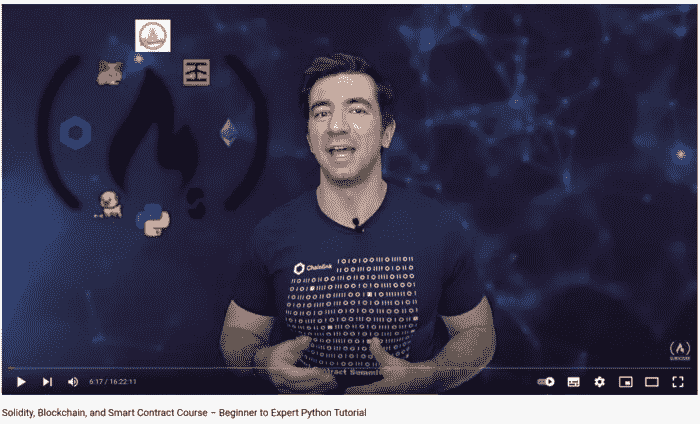

# FreeCodeCamp 的可靠性、区块链、智能合约初级到专家课程总结，第 3 部分

> 原文：<https://medium.com/coinmonks/freecodecamps-solidity-blockchain-smart-contracts-beginner-to-expert-course-summary-part-3-fea146841d9a?source=collection_archive---------24----------------------->

让我们继续这个免费教程的第 4 课。



[Patrick Collins](/@patrick.collins_58673); the Author of the Course

欢迎来到我总结的第三部分！我很高兴你找到了这篇文章。

查看该系列的前几部分:

1.  [第一部分](https://kris-ograbek.medium.com/freecodecamps-solidity-blockchain-smart-contracts-beginner-to-expert-course-summary-part-1-3539606eee0e):区块链介绍【第 0 课】
2.  [第二部分](https://kris-ograbek.medium.com/freecodecamps-solidity-blockchain-smart-contracts-beginner-to-expert-course-summary-part-2-da6e642efdea):介绍 Solidity，Remix IDE，创建你的第一个智能合同。[第 1、2、3 课]

对于这一部分，我决定只描述一课。它详细展示了我们需要采取哪些步骤来编译和部署智能契约。使用 Remix IDE 很简单。点击这里，点击这里，看看你的结果。然而，在引擎盖下发生了很多事情。

让我们开始吧！

# 第 4 课:Web3.py 简单存储

**总结**

在这一课，你不会写任何坚实的代码。相反，您将重用第 1 课:简单存储中的代码。您将使用 **solcx** 和 **Web3.py** 库编译和部署 Python 契约。在 Remix IDE 中，我们通过两次点击来完成；一个用于编译，一个用于部署。在这节课中，Patrick 仔细研究了这个过程。

**吸取的经验教训**

1.  不要硬编码你的私钥！！
2.  **用 solc 库编译 Solidity 智能合约。在 Remix IDE 中，我们只需点击一下鼠标就可以编辑我们的合同。**

这段代码返回一个冗长的 *compiled_sol* 对象。它包含了一堆只有编译器才可读的东西。但是它也返回两个重要的东西: **abi** (在[第二部分](https://kris-ograbek.medium.com/freecodecamps-solidity-blockchain-smart-contracts-beginner-to-expert-course-summary-part-2-da6e642efdea)中解释)和**字节码**。我们需要他们创建智能合约的“pythonic”版本。只有这样，我们才能使用 Web3.py 与它进行交互。

3.**使用 Web3.py 库创建** **智能合约**。在这一步，我们使用前面提到的 abi 和字节码。还有，我们必须连接到一个区块链。设置 **Web3。要实现这一点，HTTPProvider** 是必需的。对于初始测试，我强烈推荐使用 **Ganache** 。稍后，你应该在**测试网络**上测试你的合同。你必须在 **Infura** 上创建一个新项目来获得 HTTPProvider。在下面的代码片段中，您将看到一个示例。

4.**一个交易流程。**每次我们改变区块链上的东西，我们都要进行一次**交易**。交易示例:

*   智能合同部署
*   更改智能合同的值。我们称之为**改变智能合约的状态**

我们每调用一次交易，都要经过三个步骤:**建**、**签约**、**发送**。

*   **建立交易**

*   **签订交易**。首先，我们需要我们的私钥。

*记住:* ***千万不要硬编码你的私钥！*** *我守矿于此。env 文件并将该文件添加到. gitignore 中，如果有人获得了你的私钥，他就可以将你的钱发送到另一个钱包中，而你对此毫无办法。钱没了！*

为了发展，我使用一个测试账户，在这个账户上我永远不会有任何真钱。这是另一层安全，如果我把我的。env 文件。

**所以千万不要做这样的事情:**

```
private_key = 0x94385743ab0385ca3095238fe02385803bf3205805293754b23bca943875fe84 // some real private key
```

相反，从. env 中读取您的私钥。

```
private_key = os.getenv(“PRIVATE_KEY”) //from .env
```

然后，您可以发送您的交易。

*   **发送交易**

我向您展示了作为事务流程示例的契约部署。调用一个函数需要经历相同的步骤，除非它是一个**纯**或**视图**函数。

**新术语**

1.  **字节码**。一个低级代码，**以太坊虚拟机(EVM)** 需要读取我们的契约。
2.  **链条 ID** 。区块链上的每个网络都有一个唯一的链 ID。Mainnet 的链 ID 是 1，Rinkeby 的是 4。[这是链条 id](https://chainlist.org/)的完整列表。通过设置 id，我们告诉编译器我们想要在哪个网络上工作。
3.  **Nonce** 。用户进行的多次交易。你在区块链上的每一笔交易都会增加你地址的随机数。
4.  **加纳切**。它创建了运行在本地机器上的假区块链环境。相当于 Remix IDE 中的 **JavaScript VMs** 。由于在本地部署要快得多，所以便于测试。
5.  **Solcx** 。编译 Solidity 代码的库。
6.  **Infura** 。第三方客户，为我们运行区块链。你可以把它想象成一个区块链即服务平台。**炼金术**又是一个。

**技术**

Solidity，Web3.py，Ganache，Infura。

## 最后的想法

好了，这节课到此为止。老实说，这些都不容易。如果你在问自己:我总是要经历这些步骤吗？我有好消息。答案是否定的。

在接下来的部分，你将了解**布朗尼**。这是开发智能合约的一个很好的框架。Brownie 负责编译和部署。所以您不会接触到字节码，也不会显式地签署每个事务。然而，这一课对于理解我们编译时发生了什么是至关重要的。

请在评论中删除任何问题。

下一部分再见！

> 加入 Coinmonks [电报频道](https://t.me/coincodecap)和 [Youtube 频道](https://www.youtube.com/c/coinmonks/videos)了解加密交易和投资

# 另外，阅读

*   [Bookmap 评论](https://coincodecap.com/bookmap-review-2021-best-trading-software) | [美国 5 大最佳加密交易所](https://coincodecap.com/crypto-exchange-usa)
*   最佳加密[硬件钱包](/coinmonks/hardware-wallets-dfa1211730c6) | [Bitbns 评论](/coinmonks/bitbns-review-38256a07e161)
*   [新加坡十大最佳加密交易所](https://coincodecap.com/crypto-exchange-in-singapore) | [购买 AXS](https://coincodecap.com/buy-axs-token)
*   [红狗赌场评论](https://coincodecap.com/red-dog-casino-review) | [Swyftx 评论](https://coincodecap.com/swyftx-review) | [CoinGate 评论](https://coincodecap.com/coingate-review)
*   [投资印度的最佳密码](https://coincodecap.com/best-crypto-to-invest-in-india-in-2021)|[WazirX P2P](https://coincodecap.com/wazirx-p2p)|[Hi Dollar Review](https://coincodecap.com/hi-dollar-review)