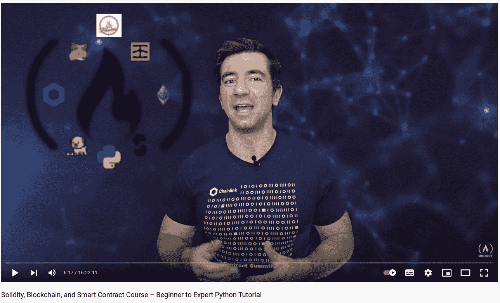
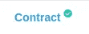

# FreeCodeCamp 的可靠性、区块链、智能合约初级到专家课程总结，第 4 部分

> 原文：<https://medium.com/coinmonks/freecodecamps-solidity-blockchain-smart-contracts-beginner-to-expert-course-summary-part-4-d9bb72a4a6bf?source=collection_archive---------14----------------------->

让我给你介绍一下布朗尼。



[Patrick Collins](/@patrick.collins_58673); the Author of the Course

欢迎来到我总结的第四部分！我很高兴你找到了这篇文章。我写这些文章来分享我从[这门课](https://www.youtube.com/watch?v=M576WGiDBdQ)中学到的东西。

查看该系列的前几部分:

1.  [第一部分](https://kris-ograbek.medium.com/freecodecamps-solidity-blockchain-smart-contracts-beginner-to-expert-course-summary-part-1-3539606eee0e):区块链介绍【第 0 课】
2.  第二部分:介绍 Solidity，混合 IDE，创建你的第一个智能合同。[第 1、2、3 课]
3.  [第三部分](https://kris-ograbek.medium.com/freecodecamps-solidity-blockchain-smart-contracts-beginner-to-expert-course-summary-part-3-fea146841d9a):web 3 . py 简介。

在这一部分，我们将了解**布朗尼**。它是一个智能合同开发平台，让您的生活更轻松。如果你从第三部分回忆起[，用 **Web3.py** 部署智能合约的过程是相当长的。上一课对于理解这一过程很重要。然而，作为一个智能合约开发者，你应该使用一个专用的框架，比如 **brownie** 或者 **hardhat** 。](https://kris-ograbek.medium.com/freecodecamps-solidity-blockchain-smart-contracts-beginner-to-expert-course-summary-part-3-fea146841d9a)

我们将在本课程的每个后续项目中使用布朗尼。

让我们开始吧！

# 第五课:布朗尼简单存储

**总结**

在这一课中，你将学习如何使用**布朗尼**创建项目。第三次，也是最后一次，我们将使用简单存储契约。

**经验教训**

1.  **与布朗尼一起发展**。用 brownie 启动一个新项目就像在控制台中键入一样简单:

```
$ brownie init 
```

此命令使用以下结构创建新的 brownie 项目:

```
-build/
 |-contracts/
 |-deployments/
 |-interfaces/
[-contracts/](https://www.youtube.com/watch?v=M576WGiDBdQ)
[-interfaces/
-reports/](https://www.youtube.com/watch?v=M576WGiDBdQ)
[-scripts/](https://www.youtube.com/watch?v=M576WGiDBdQ)
[-tests/](https://www.youtube.com/watch?v=M576WGiDBdQ)
```

Brownie 使用 *build/* 和 *reports/* 文件夹的内容来管理项目。作为开发人员，您**不应该编辑或删除**其中的任何内容。其他文件夹是做什么用的？

*   *合约*:稳健性合约，
*   *接口*:实体接口，
*   *脚本*:部署和与合同交互的脚本。
*   *契约*:测试项目的脚本

项目初始化后，所有文件夹都是空的。首先，我们需要一个契约或者一个接口。在我们的例子中，我们将 SimpleStorage.sol 添加到 contracts 文件夹中。

```
-build/
 |-contracts/
 |-deployments/
 |-interfaces/
[-contracts/](https://www.youtube.com/watch?v=M576WGiDBdQ)
 |-SimpleStorage.sol
[-interfaces/
-reports/](https://www.youtube.com/watch?v=M576WGiDBdQ)
[-scripts/](https://www.youtube.com/watch?v=M576WGiDBdQ)
[-tests/](https://www.youtube.com/watch?v=M576WGiDBdQ)
```

然后，我们必须运行:

```
$ brownie compile
```

这个命令将把 SimpleStorage.json 文件添加到 *build/contracts/* 文件夹中。该文件包含合同 **abi** 和**字节码**。提醒一下，我们需要它们用于 Python 与智能契约的交互。

2.**与布朗尼一起展开**。你还记得在[第 3 部分](https://kris-ograbek.medium.com/freecodecamps-solidity-blockchain-smart-contracts-beginner-to-expert-course-summary-part-3-fea146841d9a)中，你需要采取哪些步骤来调用交易吗？其中有三个:**建**、**签**、**送**。对于布朗尼，您需要几行代码:

就是这样！如果你回到[前一部分](https://kris-ograbek.medium.com/freecodecamps-solidity-blockchain-smart-contracts-beginner-to-expert-course-summary-part-3-fea146841d9a)，你会看到我们节省了多少时间。注意，我们从 brownie 导入了 SimpleStorage。它来自我们在上一步中填充的 *build/contracts/* 文件夹。然后，我们必须运行:

```
$ brownie run scripts/brownie_deploy.py
```

我们的合同将部署在本地区块链上。是因为布朗尼用**加纳切**运行区块链。

3.**用布朗尼测试**。作为一名开发人员，你总是要测试你的项目。在开发智能合约时，测试更加重要。你会和数字打交道，很大的数字。一个小小的错误可能导致数千甚至数百万美元的差异。

在 brownie 中编写测试时，有两件事情需要遵循。

*   将测试文件添加到 *tests/* 文件夹中，
*   测试文件名应以 **test_** 前缀开头，如 *test_simple_storage.py* 。布朗尼测试是用 **pytest，**构建的，它在你的项目文件夹中寻找前缀。

整个课程最精彩的部分之一是 Patrick 对测试的重视程度。您可以将测试分为三个类别:

*   **安排**:设置我们测试需要的所有部件，例如，获得一个帐户。
*   行动:准备一份巧妙的合同。这是我们部署契约和调用函数的地方。
*   **断言**:检查函数返回值是否正确。看看它们是否和我们期望的一样。

用布朗尼运行测试:

```
$ brownie test
```

**新术语**

1.  **布朗尼**。要了解关于这个框架的更多信息，请查看[布朗尼文档](https://eth-brownie.readthedocs.io/en/stable/toctree.html)。

**技术**

坚固性、蟒蛇皮、棕色、加纳切

# 第六课:布朗尼基金

**总结**

在本课中，我们将重用第 3 课中的 FundMe 合同。然而，这次我们将使用 brownie 与合同进行交互。

**经验教训**

1.  **布朗尼配置文件的重要性**。在更高级的项目中，配置起着更大的作用。为了添加布朗尼配置，我们创建了*布朗尼配置. yaml* 文件。它允许以下操作:

*   **将 GitHub 包导入到 Solidity 文件**。在 FundMe.sol 中，我们从 Chainlink 的 GitHub 导入包，如下所示:

```
import "@chainlink/contracts/src/v0.6/vendor/SafeMathChainlink.sol";
```

这里的问题是布朗尼不知道，@chainlink 在哪里。这意味着上面的导入抛出了一个错误。我们需要在 *brownie-config.yaml.* 中明确定义它

这将所有的导入，如上面的 SafeMathChainlink.sol，添加到*/brownie/contracts/dependencies*文件夹中。

*   **不同网络使用不同设置**。

价格馈送是提供真实世界数据的链式合同。为了与这些合同进行交互，我们需要地址。对于每个网络，地址是不同的。在配置文件中，我们定义了地址。下面这段代码读取正确的地址:

多亏了 *network.show_active()，我们得到了我们需要的地址。它返回一个带有我们当前连接的网络名称的字符串。因此，如果我们在 rinkeby 上工作，我们将从 *brownie-config.yaml.* 中获得相应的 *eth_usd_price_feed**

配置文件有更多的应用程序。但是，它们超出了本文的范围。随意探索。

2.**合同工作流程布朗尼**我需要一些时间来理解处理合同的工作流程。我们可以将其分为以下步骤:

*   把合同写实，
*   从控制台调用$ *brownie 编译*来填充 *build/* 文件夹，
*   部署协定，即调用其构造函数，
*   调用已部署契约上的函数，
*   测试已部署的协定。

3.**创建模拟合同**。下面，我来解释一下什么是模拟合同。为了创建一个，我们将 Solidity 代码添加到 *contracts/test/* 文件夹。

**新术语**

1.  **以太扫描**。Etherescan 是以太坊网络的区块链浏览器。从第 0 课开始我们就一直在用它。因此，如果您已经完成了本课程，那么以太扫描对您来说已经不再陌生了。区块链上发生的一切都是公开的。它会永远留在那里。以太扫描允许您搜索区块链数据，包括交易、钱包、区块和钱包。
2.  **模拟合同**。它们是我们为本地测试创建的合同。当我们在本地 ganache 网络上工作时，我们的区块链是空的。没有合同。我们需要模拟合同来模仿生活网络中部署的真实合同，例如 mainnet 或 rinkeby。我们传递给他们一些虚拟数据。在本课中，我们将为 chainlink 的价格源创建一个模拟。
3.  **以太扫描**上的合同验证。当我们部署契约时，我们可以添加选项 *publish_source=True* 。它将验证我们的合同，并在以太扫描上添加一个漂亮的标记。



A mark of a verified contract on Etherescan

这允许 Etherscan 与已验证的合同进行交互。你会看到固体代码。此外，您将能够读取公共变量和视图函数的值。

**技术**

坚固性、蟒蛇皮、棕色、加纳切

# 最后的想法

太多了！我从这两节课中学到了很多。像 brownie 这样的学习框架对于成为一名高效的开发人员至关重要。开始的时候，可能会很困惑。然而，在几个项目之后，你会更容易使用它。

请在评论中删除任何问题。

下一部分再见！

# 参考

[YouTube 视频](https://www.youtube.com/watch?v=M576WGiDBdQ)

[GitHub 库](https://github.com/smartcontractkit/full-blockchain-solidity-course-py)

[布朗尼文件](https://eth-brownie.readthedocs.io/en/stable/toctree.html)

> 加入 Coinmonks [电报频道](https://t.me/coincodecap)和 [Youtube 频道](https://www.youtube.com/c/coinmonks/videos)了解加密交易和投资

# 另外，阅读

*   [OKEx vs KuCoin](https://coincodecap.com/okex-kucoin) | [摄氏替代品](https://coincodecap.com/celsius-alternatives) | [如何购买 VeChain](https://coincodecap.com/buy-vechain)
*   [ProfitFarmers 回顾](https://coincodecap.com/profitfarmers-review) | [如何使用 Cornix 交易机器人](https://coincodecap.com/cornix-trading-bot)
*   [如何匿名购买比特币](https://coincodecap.com/buy-bitcoin-anonymously) | [比特币现金钱包](https://coincodecap.com/bitcoin-cash-wallets)
*   [瓦济克斯 NFT 评论](https://coincodecap.com/wazirx-nft-review)|[Bitsgap vs Pionex](https://coincodecap.com/bitsgap-vs-pionex)|[Tangem 评论](https://coincodecap.com/tangem-wallet-review)
*   [如何使用 Solidity 在以太坊上创建 DApp？](https://coincodecap.com/create-a-dapp-on-ethereum-using-solidity)
*   [币安 vs FTX](https://coincodecap.com/binance-vs-ftx) | [最佳(SOL)索拉纳钱包](https://coincodecap.com/solana-wallets)