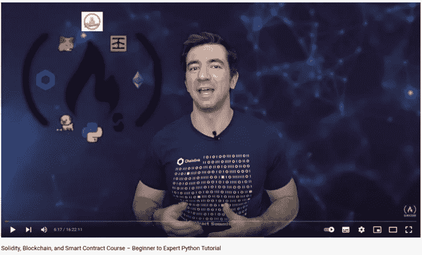

# FreeCodeCamp 的可靠性、区块链、智能合约初级到专家课程总结，第 7 部分

> 原文：<https://medium.com/coinmonks/freecodecamps-solidity-blockchain-smart-contracts-beginner-to-expert-course-summary-part-7-f12e4ade52da?source=collection_archive---------21----------------------->

让我们与 **Aave** 互动吧！



[Patrick Collins](/@patrick.collins_58673); the Author of the Course

欢迎来到我总结的第 7 部分！我很高兴你在这里。我写这些文章来分享我从[这门课](https://www.youtube.com/watch?v=M576WGiDBdQ)中学到的东西。

查看该系列的前几部分:

1.  [第一部分](https://kris-ograbek.medium.com/freecodecamps-solidity-blockchain-smart-contracts-beginner-to-expert-course-summary-part-1-3539606eee0e):区块链介绍【第 0 课】
2.  第二部分:介绍 Solidity，混合 IDE，创建你的第一个智能合同。[第 1、2、3 课]
3.  [第三部分](https://kris-ograbek.medium.com/freecodecamps-solidity-blockchain-smart-contracts-beginner-to-expert-course-summary-part-3-fea146841d9a):web 3 . py 简介。
4.  [第四部分](/coinmonks/freecodecamps-solidity-blockchain-smart-contracts-beginner-to-expert-course-summary-part-4-d9bb72a4a6bf):布朗尼简介。
5.  [第五部分](/coinmonks/freecodecamps-solidity-blockchain-smart-contracts-beginner-to-expert-course-summary-part-5-d77a8c99bfc4):区块链中的随机性。
6.  [第 6 部分](/coinmonks/freecodecamps-solidity-blockchain-smart-contracts-beginner-to-expert-course-summary-part-6-24e1aaa177e7):布朗尼混合&令牌标准

作为智能合约开发人员，您必须知道如何与其他智能合约交互。在本文中，我将向您展示如何使用最流行的 **Defi 协议之一来实现这一点；**[](https://aave.com/)**。Aave 是一个开源的 DeFi 协议，用于提供和借用**加密资产**。**

**让我们开始吧！**

# **第十课:Defi & Aave**

## **摘要**

**在这节课中，你将学习如何与一个好友互动。你将学习如何存款、取款、借款和还款。最棒的是？您将通过编程来完成这一切！我们会借一些钱给你，借一些钱给你。有趣的是，我们不会写任何智能合约。相反，我们将依赖公开可用的接口，并将它们复制粘贴到我们的项目中。**

## **经验教训**

1.  ****利用 Aave 进行借贷**。在课程开始时，[帕特里克](https://medium.com/u/589c510eb216?source=post_page-----f12e4ade52da--------------------------------)在科万测试网络上打开了一个音频文件。然后，他会经历出借和借用数字资产的步骤。对于没有使用过 DeFi 协议的人来说，这个介绍很有帮助。没有基本的概念，可能很难跟上这一课。毕竟，我们将重复相同的步骤，但是使用 Python 和 brownie。**
2.  ****使用 WETH (Wrapped Ether)** 等数字资产。这是以太币的 ERC-20 表示。1WETH =值。把它想象成赌场的代币。当你去那里时，你把真钱换成代币。你需要他们来玩。参观结束后，您将代币换回现金(假设您没有全部丢失:)。在 Aave 和大多数其他 DeFi 协议上，你需要 ERC-20 才能“玩”。**
3.  ****与 DeFi 协议(AAVE)的交互**。Aave 是一种贷款池合同。用户可以使用四种主要功能:**

*   ****贷款**:把你的资产提供给一个贷款池，**
*   ****借款**:你借出的资产可以作为借款的抵押。**
*   ****偿还**:偿还借入的资产。**
*   ****取款**:将资产转回钱包。**

****接口****

**正如已经提到的，我们将使用几个接口。我们的文件夹将如下所示:**

```
-interfaces/
 |-AggregatorV3Interface.sol
 |-IERC20.sol
 |-ILendingPool.sol
 |-ILendingPoolAddressesProvider.sol
 |-IWeth.sol
```

**让我来给你分析一下:**

*   ****aggregator v3 interface . sol**:我们将它用于**价格馈送**，我会在[第四部分](/coinmonks/freecodecamps-solidity-blockchain-smart-contracts-beginner-to-expert-course-summary-part-4-d9bb72a4a6bf)中更好地解释。**
*   **IERC20.sol:所有 ERC-20 令牌的标准接口。实现可在 [Open Zeppelin GitHub](https://github.com/OpenZeppelin/openzeppelin-contracts/blob/master/contracts/token/ERC20/IERC20.sol) 上获得，**
*   ****ILendingPool.sol** :与 Aave 协议交互的接口，**
*   ****ilendingpooladdressesprovider . sol**:Aave 开发者推荐使用这个契约来获取 Aave 协议的正确地址。因为 Aave 的地址可能会变。但是，Addresses Provider 是不可变的，它的地址永远不会改变。**
*   ****IWeth.sol** :类似 IERC20.sol 的合约，另外提供 **deposit()** 功能。我们会用它来交换我们，就像在赌场一样。**

**在我们的项目中，我们将与 Aave 协议进行交互。为了与智能契约交互，我们需要两样东西:契约的 **ABI** 和**地址**。我在[第二部](https://kris-ograbek.medium.com/freecodecamps-solidity-blockchain-smart-contracts-beginner-to-expert-course-summary-part-2-da6e642efdea)中写了更多。我们从 **ILendingPool** 接口获取 ABI。我们怎么得到地址？最简单的方法是打开 [Aave deployed contracts](https://docs.aave.com/developers/v/2.0/deployed-contracts/deployed-contracts) 页面，获取我们正在工作的网络的地址。然后，通过将地址粘贴到 *brownie-config.yaml* 文件中，对其进行硬编码。我希望您现在已经看到了这种方法的问题。**

****如果 ILendingPool 的地址改变了怎么办？****

**很棒的问题！这种情况可能会发生，尤其是在测试网络上，例如 Kovan。这就是为什么我们通过 ILendingPoolAdresseesProvider 获得 ILendingPool 的地址。如前所述，它的地址永远不会改变。我们的 *brownie-config.yaml* 看起来是这样的:**

**brownie-config.yaml **does not** include the lending_pool address.**

**我们怎么才能拿到 ILendingPool 的地址？我们为它创建了一个简短的函数:**

**A function to get Aave Contract.**

**上面的函数返回部署在区块链上的 Aave 契约。所以我们可以和 DeFi 协议互动。**

***注意:在本文中，为了更好地理解，我提供了代码片段和函数。它们是一个更大项目的一部分，无法独立运行。我鼓励你从*[*Patrick ' s GitHub*](https://github.com/PatrickAlphaC/aave_brownie_py_freecode)*中抓取完整代码。***

****批准****

**此时，我们可以使用我们的帐户与 Aave 进行交互。出于安全原因，它无权使用我们的资产。我们必须批准从我们的钱包里转账。**

**Example of how to approve Aave to use 0.1 of our Weth.**

**我们不仅批准每个令牌，还批准协议可以使用的数量。**

****存款****

**在我们批准我们的令牌后，我们终于可以存放它了。**

**Example of how to deposit 0.1 Weth on Aave.**

**这笔交易之后，你就可以在科万的档案上看到你的存款了。因为你提供资产，你将获得被动收入。让我们进入下一步。**

****借款****

**在区块链中，要借用任何资产，你都必须先存款。你可以用借出的钱作抵押。然而，你可以借的比你存的少，通常是 50-80 %,这取决于你的资产。解释这些数字超出了本文的范围。如果你想了解更多，可以查看一下**清算**和**健康因子**的含义。**

**在我们的项目中，我们借用了一个流行的**稳定币**、**戴**。我就不计算我们应该借多少钱了。**

**Borrowing DAI on Aave;**

**太好了！你借了戴！你可以把它转到你的钱包里，用它做任何你想做的事情。**

****还款****

**只要我们的健康系数高，我们就不用还贷。尽管如此，我们还是要做。怎么会？**

**Approve and repay borrowed assets.**

**请注意，我们必须再次批准。当我们从账户转账*时，这一步是必需的。当我们借款时，资产进入我们的账户，因此我们跳过审批。***

***注意:在课程中，我们与 Aave v.2 进行交互。在撰写本文时，Aave v.3 可用于多个区块链。当您将 ILendingPool.sol 复制到项目中时，请确保您使用的是第二个版本。***

## **新术语**

1.  ****Aave** 。这是一个用于提供和借用**加密资产**的开源 DeFi 协议。它提供了进入贷款池的机会。**
2.  **贷款池。这是一个智能合同，可以借出、借入、偿还和提取数字资产。**

## **技术**

**坚固，布朗尼，开放齐柏林飞艇，万岁**

# **最后的想法**

**恭喜你！您刚刚学习了与 Aave 互动的完整过程！是不是很牛逼？**

**你有什么问题吗？你喜欢这种总结吗？请在评论中告诉我！**

****参考文献****

**[YouTube 视频](https://www.youtube.com/watch?v=M576WGiDBdQ)**

**[GitHub 回购](https://github.com/smartcontractkit/full-blockchain-solidity-course-py)**

> **加入 Coinmonks [电报频道](https://t.me/coincodecap)和 [Youtube 频道](https://www.youtube.com/c/coinmonks/videos)了解加密交易和投资**

# **另外，阅读**

*   **[3 commas Review](/coinmonks/3commas-review-an-excellent-crypto-trading-bot-2020-1313a58bec92)|[Pionex Review](https://coincodecap.com/pionex-review-exchange-with-crypto-trading-bot)|[coin rule Review](/coinmonks/coinrule-review-2021-a-beginner-friendly-crypto-trading-bot-daf0504848ba)**
*   **[莱杰 vs Ngrave](/coinmonks/ledger-vs-ngrave-zero-7e40f0c1d694) | [莱杰 nano s vs x](/coinmonks/ledger-nano-s-vs-x-battery-hardware-price-storage-59a6663fe3b0) | [币安评论](/coinmonks/binance-review-ee10d3bf3b6e)**
*   **[Bybit Exchange 评论](/coinmonks/bybit-exchange-review-dbd570019b71) | [Bityard 评论](https://coincodecap.com/bityard-reivew) | [Jet-Bot 评论](https://coincodecap.com/jet-bot-review)**
*   **[3 commas vs crypto hopper](/coinmonks/3commas-vs-pionex-vs-cryptohopper-best-crypto-bot-6a98d2baa203)|[赚取加密利息](/coinmonks/earn-crypto-interest-b10b810fdda3)**
*   **最好的比特币[硬件钱包](/coinmonks/hardware-wallets-dfa1211730c6) | [BitBox02 回顾](/coinmonks/bitbox02-review-your-swiss-bitcoin-hardware-wallet-c36c88fff29)**