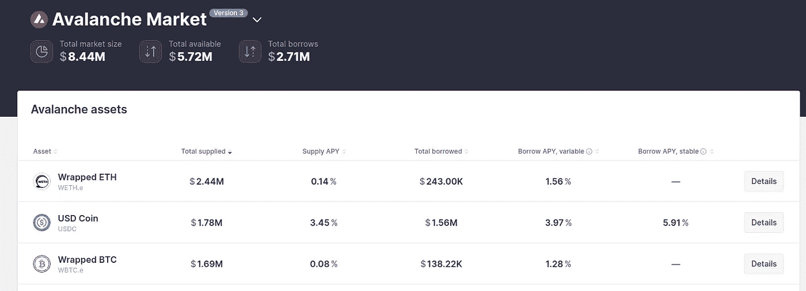
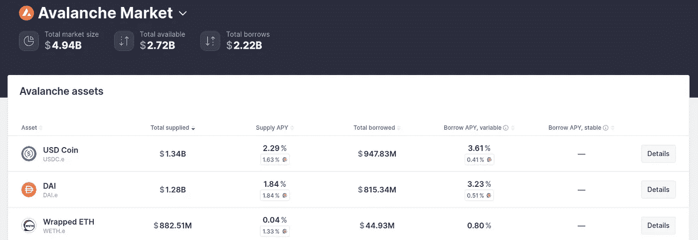
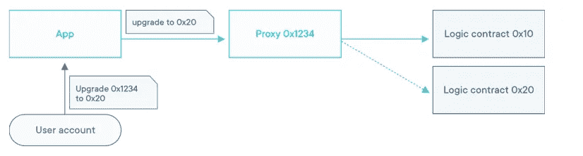

# FreeCodeCamp 的可靠性、区块链、智能合约初级到专家课程总结，第 9 部分

> 原文：<https://medium.com/coinmonks/freecodecamps-solidity-blockchain-smart-contracts-beginner-to-expert-course-summary-part-9-b1531c54485a?source=collection_archive---------12----------------------->

## 智能合约是不可变的，不是吗？

[Patrick Collins](/@patrick.collins_58673); the Author of the Course

欢迎来到我总结的第 9 部分！我很高兴你在这里。我写这些文章是为了分享我从[这门课](https://www.youtube.com/watch?v=M576WGiDBdQ)中学到的东西。

查看该系列的前几部分:

1.  [第一部分](https://kris-ograbek.medium.com/freecodecamps-solidity-blockchain-smart-contracts-beginner-to-expert-course-summary-part-1-3539606eee0e):区块链介绍【第 0 课】
2.  [第二部分](https://kris-ograbek.medium.com/freecodecamps-solidity-blockchain-smart-contracts-beginner-to-expert-course-summary-part-2-da6e642efdea):介绍 Solidity，Remix IDE，创建你的第一个智能合同。[第 1、2、3 课]
3.  [第三部分](https://kris-ograbek.medium.com/freecodecamps-solidity-blockchain-smart-contracts-beginner-to-expert-course-summary-part-3-fea146841d9a):web 3 . py 介绍。
4.  [第四部分](/coinmonks/freecodecamps-solidity-blockchain-smart-contracts-beginner-to-expert-course-summary-part-4-d9bb72a4a6bf):布朗尼简介。
5.  [第五部分](/coinmonks/freecodecamps-solidity-blockchain-smart-contracts-beginner-to-expert-course-summary-part-5-d77a8c99bfc4):区块链中的随机性。
6.  [第 6 部分](/coinmonks/freecodecamps-solidity-blockchain-smart-contracts-beginner-to-expert-course-summary-part-6-24e1aaa177e7):布朗尼混合&令牌标准。
7.  [第 7 部分](https://kris-ograbek.medium.com/freecodecamps-solidity-blockchain-smart-contracts-beginner-to-expert-course-summary-part-7-f12e4ade52da) : DeFi 协议& Aave。
8.  [第 8 部分](/coinmonks/freecodecamps-solidity-blockchain-smart-contracts-beginner-to-expert-course-summary-part-8-67a1dd76ec44):非功能性测试。

在这篇文章中，我总结了一个关于智能合同升级的教训。作为一名正在成长中的智能合同开发人员，我发现这很吸引人。智能合约是不可变的，不是吗？

智能合约是不可改变的。

一旦智能合约部署在区块链上，就不可能更改它。它的逻辑永远不变。

是否意味着他们不能改变？

看情况。升级智能合约有三种常见方式。在本文结束时，您将了解这些方法以及每种方法的优点和缺点。

让我们开始吧！

# 第 12 课:升级

## 介绍

如前所述，我喜欢这一课。我对智能合同是如何更新的有了很好的理解。我也会尽力帮助你理解这些概念。

## 方法一:参数化。

在这种方法中，开发人员创建的变量在未来可能会发生变化。通常，他们添加可以从另一个智能契约调用的 setters。所以这不是真正的升级，更像是留下了改变的可能性。

**好处**

*   简单。

**瑕疵**

*   少放权。它为管理员打开了控制重要变量的大门，
*   容易成为骗子的目标，
*   开发人员必须考虑到未来可能发生变化的一切。如果他们忘记为一个变量创建 setter，他们就不能再修改它了。

## 方法 2:社会 Yeet /迁移。

是最像区块链的方法。开发人员创建一个新的、改进版本的智能合约。然后，他们说服人们开始使用它，而不是以前的版本。他们是怎么做到的？通过提供一个更好的合同版本，修复已知问题，优化用户收益。许多流行的 **DeFi 协议**，包括 **Aave** 和 **Uniswap、**都使用这种方法来升级他们的合约。

**总是成功吗？**

一个月前，开发者推出了 Aave 3。让我们看看它与第二版相比表现如何。Aave 3 运行在六个不同的区块链上。然而，以太坊不在其中。为了比较协议版本，我们将使用**雪崩区块链**。首先，Aave 3。

AAVE **v.3** for Avalanche Blockchain.

让我们看看第二版。

AAVE **v.2** for Avalanche Blockchain.

最重要的指标是**总市场规模**。第二版的数字要大 500 多倍。是否意味着向 Aave 3 的迁移是失败的？我不会这么说。我们必须考虑许多方面，比如:

*   现在还很早，
*   Aave 2 为雪崩区块链提供**激励**。这意味着投资者因使用 Aave 2 而获得额外收入，
*   我们无法比较以太坊的结果，以太坊是最受欢迎的区块链，
*   多边形上的数字也倾向于第二版，但总市场规模“只有”30:1 左右。

Uniswap，一个**流动性池协议**，也在过去迁移过。第三个版本允许投资者优化他们的被动收入。

*注意:在这篇文章中，我将向您展示迁移在实践中的样子。这就是为什么我没有提到 Aave 3 与 Aave 2 相比提供了什么，也没有解释 Uniswap 3 如何为投资者优化被动收入。*

**好处**

*   最像区块链的，
*   用户选择他们想要使用的版本，
*   升级版本必须提供大的改进。

**瑕疵**

*   说服人们迁移可能会失败，
*   将资产转移到新合同可能具有挑战性。

## 方法三:代理。

代理是程序升级最真实的形式。

Proxy contract diagram; source [Open Zeppelin documentation](https://blog.openzeppelin.com/the-transparent-proxy-pattern/).

在代理模式中，用户连接到代理契约。在不深入代理合同的底层内容的情况下，您应该知道两件事:

*   他们使用`**delegateCall**` **功能**，
*   它们与**实现契约**交互。

在基本模型中，我们有两个组件:

1.  一份**代理合同**。它存储协议的**状态**。它意味着所有的变量、映射等。它还*指向当前的实现契约*。
2.  一份**实施合同**。它保存协议的**逻辑**。

代理契约使用了`delegateCall`功能。我们将电话委托给哪里？执行合同。让我们称之为契约 B。因此，通过一个`delegateCall`，代理调用契约 B 中定义的一个函数。契约 B 进行计算，并将更新后的值返回给代理。代理获取新值并更新其变量。

我们总结一下:

*   多亏了`delegateCall`，代理契约通过实现契约的逻辑来改变它们的变量，
*   部署的代理契约不会改变，
*   为了更新，我们部署了新的实施合同。然后，我们在代理契约中更改实现契约的地址，
*   契约的管理员是一个用户或一组用户，他们重新路由到新的实现契约。

有三种不同的**代理模式:**

1.  **透明代理模式。**
2.  [**通用升级代理标准。**](https://eips.ethereum.org/EIPS/eip-1822)
3.  [**钻石/多面代理。**](https://eips.ethereum.org/EIPS/eip-2535)

在本课中，Patrick 实现了第一个代理模式。我没有在文章中包括它，因为我必须粘贴大量代码并分解它。这会使文章至少长一倍。你想让我写一篇关于透明代理的文章吗？我会给你一个例子，并通过代码的细节。

**好处**

*   因为代理存储数据，所以不需要传输数据，
*   如果我们需要一个新的变量，我们必须将它添加到实现契约中。

**瑕疵**

*   它有许多陷阱和潜在的问题，
*   如果管理是一个单一的实体，分散化可能会有风险。

# 最后的想法

智能合同升级是一个复杂的话题，尤其是对初学者来说。我发现用简单的英语解释它很有挑战性。但我尽力了。

你喜欢吃吗?你有什么问题吗？请在评论中告诉我！

# 参考

[YouTube 视频](https://www.youtube.com/watch?v=M576WGiDBdQ)

[全程 Github 回购](https://github.com/smartcontractkit/full-blockchain-solidity-course-py)

[第 12 课 GitHub 回购](https://github.com/PatrickAlphaC/upgrades-mix)

> 加入 Coinmonks [电报频道](https://t.me/coincodecap)和 [Youtube 频道](https://www.youtube.com/c/coinmonks/videos)了解加密交易和投资

# 另外，阅读

*   [如何在加拿大购买加密货币？](https://coincodecap.com/how-to-buy-cryptocurrency-in-canada)
*   [百无聊赖的猿游艇俱乐部(BAYC)审查](https://coincodecap.com/bored-ape-yacht-club-bayc-review)
*   [5 款最佳加密交易终端](https://coincodecap.com/crypto-trading-terminals) | [最佳 DeFi 应用](https://coincodecap.com/best-defi-apps)
*   [在美国如何使用 BitMEX？](https://coincodecap.com/use-bitmex-in-usa) | [BitMEX 评论](https://coincodecap.com/bitmex-review)
*   [最佳期货交易信号](https://coincodecap.com/futures-trading-signals) | [流动性交易所评论](https://coincodecap.com/liquid-exchange-review)