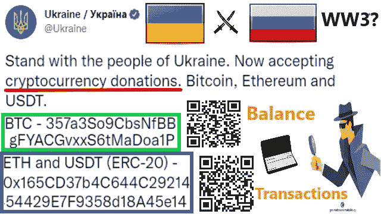

# 公开加密货币的自由和透明案例研究捐赠给乌克兰

> 原文：<https://medium.com/coinmonks/freedom-and-transparency-of-open-cryptocurrency-case-study-donation-to-ukraine-f50c90bbe9af?source=collection_archive---------86----------------------->

透明性是加密货币的关键创新之一。被普通人称为“加密货币”的术语和被学者称为“公开区块链”的术语是一种内部人人可见的金融技术。如果我们知道加密货币账户的所有者，我们就可以全面、实时地跟踪他们的交易。