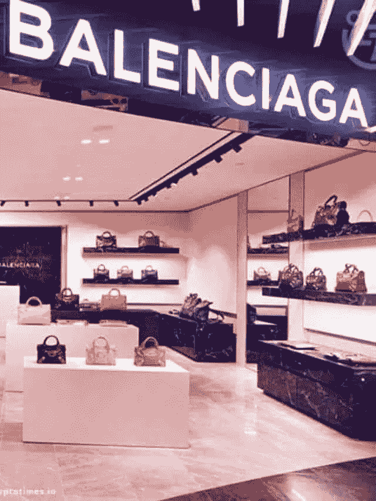

# 法国时装品牌巴黎世家在美国接受数字货币支付

> 原文：<https://medium.com/coinmonks/french-fashion-house-balenciaga-to-accept-digital-currencies-as-payment-in-the-united-states-571596b1c308?source=collection_archive---------61----------------------->

您现在可以使用比特币、以太坊和柴犬从巴黎世家购买时尚商品。

巴黎世家成为最新一个宣布在其美国总店接受加密货币支付的时尚品牌。

《女装日报》报道称，这家法国时尚品牌将在选定的美国商店接受比特币(BTC)和以太坊(ETH)支付，包括其在纽约麦迪逊大道和比佛利山庄罗迪欧大道的分店，以及其在线商店。

巴黎世家展开产品

该公司透露，根据顾客对新发展的反应，未来将在其他地区开设商店。

此外，虽然巴黎世家已经开始接受比特币和以太坊支付，但该公司补充说，一旦选择加密货币支付提供商，它还将随着时间的推移包括其他数字货币。

巴黎世家并不担心加密的不稳定性

这一举措似乎不是在完美的时间提出的，因为加密货币市场整体大幅下滑，过去两周市场损失超过 1 万亿美元。

过去几周，随着投资者继续小心翼翼地减少损失，对加密货币相关大幅波动的担忧有所加剧。

有趣的是，巴黎世家并不担心加密货币的波动性，因为这个流行的时尚品牌透露，它“对加密进行了长期思考”，并补充说“货币价值的波动并不新鲜。”

> 加入 Coinmonks [电报频道](https://t.me/coincodecap)和 [Youtube 频道](https://www.youtube.com/c/coinmonks/videos)了解加密交易和投资

# 另外，阅读

*   [Bookmap 点评](https://coincodecap.com/bookmap-review-2021-best-trading-software) | [美国 5 大最佳加密交易所](https://coincodecap.com/crypto-exchange-usa)
*   最佳加密[硬件钱包](/coinmonks/hardware-wallets-dfa1211730c6) | [Bitbns 评论](/coinmonks/bitbns-review-38256a07e161)
*   [新加坡十大最佳加密交易所](https://coincodecap.com/crypto-exchange-in-singapore) | [购买 AXS](https://coincodecap.com/buy-axs-token)
*   [红狗赌场评论](https://coincodecap.com/red-dog-casino-review) | [Swyftx 评论](https://coincodecap.com/swyftx-review) | [造币厂评论](https://coincodecap.com/coingate-review)
*   [投资印度的最佳密码](https://coincodecap.com/best-crypto-to-invest-in-india-in-2021)|[WazirX P2P](https://coincodecap.com/wazirx-p2p)|[Hi Dollar Review](https://coincodecap.com/hi-dollar-review)
*   [加拿大最佳加密交易机器人](https://coincodecap.com/5-best-crypto-trading-bots-in-canada) | [库币评论](https://coincodecap.com/kucoin-review)
*   [OKEx vs KuCoin](https://coincodecap.com/okex-kucoin) | [摄氏替代品](https://coincodecap.com/celsius-alternatives) | [如何购买 VeChain](https://coincodecap.com/buy-vechain)