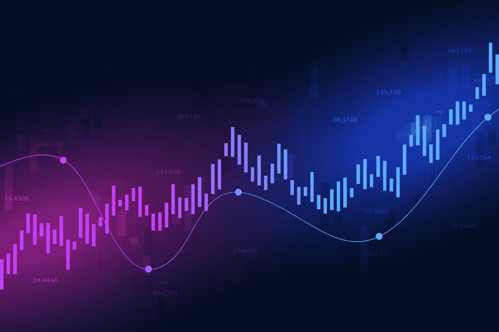

# 从阿尔法到贝塔:交易。

> 原文：<https://medium.com/coinmonks/from-alpha-to-beta-trading-f99d03d2aae1?source=collection_archive---------17----------------------->

DeltaPrime 交易部分即将进行的改进。

DeFi 竞赛的 DeltaPrime Wolf，庆祝 DeltaPrime 的 alpha 发布，将于明天举行。在这个发布会上，交易者将会面对奖品，检查平台，并确立自己是真正的 DeFi 之狼。作为一名参加比赛的交易者，请记住这只是 Alpha 版本，这意味着我们的重点是在短期内对平台进行巨大的改进。哪些改进？很高兴你问了！

**抵押品期权**

现在，你可以把$AVAX 作为抵押，并以此获得贷款。虽然您可以通过使用我们的交易功能来更改您持有的代币，但您只能以$AVAX 为基准进行借贷，这意味着无论您进行何种交易，您的盈利能力都与红色硬币的价格息息相关。我们通往 Beta 的道路上的改进之一是添加了其他令牌作为抵押品。这意味着，过不了多久，你就可以把 USDT 作为抵押品，获得$AVAX 的回报，如果$AVAX 的价格上涨，你就可以获利。此外，当与 stablecoins 一起使用时，该功能将简化和改善初学加密交易者的交易体验，因为他们将能够在绘制图表时将他们的当前资产价格与他们通常更熟悉的美元等值进行比较。

**杠杆变异**

LTV 是你贷款的健康因素，最高设定为 500%。目前，这个上限百分比与代币分配或交易者经验无关。实际上，并不是所有的代币都有同样的风险。与不稳定的国家相比，像 USDT 这样稳定的国家波动性较小，降低了清算风险。在不久的将来，我们将考虑价格波动等因素，改变应用于代币的“权重”。这意味着存款 USDT 为你提供了获得更高交易杠杆的可能性。

虽然 500%的上限也是为了防止新手交易者过度扩张自己，但它可能会阻止更有经验的交易者执行对他们有利的交易策略。由于我们的目标是为有经验的交易者提供良好的交易体验，我们正在研究为这些交易者提供更高杠杆的可能性。

**止损**

我们喜欢杠杆。在交易中，它提供了超出一般交易的机会。同时，我们意识到杠杆交易的潜在风险。由于止损使您能够自动退出亏损的交易，我们正在研究在我们的协议中包含止损或止损等价物的可能性。目前正在探索的可能性有:1)在协议本身中实现止损的可能性，2)整合第三方代表 DeltaPrime 投资者管理止损，3)创建一个 Discord bot，在达到给定的目标价格时向您发出警告。

我们的首要任务是创建不和谐机器人，之后我们将探索在协议中建立止损的可能性。在任何情况下，你都可以安全地离开你的电脑，而不必担心交易是否达到了临界数字。

**高级图表**

所有技术分析人员集合！详细图表即将发布。为了给更多有经验的交易者最好的体验，该平台将提供对价格行为的详细见解。如果 TradingView 允许，您还可以绘制自己的线条/使用自己喜欢的信号。这样你就可以完全控制你所做的交易。

**小的额外改进**

在你交易页面的底部，你会找到你当前的交易历史。我们认为投资者将受益于更详细，但优雅的交易历史。这样，你就能准确地知道你在什么时候和什么价位用你的$AVAX 换了$BTC，然后再换回来，而不会影响到最重要的功能。

我们还将在平台中引入黑暗模式。能够控制黑暗面平台的颜色会让你有一种我们都喜欢的感觉。不错的壮举。

最后但同样重要的是:将引入一个面额按钮。现在整页都是以美元计价的。这将很快定制为$AVAX。除了我们对$AVAX 的爱国之情——所有人都为红色硬币欢呼——将面额改为$AVAX 让大多数人更容易进行技术分析。还想知道你的代币的法定价格？再按一下那个按钮，继续，我们不会说出去的。

当然，DeltaPrime 不仅仅是一个交易平台。然而，随着这些改进的到位，我们知道交易部分是第一个繁荣的。

让我们把这些代币投入使用。

# — — — — — — — — — — — — — — — — — —

# 关于 DeltaPrime

DeltaPrime 是您的主要经纪人，致力于释放 DeFi 的全部潜力。我们通过提供安全的低抵押贷款，重新分配资产，关注资金效用最大化来实现这一目标。我们的投资者建立在 Avalanche 网络的坚实基础之上，可以确保他们最重要的投资获得快速可靠的交易。

一定要来看看我们！

> ***|🐦* [*推特*](https://twitter.com/DeltaPrimeDefi) *|👾* [*不和*](https://discord.gg/9bwsnsHEzD) *|***

> **加入 Coinmonks [电报频道](https://t.me/coincodecap)和 [Youtube 频道](https://www.youtube.com/c/coinmonks/videos)了解加密交易和投资**

# **另外，阅读**

*   **[在美国如何使用 BitMEX？](https://coincodecap.com/use-bitmex-in-usa) | [BitMEX 回顾](https://coincodecap.com/bitmex-review) | [买索拉纳](https://coincodecap.com/buy-solana)**
*   **[德国最佳加密交易所](https://coincodecap.com/crypto-exchanges-in-germany) | [Arbitrum:第二层解决方案](https://coincodecap.com/arbitrum)**
*   **[比诺莫评论](https://coincodecap.com/binomo-review) | [斯多葛派 vs 3Commas vs TradeSanta](https://coincodecap.com/stoic-vs-3commas-vs-tradesanta)**
*   **[Capital.com 评论](https://coincodecap.com/capital-com-review) | [香港的加密借贷平台](https://coincodecap.com/crypto-lending-hong-kong)**
*   **[支持卡审核](https://coincodecap.com/uphold-card-review) | [信任钱包 vs 元掩码](https://coincodecap.com/trust-wallet-vs-metamask)**