# 从币安 CFX (bCFX)到 PoS 在 Conflux 上的赌注

> 原文：<https://medium.com/coinmonks/from-bcfx-to-pos-staking-on-conflux-dca0df638233?source=collection_archive---------4----------------------->

拥有 bCFX 的币安用户可以轻松地在 Conflux PoS 网络上下注。本指南将引导您完成将 bCFX 连接到 Conflux 并对其进行赌注的过程。

# 先决条件

对于本教程，您需要安装以下软件:

*   一个币安账户。
*   [流畅钱包](http://fluentwallet.com)，兼容 Conflux 的钱包。
*   您的浏览器上安装了元掩码。
*   MetaMask 与币安智能链的连接。
    关于如何将 MetaMask 连接到币安智能链的说明，您可以遵循[本教程](https://academy.binance.com/en/articles/connecting-metamask-to-binance-smart-chain)。
*   至少 1000 `bCFX`，将用于打桩。
    **注**:在 PoS 下注需要至少下注 1000 `CFX`。如果你希望下注更多，你需要下注 1000 的倍数`CFX`(即。2000 `CFX`，3000 `CFX`等。).
*   BNB 加油。
*   `CFX`为气。

# 概观

汇流位置终结链中的锁定`bCFX`过程包括以下步骤:

1.  通过币安智能链将`bCFX`存入您的 MetaMask 钱包
2.  使用 Shuttleflow 将您的`bCFX`连接到 Conflux as `CFX`
3.  在汇流位置赌注池中下注`CFX`

# 1.通过币安智能链将 bCFX 存入您的 MetaMask 钱包

在本部分中，您将把您的`bCFX`从您的币安帐户中提取到您的 MetaMask 帐户中。

**注意**:如果您还没有这样做，请将您的 MetaMask 帐户连接到币安智能链网络。点击[此处](https://academy.binance.com/en/articles/connecting-metamask-to-binance-smart-chain)查看详细说明。

1.登录您的币安帐户。

2.进入**钱包** > **概述**。

3.点击**撤回**。

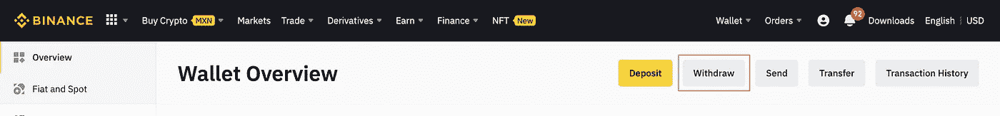

4.在**选择硬币**中，选择 **CFX —汇流网络**。

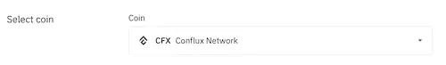

5.在地址中，输入元掩码中的 BSC wallet 地址。
**注**:请确保您的 MetaMask 钱包已连接到币安智能链网络！

6.在网络中，确保选择了 **BSC — BNB 智能链(BEP20)** 。

7.在提取金额中，输入要提取的金额。对于本教程，我们将使用 **1100.00 CFX** (1100 `bCFX`)。

8.点击**提取**提取您的资金。

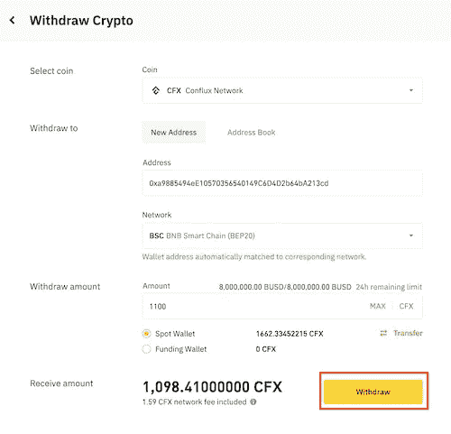

9.在对话框中，点击**确认**确认您的传送。
**注**:该交易将使用 BNB 支付币安智能连锁网络的天然气费用。

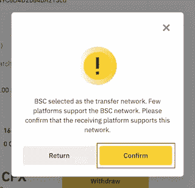

10.一旦您确认您的转移，您需要完成安全验证。这个过程需要确认一个验证码发送到您的电子邮件和另一个发送到您的手机。输入这些代码并点击**提交**完成安全验证。

11.您需要等待 15 次批量确认才能看到您的 MetaMask 钱包中反映的资金。完成 15 次批量确认后，转到 MetaMask 验证资金是否正确反映在您的钱包中。或者，您也可以在币安验证交易 ID。

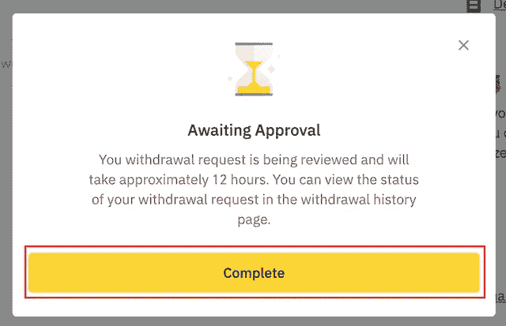

您已经通过币安智能链网络将您的`bCFX`从您的币安账户转移到您的 MetaMask 账户！

# 2.使用 Shuttleflow 将 bCFX 作为 CFX 连接到 Conflux

在本节中，您将学习如何使用 Shuttleflow 将您的`bCFX`从币安智能连锁网络连接到 Conflux。这些资金将作为`CFX`连接到 Conflux。

**注意**:请确保您已经安装并设置了 Fluent Wallet。

1.转到 [Shuttleflow](http://shuttleflow.io/) 并启动 Shuttleflow 应用程序。

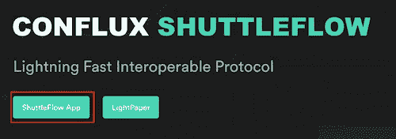

2.选择 **BSC** 作为源网络，点击**连接**连接您的 MetaMask 钱包。

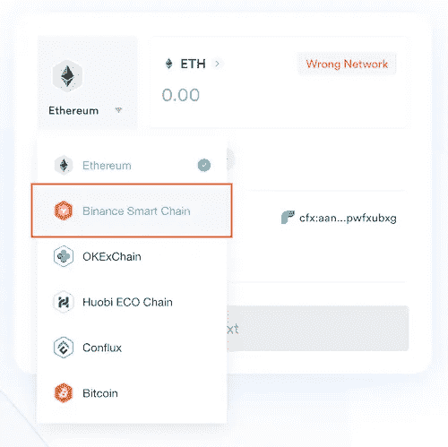

3.在 MetaMask 对话框中，选择您想要连接的帐户，然后单击下一个按钮**。**

4.在 MetaMask 的 Connect to Conflux 对话框中，点击 **Connect** 完成钱包连接。

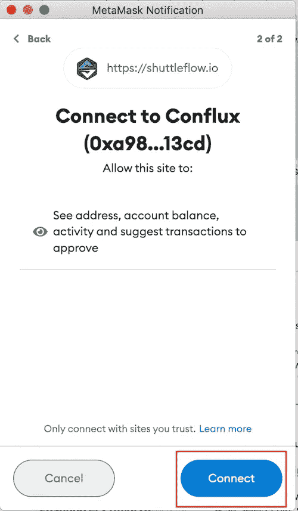

5.点击 BNB 旁边的**右箭头**打开选择令牌对话框，然后选择 **bCFX** 。

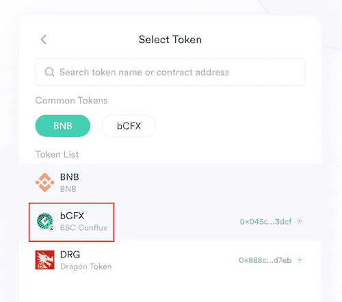

6.输入您希望转账的`bCFX`金额。在这种情况下，我们将使用最大可用金额，即 1098.41 `CFX`。

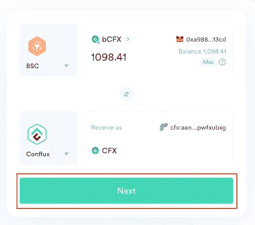

7.选择**汇流**作为目的网络，点击**连接钱包**。

8.将您的流畅钱包连接到 Shuttleflow。

9.在接收方式中，确保选择了 **CFX** 。

10.点击**下一步**继续将您的 BNB 连接到 Shuttleflow。

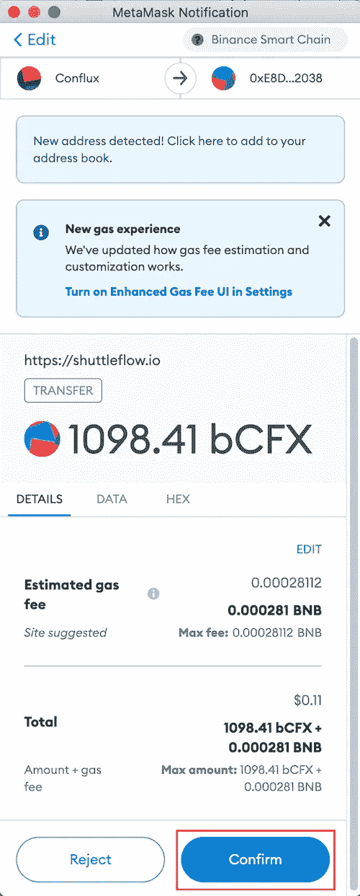

11.在转账对话框中，查看交易详情并检查**我已确认转账信息**，然后点击**下一步**。

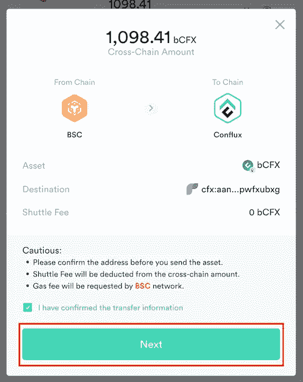

12.在两步对话框中，单击**发送**将您的`bCFX`发送到桥智能合同。
**注**:该交易将使用 BNB 支付币安智能连锁网络的天然气费用。

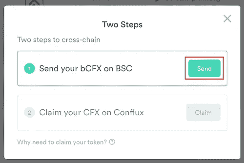

13.确认 MetaMask 上的事务，以完成 Shuttleflow 中桥接流程的第一步。
**注意**:此交易可能需要几分钟时间。

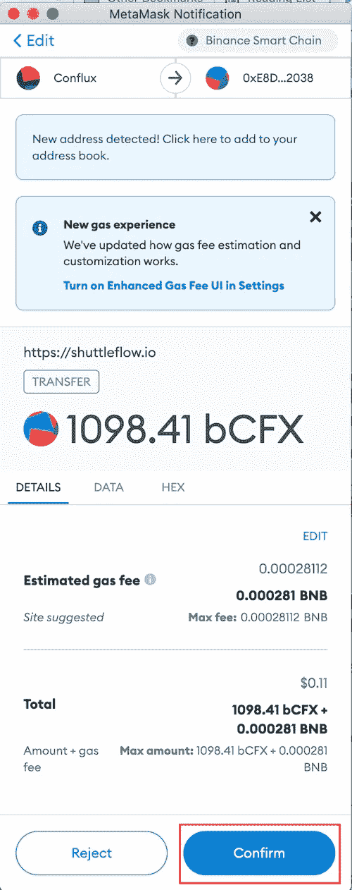

14.交易在币安智能链上确认后，点击**认领**，使用您的 Fluent 钱包在 Conflux 上认领您的`CFX`。

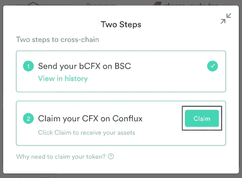

15.在 Fluent Wallet 对话框中，点击**确认**确认您的交易。

> 请注意，这项交易不需要`CFX`支付任何汽油费用，因为这是一项赞助交易。Conflux 让开发人员有可能赞助交易中消耗的气体，使他们能够为用户提供更好的体验。要了解更多关于天然气赞助机制的信息，请访问:[http://developer.confluxnetwork.org](http://developer.confluxnetwork.org/)。

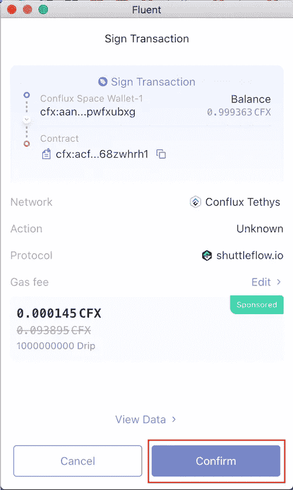

16.*可选*:交易在 Conflux 上确认后，您可以在 [Confluxscan](http://confluxscan.io) 中进行验证。

17.转到 Fluent wallet 并验证`CFX`是否反映在您的钱包中。

您现在已经将您的`bCFX`从币安智能链连接到了 Conflux！

# 3.在汇合位置锁定池中锁定 CFX

> **免责声明**:在资金池中押注 CFX 可能会有风险！当下注时，你是否对你下注的池进行了研究，并自担风险！

您可以通过赌注池下注`CFX`。Staking `CFX`允许你提供块终结来提高网络的安全性。作为交换，每成功验证一个模块，您将获得奖励。

在 PoS 赌注池下注`CFX`:

1.  选择一个赌注池。
2.  连接您的流畅钱包。
3.  输入您希望下注的金额。

# 选择一个赌注池

赌注池由 Conflux 社区拥有、运营和维护。Conflux Network 不认可任何特定的池，但是，您可以在整个 Conflux 社区渠道中找到池。

以下是一些可以找到泳池的地方:

*   [汇流论坛](https://forum.conflux.fun)
*   [CFX 池](http://cfxpools.org)
*   不调和
*   电报

一旦你找到了一个池，你应该通过询问其他社区成员、访问他们的网站和/或与赌注池运营商取得联系来了解更多。

一旦你选择了一个赌注池，赌注过程因池而异，但这是一个相当简单的过程。

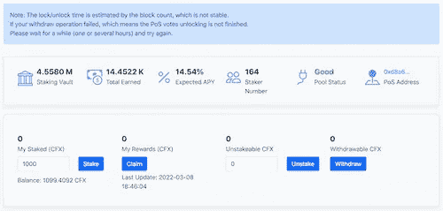

A Conflux PoS staking pool.

# 关于赌注池的说明

打桩时，考虑以下事项:

*   最短锁定期为一周。
*   赌注奖励按周支付。
*   大多数池将要求最低 1000 `CFX`的赌注金额，并逐步增加 1000 `CFX`。
*   泳池通常会收取泳池表演费。这个费用因泳池而异。

快乐的赌注！

> 加入 Coinmonks [电报频道](https://t.me/coincodecap)和 [Youtube 频道](https://www.youtube.com/c/coinmonks/videos)了解加密交易和投资

# 另外，阅读

*   [5 款最佳加密交易终端](https://coincodecap.com/crypto-trading-terminals) | [最佳 DeFi 应用](https://coincodecap.com/best-defi-apps)
*   [比特币基地 vs 瓦济克斯](https://coincodecap.com/coinbase-vs-wazirx) | [比特鲁点评](https://coincodecap.com/bitrue-review) | [波洛涅克斯 vs 比特鲁](https://coincodecap.com/poloniex-vs-bittrex)
*   [德国最佳加密交易所](https://coincodecap.com/crypto-exchanges-in-germany) | [Arbitrum:第二层解决方案](https://coincodecap.com/arbitrum)
*   [币安交易机器人](/coinmonks/binance-trading-bots-d0d57bb62c4c) | [OKEx 评论](/coinmonks/okex-review-6b369304110f) | [阿塔尼评论](https://coincodecap.com/atani-review)
*   [最佳加密交易信号电报](/coinmonks/best-crypto-signals-telegram-5785cdbc4b2b) | [MoonXBT 评论](/coinmonks/moonxbt-review-6e4ab26d037)