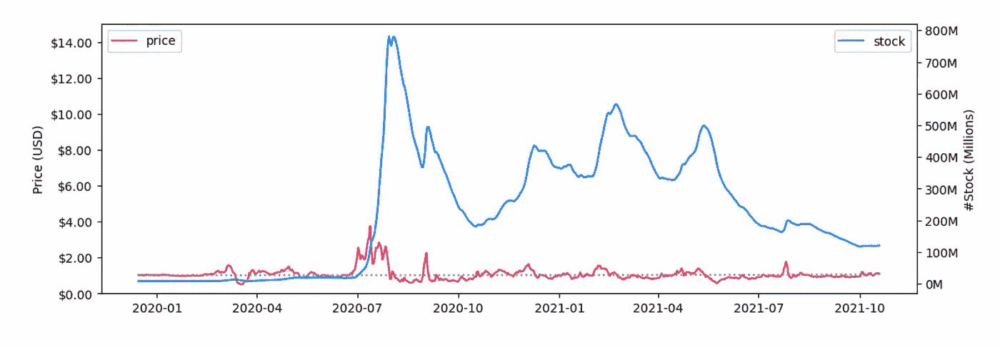

# 从哈耶克的货币非国有化到算法稳定

> 原文：<https://medium.com/coinmonks/from-hayeks-denationalization-of-money-to-algorithmic-stablecoins-7b72735272a5?source=collection_archive---------8----------------------->

## 安普尔福思、特拉和杰德述评

Source: Bit2Me Academy

你有没有想过竞争性的私人货币，个人可以选择他们喜欢的货币？1976 年，诺贝尔奖获得者[弗里德里希·a·哈耶克发表了**货币非国有化**。在他的书中，哈耶克设想了一个世界，私人代币可以进入流通，剥夺国家生产货币的垄断权。](/@charlietuk73/cryptopolitics-the-geopolitics-of-cryptocurrencies-and-their-impact-on-the-global-geopolitical-36e255076240)在“将私人代币投入流通”一章中，他写道，竞争货币*肯定会被证明是一种更有效的约束，迫使发行机构保持其货币价值不变[……]。*此外，他指出:*银行的经理们将了解到，其业务依赖于对银行将继续管制私人货币发行的不可动摇的信心，以使他们的购买力保持大致不变[……]为了实现这一目标，* ***货币量必须迅速适应需求的任何变化，无论是增加还是减少*** 。

近 50 年后，哈耶克的私人流通货币在区块链算法稳定货币的出现中得到了最接近的配置，在这种货币中，货币供应对需求变化的调整是非政治化的、去中心化的，并且通过智能合约完全自动化。

## 挖掘算法稳定的内容

加密货币极其不稳定。从广义上讲，加密货币不具备作为“货币”的三个特征，也就是说，不具备作为一个好的**价值储存手段**——以一种合理可预测的方式保持其价值的东西；记账单位(一种简单的商品和服务定价方式)和交易媒介(一种人们可以用来交换其他东西或货币的东西)。由于价值的高度可变性，加密货币不能用作记账单位，因此使其作为交易媒介的使用变得复杂。想象一下，客户每次想购买以 BTC 或瑞士法郎计价的商品时，都需要知道汇率。

加密货币的波动性由 **stablecoins** 解决，它们试图在区块链保持本地加密货币的特征，如去中心化、抵制审查、不信任，同时寻求充当货币。在我看来，Stablecoins 代表了最接近 Hayek 的私人代币流通与[的潜力，通过引入一个无摩擦的全球实时价值结算的新时代，改变传统支付基础设施，如 SWIFT、处理全球支付的银行间网络等](https://www.blockchainresearchinstitute.org/project/digital-asset-revolution/?utm_campaign=Newsletter%202021&utm_medium=email&_hsmi=195407350&_hsenc=p2ANqtz-_uxjqJV3tCWz0VydXxvhv3M98Q-ong0cWZ4udt7VfZYy-NSIm-bxnlIU7a06xF--Wx0e0E-ADEwP4FAQY-fNz_Myln0lq-1rNbddYn5WYOOcu5Z3c&utm_content=195407350&utm_source=hs_email)。

稳定货币是一种加密货币，其价格与一种被广泛认为“足够稳定”的法定货币挂钩，如美元、欧元或黄金。有不同类型的稳定的硬币。一类是**法定抵押**，其中价格保持稳定，由相应数量的法定储备支持，在这种情况下，我们可以找到如 Tether 这样的例子。法定抵押有一些缺点，例如，需要使用传统的金融系统将储备投资于货币市场或债券市场，这可能会将新的风险转移到稳定的货币。也许一个主要的缺点是，这些稳定币是集中的，这与使用分布式分类账(即区块链)的情况相反，首先是因为在储备管理方面信任第三方，其次是因为对需求变化的供应调整依赖于稳定币的经营者。第二种类型的稳定货币是**加密抵押**，由加密货币支持，例如 DAI，这带来了一些其他挑战，例如需要解决加密货币的波动性、更高的自动流动性风险或过度抵押要求。第三种类型是**算法稳定，其中货币供应对需求变化的调整被编码在协议中，提供了更高的资本效率和分散化。稳定算法也带来了一些挑战，例如，保持稳定性和流动性，稳定算法要求持续增长。算法稳定硬币是场景中“最年轻的”,然而也有一些合理的案例，可以证明它们将取代中央稳定硬币和法定货币。**

## 算法稳定中的三种不同稳定机制

算法稳定币与法定货币挂钩的机制并不独特。以下案例:Ampleforth、Djed 和 Terra 利用了不同的机制:

## 安普尔福思

[Ampleforth 是一种用于稳定购买力的无抵押算法币](https://messari.io/asset/ampleforth)。AMPL 硬币是一种 ERC-20 代币，围绕[的概念*非国有化货币*](https://www.ampleforth.org/economics/) 设计，作为基础货币。

安普尔福思最大供应量为 395，345，189 枚硬币。截至发稿时，流通供应量为 9303 万 AMPL，市值为 8775 万美元。AMPL 的规模和存在都不算大，例如，它在 100 种加密货币中名列前茅。尽管如此，AMPL 被设计为 DeFi 中的一个新的原始构建模块，就像 BTC 或 ETH 一样，它对 DeFi 的插入正在增长例如，AMPL 是 Aave 中的一个借出或借入资产，同时集成到 Avalanche、币安智能链、Uniswap 和 Balancer，这将促进采用和增长。

在这些使用案例中，AMPL 被视为一种记账单位，即可以用作支付手段。作为一种价值储存手段，它旨在保持购买力，在定义上， [AMPL 适合于命名长期的链上稳定合约和加密支持的衍生品。此外，它是功能性货币，不受集中抵押品、最后贷款人和政治影响。](https://www.ampleforth.org)

***AMPL 令牌设计***

Ampleforth 有一个弹性供给，通过设定一个*目标价格* (Pt)和一个*价格阈值(* δ)来吸收需求的波动，从而在目标价格附近形成一个价格带。在这个区间内，AMPL 的价格被认为是“稳定的”或均衡的。每当需求发生变化，单位价格超出该范围时，供应就会按比例扩张或收缩，直到价格回到均衡区间(见下图)。供应的扩张或收缩会改变持有者钱包中 AMPLs 的数量，使其净余额保持不变，这称为余额基数的调整。[用户的所有权百分比保持固定，除非用户选择出售或购买 AMPLs](https://www.ampleforth.org/papers/) 。

假设爱丽丝有一个价值 1 美元的 AMPL。如果需求增加到 1 AMPL = 2.00 美元，AMPLs 的名义汇率高于目标，因此出现供应扩张。在下一个均衡中，爱丽丝将有 2 个价值 1 美元的 AMPLs。基于最新的价格差异，供应变化每 24 小时计算和执行不超过一次，并且在 *k* 天内均匀分布。供应的变化是自动标记时间戳的，因此有可能知道它将在何时发生以及以何种方式发生。

严格地说，安普尔福思不是一种稳定的货币，因为它受价格波动的影响。尽管如此，AMPL 有能力通过将价格波动保持在一个区间内来引导波动。

## 安普尔福思的波动指纹

Source: Ampleforth whitepaper.

在左图中，供给的扩张用价格带上方的半圆虚线表示，而供给的收缩用价格带下方的半圆表示。在这些 AMPL 供应走向新平衡的动态时期，套利者可以在供应增加或减少后但价格修正发生前卖出或买入 AMPL，产生供应和市值(中间和右边的数字)的模式(阶梯式函数)，勾勒出其自身的波动指纹。调整期过后，供给和市值达到新的平衡，在上图中用水平直线表示。

供应和市值的波动指纹表明，从长期来看，没有固定的趋势。根据需求的变化，趋势可能上下交替，而价格则在区间内波动。在下图中，一年的价格和股票序列显示趋势与理论设计相符。

Taken from Ampleforth.org

此外，AMPL 是分散的，这意味着在供应调整中没有控制，协议通过传播最新的价格信息来设置激励，快速行动者(从短期交易中受益的套利者)通过在他们可以从过高或过低的 AMPL 中获利的时间间隔内出售或购买 AMPL 来将供应信息传播回价格。对于 AMPL 持有者来说，一种均衡和另一种均衡之间的动态关系并不为人所知，因为他们的净余额是重定基数的。

## 地球月神

你在网站上看到的第一件事是:“ [Terra 是一个公共区块链协议，部署了一套算法分散的稳定核心，支撑着一个蓬勃发展的生态系统，为大众带来 DeFi](https://www.terra.money)”。在 Terra 的理念中，满足普通客户的货币需求是推动价格稳定的全球支付系统的关键[。在哈耶克看来，Terra 正在努力吸引数十亿客户在新的 Web 3.0 货币秩序中使用他们的 stablecoins。](https://coinmarketcap.com/currencies/terra-luna/)

为了做到这一点，Terra 使用了一种双币机制，其中 Luna(原生令牌)吸收了各种 Terra 稳定币的波动性。在这种情况下，弹性货币供给会根据货币需求的变化而收缩或扩张，以保持盯住汇率。月神也被用作[的治理令牌](https://coinmarketcap.com/alexandria/glossary/governance-token)。

双重机制的运作方式如下:如果 UST 稳定币(与美元挂钩)的价格跌破挂钩，卢纳被拍卖以换取 UST，即系统铸造卢纳，焚烧(毁灭)UST。这一过程将减少 UST 的供应，提高其价格，直到再次达到挂钩。在这种操作中，由于系统总是以 1.00 美元的价格进行交易，因此通过套利差价可以获得无风险利润。例如:如果 UST 跌至 0.90，通过从系统中用 UST 换 1 美元的 Luna，套利者可以获得 0.10 美元的无风险利润，而她在公开市场上只能获得 0.9 美元。相反，当 UST 的价格高于挂钩时，通过铸造 UST 和燃烧(摧毁)月神来增加供应，降低 UST 的价格直到达到挂钩。套利者也获得无风险利润，例如，如果 UST 涨到 1.10，套利者可以用价值 1 美元的 Luna 交易系统，得到价值 1.1 美元的 UST。最初，月神之火是存放在 Terra 国库中的代币，用这些资金来支持生态系统的新发展，并保持对 Terra stablecoins 不断增长的需求。在最近的升级中，协议被修改为有效地刻录 Luna 令牌。

今年早些时候，Terra Money 代替财政部宣布成立 [Luna Foundation Guard](https://lfg.org/fundingandgrants/) ，这是一个无论何时都将支持项目的组织，无论这些项目是开源应用、算法稳定、研究和教育还是社区驱动的生态系统的建设。

截至发稿时，Terra stablecoin (UST)以 149 亿英镑的市值成为同类公司中的第四名。同样，Luna 在不到一年的时间里攀升至 322.5 亿美元，成为大型市值代币的一部分。

如今，Terra 生态系统有大约 90 个项目，其中 60 个是活平台，Terra stablecoins 被用于货币的充分功能，例如，Anchor 是一个储蓄平台，在那里 UST 可以存储不可忽略的 20% APY。Nexus Protocol 是一个产量农业优化器，即进行资本投资的 Apollo Dao。Chai 是一个支付平台，KRT(跟踪韩元价格的货币)被用作交换手段，Memepay 在蒙古国也是如此。在电子商务、货币市场和自动做市商中也有使用 stablecoins 的平台。

## 杰德

Djed 是卡尔达诺生态系统中的新生稳定币。[白皮书发布于 2021 年 8 月 17 日](https://iohk.io/en/research/library/papers/djeda-formally-verified-crypto-backed-pegged-algorithmic-stablecoin/)。Djed 是一种混合稳定币，因为它有密码支持和算法。在 Djed，一家由智能合约驱动的自治银行以与目标挂钩的价格买卖稳定的货币，将波动的货币作为储备。[在这样做的同时，它收取费用并将其作为储备的一部分积累起来，使储备持有者受益，他们最终为储备资金做出贡献，并承担价格波动的风险。](https://iohk.io/en/research/library/papers/djeda-formally-verified-crypto-backed-pegged-algorithmic-stablecoin/)

Djed 经历了一个漫长的验证过程，包括在纸上检查的强大的数学研究，以及通过 Isabelle，一个用于定理证明的自动化工具，之后对 Djed 进行了测试。

***Djed 的令牌设计***

Djed 的设计比前两种情况更复杂。该协议从一个被称为 **minimal Djed** 的简化版本开始，该版本对自动化银行操作的稳定性属性进行编码。

在最低限度 Djed 用户从合同中购买稳定的硬币，并在基础硬币(如 ADA、ERG 等)和合同铸币厂 Djed 中存入固定法定货币的等值。同样地，用户可以出售稳定币，并以基础币换回等值的美元。该协议建立了一个下限和上限，智能合约总是愿意以 0.99 美分开始购买稳定的硬币，并以 1.01 美元出售。如果储备因基础硬币价格波动而过低，稳定硬币持有人将不会从每个 Djed 中获得 1 美元，相反，他们将获得与流通中 Djed 总数成比例的储备金额(R / Nsc)。该协议旨在抵御高达 67%的市场崩溃，在这种情况下，股本永远不会为零，从而将该协议从资不抵债问题和破产中解脱出来。然而，为了改善稳定币持有者从每个 Djed 获得不到 1 美元的情况，该协议买卖储备币(RC)以向合同提供更多的权益，从而有足够的储备。

Source: [Input / Output](https://iohk.io/en/blog/posts/2021/08/18/djed-implementing-algorithmic-stablecoins-for-proven-price-stability/)

该协议通过建立等于储备除以负债(即，在 Djed 中流通的等值美元)的储备比率(r)和不允许操作的参数，对储备硬币的购买/出售操作设定了限制。如果出售了太多的 RC，比率可能会太低，合同将无法承担责任。同样，如果 Djed 的需求增加。在相反的情况下，人们可能会认为 verey big (r)是可取的，但是也有一个最大值来避免稀释每枚储备硬币的费用，这是对储备硬币持有者的激励。

在测试期间，检测到最小的 Djed 需要一些调整，仅举几个例子，如果恶意行为者可以估计未来汇率，储备耗尽是可能的；最低版本中的费用是严格的，不能在需要时作为鼓励或阻止操作(购买/出售储备硬币)的杠杆，更重要的是，如果失去联系汇率，稳定的硬币持有人可能会遭受财务损失，随着储备比率接近零，储备硬币持有人可能会出现银行挤兑。

一个**扩展的 Djed 协议**克服了在最小 Djed 中检测到的问题，此外，它考虑了动态费用，对于使准备金率偏离最佳准备金参数的操作，该费用会增加，而对于使准备金率接近最佳准备金参数的操作，该费用会减少。通过这样做，Djed 的持有者拥有稳健的稳定性条件，而储备硬币持有者则拥有诱人的回报。

Djed 的未来发展是可以预期的，例如，储备股份的可能性和为储备硬币持有者提供更好的激励，将治理引入协议——例如，允许治理机构调整协议中的关键参数——KYC 和反洗钱功能，自治银行的债务融资，将稳定硬币与一篮子资产挂钩，等等。

Djed 除了是卡尔达诺和埃尔戈区块链的 DeFi 生态系统的稳定中心之外，还有非常相关的使用案例:

最突出的一个用例是，Djed 是一种分散的稳定货币**，用于支付**。由卡尔达诺的合作伙伴 COTI 发行的 stablecoin 将在 AdaPay 中即时可用，AdaPay 是一个已经支持 30 多种法定货币的支付网关。其次，Djed 是[用来命名所有 Cardano 网络交易费用的稳定货币，引入了**稳定费用**](https://iohk.io/en/blog/posts/2021/06/10/stablefees-and-the-decentralized-reserve-system/)**的新概念，这将是 DeFi 平台的用户和运营商的一大优势和游戏规则改变者，这些用户和运营商目前正承受着高波动性天然气费用的头痛。最后但同样重要的是，Djed 是一种强大的多元化稳定货币，因为自治银行可以持有多种加密货币的储备，包括稳定货币(如 ADA、BTC、ETH、USDC 等)。)且目标价可参考法定货币或其他资产(如美元、欧元或黄金)。**

## **外卖食品**

**如果哈耶克能够看到算法稳定币能够做什么，我想他肯定已经写了一些，作为流通中私人代币的生动例子。也许算法 stablecoins 是支付、储蓄、交易、长期合同等领域大规模采用的杀手级应用。因为他们证明了创造不受政治控制和其他各种因素影响的货币体系的可能性，这样顾客就可以选择最有竞争力的稳定的货币来满足他们的需求。最后，就资本效率而言——从分散的货币调整中可以看出——算法稳定的货币可能会取代抵押货币，或许还有法定货币。**

> **加入 Coinmonks [电报频道](https://t.me/coincodecap)和 [Youtube 频道](https://www.youtube.com/c/coinmonks/videos)了解加密交易和投资**

# **另外，阅读**

*   **[最佳网上赌场](https://coincodecap.com/best-online-casinos) | [币安评论](/coinmonks/binance-review-ee10d3bf3b6e) | [BitMEX 评论](https://coincodecap.com/bitmex-review)**
*   **[麻雀交换评论](https://coincodecap.com/sparrow-exchange-review) | [纳什交换评论](https://coincodecap.com/nash-exchange-review)**
*   **[美国最佳加密交易机器人](https://coincodecap.com/crypto-trading-bots-in-the-us) | [经常性回顾](https://coincodecap.com/changelly-review)**
*   **[在印度利用加密套利赚取被动收入](https://coincodecap.com/crypto-arbitrage-in-india)**
*   **[Godex.io 审核](/coinmonks/godex-io-review-7366086519fb) | [邀请审核](/coinmonks/invity-review-70f3030c0502) | [BitForex 审核](https://coincodecap.com/bitforex-review)**
*   **[最佳比特币保证金交易](/coinmonks/bitcoin-margin-trading-exchange-bcbfcbf7b8e3) | [萝莉点评](/coinmonks/lolli-review-e6ddc7895ad8) | [比特币保证金交易](https://coincodecap.com/bityard-margin-trading)**