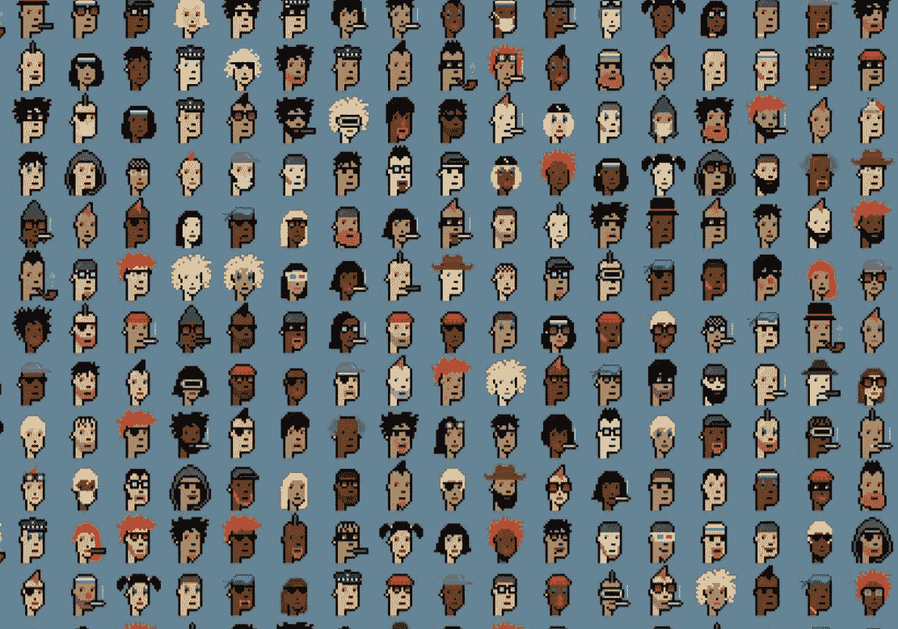

# 从静态收藏品到交互式数字产权，NFT 如何成为下一件大事

> 原文：<https://medium.com/coinmonks/from-static-collectibles-to-interactive-digital-property-rights-how-nfts-are-the-next-big-thing-22e910338f1c?source=collection_archive---------36----------------------->

ape coin

NFTs 在 2021 年起飞，像 OpenSea 这样的市场似乎在一夜之间从零变成了英雄。虽然 NFT 已经存在了五年，但 2021 年是它们爆发成为主流话题的一年。在需求方面，NFT 市场继续吸引新的投资。首先，现在有一批富裕的收藏家，他们正确地预测到了强劲的市场需求。(BAYC 的底价现在已经超过了 75 ETH，这使得 9 个月前 0.08 ETH 的初始铸币价对持有其猿类的早期所有者来说异常有利可图。)这些令人瞠目结舌的数字可能会让投机需求保持强劲。许多一线明星如 Jay-Z 和史蒂夫·青木公开采用 NFTs 作为他们的社交媒体个人照片(PFPs ),也推动了 NFT 浪潮。

不可替代令牌是存储在区块链(一种数字分类账形式)上的不可互换的数据单元，可以出售和交易。NFT 数据单元可以与诸如照片、视频和音频的数字文件相关联。尽管如此，随着区块链生态系统的加速发展，这些单元将很快与房地产及更多相关联。

与更广泛的加密市场不同，NFT 将在 2022 年迎来一个火热的开端。1 月份将成为 NFT 成交量最好的一个月，由于对新项目的兴奋情绪仍然异常高涨，独立买家的数量也在增加。

# **社区，社区，社区**

CryptoPunks 和 BAYC 的成功催生了数百个模仿项目，但就像许多新兴的 web3 原始人一样，NFT 项目维持自身(及其价值)的能力归结于其背后社区的力量。专注于建立一个充满激情、积极参与的社区将变得越来越重要，尤其是随着 NFT 社区数量的增长。web2 公司对 NFT 战略的高度关注，尤其是那些拥有强大品牌关系和活跃的已有社区的公司，也是将新员工带入 web3 空间的时机。团队还将专注于为 NFT 持有者提供更出色的效用和独特的津贴，以区别于他们的竞争对手，这是我们已经看到的发展趋势。

# **被低估的社区在增加**

酷猫是社区建设的一个很好的例子。他们有很大的机会进入家族品牌市场，这可能会创造大量的合作机会。他们也有一个优秀的创始人起源的故事，一个受人喜爱的和执行良好的团队，以及一个狂热的社区，它包容他人，并有助于发展整个 NFT 馅饼。即将到来的催化剂包括本月晚些时候推出的酷酷的宠物伴侣和一个价值 10 美元的牛奶代币，这将增加他们正在创建的游戏化生态系统。作为参考，BAYC apes 的底价是酷猫的 7 倍。

与其他更具流动性的加密资产的价格大幅下跌相比，过去几个月，许多受欢迎的 NFT 收藏也起到了准对冲的作用。

# 一批新的收藏家和艺术家

2022 年将迎来新一波 web3 参与者，因为 NFT 将继续推进主流对话。我们可以看到投机炒作开始让位于功能用例，因为在过去的几个月里，更多的创新项目已经建立。NFTs 的设计空间只受人类创造力的限制。这将得到更好的 NFT 工具的支持，使创作者更容易进入:

# **工具是障碍**

NFT 工具和基础设施走到了最前面——工具允许艺术家轻松启动 NFT 项目，而不需要技术知识。只需点击几下鼠标即可定制和部署智能合同。今天，对于许多创作者来说，这仍然是一个障碍，有那么多设计糟糕的智能合同可以利用。

# 【NFTs 定义

面向非技术产业的金融服务是缺乏的，然而蓝筹项目的持有者已经积累了大量的财富(至少在纸面上)，可以用来抵押借款。对于某些非金融资产来说，杠杆变得很平常。个人认为这是一个新的 DeFi + NFT 叙事的触发器。认为像 Aave v3 这样的 DeFi 1.0 项目的新迭代同时获得了复兴季节，以支持叙事。

# 知识产权的货币化:后续销售的版税

NFTs 为资产所有者开辟了潜在的新收入来源。可以编写一份 NFT 的智能合同，在每次继续销售 NFT 时，自动向最初的 NFT 卖家支付版税。特许权使用费通常按二次购买价格的一定比例支付，这为无限的收入流提供了可能性。

NFTs 的这一方面对于游戏领域中的数字内容创作者来说是特别感兴趣的，其中创作者的经济利益可以激励游戏开发者记录他们对游戏中物品的所有权，并有助于刺激游戏中的经济。

# 商标、许可和品牌

如上所述，艺术家引用的一个优势是，通过 NFTs，他们可以接触到现有的粉丝并建立新的受众，而无需中间人。这种诱惑力吸引了大量品牌和企业来试水 NFT。与任何新的分销渠道一样，已经有大量的商标申请和商标许可问题需要解决。商标持有人可能会寻求新的注册，如 NBA TOP SHOT 应用程序的第 34 类，用于

提供可收集的数字服务，即使用基于区块链的软件技术和智能合同为交易和注册服务运营一个在线市场，用于以篮球领域中的球员、游戏、记录、统计数据、信息、照片、图像、游戏镜头、集锦和经历为特色的数字收藏品。

奢侈品牌已经看到了 NFTs 的优势，因为有机会证明其产品的真实性。然而，与任何新技术一样，也有商标侵权、伪造和未经授权销售受版权保护的材料的例子。因此，让购买者警惕欺诈行为，让商标持有人警惕新的侵权行为，这些行为可能会玷污他们的品牌以及他们与粉丝和购买者的宝贵关系。

# 最后意见

NFTs 为企业带来了大量的机会和潜在的风险。在销售 NFT 和/或 NFT 中编码的智能合同的条款中，应明确界定哪些知识产权是允许的，哪些是不允许的，这将最好地允许企业控制其知识产权并将其货币化。

还应对第三方(NFT 的购买者或第三方)使用企业知识产权的情况进行适当监督，并在适用的情况下采取措施。有许多问题需要解决，最终，法律如何演变还有待观察。

希望你有一个精彩的阅读

非专利技术与知识产权。[https://www . nortonrosefulbright . com/en/knowledge/publications/1a 1 ab B9 f/nfts-and-intellectual-property-rights](https://www.nortonrosefulbright.com/en/knowledge/publications/1a1abb9f/nfts-and-intellectual-property-rights)

NFTs:2021 年的互联网热潮还是……—Lutzker & Lutzker。[https://www . lutzker . com/nfts-a-2021-internet-craze-or-a-fundamental-shift-in-how-we-think-of-digital-property-and-copyright-law/](https://www.lutzker.com/nfts-a-2021-internet-craze-or-a-fundamental-shift-in-how-we-think-of-digital-property-and-copyright-law/)

> 加入 Coinmonks [电报频道](https://t.me/coincodecap)和 [Youtube 频道](https://www.youtube.com/c/coinmonks/videos)了解加密交易和投资

# 另外，阅读

*   [XT.COM 评论](https://coincodecap.com/profittradingapp-for-binance)币安评论 |
*   [SmithBot 评论](https://coincodecap.com/smithbot-review) | [4 款最佳免费开源交易机器人](https://coincodecap.com/free-open-source-trading-bots)
*   [比特币基地僵尸程序](/coinmonks/coinbase-bots-ac6359e897f3) | [AscendEX 审查](/coinmonks/ascendex-review-53e829cf75fa) | [OKEx 交易僵尸程序](/coinmonks/okex-trading-bots-234920f61e60)
*   [如何在印度购买比特币？](/coinmonks/buy-bitcoin-in-india-feb50ddfef94) | [WazirX 评论](/coinmonks/wazirx-review-5c811b074f5b)
*   [CryptoHopper 替代品](/coinmonks/cryptohopper-alternatives-d67287b16d27) | [HitBTC 审查](/coinmonks/hitbtc-review-c5143c5d53c2)
*   [CBET 评论](https://coincodecap.com/cbet-casino-review) | [库科恩 vs 比特币基地](https://coincodecap.com/kucoin-vs-coinbase)