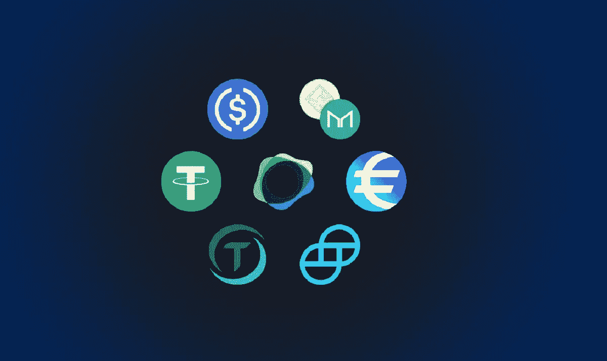

# 从系绳到陆地——稳定圈概述

> 原文：<https://medium.com/coinmonks/from-tether-to-terrausd-an-outline-of-stablecoins-56020c2f2376?source=collection_archive---------21----------------------->

对于每一个刚刚开始交易密码的密码新手来说，像 USDT、USDC 或 BUSD 这样稳定的货币——这些货币都与美元 1:1 挂钩——通常是他们首先追求的目标。

稳定货币大多与美元等法定货币或黄金和白银等大宗商品挂钩，其结构是一种价值储存手段，通过这种手段，代币持有者可以避免暴露于加密货币的高波动性。稳定货币也越来越多地被用作交换媒介，因为其价格稳定，并被用于整合传统金融和分散金融(DeFi)。

从加密货币交易到贷款市场的借贷，stablecoins 是填补法定货币和加密货币之间空白的重要桥梁。不管市场条件如何，保证稳定的货币价格稳定的四种基本结构可以进一步细分为两大类:集权或分权。

**集中担保品**

目前最受欢迎的稳定货币是**菲亚特支持的**，与美元 1:1。为了铸造稳定硬币并将其供应到公开市场，企业被迫持有准确数量的法定抵押品作为储备，以确保铸造的稳定硬币得到充分支持。

据推测，如果发行者持有 100 美元的储备，只有价值 1 美元的稳定硬币可以在流通中发行。法定抵押品没有锁定在智能合约中，因此它以货币、商业票据、国债等形式存在于链外。

由集中实体发行的稳定 coin 存在固有风险。缺乏透明度和涉及的隐蔽欺诈可能导致硬币持有者承担意想不到的后果。USDT 是市值第二大的稳定货币，流通价值超过 780 亿美元，是这种争议的一个例子。截至 2021 年 6 月，Tether 声称其 49%的储备是商业票据和存款证，而其他稳定的硬币发行者，如 Circle 创建的 USDC，则提议其 80%的储备是美元。

2021 年 10 月，泰瑟因[虚报储量](https://www.lexology.com/library/detail.aspx?g=f6fe03a1-9b3b-4ac2-bb65-739e708e888c)被抓，结果被美国商品期货交易委员会罚款 4200 万美元。尽管 Tether 在多个场合声称其发行的 stablecoins 完全由等量的现金支持，但在同年早些时候，纽约总检察长办公室表明，Tether 一直在隐瞒其储备状态，并掩盖了约 8.5 亿美元的损失。

另一种不太受欢迎的稳定债券是由商品支持的。**这些稳定商品的价格与特定的商品价格挂钩。例如，Digix (DGX):每个 DGX 代币由 1 克黄金支持，可按市场价兑换为基础资产或抵押品。**

**据说，每个硬币持有者持有一枚 DGX 代币时可以申领 1 克黄金。由于商品价格的波动性通常高于大多数主权支持的货币，这种支持机制的典型缺点是价格不稳定。**

**对于许多中央支持的稳定银行来说，透明度是证明其公开持有大宗商品或现金及现金等价物的合理性的关键。由于过去几年分散融资的爆炸式增长，许多稳定硬币发行者以类似于银行的方式运营——将稳定硬币借给人们，并通过他们的储备资产赚取利息——引起了监管机构的注意。**

****分散支持****

**除了资产支持机制，stablecoins 还可以确保价格稳定，免受其他链上加密货币的影响。该 stablecoin 协议优先考虑分散化，而不需要像 Tether 和 Circle 这样的集中实体来管理发行 stable coin 的储备。通过智能合约，**加密支持的**协议将稳定币的稳定性直接与抵押加密货币联系起来。**

**MakerDao 的 Dai 不同于其他由一种抵押品支持的 stablecoins，它可以使用各种基于以太坊的资产作为抵押品。这种多种抵押品的体系得益于巧妙的对比，戴还将人民币汇率与美元 1:1 挂钩。无论谁想获得戴，都必须将 ETH 或其他 20 令牌作为抵押，因为由于加密货币的高波动性，需要超额抵押。如果担保品的价值低于 Dai 的借入金额，担保品将通过一个自主流程进行清算。**

**此外，马克尔岛的治理标志的持有人可以决定戴的储蓄率，存入[戴储蓄率(DSR)](https://www.gemini.com/cryptopedia/makerdao-dai-decentralized-autonomous-organization#section-maker-da-os-risk-and-collateral-mechanisms%5C) 以获取利息。MKR 令牌持有者需要确保分散系统的安全性和可操作性。他们监督每种担保品类型可能产生的债务量、特定担保品预期发生的波动量，并在波动情况下管理清算资产不再覆盖以其为抵押借入的未偿债务(Dai)量的后果。**

**马可道的成功在于贯彻道的原则，实现戴的优势稳定。通过这一点，戴成为这种分散的金融基础设施的主要引擎。在吹捧使其区别于其他由中央集权实体操纵的机制的技术分散化的同时，MakerDAO 一直因其集中的决策权而受到抨击，一小部分硬币持有者充当 MakerDAO 的“董事会”，并通过寡头政治劫持社区。**

****算法稳定积分****

**通过抵押品支持是稳定债券最常见的协议，但有一种新的方法可以通过**计算算法**控制和监控稳定债券的价格稳定性。**

**通常，平台会创建一个附加令牌—通常是治理和赌注令牌—与稳定令牌挂钩。通过自动调整货币政策，如通过算法改变硬币的供应量，以控制其与稳定硬币相关的价值，稳定硬币生成器可以保持价格稳定，而无需求助于其他加密货币、法定货币和商品。**

**让我们看另一个例子。TerraUSD(UST)由区块链电子商务平台 Terra 创造和分销，其主要客户群来自东南亚，它只是 Terra 开发的众多 stablecoins 之一，旨在升级零售支付服务，供全球市场使用。Terra 的 stablecoins 是为包括电子商务交易在内的扩展应用而呈现的。**

**Terra network 通过利益相关证明共识机制来验证其本机治理令牌 LUNA 的赌注，这意味着 LUNA 在某种程度上扮演着与以太坊网络上其他 ERC-20 令牌类似的角色。Terra 也是 dApps 构建的第 1 层区块链，因为像 Mirror Protocol 和 Anchor Protocol 这样的项目利用了更低的交易费用和更高的互操作性，支持与 Solanna 和 Ethereum 这样的区块链进行跨链通信。**

**那么……为什么 Terra-backed stablecoins 对生态系统如此重要？**

**根据 LUNA 的监测，UST 的价格根据网络上的交易量而波动。随着交易量的上升，Terra 将通过算法发行新的 LUNA，以抵消因需求上升而上涨的 UST 价格；相反，随着交易量下降，Terra 会烧掉或回购 LUNA，以抬高 UST 价格，维持 1:1 的美元汇率。通过奖励在 UST 进行套利的用户，Terra 无需借助任何形式的抵押品就能维持价格稳定。**

**尽管这种稳定的硬币还不成熟，但人们主要关注的是它在极端波动时期的稳定性。LUNA 价格一天突然下跌超过 20–25%可能会导致市场上缺乏足够的需求来购买新发行的 LUNA，这将导致 UST 价格在罕见的情况下飙升。然而，这是一个潜在的错误，只有在另一个灾难性事件中才能得到验证，如“5.19”或“3.12”，其中大量杠杆在加密领域被清算，大量替代硬币暴跌至底部。**

****Stablecoins —采用和扩展****

**随着各发达国家的监管机构加大对稳定币业务的审查力度，不确定性仍在影响传统银行和机构接受稳定币作为货币替代品。尽管如此，金融科技公司正通过一种友好得多的方式接近稳定的竞争对手。**

**全球最大的支付平台之一的贝宝公司[承认](https://cointelegraph.com/news/paypal-stablecoin-what-it-could-mean-for-payments)创造自己的稳定货币——贝宝币，即将到来。Paypal 拥有超过 3.5 亿个活跃的钱包，并已允许美国客户交易各种加密货币，是推动 stablecoins 全球采用的关键角色。**

**谁会去追贝宝？万事达卡？Visa？条纹？可以预见的是，新一批金融科技公司要么开发自己的稳定硬币，就像脸书创造 Libra 硬币一样，要么选择稳定硬币作为一种支付形式。无论哪种情况，对稳定的玉米来说都是牛市。**

**尽管市场上有各种稳定的货币，但大多数都是一样的——直接或间接地跟随美元的价格。在某种程度上，这是自 1971 年美元与金本位脱钩以来，一直主导全球金融的美元体系的继续实施。一些批评者认为，随着时间的推移，美元一直在失去其内在价值，每一美元的购买力都在下降，因此跟踪美元价格并不能反映一个人购买力的真实情况。**

**相反，追踪 CPI(消费者价格指数)是衡量美元实际价值的一种更有效的方法。CPI 代表美国自 1913 年以来的累计通胀率。该指数值在 1913 年约为 10，现在根据 2022 年 1 月的最新[数据](https://tradingeconomics.com/united-states/inflation-cpi)，该数字已上升至 280.19，这意味着 10 美元在 1913 年可以购买的东西相当于 2022 年 280.19 美元的购买力。 [FRAX](https://docs.frax.finance/) 正计划建立第一个 CPI 的加密本地版本，称为 FRAX 价格指数(FPI)，由 FXS 持有者管理。**

**如果稳定货币作为价值储存的先驱，那么它不仅应该与货币或商品挂钩，还应该与反映购买力的数学表示的指数挂钩，购买力是法定货币内在价值的标准化衡量标准。或许，我们会看到一种稳定的货币跟踪全球巨无霸的价格，这是另一种常用的衡量通货膨胀的指数。**

**下一次，我们将深入探讨稳定的硬币是如何作为杠杆的尖端来提升重量级的银行系统的。**

**敬请关注。**

> **加入 Coinmonks [电报频道](https://t.me/coincodecap)和 [Youtube 频道](https://www.youtube.com/c/coinmonks/videos)了解加密交易和投资**

# **另外，阅读**

*   **[新加坡十大最佳加密交易所](https://coincodecap.com/crypto-exchange-in-singapore) | [购买 AXS](https://coincodecap.com/buy-axs-token)**
*   **[投资印度的最佳加密软件](https://coincodecap.com/best-crypto-to-invest-in-india-in-2021) | [WazirX P2P](https://coincodecap.com/wazirx-p2p)**
*   **[7 个最佳零费用加密交易平台](https://coincodecap.com/zero-fee-crypto-exchanges)**
*   **[最佳网上赌场](https://coincodecap.com/best-online-casinos) | [期货交易机器人](/coinmonks/futures-trading-bots-5a282ccee3f5)**
*   **[去中心化交易所](https://coincodecap.com/what-are-decentralized-exchanges)|[Bitbns FIP](https://coincodecap.com/bitbns-fip)|[Bingbon 评论](https://coincodecap.com/bingbon-review)**
*   **[用信用卡购买密码的 10 个最佳地点](https://coincodecap.com/buy-crypto-with-credit-card)**
*   **[加拿大最佳加密交易机器人](https://coincodecap.com/5-best-crypto-trading-bots-in-canada) | [Bybit vs 币安](https://coincodecap.com/bybit-binance-moonxbt)**
*   **[阿联酋 5 大最佳加密交易所](https://coincodecap.com/best-crypto-exchanges-in-uae) | [SimpleSwap 评论](https://coincodecap.com/simpleswap-review)**