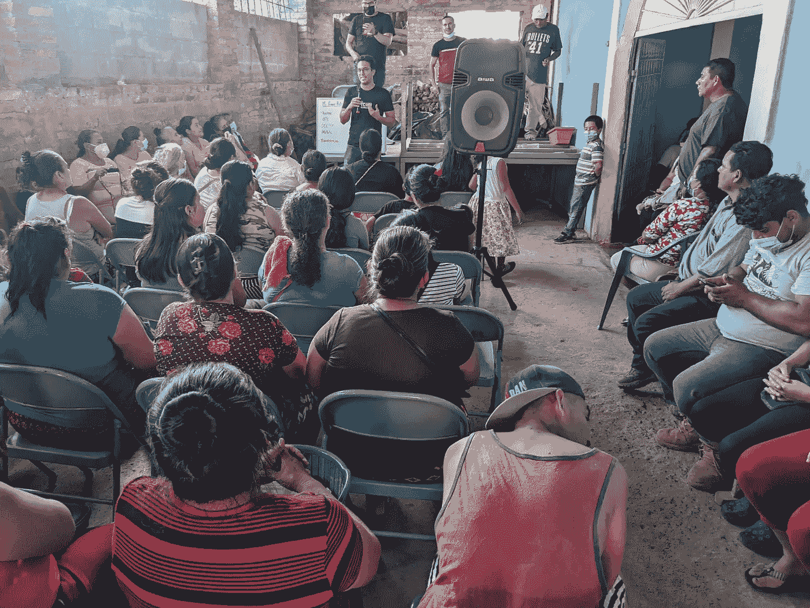

# 从零到一百万:我的第一个比特币的前六个月及以后

> 原文：<https://medium.com/coinmonks/from-zero-to-a-million-the-first-six-months-of-myfirstbitcoin-and-beyond-2d51118431c7?source=collection_archive---------20----------------------->

A MyFirstBitcoin class in Chaletenango, El Salvador

9 月 24 日，MiPrimerBitcoin 在萨尔瓦多上了第一堂课。我们把折叠椅带进了瑜伽馆，借用了练习间隙的空间。一个学生来了。到月底，我们总共有 5 名学生。

从这些卑微的开始，我们已经成长了不少。我们教成千上万的学生，分布在…