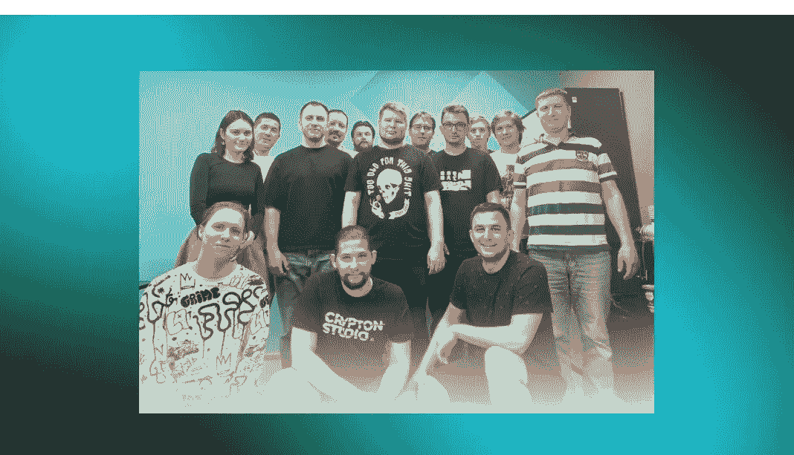

# 区块链项目的前端开发人员

> 原文：<https://medium.com/coinmonks/frontend-developer-on-a-blockchain-project-9d0c496fd38?source=collection_archive---------6----------------------->

前端开发人员是负责创建网站、应用程序或软件的用户界面的专家。网站的前端是用户在浏览器中看到的一切，当用户输入数据和接收反馈时，用户会与之交互。

如今，在现代应用程序开发中，有一种将尽可能多的应用程序逻辑移至浏览器的趋势。服务器用于提供良好的 API、连接数据库和存储数据。服务器不再需要推送充满数据的整个模板。渲染可以在浏览器内部进行。

## 标准前端开发和基于区块链的前端开发有什么区别？

布局没有什么不同。仅添加了智能合约的使用。在 web3 库的帮助下，前端人员绑定来自区块链开发者的智能合约，然后连接到接口。

因此，一个区块链项目的前端开发人员不需要知道可靠度或 rust。对于他们来说，使用常规语言并连接 web3 库来处理智能合约就足够了。

此外，了解分散式应用程序 DApps 的架构也很有用。这会给你一个理解，这将进一步简化你的工作。

因此，区块链应用程序开发不会改变我们开发应用程序的方式。前端开发人员仍然可以使用他们已经使用的所有工具，只需稍作调整。

在 [crypton.studio](https://crypton.studio) 上阅读[我们的文章](https://crypton.studio/blog/Frontend-developer-on-a-blockchain-project)以了解更多信息。

> 加入 Coinmonks [电报频道](https://t.me/coincodecap)和 [Youtube 频道](https://www.youtube.com/c/coinmonks/videos)了解加密交易和投资

# 另外，阅读

*   [最佳加密交换平台](https://coincodecap.com/best-crypto-swap-platforms) | [最佳加密交易所](https://coincodecap.com/crypto-exchange)
*   [购买比特币印度](/coinmonks/buy-bitcoin-in-india-feb50ddfef94) | [Pionex 评论](/coinmonks/pionex-review-exchange-with-crypto-trading-bot-1e459d0191ea) | [加密交易机器人](/coinmonks/crypto-trading-bot-c2ffce8acb2a)
*   [n rave 零点回顾](/coinmonks/ngrave-zero-review-c465cf8307fc) | [Phemex 回顾](/coinmonks/phemex-review-4cfba0b49e28) | [PrimeXBT 回顾](/coinmonks/primexbt-review-88e0815be858)
*   最佳[区块链分析](https://bitquery.io/blog/best-blockchain-analysis-tools-and-software)工具| [赚比特币](/coinmonks/earn-bitcoin-6e8bd3c592d9)
*   [Cloudbet 赌场评论](https://coincodecap.com/cloudbet-casino-review) | [点火赌场评论](https://coincodecap.com/ignition-casino-review)
*   [加密套利](/coinmonks/crypto-arbitrage-guide-how-to-make-money-as-a-beginner-62bfe5c868f6)指南| [如何做空比特币](/coinmonks/how-to-short-bitcoin-568a2d0b4ae5)