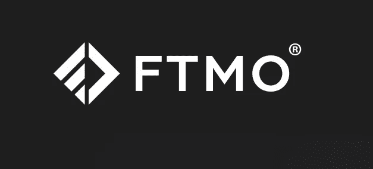

# FTMO:为交易获得资金

> 原文：<https://medium.com/coinmonks/ftmo-get-funded-for-trading-7b4014db8c1e?source=collection_archive---------4----------------------->

# CoinDCXpathbreaker

> 这纯粹是为了教育我的读者而写的教育文章。我与 FTMO 没有关联，也没有这篇文章中的任何附属链接。

在本指南中，你会发现在尝试 **FTMO 挥杆融资挑战**时需要考虑的最重要的事情。FTMO 是一家自营公司，为散户交易者提供不同账户余额的资金，这是基于一个有许多目标要实现的挑战。

在众多公司中，这是最合法、最值得信赖的融资自营公司，因为我已经看到了交易者的支出证明，而且它还提供了广泛的交易资产。

**FTMO 有什么好处？**

FTMO 的主要目标是找到世界上最好的交易者，但我们必须清楚地知道这样一个事实，即使 FTMO 支持你作为交易者的旅程，他们也有自己的利益，因为他们的主要收入来源之一来自支付初始挑战的交易者，他们没有资格进入下一轮。

这就把我们带到了下一个话题——FTMO 挑战。

这个挑战是为你设计的，让你无法成功，至少没那么容易。我不是悲观主义者……听我说完:这听起来可能是一种威慑，但重要的是，挑战并不是做不到。

交易者只需要遵循非常严格的风险管理参数，这将让你获得更好的结果，并最终获得资金。

在下面的指南中，如果我真的打算接受挑战的话，我会告诉你我将如何通过这个交易挑战。

## 目录:

*   **摇摆交易挑战**
*   **可用的交易平台**
*   **日内交易组合**
*   **平台费用**
*   **规则&规定**

## 挑战

页（page 的缩写）尽管 FTMO 提供付费的挑战，但是你要明白，如果你没有通过挑战，你的费用将被没收。我个人的建议是接受这个平台提供的免费挑战，看看它是否适合你的交易风格。

深入研究——FTMO 有两种挑战:**正常** **交易**和**摇摆交易**。

普通挑战允许交易者以高达 1:100 的杠杆开仓，这意味着直接 100 倍，而摇摆交易挑战允许交易者在任何给定时间仅以高达 1:30 的杠杆开仓，这意味着 30 倍的杠杆。(在挑战期间，这将比开仓头寸规模交易更有必要，因为通常新手交易者会因 1:100 的杠杆比率而兴奋不已)。

我会随时建议任何交易者接受波动挑战，因为交易时限制较少，此外，我们也不希望仅仅因为极端波动性导致的头寸止损而失去挑战。

**如何注册:**

1.  在这里创建一个 FTMO 账户
2.  如果你想尝试付费挑战——为挑战付费，你愿意承担谁的费用
3.  **选择 FTMO |摇摆挑战**

FTMO 挑战赛分为 4 个阶段:

1.  **评估流程**
2.  **FTMO 挑战赛**
3.  **验证**
4.  **资金交易员**

挑战赛有 5 个账户规模等级，每个等级都有自己的费用。它们如下:

*   10，000 美元帐户资金-费用 167.16 美元
*   25，000 美元账户资金-费用 269.61 美元
*   50，000 美元账户资金-费用 372.07 美元
*   100，000 美元帐户资金-费用 582.36 美元
*   200，000 美元账户资金-费用 1，164.73 美元

…

## 游戏规则:

*   **30 天交易期**

1.这意味着一旦你在平台上执行了第一笔交易，挑战就开始了，你将有 30 天的时间来完成所有的目标。

*   **最小交易日**

1.可能会出现这样的情况，你在第一周内或 30 天交易期结束前完成挑战。为了避免这种情况，FTMO 要求所有参与的交易者必须有 10 天的活跃交易时间才能通过评估

2.您需要在 10 个不同的日历日开始交易。

3.如果你在这 10 天之前达到了设定的利润目标，那么你可以在剩下的 10 天里建立更小的仓位来保持活跃。

*   **每日最大损失**

1.  挑战中的最大每日损失限额是账户初始值的 5%。
2.  因此，如果你选择一个 10，000 美元的账户，你将只允许在一天内损失 500 美元
3.  这适用于账户上已实现和未实现的损失。因此，我们必须考虑整体账户权益，而不仅仅是浮动余额。
4.  这种每日损失将根据 CEST 时区自动重置，并将在 CEST 时间 00:00:01 开始，在 CEST 时间 23:59:59 结束(对我的朋友 Dhruv Vashist 大声喊出来，他不厌其烦地向我解释了这一点)

*   **最大损失**

1.  账户允许的最大损失是账户初始价值的 10%
2.  因此，如果你选择 100，000 美元的帐户，在整个挑战过程中，你只有 10，000 美元的喘息空间。
3.  这同样不利于已实现和未实现的损失
4.  整个交易组合的总股本不得低于初始账户余额的 90%。帐户余额为 50，000 美元的 FTMO 挑战意味着帐户的最低余额在任何给定时间都不能低于 45，000 美元。

*   **利润目标**

1.  无论账户资金规模如何，该账户的利润目标都是 10%
2.  因此，如果你选择一个 100，000 美元的资金账户，你将需要实现 10，000 美元的利润
3.  这仅在达到利润目标且交易者在每日收盘前平仓所有未平仓头寸的情况下有效。该账户必须实现利润。

*   **可退还费用**

1.  当交易者通过挑战和验证时，平台将通过第一次利润分成来偿还费用

## 什么样的验证？

验证过程是为了向 FTMO 确认，成功通过挑战的交易者不只是在挑战阶段运气好。

所以基本上这里发生的是，FTMO 会给交易者另一个资金账户，这次用不同的规则从头开始交易…

*   **60 天交易期**

1.  交易者现在将有 60 天的时间来实现全部资金净值 5%的利润目标
2.  因此，如果交易者选择 50，000 美元的账户，他们将需要获得 2500 美元的实际利润

*   **验证阶段的其他规则**

1.  其他所有规则保持不变

## 最终入职和融资

一旦交易者达到这一阶段，他们将必须遵循 FTMO 的指示，以填写合规表格，接受公司的条款和条件

*   合格的交易者也将以 80:20 的利润分成开始(交易者获得 80%的利润，FTMO 保留 20%)
*   没有固定的利润目标来获得支付，但是交易必须有稳定的结果。尤其是像**最大损失** & **最大日损失这样的风险管理规则。**
*   默认情况下，FTMO 账户上的利润分割将按月进行，可以选择在账户上第一笔交易后的 14 个日历日后按需支付(再次感谢 Dhruv 帮助我获得了这些信息)

根据交易者的选择，通过银行转账或加密来处理支付。

总的来说，我喜欢把你推到极限的交易挑战的想法。如果你想在不损失太多的情况下，用一大笔资金测试你的技能，这是一个非常好的工具。

如果你有兴趣接受这样的挑战，请在评论中告诉我。

…

非常感谢 [CoinDCX](https://medium.com/u/a30fa2b03c2f?source=post_page-----7b4014db8c1e--------------------------------) 给我这个机会来撰写如此详细的报告，并成为**# coindcxpathbaker**计划的一部分，使我能够与加密领域的每个人分享这些知识。

> 加入 Coinmonks [电报频道](https://t.me/coincodecap)和 [Youtube 频道](https://www.youtube.com/c/coinmonks/videos)了解加密交易和投资

# 另外，阅读

*   [霍比审核](https://coincodecap.com/huobi-review) | [OKEx 保证金交易](https://coincodecap.com/okex-margin-trading) | [期货交易](https://coincodecap.com/futures-trading)
*   [Cloudbet 赌场评论](https://coincodecap.com/cloudbet-casino-review) | [点火赌场评论](https://coincodecap.com/ignition-casino-review)
*   [Godex.io 审核](/coinmonks/godex-io-review-7366086519fb) | [邀请审核](/coinmonks/invity-review-70f3030c0502) | [BitForex 审核](https://coincodecap.com/bitforex-review)
*   [Crypto.com 费用](/coinmonks/binance-fees-8588ec17965) | [僵尸密码审查](/coinmonks/botcrypto-review-2021-build-your-own-trading-bot-coincodecap-6b8332d736c7) | [替代品](https://coincodecap.com/crypto-com-alternatives)
*   如何在 Bitbns 上购买柴犬(SHIB)币？ | [印度的币安](https://coincodecap.com/binance-in-india)