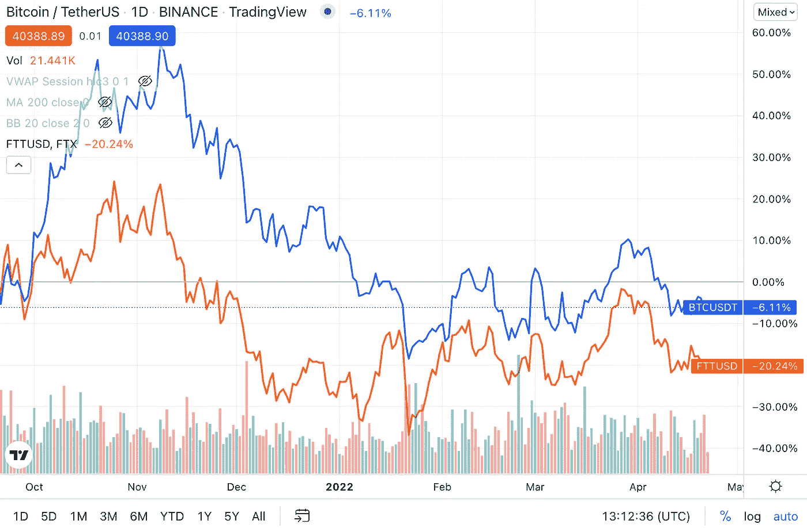

# FTT，被遗忘的象征

> 原文：<https://medium.com/coinmonks/ftt-the-forgotten-token-7780d8c041da?source=collection_archive---------11----------------------->

自 2019 年成立以来，FTX 取得了巨大的发展。这个庞然大物获得新资金的消息对我们来说并不陌生。然而，FTT FTX 的本土标志并没有像母公司那样发展壮大。下面是我对为什么 FTT 不是未来的好赌注的看法。

1.供应

FTX 虽然在 FTT 代币的总供应量上完全诚实，但在最初的白皮书发布时，公众无法获得该代币的授予时间表。这是四个月前公布的授权时间表。

[https://help . ftx . com/HC/en-us/articles/360031160031-FTT-解锁-日程](https://help.ftx.com/hc/en-us/articles/360031160031-FTT-Unlock-Schedules)

令牌在 2022 年 1 月 5 日完全解锁，离我的文章发布的日子非常近。球队已经承诺不出售代币。

> 交易新手？试试[密码交易机器人](/coinmonks/crypto-trading-bot-c2ffce8acb2a)或[复制交易](/coinmonks/top-10-crypto-copy-trading-platforms-for-beginners-d0c37c7d698c)

然而，来自供应方的威胁是千真万确的。在 FTT 代币的网站上查询，代币现在的供应量为**251004230。与去年相比惊人的增长。因此，可以理解为什么代币造成了损失。**

2.美国的法规

坦率地说，美国是并将永远是世界上最大的市场。FTT 在美国不可用的事实极大地限制了它的潜力。

3.有限效用

不像 BNB，FTT 没有机会成为 FTX 链的本土标志。山姆(FTX 的首席执行官)一直是 Solona 生态系统的拥护者，FTT 令牌仍将是当前的公用事业。

虽然降低费用和免费提取 ETH 对投资者来说很有吸引力，但对散户投资者来说，降低费用关系不大。对于 ETH 撤销，替代链和汇总提供了不同于标记 FTT 令牌的方法。只有活跃的 Opensea 交易商才会发现押注 FTT 是一个有利可图的选择。

机构也会发现免费撤销 ETH 也很有吸引力。然而，机构会在乎他们的投资(相对于他们的资本)所附带的那点点汽油费吗？机构应该更加关注交易所的深度、流动性和声誉，而不是降低汽油费。他们是否会对在 FTX 树立本土标志感兴趣仍不明朗。

*(我忽略了 FTT 赌客享有的 IEO 特权，因为我不认为 IEO 有利可图。请随意思考)*

4.燃烧的

FTX 官方的推特以每周展示他们烧毁的令牌为荣。然而，被烧毁的令牌根本无法与供应相比。到目前为止，车队出道以来只烧了 **17，138，516 辆 FTT** 。刻录时间表与令牌供应方的增长完全不兼容。

燃烧量与 FTX 的交易量同步。FTX 承诺从该平台购买并烧掉相当于 33%交易费的 FTT。因此，如果对 FTT 的分析正确的话，也应该对 FTX 国际的未来前景进行分析。

就衍生产品而言，FTX 一直是领先的交易所。随着市场进入成熟期，对衍生品的需求应该会上升。然而，币安在 CEX 市场的垄断是千真万确的，因为 FTX 国际应该很难打破这种垄断，更不用说来自 DEX 的竞争了。如果你可以查看 CoinMarketCap 网站，FTX 国际在 CEX 的排名一直没有上升。现货交易量仍然落后于比特币基地，尽管 FTX 的交易费用低于比特币基地。衍生体量被 Bybit，OKX，CoinTiger 这样的玩家超越。

更确切地说，FTX 团队最有前途的产品是 [FTX。美国](http://ftx.us/)。随着广告数量在美洲无处不在， [FTX。US](http://ftx.us/) 在美国已经成为一家声誉卓著的交易所。在所有密码交易所中，该公司拥有最具流动性的市场，这是一项不小的成就。FTX 的成功[。然而，可悲的是，美国与 FTT 毫无关系。](http://ftx.us/)

5.与比特币同行的趋势

From TradingView. The blue line is the price of Bitcoin and the orange line is FTT.

如果你一直密切关注这两个密码的动向，你会和我一样意识到同样的事情。两个密码基本上运行相同的轨迹。背后的理论相当简单。

由于比特币是加密技术之母，也是市值最大的加密技术，它的走势总是预示着整个加密市场的看涨或看跌。

因此，当比特币上涨时，市场的交易量将会上升，因为人们预计牛市即将到来。

FTX 将是市场持续看涨的主要受益者之一，交易量也将上升。

交易量的上升意味着 FTT 的买进卖出过程将会加快。

FTT 上去了。

**或者简单地说，比特币影响了整个加密市场。**

这就回避了一个问题，那么，我们为什么要在分享比特币轨迹的同时，投资一种不是比特币的加密货币呢？貌似有理，我们可以说是为了效用。但它已经建立之前，FTT 的效用是缺乏的。我们为什么不投资一只 crypto 的蓝筹股，而波动性更大的新生股票基本上复制它的表现呢？

我对 FTT 的看法。NFA)