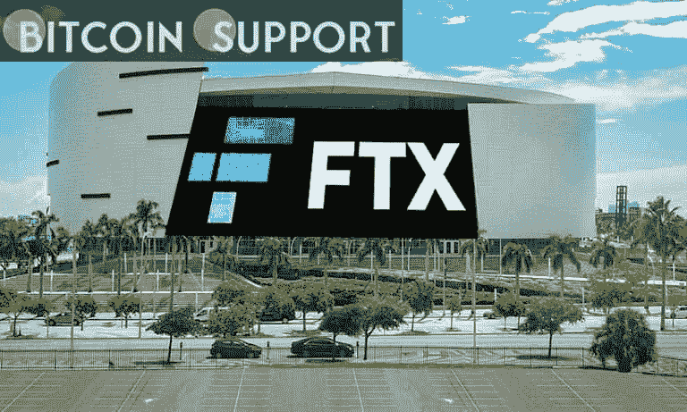

# FTX 将向未来基金投资 10 亿美元，以使人工智能更加安全，并将生物风险降至最低

> 原文：<https://medium.com/coinmonks/ftx-will-invest-1-billion-in-the-future-fund-to-make-ai-safer-and-minimise-biorisk-b40dd3d00d99?source=collection_archive---------49----------------------->

**Visit our website:-** [**https://bitcoinsupports.com/**](https://bitcoinsupports.com/)

新 FTX 基金寻找“大规模可扩展”的想法，并有可能明智地花费数百万美元。

FTX 未来基金由全球密码交换平台 FTX 创立，目标是支持人类的长期进步。多达 10 亿美元将被分配给专注于安全人工智能开发、降低生物风险、有效利他主义和其他主题的倡议。

根据新闻稿，该团队将支持非营利性和营利性企业，只要它们符合基金的目标，其中包括解决贫困和环境问题等挑战，以保护后代。该基金还试图寻找推动技术发展的项目。该公司还强调，它渴望投资“大规模可扩展”的项目。这被定义为“有潜力每年花费数千万或数亿美元进行生产的项目。”https://Twitter . com/ftxfuturefund/status/1498350483206860801

亿万富翁、FTX 首席执行官山姆·班克曼-弗里德(Sam Bankman-Fried)是该倡议的主要支持者。卡罗琳·埃里森、王微和尼沙德·辛格都是著名的撰稿人。此外，该团队将由 FTX 基金会首席执行官 Nick Beckstead 领导，Leopold Aschenbrenner、William MacAskill 和 Ketan Ramakrishnan 也将加入该团队。

在征集提案的同时，FTX 还制定了针对独立拨款人的重新拨款计划。此外，该团队表示将举办项目创意竞赛。

Sam Bankman-Fried 最近结合当前乌克兰局势给出了他对比特币(BTC)市场的看法。班克曼-弗里德认为，欧洲日益不稳定，可能会导致个人寻找替代品，使 BTC 成为一个有吸引力的选择。今年 1 月，美国 FTX 分公司完成了一轮 4 亿美元的投资，对该公司的估值为 80 亿美元。这笔钱将用于增加该公司在美国的劳动力和增加其产品供应。

**访问我们的网站:-**[**https://bitcoinsupports.com/**](https://bitcoinsupports.com/)

**免责声明:以上为作者观点，不应视为投资建议。读者应该自己做研究。**

> *加入 Coinmonks* [*电报频道*](https://t.me/coincodecap) *和* [*Youtube 频道*](https://www.youtube.com/c/coinmonks/videos) *了解加密交易和投资*

# 另外，阅读

*   [有哪些交易信号？](https://coincodecap.com/trading-signal) | [Bitstamp vs 比特币基地](https://coincodecap.com/bitstamp-coinbase) | [买索拉纳](https://coincodecap.com/buy-solana)
*   [ProfitFarmers 点评](https://coincodecap.com/profitfarmers-review) | [如何使用 Cornix 交易机器人](https://coincodecap.com/cornix-trading-bot)
*   [十大最佳加密货币博客](https://coincodecap.com/best-cryptocurrency-blogs) | [YouHodler 评论](https://coincodecap.com/youhodler-review)
*   [my constant Review](https://coincodecap.com/myconstant-review)|[8 款最佳摇摆交易机器人](https://coincodecap.com/best-swing-trading-bots)
*   [MXC 交易所评论](/coinmonks/mxc-exchange-review-3af0ec1cba8c) | [Pionex vs 币安](https://coincodecap.com/pionex-vs-binance) | [Pionex 套利机器人](https://coincodecap.com/pionex-arbitrage-bot)
*   [我的密码交易经验](/coinmonks/my-experience-with-crypto-copy-trading-d6feb2ce3ac5) | [比特币基地评论](/coinmonks/coinbase-review-6ef4e0f56064)