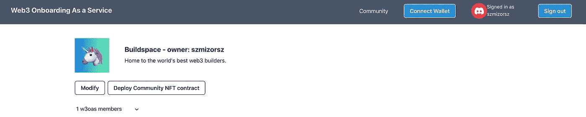

# 面向半 DAPPs 的全栈 web 3:web 3 on boarding as a service

> 原文：<https://medium.com/coinmonks/full-stack-web3-for-semi-dapps-web3-onboarding-as-a-service-cfbb70fa9d54?source=collection_archive---------23----------------------->

在我之前的项目中，像 [NFT 分数去中心化交易所](/@szmizorsz/nft-fractions-decentralised-exchange-introduction-3e696f27c065)和[房地产管理平台](https://royal-mode-4747.on.fleek.co/#/)，我一直致力于完全去中心化的应用。这或多或少可以通过一些瓶颈实现，如 RPC 提供者(如 Infura)或应用程序的一些集中部分，如我的分散交换中的桥。但一个严峻的事实是，很多 web3 产品或初创企业并没有以完全去中心化为目标，尤其是在 DeFi 领域之外，这种需求更少。构建半分散的应用程序或 CeDAPP 可能有几个原因，我喜欢用 CeDeFi 的首字母缩写来称呼它们。通常，需要抵御审查的数据会保留在区块链上，如令牌、所有权表示等。其余的可以保存在中央数据库中。根据经验，如果在集中部分完全崩溃的情况下，用户没有失去产品或服务提供的核心价值，例如，他们的令牌在区块链上仍然有效，则 CeDAPP 在集中和分散之间找到了平衡。这并不一定意味着产品可以在没有任何数据丢失的情况下被重新创建，这只是意味着为用户提供的核心价值是完整的。

该项目的目标是为 CeDAPPs 创建一个全栈技术模板，将传统的基于集中式数据库的应用程序与 web3 功能结合起来。显然，像关系数据库或 graphql 服务器这样的技术选择并不是一成不变的，我们更应该关注实现模式。这个项目像以前的项目一样纯粹是教育性质的，我想在其他人当中自学。

我们想要实现的业务目标或用例是什么？作为一个空间，Web3 可以为社区提供很多东西，随着空间的不断增长，越来越多的现有社区愿意加入或尝试这些可能性，因此加入这些社区最近成为了一种趋势。有不同的现有产品从不同的角度针对这个问题。[解锁协议](https://unlock-protocol.com/)服务于会员 NFTs 和令牌门控，同时 [Mintparty](https://about.mintparty.xyz/) 帮助管理社区以执行他们的 NFT 活动。在这个项目中，我想为现有社区创建一个简单的 web3 onboarding 服务。很简单，因为它只针对现有的不和谐社区，让他们创建自己的会员 NFT 合同，并向会员分发会员 NFT。它是半分散应用程序的理想候选，因为该产品用户的价值是位于区块链的会员 NFT，其余的可以放在任何集中的服务或数据库中。此外，我们希望尽可能平稳地完成入职流程，因此我们不希望让用户因私钥管理或首次购买加密货币而无法申领他们的 NFT。这两者都将作为服务提供，但它们需要集中化，稍后会详细介绍。

这个教育项目的目标受众是谁？任何和我处境相同的人:已经涉足 web3 领域的开发人员，交付了一些项目，无论是付费的还是个人的，但仍然缺乏对如何专业地完成事情的充分信心。我这么说是什么意思？如果您最近花了一些时间查看 github repos，了解如何优雅地实现 web3 连接按钮(例如)，如何创建封装契约实例化逻辑的 react 挂钩，或者实现元事务的选项是什么，那么您可能会在这里学到一些新东西。因此，任何已经结束在线课程学习，但仍在寻找提示的中级工程师。

在进一步深入之前，您可以查看一下[应用程序](https://w3oas.vercel.app/)，以及相关的存储库:[应用程序](https://github.com/szmizorsz/w3oas)和[契约](https://github.com/szmizorsz/w3oas-contracts)。

# 用例

让我们浏览一下用例，了解一下应用程序是如何工作的:

1.用户可以使用他们的 discord 身份登录:
认证流程基于 discord oauth 认证。成功登录后，在 w3oas 数据库(一个集中式关系数据库)中创建一个用户记录。

2.Discord 社区所有者可以在 w3oas 平台中注册他的社区:
如果登录的用户是任何 discord 服务器的所有者，那么他可以将他的社区注册为 w3oas 社区。在 w3oas 数据库中创建新的社区记录。例如，如果我们是 Buildspace 社区的所有者，我们可以注册它:

Discord server selection for w3oas community registration

After successful registration

3.Discord 社区成员可以加入相应的 w3oas 社区:
社区所有者可以将新创建的社区(在平台之外)与他的可以加入 w3oas 社区的成员共享。当新用户登录 w3oas 平台时，他们可以查看自己的可用社区。可用社区是已经注册到 w3oas 的 discord 社区，并且用户是 discord 社区的一部分，但尚未加入 w3oas 社区。一旦他加入 w3oas 社区，就会在 w3oas 数据库中创建一个新的成员记录。正如我们所看到的，一个 discord 社区在 w3oas 数据库中有其所有者和成员。

Discord members can join the w3oas community

4.社区所有者可以部署会员 NFT 合同:
该平台的整体目标是为社区提供 web3 体验。它通过社区 NFT 合同和会员资格来实现。因此，社区所有者可以部署社区 NFT 合同。社区合同是 erc1155 合同。你可以在[的原始提案](https://github.com/ethereum/EIPs/issues/1155)中了解 erc1155 规范。当契约被部署时，还会生成一个新的令牌来表示成员资格 NFT。社区所有者自动获得 1 个会员 NFT，这意味着他拥有一个会员 NFT。在 erc1155 条款中，会员 NFT 是 erc1155 合约中具有第一 id 的代币，每个会员可以获得等量的该会员 NFT 代币。
合同部署免费，交易费用由 w3oas 平台承担。

5.社区成员可以声明他们的成员资格 NFTs:
只有社区所有者在部署社区 NFT 合同时自动获得成员资格 NFT。所有其他成员都必须认领。合约交互是免费的，交易费用由 w3oas 平台承担。为了能够申请 NFT 会员资格，会员们必须连接他们的钱包。由于这是一个 onboarding 平台，我们不能假设用户已经有一个钱包，或者可以轻松地创建一个新的钱包并负责任地管理密钥。解决这个问题的一个很好的方法是 web3auth，它允许用户用他们的社交网站登录，并为他们创建一个钱包，这个钱包由 Torus 网络持有，并且只能由持有适当声明的用户恢复。长话短说，这是一个完美的 onboarding wallet 解决方案，这就是为什么 w3oas wallet connection 集成了 we3bauth 流。

Sign in options with web3auth on wallet connection.

6.社区所有者可以空投成员资格 NFTs:
社区所有者可以为尚未拥有成员资格 NFTs 的成员空投成员资格 NFTs。费用也由 w3oas 平台承担。

Community owners can airdrop membership NFTs

7.成员可以离开社区，所有者可以删除社区:
该平台支持社区和成员通常的 web2 CRUD 功能。因此，成员可以离开 w3oas 社区，这仅意味着他们的成员记录从 w3oas 数据库中删除，但并不意味着他们离开了 discord 社区。社区所有者可以从 w3oas 平台删除他的社区，这显然并不意味着 discord 社区删除本身。

Community owners can modify, or delete their community

这就是 w3oas 平台的全部功能。如果你想玩[应用](https://w3oas.vercel.app/)，只要创建一个 discord 服务器就可以注册为 w3oas 社区。

这是一个半分散的应用程序，因为用户和社区的价值是社区 NFT 合同和区块链上的成员资格 NFTs，在平台关闭的情况下，它仍然为社区服务。由社群决定如何使用其成员资格 NFT，例如用于令牌选通，或者是否愿意在社群 erc1155 合同中创造与成员资格含义不同的新令牌。

在下一篇文章中，你可以读到关于[的技术细节。](/@szmizorsz/f9f19b8daba5)

> 加入 Coinmonks [电报频道](https://t.me/coincodecap)和 [Youtube 频道](https://www.youtube.com/c/coinmonks/videos)了解加密交易和投资

# 另外，阅读

*   [去中心化交易所](https://coincodecap.com/what-are-decentralized-exchanges)|[Bitbns FIP](https://coincodecap.com/bitbns-fip)|[Bingbon 评论](https://coincodecap.com/bingbon-review)
*   [用信用卡购买密码的 10 个最佳地点](https://coincodecap.com/buy-crypto-with-credit-card)
*   [加拿大最佳加密交易机器人](https://coincodecap.com/5-best-crypto-trading-bots-in-canada) | [Bybit vs 币安](https://coincodecap.com/bybit-binance-moonxbt)
*   [阿联酋 5 大最佳加密交易所](https://coincodecap.com/best-crypto-exchanges-in-uae) | [SimpleSwap 评论](https://coincodecap.com/simpleswap-review)
*   购买 Dogecoin 的 7 种最佳方式
*   [最佳期货交易信号](https://coincodecap.com/futures-trading-signals) | [流动性交易所评论](https://coincodecap.com/liquid-exchange-review)
*   [用于 Huobi 的加密交易信号](https://coincodecap.com/huobi-crypto-trading-signals) | [Swapzone 审查](/coinmonks/swapzone-review-crypto-exchange-data-aggregator-e0ad78e55ed7)