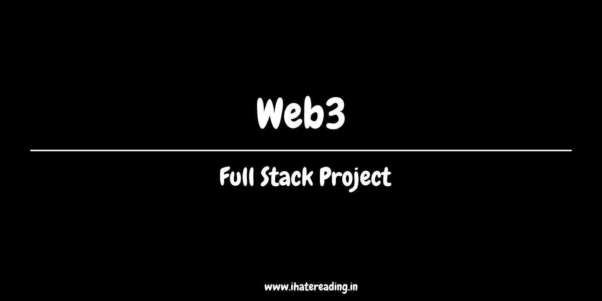

# 全栈 Web3 项目

> 原文：<https://medium.com/coinmonks/full-stack-web3-project-3252d1a6b230?source=collection_archive---------7----------------------->

想开发一个全栈的 web3 项目

[**Our wesbite**](http://ihatereading.in)

## 在后台

这个故事不是一个关于开始和开发全栈 web3 库的简短故事。最近看了一个 youtube 视频，讲的是用以太坊，hardhat，以太坊华夫，chai，ether.js，react.js 开发一个全栈 web3 项目。

## 视频参考