# QREDO 网络的基本分析。(更新于 2022 年 3 月 17 日)

> 原文：<https://medium.com/coinmonks/fundamental-analysis-on-qredo-network-qrdo-80445f0d53db?source=collection_archive---------4----------------------->

**1。简介**

我们经常听说机构将开始大规模转向分散财务的过程，但分散财务为机构做好准备了吗？在 ConsenSys 于 2021 年 7 月发布的“金融机构加密货币基金、交易所、托管人和家族理财室分散融资指南”报告中，他们描绘了机构世界的采用周期，指出了合规和监管的作用和影响。他们建立了一个交易流程的心理模型，以确定机构需求和挑战—从托管、合规和最佳执行，到监控、报告和研究。这个交易流程可以被看作是一个金字塔，一个马斯洛的制度需求层次——如果你愿意的话。

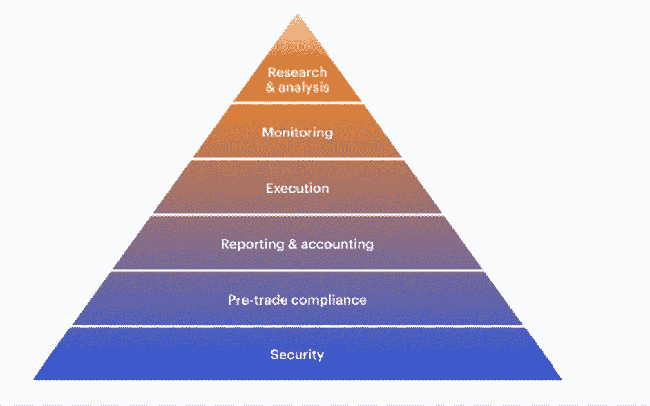

NOTE: ConsenSys Piramide diverges from the text, so I preferred to use the text order. Source: ConsenSys — A guide to Decentralized Finance For Financial Institutions Cryptocurrency Funds, Exchanges, Custodians and Family Offices — 2021 July.

不同规模的不同机构面临不同的挑战。然而，有一个方面**将整个机构世界团结在一起，不管监管监督或管理的资产(AUM):风险**。DeFi 的风险管理包括几个方面。在制度需求金字塔的**底部，是** **安全。**这**需要安全存储私钥、密钥恢复和多重签名功能**确保您的密钥免受黑客攻击和盗窃，并且在没有多方批准和签署交易的情况下，您的资产不能发送到网络内的任何地方。在基础层中，额外的安全性包括将钱包地址和智能合约列入白名单，并对交易的数量或规模进行限制。实际上，建立风险管理规则取决于组织的复杂性。它通常包括防止访问丢失(丢失私人钥匙)和失窃的保险。同样，最近来自彭博的一份报告注意到加密安全是机构投资者最关心的问题。

**金字塔的下一层是合规** —这是整个机构世界尚未面临的风险和挑战，尽管加强监管无疑将在未来几个月和几年变得至关重要。在欧洲、亚洲和美国，金融机构必须遵守反洗钱(AML)法规，在与邪恶的交易对手进行交易时，这些法规通常会带来监禁的威胁。**规模更大、监管更严格的公司也深刻认识到要避免与受制裁或被禁止的交易对手进行交易。**这意味着 DeFi(去中心化和假名)的一个核心特性可能会变成一个 bug。所有 DeFi 基础设施中的流动性池，包括借贷池和分散交易所，都可能充满潜在的风险交易对手。

金字塔的下一层包括**最佳执行**:确保能够以充足的流动性收购和处置**资产，并确保利润率、利差和滑点保持在较低的水平。**

通过一级经纪商、集中和分散交易所以及场外交易柜台直接获取 DeFi？暴露于该资产类别通常是可能的，但**下一个挑战，也是金字塔中的一层，是监控**:确保资产、收益率和交易头寸被准确跟踪，并且可以应用风险度量和监控。**报告构成了金字塔的第四层**，其中包括机构世界面临的各种新挑战:确保新的代币、复杂的交易、收益率以及全新的发展和行话(如空投)得到正确定价和准确核算。**最后，还有关于如何更好地理解和筛选 DeFi 生态系统中日益增长的细微差别和最重要的机会的研究(要解决这个问题，机构可以去 Twitter 并雇佣@thecrypto_V):** 。

为了解决机构面临的数十亿美元的问题，让我介绍一下 Qredo Network， **a** **第 2 层和第 3 层协议，提供分散的** **托管解决方案，其共识机制中内置了合规性和治理控制。** Qredo 正在为多链世界重新构建数字资产所有权和区块链连接，并率先推出了首个分散式无信任多方计算(MPC ),这是一个安全的托管网络，可适应金融机构的监管和合规流程。该网络**支持分散托管、跨链原子互换、跨链信贷设施和流动性访问。**QRDO 令牌在一个独特的以用户为中心的模式中融合了公用事业和治理功能，使用基于费用和基于通货膨胀的补偿的独特组合来推动所有利益相关方的积极回报，并促进快速采用和增长。

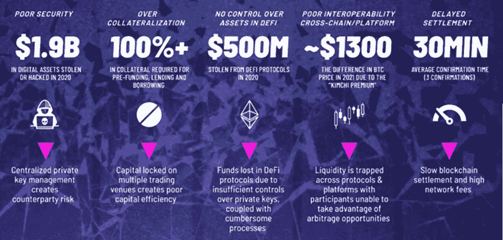

Problems identified by QREDO. Source: [Litepaper.](https://www.qredo.com/qredo-litepaper)

Qredo 是一个非常复杂和详细的项目，但通过一种非常简单的方式，您可以将网络想象为两个加密链接的协议，它们同步工作以提供隐私和不可否认性，该协议由以下部分组成:

*   **第 2 层**:分散委托股权证明(DPoS) **区块链，作为中间件，支持交易方之间交换第 1 层资产**(如 BTC、瑞士联邦储蓄银行)**的分散托管和原子互换，并在其共识机制中内置合规性和治理控制。**
*   **第 3 层**:一种**加密的分散式通信网络，使用第 2 层区块链的加密原语和身份结构作为提供消息不可否认性的构建块之一。**第 3 层可用于向做市商发出 RFQ(报价请求),进行私下的交易前谈判，或携带关于受监管的虚拟资产服务提供商(VASPS)之间特定交易的旅行规则信息。一旦一项交易在第三层网络上被双方自行任命的具有治理责任的保管人批准，它将被自动记录在第二层区块链上。

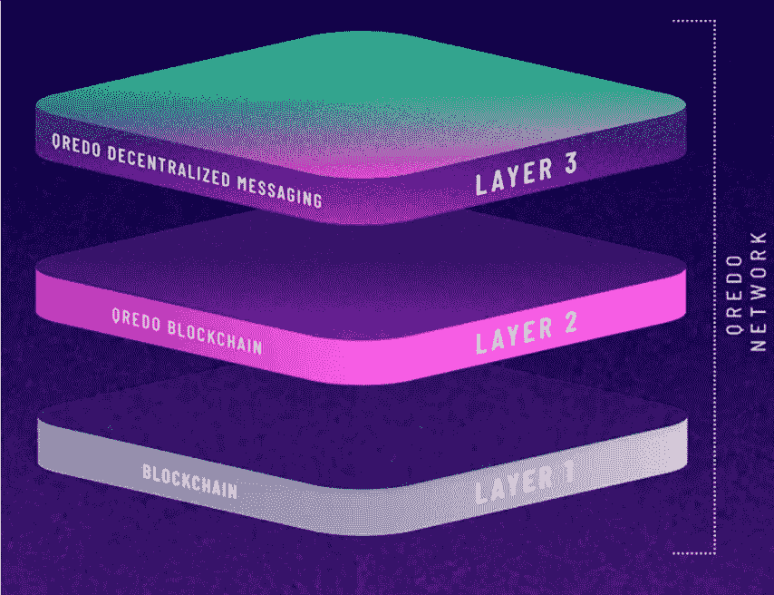

Qredo 提出的这一新解决方案将区块链从通信网络中分离出来，其目标是通过利用分散的通信协议(第 3 层)作为独立层来卸载任何无关的通信，从而允许第 2 层协议发挥其全部潜力。他们认为这对于任何希望向希望参与或开发 DeFi 协议的传统金融参与者交付高性能解决方案的第 2 层来说都是必不可少的。

**2。深入项目**

上面的图片是关于 Qredo 架构的基本解释，现在，我建议你把下面的图片放在脑子里，以便最容易地想象这篇分析/文章的其余部分。

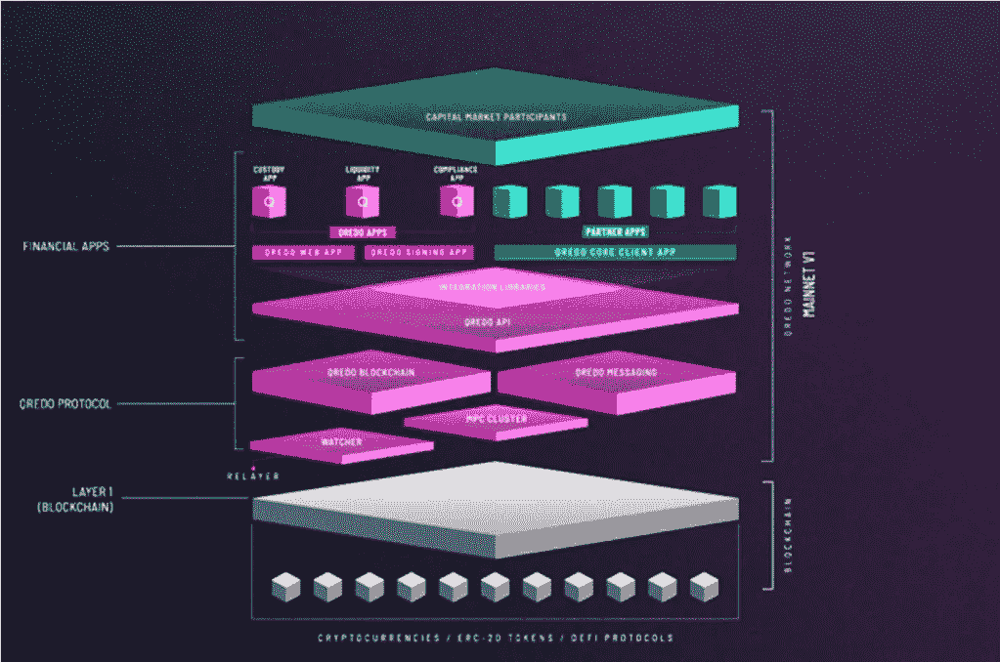

Qredo architecture.

**2.1 MPC**

多方计算(MPC)的激增第一次允许以不需要私钥的方式生成公钥和数字签名——因此不再有信任集中的一方来保护密钥或自己承担保护/保持密钥安全的风险。

**MPC 是多方联合执行数学计算，而任何一方都不会向其他方泄露其秘密的能力。**多方合作解决签名方程，而无需创建密钥，也无需向对方透露任何关键信息。这使得 c **通过使用 MPC，集中的托管人变得分散。**

但这只会改变问题的根源，因为大多数集中式保管人已经部署了 MPC 来降低私钥被盗的风险，他们自己运行大多数(如果不是全部的话)MPC 节点，**并且他们将所有数字资产所有权信息存储在 SQL 数据库中。**允许黑客只需要通过创建一个虚假的所有权记录来改变数据库中的值的攻击，使黑客能够从集中保管者那里取出任何她想要的东西。

Qredo Network 利用 MPC 创新并了解集中式解决方案的缺点，通过实施分散式 MPC 解决方案*(请参见下面的注释)并结合第 2 层区块链(作为不可变和不可更改记录的基础)提出了一种独特的解决方案，**通过这种方式，每项资产的所有权信息、交易记录和治理批准都记录在第 2 层区块链上，并由绝大多数验证人员进行批准，这些验证人员负责验证交易是否违反合规政策，这些信息也记录在同一个区块链上。甚至 MPC 网络为生成钱包地址或第 1 层交易签名而采取的行动也会被询问、验证并记录到 Qredo 的区块链中。**

此外，**所有交易操作都利用 BLS 签名方案来实现多保管人批准**(手动、自动或两者兼有)，从而确保最高的操作完整性。为什么？**因为托管执行人的批准签名也是记录在 Qredo 区块链中的可审计数据的一部分。**put**换句话说，BLS 是一种加密签名方案，它允许用户验证签名者是可信的。**

****注意:**目前 Qredo 尚未完全分散，最初他们部署了第 1 版 Mainnet，Qredo Ltd(“公司”)是分散架构的唯一运营商。Qredo 的验证器托管在全球六个数据中心，通过低延迟网络运行验证器节点。在 2021 年下半年(延迟——在撰写本文时仍未上线), Qredo 计划在其 v 2.0 协议 Testnet 下迁移到一个联邦模型，在那里一组第三方验证器将开始运行验证器节点。在 2022 年完成这一阶段后，假设所有操作测试和安全审查结果都很低，则第三方验证者的数量将增加到一个完全分散的模型。**

**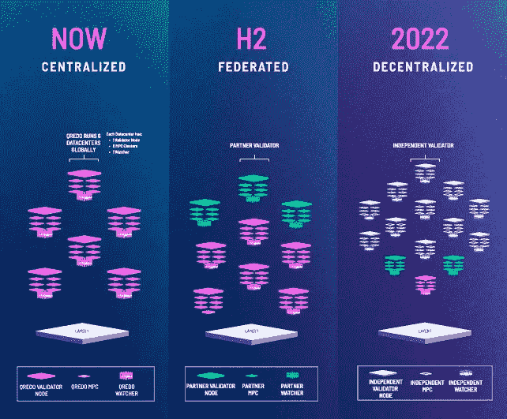**

****2.1.1 无需钥匙的保管****

**正如 [Rasheed Saleuddin 在 Mesari](https://messari.io/article/qredo-decentralized-custody-for-institutions) 的一份报告中提到的，“在确保区块链托管资产的安全方面，Qredo 选择不使用传统的多重签名(multi-sig)技术，需要验证“M/N”个私钥来验证每笔交易。虽然这种方法很受欢迎，但它的缺点包括(1)交易规模(因此成本)随着所需签名者数量的增加而增加；以及(2)对智能合约的依赖，开放架构以应对风险。**

****Qredo 使用一种门限签名方案(** [**TSS**](https://wiki.mpcalliance.org/key%20management%20for%20blockchain.html) **)，一种特殊类型的安全多方计算(MPC)** ，也就是 Shamir 的秘密共享(SSS)的一种变体:将私钥分成多个密钥部分，需要部分私钥持有者的 M/N 批准才能实现交易。当收集到 N 个签名中的 M 个时，一个私人签名批准一个交易。许多最流行的集中保管者都使用 MPC，包括 Fireblocks 和 Bakkt Warehouse，但也有分散协议，如 THORchain。**

**用户的密钥份额——只要达到阈值就提供所有权和访问权——存储在 MPC 节点中，并受到密钥轮换等[安全措施](https://insights.deribit.com/industry/decentralisation-of-custody-solutions/)的保护。一旦在 Qredo 上获得安全，Qredo 网络内的任何转账成本都非常低，托管也是免费的。区块链区拥有所有的 BTC、ETH 等。本地和链允许 Qredo 地址之间的结算。**

**Qredo 的前端由一个 web 应用程序组成，需要通过移动应用程序进行签名(PIN 加生物识别)。电子钱包的管理员可以创建一个组织帐户并授权给用户，如经理、交易员和其他管理员。各方可以邀请其他钱包加入他们的可信网络，并可以查看未完成的订单、账户活动、库存和白名单中的地址。为了增加安全性，可以实施单独的交易和取款政策。"**

**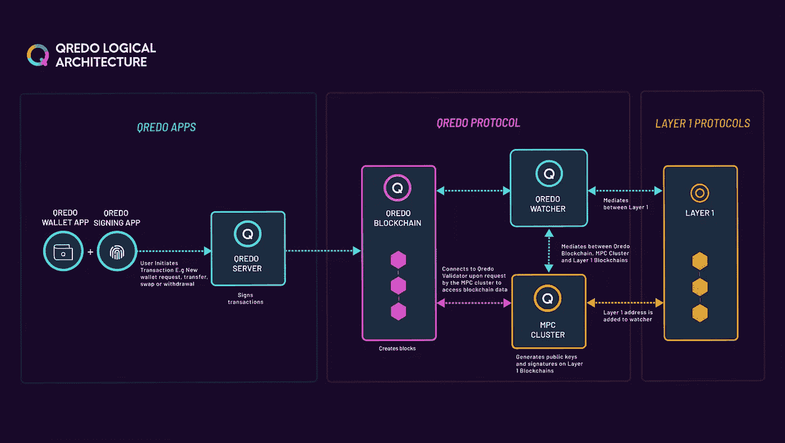**

**在 Qredo 网络中，一起运行 MPC 协议的 CD-MPC 节点可以 **a)创建用于为要存放在 Qredo 网络中的第 1 层加密资产创建地址的公钥，或者 b)在由底层第 1 层区块链(例如:比特币)识别的第 1 层交易上创建签名，以花费加密资产或将加密资产移出 Qredo 网络。由每个验证器运行的称为代理的软件模块充当中间件控制器和每个第 1 层 Qredo 支持的接口。****

**经纪人使用区块链神谕来引导自己行动。当退出 Qredo 网络的交易被验证并包括在下一个块中时，每个代理软件实例(由每个验证器运行)确定性地创建第 1 层交易，并将其提交给其本地 MPC 节点进行签名。这是一个重要的要点:MPC 协议只有在每个 MPC 节点在协议开始时输入完全相同的内容来签名时才有效。**

**当操作 MPC 协议的 MPC 节点参考链上数据集以获得操作的指令和确认时，就像代理一样，创建了(共识驱动的)CD-MPC 网络。也就是说，它们使用区块链来验证状态，并在需要时组织自己采取行动。他们继承了区块链的当前状态，从而继承了对验证者已经执行的交易的验证(信任),但是他们也参与了他们自己对区块链中的交易的验证(但是，验证),这迫使他们创建数字签名。信任，但要核实。**

**Qredo 的 CD-MPC 网络在其操作中内置了其他防御机制，如网络混淆、节点隔离、加密组织以及使用阈值解密、机密计算和分布式密钥生成的 MPC 秘密安全。**

**更简单地说，**MPC 集群是一组节点，它们通过应用 MPC 协议一起工作来生成签名的公钥。**该协议通过在幕后使用数学，减少了对私钥的需求，以便对添加到 Qredo 区块链中的交易进行签名。**

**MPC 集群与观察器和 MPC 验证器一起工作。添加资金时，MPC 节点根据交易提供的证明或通过查询 Qredo 区块链验证器来验证请求的有效性。任何由此产生的 MPC 事务都可以通过观察器传输回 Qredo 区块链。可以通过对照 MPC 集群的公钥验证签名来检查事务的有效性。**

**MPC 验证程序应 MPC 集群的请求，通过与区块链验证程序节点的独立连接来访问 Qredo 区块链上的数据。MPC 验证器对于高度敏感的流程(如取款)是必需的。**

**为了提高网络的安全性，执行 CD-MPC 操作、验证交易和对整体提案进行投票的软件被打包并在安全的飞地中运行。应用程序使用安全管道机制直接从开源代码库分发到可信硬件或云环境，提供安全的飞地。**

**安全飞地是安全计算领域的一项进步，它提供了一个隔离、强化且高度受限的环境来托管安全关键型应用程序。跃进是一个被称为证明的加密过程。这意味着应用程序用户现在可以验证运行软件的硬件完整性，以及用于运行这些应用程序的软件的完整性。**

****证明过程以编程方式审计源代码，并使用户能够接收加密证明，数据正根据规范进行处理，并且所有软件和硬件完整性检查都已通过。** **这些证明支票的凭证被写进了区块链的 Qredo。**这有助于消除攻击面，阻止任何试图写入区块链或调用与其他节点的任何交互的未授权操作。**

****2.2 Qredo 第二层——区块链****

**Qredo 网络建立在 Tendermint 基础上，全面发布了 v 2.0 mainnet 协议。Qredo 团队的目标是提供**一个经过调整的第 2 层快速终结解决方案，以提高可扩展性，允许网络参与者执行原子交换，跟踪记录跨不同第 1 层区块链的资产所有权，以及在流动性网络内的资产所有权**、**，同时还记录每项资产的所有权信息、交易记录、 治理批准记录在第 2 层区块链上，并由绝大多数验证者批准，验证者验证交易是否违反合规政策，合规政策也记录在同一个区块链上。****

**让我解释一下第二层区块链的工作原理:分布式账本用于记录第一层加密资产的所有权，这由 Qredo 区块链中的合成令牌表示——用户将第一层资产发送到 Qredo 提供的地址，**Qredo wallet 将对发送到 Qredo 地址的第一层区块链资产的价值进行一对一的映射。**换句话说，如果一个 Qredo 合成 BTC 钱包有 10 个 BTC 存入其中，10 个 qBTC(真实资产的合成对应物)将在下一个区块铸造，并将显示为交易者 qBTC 钱包中的存款。**

**使用 Qredo 的区块链浏览器可以看到 qBTC 在第 1 层区块链上链接其值的确切位置，这意味着它是映射。这对于**每个支持的第 1 层和 ERC-20 令牌**重复进行。**重要的是，Qredo 网络从不进行再抵押。也就是说，Qredo 网络在任何时候都可以证明是有偿付能力的。Qredo 区块链上的 1 qBTC 将始终映射到比特币区块链上的 1 BTC。**这些合成值到第一层区块链值的映射被称为“结晶”。**

**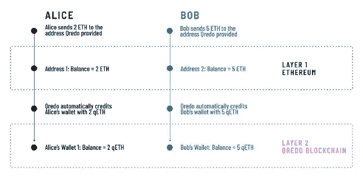**

**Qredo 的**结晶**过程计算出哪些第一层资金映射到第二层钱包。《出埃及记》:Bob 发送给 Alice 第 2 个 ETH，现在 Alice 拥有第 4 个 ETH，Bob 拥有第 3 个 ETH，现在 Bob 的钱包有第 3 个 ETH 映射到地址 2 的一部分，总共 5 个 ETH 中的第 3 个 ETH。Alice Wallet 有 4 个 ETH 映射到地址 2 的另一部分，地址 2 的 5 个 ETH 中的另 2 个 ETH。这种映射使 Qredo 能够随时提出“资金索赔证明”。**

**这将使运行 Qredo 客户端的任何公众成员(无论验证与否)和附带的 Qredo Broker 模块能够证明系统中的所有第 2 层资金(钱包)都映射到真正的第 1 层资金，并且他们能够确切地看到这些映射的细节。**

**事实上，所有资产都将保存在与 MPC 集群结合的第 2 层区块链解决方案**中，这将使 Qredo 能够在几秒钟内确认用户之间的交易，而没有交易对手、结算或支付风险，包括第 1 层原子互换(ETH 的 BTC)或加密至菲亚特交易(ETH 的英镑)**。除非交易双方的资产所有权通过自动化、无摩擦的幕后流程进行加密验证(“硬币证明”)，否则不得使用 Qredo 与另一交易方进行原子互换或转移。**除非数字资产存在，否则交易无法进行。**用户受益于更高的结算吞吐量，消除了暴露于未验证资金的交易对手风险，并因消除硬币证明费用而节省了成本。简而言之，在执行第 1 层资产与其他第 1 层资产或法定资产的交换时，不再有“谁先走”的问题。结算是即时的。**

**总结即时结算，区块链将记录各种信息，以及在交易中使用的合成资产的解决方案，这将在加入 DeFi 时为机构和普通用户提供多样化的解决方案，如:交易不安全(前置运行机器人、矿工可提取价值— MEV —以及顺序智能合约交易)；错误的交易中继(临时缺口问题和中继者的角色)；缺乏合规支持；资本效率(无风险结算——多亏了“硬币证明”——译者注)；不需要预先融资；贸易信贷；和贷款池利率)。要了解这些问题是如何发生的，以及 Qredo 将如何解决它们，我建议您看一下[白皮书。](https://www.qredo.com/qredo-white-paper.pdf)**

**但不止于此，通过所有这些解决方案 **Qredo 不会对数字资产集中保管人的业务模式构成威胁，**但它们为集中保管人提供了一个机会，随着世界向分散基础设施发展，他们可以发展自己的业务并保持相关性。这些集中托管人可以使用其现有的基础设施来运行 Qredo 客户端，这些客户端生成托管人批准交易，进而为其客户提供定制的可编程合规性和治理流程。不久，你可能会看到一个无托管的集中交易所。**

****2.2.1 在将信息存储到第 2 层之前，Qredo 如何提供交易保密性，以避免交易不安全？****

**Qredo 客户机完成一个事务，准备将它推送到网络中，在那里它将在 mempool 中可见，执行最后一个动作。**它生成一个 AES 加密密钥并加密整个交易有效负载，除了它生成的唯一交易 ID 和任何可选的订购信息(如果该订单是多交易策略的一部分)。****

**Qredo 的验证器不在竖井中运行。**它们被组织成三个一组，叫做豆荚。**pod 为 Qredo 的经济安全设计提供了一个在运行中的第二层网络中无与伦比的强度和复杂程度。**

**这里的关键细节是，作为初始化过程的一部分，Pod 运行一个设置协议，使 Pod 能够执行阈值解密操作。在设置过程中，三个 Pod 成员相互通信，并且该操作的结果是公开给 Qredo 区块链的公钥，该公钥被标识为 Pod 阈值解密公钥。每个操作舱创建一个门限解密公钥，并将其写入区块链。任何 Qredo 客户端或网络参与者都可以使用这个公钥来加密消息，这样只有 Pod 成员才能看到它们。**

**对于每个正在运行的 Pod，Qredo 客户端使用 Pod 的阈值解密密钥对用于加密交易的 AES 密钥进行加密。在 Qredo 的第 3 层上为每个 Pod 建立了通道，以接收加密的对称密钥，一旦解密，使 Pod 能够解密特定的交易并验证其合法性，然后就其插入区块链进行投票。为了解密 AES 对称密钥，所有 Pod 成员都运行阈值解密协议。密钥细节是所有三个成员必须参与协议，因为没有一个 Pod 能够独自解密 AES 对称密钥。此外，包含验证器的 pod 有自己的通信协议，用于表决块的创建。这个通信协议不能被网络上的任何其他 Qredo 客户端访问，并且独立于 mempool。**

**结果是，当加密的交易驻留在 mempool 中时，交易被加密，并且不可能被 Qredo 网络上的其他交易者分析。只有操作单元中的验证者才能解密事务，**并且只有当解密的事务被写入块中时，才可能被其他网络参与者分析。****

**这种设计的附带好处是，交易可以分批进行，以减少燃气费。**

****2.3 Qredo 第三层****

**Qredo 将用于数字资产跟踪和结算的快速终结区块链(第 2 层)与共识驱动的多方计算(CD-MPC)网络**和安全的端到端加密分散式对话复制网络(第 3 层)** **相结合，以处理从机器对机器通信到存储和提供监管交易前通信的审计跟踪等一切事务。**第 3 层已作为 v 2.0 协议的一部分推出，即将发布。**

**请求签名的消息、响应以及获取和聚合签名所需的其他通信发生在 Qredo 的第 3 层网络上，通过端到端加密保护消息流，该解决方案旨在卸载第 2 层区块链，提供一个经过调整以提高可扩展性的**快速终结解决方案。****

**Qredo 的第 3 层解决方案是一个端到端加密的分散式对话复制系统，它使用第 2 层区块链用户的加密身份作为构建块之一，来提供端到端加密(隐私)、消息存储的身份验证、消息完整性和不可否认性。第 3 层协议基于 Matrix1，matrix 1 将自己描述为“一个分散的会话存储，而不是一个消息传递协议”。当通过 Matrix 发送消息时，它在所有 Matrix 节点上被复制，这些节点的用户(人或机器)参与给定的对话——类似于 Git 存储库之间提交的复制方式。没有单点控制或故障。**

**Qredo 第 2 层协议也使用第 3 层的分散 RFQ 系统将这些第 1 层资产交换为 QRDO 令牌，并负责将它们汇回验证器。在第 3 层网络上，用户可以向做市商发出询价，并从做市商处接收可操作的报价，他们可以对这些报价进行数字签名并提交给第 2 层区块链。**

**报价请求(“RFQ”)交易方法是一种不对称的交易执行模式。在该模型中，交易者用户调用第 3 层协议，该协议使用第 3 层网络查询有限的一组参与做市商，这些做市商向该协议报价/出价(“市场”)。该协议将向交易者用户显示所有收集到的最佳报价。该协议实施了一条规则，即用户只能“出价”(卖给出价最高的做市商)或“提价”(从最便宜的卖方做市商购买)。用户被禁止进入买价/卖价价差，从而减少执行费用。**

**在典型的 RFQ 系统中，交易者用户不能互相交易，更重要的是，他们不能自己做市。Qredo 协议对此提供了一个例外，即交易者用户可以与已知的、可信任的交易对手(其他交易者用户)进行私下交易，但类似于典型的 RFQ 系统，因为他们不能自己做市。**

****2.4 Qredo 观察器****

**观察器在区块链验证器、MPC 集群和加密资产网络节点之间进行协调。该服务旨在防止失窃。当创建新的钱包时，当加密资产被存入用户账户时，以及当进行结算时，监视者扮演关键角色，通过轮询变化来提供无信任的监视。**

****2.5 Qredo API e 核心客户端****

**Qredo 集成库连接到 Qredo 客户端 API，使市场参与者能够将 Qredo 集成到他们的中间办公室应用程序中。该特性支持快速集成和独立应用程序开发，因此对 TradeFi 建模和交易系统执行的支持是无缝的。**

**使用 Qredo 的客户端软件和开源集成库(Python、Java、.NET)金融机构可以创建包含关于受监管的虚拟资产服务提供商(vasp)之间特定交易的旅行规则信息的消息，或者发送到 vasp 或从 vasp 接收的消息。Qredo 对第 2 层/第 3 层和企业级集成库的选择奠定了基础，使开发人员能够快速创建独立的应用程序，扩展 Qredo 的功能，从而快速实现价值。**

****2.5.1 Qredo 应用****

**这些是面向用户的应用程序，允许您与 Qredo 网络进行交互。Qredo 应用程序根据可用的安全原则进行设计，以确保出色的用户体验与机构级安全性相平衡。**

****2.5.1.1 快乐多网络应用****

**登录 Qredo 网络即可访问。这是最重要的行为发生的地方，比如开始交易和增加会员。**

****2.5.1.2 Qredo 签约****

**签名应用程序与 Qredo Web 应用程序一起使用，以授权 Qredo 网络上的访问和操作。**

****2.5.2 Qredo 核心客户端 App****

**合作伙伴可以开发与 Qredo 网络集成的定制应用，并受益于其灵活的架构和对多种用例的支持。**

****2.6 加分内容！****

****2.6.1 去中心化的路径——道****

**Qredo 协议和代码不归任何一方所有。qre do 网络是一个社区，将利用分散自治组织(Dao)的最佳运营。Qredo 网络本身将由一个开放的分布式 Qredo 验证器网络保护，该网络运行 MPC 协议以保护存款、管理参与者的市场活动、验证交易以及对新区块进行投票。**

**Qredo DAO 将独立于中央机构运作。取而代之的是，该组织将集体做出决定，QRDO 令牌代表一票。通常情况下，如果改进提案获得了足够的支持以进行更广泛的投票，它们就会被选中进行投票。投票通过部署在以太坊区块链上的智能合约进行。阿道的智能合约定义了组织的规则，掌握着集团的金库。一旦合同在以太坊上生效，除了投票，没有人能改变规则。Qredo 开发了这些智能联系人，目前正在进行安全审计。确定的问题将得到解决，如果第二次审计没有问题，合同将被放行。**

****2.6.2 流动性中心**(2021 年 8 月 25 日推出测试版)**

**场外交易通常依赖中介。这个可信方充当托管服务，收取从双方接收资产的费用，并将它们发送给每个用户。然而，不能保证资产会被交付，或预期的金额会收到。时间框架也无法保证，因为交易可能会被流氓交易员拖延，计划也会改变。**

**在流动性中心，这是一个简单的公告板，可以将订单 URL 广播给特定的交易对手或共享给完整的白名单，一旦接受，就会立即以非常低的成本执行。在 8 月份开始的公开测试中，Liquidity Hub 充当了一个公共论坛，专门为金融机构通过跨链原子互换进行交易而构建。交易者可以在不同的加密资产(如比特币和以太网)之间进行场外掉期交易，而无需信任第三方、托管人或复杂的机制，如包装和挂钩。**

**完全启动后，流动性中心将能够实现点对点交易，从而始终保持对资产的控制，并通过直接在 Qredo 钱包内进行交易享受多种好处:**

*   ****即时无风险结算。** Qredo 独特的跨链原子互换架构意味着资金同时结算到每个钱包，没有任何一方无法兑现交易的风险。**
*   ****内置数字资产管理和报告**。机构可以履行合规义务，并定制其保管治理和批准工作流。**
*   ****加密资产的范围。**流动性中心目前支持 BTC、瑞士联邦理工学院和多个 ERC-20 代币。流动性将得到 Qredo 投资者和包括 Wintermute Trading 在内的加密做市商的支持。**
*   ****经济实惠的费用。**流动性中心的交易对做市商和接受者收取 0.5 个基点(0.005%)的费用，低于 Uniswap 等 dex 的 30 个基点费用，以及中央交易所通常收取的 10 个基点费用。没有天然气或采矿成本，允许不受限制和自由流动的贸易。**
*   ****最佳执行力。**滑点是不可能的，即使对于那些希望在一次交易中交换大量加密资产的人来说也是如此。**

****2.6.3 出行规则解决方案****

**FATF(金融行动特别工作组)建议#16(旅行规则)为虚拟资产服务提供商(VASPs)带来了许多技术挑战。首先，如何在保护用户隐私的同时遵守交换信息的要求。当 VASP 希望向另一个 VASP 发送交易发起人和受益人信息以支持旅行规则要求时，他们必须与另一个 VASP 建立安全通信。**

**因此，在这两种情况下，都需要端到端加密。其次，为了完全合规，如果入站交易来自受管制的 VASP，则接收 VASP 不应该向受益人提供资金，直到旅行规则交易身份信息被接收和记录。**

**许多 VASPs(主要是日交易量较大的交易所)正在寻求将旅行规则合规性改进到现有的加密货币交易流程中。其想法是在一天的交易和交易结束时支持批量交易处理。挑战在于如何在不影响现有 VASP 数据处理和事务处理管道的直通式处理(STP)的情况下完成批处理。**

**例如，一些增值服务提供商对区块链交易进行了优化，将 50-200 笔支付集中在一笔区块链交易中，从而大幅降低了交易成本。根据 FinCEN，批量处理是可以接受的，但在提供相应的发起人信息并对其进行制裁和风险合规扫描之前，不能将收到的资金交付给收款人。检查受制裁或可疑个人或实体的交易身份数据的责任落在发送和接收增值服务的双方。如果将手动流程应用于旅行规则合规性，这一要求可能会使许多客户的出站/入站加密货币支付的可用性延迟数小时。**

**此外，发起 VASP 应始终确保在将交易置于第 1 层区块链之前，收到来自受益人 VASP 的交易身份信息的签名收据。这一要求可能会使发送 VASPs 的处理系统变得复杂，因为为了降低区块链处理费用，通常会将多个价值转移分批处理到单个交易中。一旦发送和接收 vasp 之间的差旅规则处理得到确认，该工作流将不得不重新工作，以便只对转移进行排队，这可能会大大增加 vasp 的交易成本。**

**只有采用分散式平台才能解决这一挑战，该平台将实时分散式通信(第 3 层)与第 2 层网络上的资产转移相结合。平台必须将资产转移与 VASPs 之间交换的旅行规则数据加密绑定，并且必须能够实现近实时交易终结，并内置端到端加密。如果做得不够，将会导致客户存取资金的延迟，并带来客户数据泄露的风险。**

**对于必须遵守国内法规、注册为 VASP 并开始发送和接收交易旅行规则信息的受监管机构而言，Qredo 是最佳选择。 **Qredo 将在 v 2.0 协议的 Qredo 集成库中创建和发布脚本，使任何 VASP 能够在不中断其交易流程的情况下快速符合国内法规，并集成传出和传入消息、交易记录和托管人批准，以利用外部服务并与内部合规和会计系统对话。****

****3。团队、合作伙伴和支持者。****

****3.1 团队****

**这是一个相当稳固的团队，领导团队的成员包括:**

*   **安东尼·福伊(首席执行官):数字老兵和连续企业家。在风投支持的成长型公司有 20 多年的经验。**
*   **Brian Spector(首席产品和技术官):拥有 20 多年经验的网络安全专家。专门研究高级加密技术，拥有 5 项专利。**
*   **Ben Whitby(监管事务):前普华永道和汇丰监管行为和金融犯罪主管，现为 Crypto Regulatory SME。**
*   **邓肯·佩恩-谢利(首席财务官):干劲十足、精力充沛、干劲十足、高度商业化的首席财务官，负责领导、交付战略和推动绩效。**
*   **Josh Goodbody(首席运营官):运营负责人，负责管理全球最大的加密货币交易所(币安，Huobi Global) 15 年以上的经验，之前是金融市场律师。**
*   **Clarence Sittampalam (CDO):设计、产品和品牌管理。跨越金融科技和受监管的新公司 15 年以上。**
*   **你可以在这里找到其余的团队简介[，也有他们 Linkedin 的链接。](https://www.qredo.com/about)**

****3.2 合作伙伴和支持者****

**他们的合作伙伴数量非常多，令人印象深刻，包括加密领域的一些知名公司，如比特币基地、Metamask、Avalanche、Terra、Celsius、10T holding 等。在这里你可以看到这个项目将是巨大的——这并不意味着代币将达到 1000 美元，效用不同于价格投机！**

**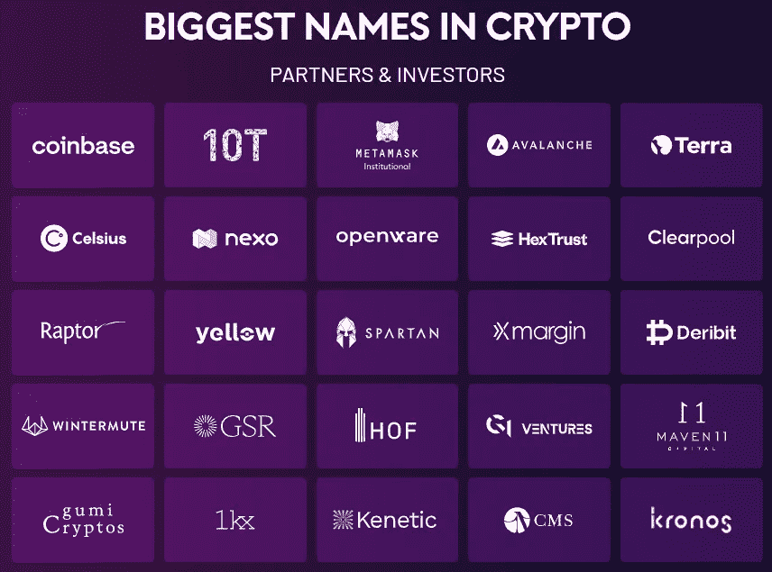**

****4。硬币事实+路线图****

**价格:2.64 美元**

**市值:125，213.729 美元**

**完全稀释后的市值:5.273 美元**

**循环供应量:47.485.856**

**最大供应量:2.000.000.000**

**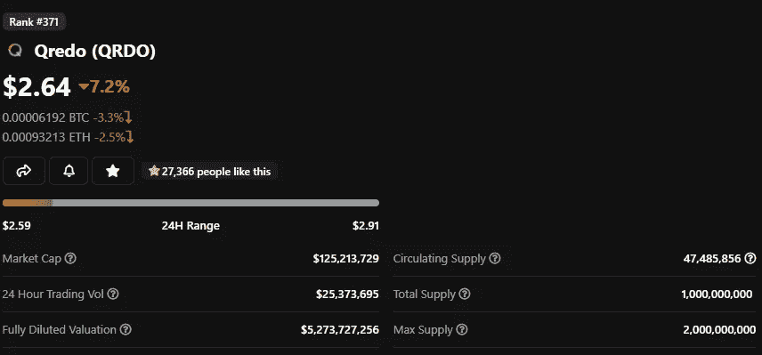**

****4.1 硬币事实、指标和未来排放****

**Tokenomics 是一个让很多人逃离 Qredo 的话题，所以我决定在这里多花一点时间。当人们第一眼意识到 Qredo max 的供应量是 2b 的代币时，他们会感到害怕，但让我们更好地理解这一点，好吗？！**

**首先，令牌文件将 QRDO 描述为 Qredo 网络的公用设施和治理令牌。他们设计了一个“以用户为中心”的激励结构，在经济上倾向于所有网络参与者，以建立网络效应并推动采用。因此，设计考虑了每个参与者所需的激励措施。包括验证者、流动性提供者、交易者和托管用户。**

**如前所述，令牌的总数是 2b，但是它们使用了两个独立的解锁系统。**第一个，**1b 代币分配预留给 Qredo 有限公司的投资者；包括贡献者、团队、资金管理的初始基金、帮助初始引导初始验证者的基金以及引导生态系统的基金，如上图所示。这 10 亿美元中还包括一部分(10%)将在私人投资者和公众之间出售。就我个人而言，我希望看到更多的代币分配给公众销售，只有 4%看起来太少了。**

**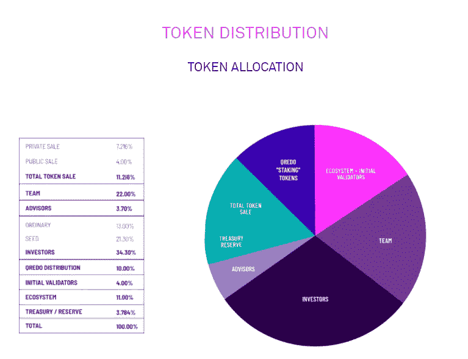**

**这些代币按照下面的发行时间表授予，TGE 日期是 2021 年 7 月 14 日。因此，代币的首次发行发生在 2021 年 9 月 14 日，来自公开销售选项 1。**注:Qredo 每周发布一次。**“第一次重大影响”发生在 2022 年 1 月 14 日，当时开始释放私人投资者和公开出售选项 2 和私人出售。“下一个更大的”将于 2022 年 7 月 14 日发生，届时将开始向团队、投资者和储备发放代币，代币数量将开始大幅增加，在年底前超过+2 亿代币。**

**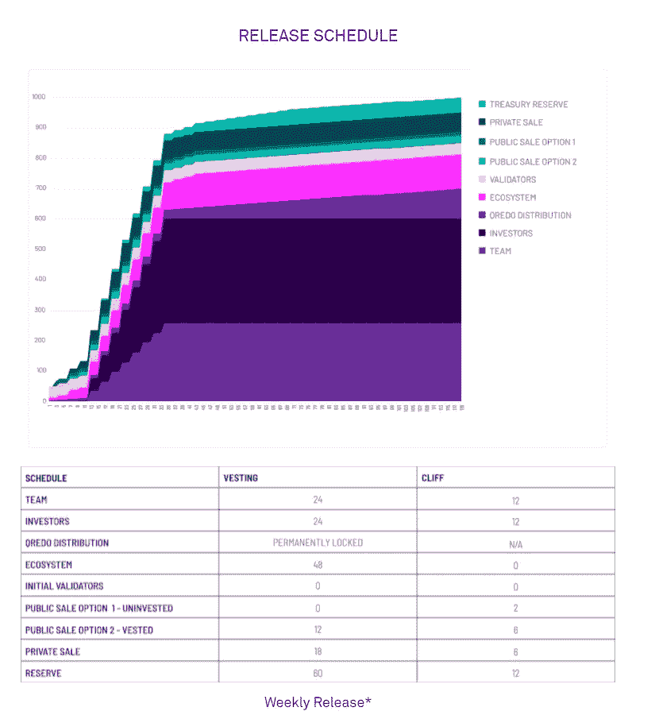**

****在第二个**中，当该协议的 v 2.0 版本上线时，另外 10 亿个令牌将留给**，并将作为费用回扣和通货膨胀奖励的组合分发给网络上的演员，**预计在 50 年内将浮动从 10 亿增加到 20 亿。******

**为了更好地解释，让我解释一下 Qredo 网络上的六种用户类型:**

*   **做市商:在 Qredo 网络上使用第三层，不断向交易者用户提供报价(包括买入报价和卖出报价)的公司。该用户将被要求向做市商库存钱包**中存入最低美元价值的数字资产，并在做市商下注钱包**中下注最低数量的 QRDO 代币(代币的适当数量将由协议使用从起源块到当前块测量的经济活动指标作为输入来确定)。**
*   **验证器:Qredo 验证器轮流对下一个块中包含的事务进行验证、提议和投票。块以链的形式提交，每个高度一个块。验证器检查事务以验证它们的合法性，这是提议将事务包含在下一个块中的过程的一部分。协议直接补偿验证者；当交易者用户与做市商或另一交易者用户交易时，从交易者用户的本金中提取 0.5 个基点的小额费用。**验证者需要将获得的 QRDO 令牌存入一个特殊的验证者赌注钱包，以便参与协议**(所需令牌的数量考虑了基于网络的存款，并计算验证者的存款金额，以便激励验证者高度可用，并使恶意行为在经济上不可行)；**
*   **交易者用户:**使用 Qredo 第 2 层协议在自己和交易对手之间自动交换数字资产的个人或公司。**该交易对手可以是做市商，也可以是已知交易对手。在这两种情况下，用户使用 Qredo 的第 3 层加密、分散的通信网络向做市商发出 RFQ(询价),或者进行私下的交易前协商，最终使用 Qredo 的第 2 层协议进行数字资产的原子交换。**
*   **保管用户:使用 Qredo 的第 2 层协议来安全保管数字资产的个人或公司。注意，托管用户也可以是交易者用户，但是交易者用户必须首先是托管用户才能成为交易者用户。**
*   **流动性提供者:向 Qredo 的贷款池添加流动性的流动性提供者，在其他交易者用户从这些池中取出贷款并进行短期跨链交易时，会获得费用奖励。**
*   **借款人: **Qredo v 2.0 协议将使**贷款池的创建能够方便地获得高杠杆贸易信贷，适用于快速贷款或高产农业。对于流动性提供商来说，它们将类似于短期货币市场基金，其功能主要是以高杠杆比率(8 倍至 10 倍)向 Qredo 网络上的借款人短期贷款数字资产。创建贷款池的目的是从向借款人收取的费用中获得高收益，这些借款人贷款用于短期交易或高产农业。**由于预期的高收益和获得贸易信贷的便利性，流动性提供者和贷款借款人不参与快速发展机构奖励计划。**贷款池是单边池，拥有自己的第 1 层外向钱包，通过验证器代理模块中的功能以编程方式与 dApps 交互。与外部区块链互动的交易商的所有买入/卖出订单都是使用由验证器的经纪人模块指导的贷款池钱包执行的，因此交易对手剩余风险是订单接受和第 1 层区块链(ETH，BTC 等)的数字资产交付效力。)，使抵押品管理具有足够的可扩展性，可以提供杠杆贷款。Qredo 的开发人员将不断调整和更新代理模块，以处理复杂的交易和条件。**

**现在，让我们深入研究他们所谓的以用户为中心的令牌模型，以用户为中心的模型是一种激励结构，主要在经济上有利于协议的用户，以不惩罚做市商或验证者的方式推动用户采用，但旨在为做市商和验证者提供更高的经济价值。**

**许多人难以理解 Qredo 上的令牌组学的原因是，他们认为 Qredo 使用传统的第 1 层模型，其中验证器/挖掘实体直接获得协议创建的所有新令牌。但在现实中，Qredo 协议确保了从膨胀奖励系统得到的新令牌以一种共生关系中对用户和验证者都有益的方式流向协议用户。做市商也因提供报价和完成订单而得到协议的补偿。怎么会？**

*   **网络上的验证者将因为他们的工作而获得最高的经济回报，确保在协议的治理中有更高的参与权，使验证者能够获得长期的经济价值。**
*   **做市商将有来自不断增长的用户群的不断增长的需求，以提供流动性，并且将在从卖方购买数字资产之后和出售给买方之前，有效地补偿经历数字资产价值下降的风险。**

**推动用户和做市商参与的激励措施是推动 Qredo 网络实现更多价值的关键，这些价值以数字资产存款和 Qredo 网络上更多交易的形式存在。**

****4.1.1 酬金奖励****

**Qredo 协议将托管用户存储的一小部分资产作为托管费，将交易用户交易的一小部分(0.5 个基点)资产作为交易费。**

**这些收取的费用实际上是网络中交易或托管的“硬”第 1 层资产。**然后，Qredo 协议充当用户，并向网络上的每个做市商发出自己的询价，以将这些第 1 层资产交换成 QRDO 令牌，作为从协议收入中获得的报酬进行分配，主要分配给网络上的验证者，其次分配给由 DAO 控制的财资管理钱包。**QR edo 网络上主要有三种交易类型:**

*   **1 — **已知交易对手交易:**彼此认识的两个交易者用户之间的第 1 层数字资产的原子交换**，这意味着对等交易。该费用适用于交易中的交易者和用户，按 0.5 个基点计算，交易费用作为第 1 层资产由协议收取，从用户交易的本金中扣除。验证器份额也作为第 1 层资产收集，并汇至由协议控制的特殊验证器钱包，而财资管理钱包接收相同的信息。****
*   **2 — **用户&做市商交易**:第 1 层数字资产的原子交换(例如:交易者用户和做市商之间的 BTC(ETH)**。**做市商完全不收费，只有交易者用户、验证者和库藏股遵循前面提到的相同系统。**
*   **3 — **托管费交易**:托管用户按 AUM 模式收费，每月末根据当月网络存款按协议收取。目前，Qredo 每月收取 0.75 个基点的费用，Validator 和 Treasury 的份额遵循前面提到的相同系统。**

**在收集了所有费用之后，并且当协议确定验证器钱包和资金管理钱包包含足够“硬”的第 1 层数字资产(在一定时期内被收集为交易费用或托管费用)时，协议本身向所有可用的做市商发送一个 RFQ 信号(RFQ 系统上的交易者用户使用的正常功能)**，以便将所有收集的第 1 层资产交换为 QRDO 令牌。****

**分散的 RFQ 机器人就像交易者用户一样响应协议，提供购买每个第 1 层资产的最佳价格，以交换每个做市商提供的 QRDO 令牌。分散的 RFQ bot 然后完成与每个做市商的交易，以出售这些累积的第 1 层资产来换取 QRDO 令牌。**

**然后，这些购买的 QRDO 代币被分配给验证者和财资管理钱包，代替通过计算收集的“硬”第 1 层资产，该计算使用第三方与验证者的按比例百分比的 Qrdo 代币和验证者自己与总浮动的比例。这些分发的 QRDO 令牌一旦被验证者接收，就是验证者的财产，没有锁定期。**每个做市商的责任是在库存中拥有足够的 QRDO 代币，以便能够通过 RFQ 履行协议下的 QRDO 代币订单。**下图显示了奖励金额和奖励类型。**

**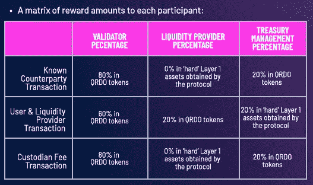**

**在交易者用户&做市商交易中，当做市商作为交易者用户交换第一层资产时，向协议的 RFQ 发出中标报价的做市商将获得协议**收集的第一层数字资产的 20%。****

**此外，**网络上的每个做市商有能力添加他们自己的提升费、佣金或其他交易费用，这些费用应该是对 RFQ 的响应报价的一部分。**报价中的这个字段被称为“ **Relayer** ”(还记得 Qredo architecture 图片上的那个未解释的小点)字段。这为做市商提供了发展额外服务的独特机会，例如:向可能拥有完成交易的数字资产但居住在中央交易所的交易者用户提供类似经纪业务的信贷。**

****注意:**还记得我们谈到借款人时，有第四种类型的交易，交易者获得杠杆短期贷款或超额抵押的长期贷款，将贷款利息偿还给贷款池，然后贷款池中的 90%分配给流动性提供者，5%分配给验证者，5%分配给资金管理职能部门。**但是，该交易类型不在基于费用的奖励计划和代币膨胀奖励计划的范围内。**流动性提供者在其向贷款池提供的第一层资产中获得回报。**

****4.1.2 收入奖励****

**Qredo 网络中的四个主要生态系统参与者群体是交易者用户、托管用户、做市商和验证者。交易者用户和托管用户，Qredo 团队为他们每个人实施了不同的奖励方案分配(**注:流动性提供者和借款者不参与奖励分配**):**

*   **对于交易者用户:**基于支付费用的%份额。**为了激励平台上的交易活动，交易者将获得代币**，作为他们支付费用的一种返现形式**(首先以美元计价，然后兑换成 QRDO)。他们可能会被全额退款或部分退款，这将取决于每块分配的 Qredo 数量、交易者数量和退款费用。如果交易者获得了全额退款，并且仍然剩余一些 QRDO 剩余产品，这些产品将被发送给托管用户，因此即使没有波动性和机会以及交易机会，用户也会受到激励，将他们的数字资产保留在平台上。**
*   **对于托管用户:**基于占管理总资产的百分比。****固定数量的代币分配给网络上持有的所有资产，与它们持有的美元价值成比例。这使得 Qreto 能够提供传统的流动性挖掘机会，用户能够从 token 的通胀机制中受益，同时面向交易激励。****
*   ****对于做市商:**基于交易量的%份额。**记住，做市商不支付交易费用，因此他们在大宗奖励中的份额是基于他们在所有有限合伙人产生的总交易量中的份额。或者，我们可以根据他们收取的费用来计算他们在排放量中的份额。****
*   ****对于验证者:**基于总赌注的百分比份额&委托代币。**验证者的收入分配模式与做市商相同，唯一的区别是他们在整体奖励中的份额是根据他们持有的 QRDO 令牌总数(自有和委托)的比例计算的。****

****这四个流之间的具体奖金分配取决于 Qredo 团队的决定，并可根据持续需求进行调整。今后，DAO 将每两周/每两个月投票一次来调整该数字。《出埃及记》:如果没有足够的流动性(高利差)，DAO 应投票优化面向需求方的代币发行；或者，DAO 可能会投票支持将更多排放量分配给做市商(做市商)；或者，如果没有足够的存款基础和交易活动，更多的排放将流向交易用户和托管用户。DAO 将根据协议仪表板上显示的网络数据管理该分发，Qredo DAO 管理团队提供的数据增强了该网络数据。****

******4.2 私人和公开销售******

****QREDO public sale 有两种价格选择:0.50 美元的 30.000.000 代币，锁定 2 个月，2021 年 9 月 8 日完全解锁；0.225 美元的 10.000.000 代币，锁定 6 个月，每周线性发布 12 个月。****

****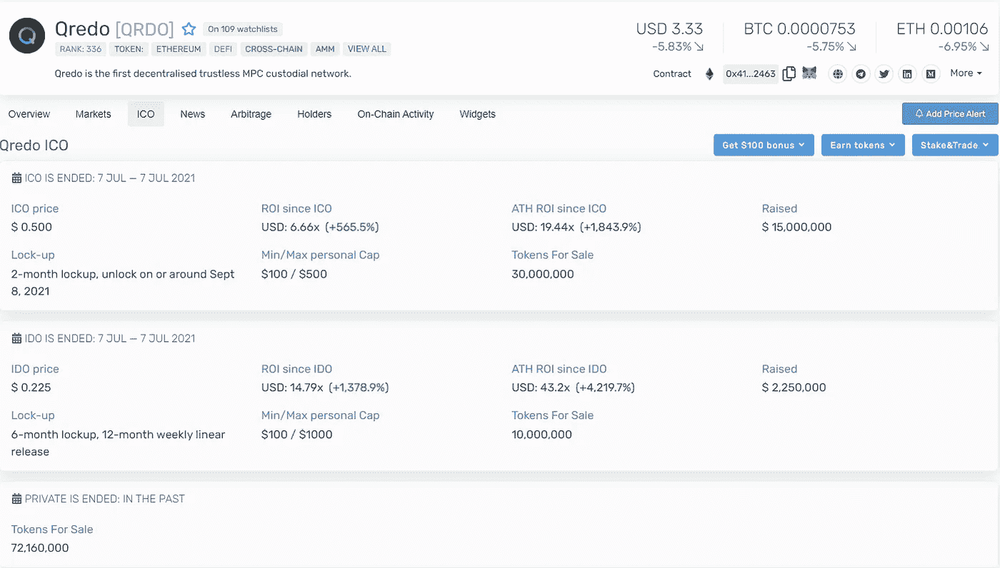****

****Source: cryptorank.io****

****Qredo 早期[的战略投资者在 2021 年 5 月份超额认购了 1100 万美元的种子轮](https://www.qredo.com/blog/seed-funding-round?hsLang=en)，包括:Celsius、Deribit、Wintermute、GSR、CMS Holdings、克罗诺斯研究公司和 3commas，**但没有出售代币数量和价格的信息。******

****此外，Qredo 进行了一次私人出售，投资者包括:Nexo、比特币基地、Figment 和 Ledger Prime。这次拍卖筹集了超过 1600 万美元，但我没有找到正确的数字，也没有找到多少代币，价格是多少。Cryptorank.io 提到了来自私人销售的 72，160，000 英镑，将这一信息与 1，600 万美元配对，导致每枚令牌的成本接近 0，2217 美元，非常接近公开销售选项 2，**这可能是一件好事，但我无法证实这一点！******

******4.3 路线图**(2022 年 3 月 17 日更新)****

****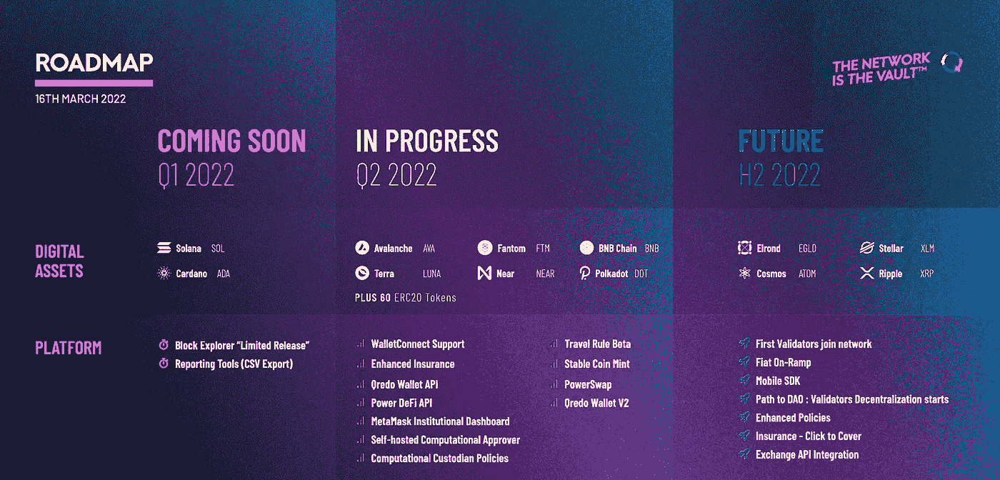****

****Q1:****

*   ****新的区块链集成:Solana，Cardano****
*   ****Block Explorer **(有限发布)**:直接查看 Qredochain，跟踪交易、余额等的状态。**最初，Block Explorer 仅适用于经批准的客户端。******
*   ****报告工具(CSV 导出):立即将不可变的记录(包括政策变更、交易和余额)直接从 Qredo Wallet 导出到电子表格中，用于报告和会计目的。****

****Q2:****

*   ****新的区块链集成:Polkadot、BNB 链、雪崩、Fantom、Terra、Near (+60 ERC20 代币)****
*   ****计算托管政策:计算政策引擎**的引入将通过简化交易工作流程和实现精细的治理控制来增强我们的托管服务。**为了最大限度地减少交易延迟，升级将引入条件路由。这使得交易能够根据预先确定的因素(如交易规模或类型)进行，并且可以为单个团队成员量身定制。此外，升级将引入可信交易对手和协议的白名单，并进一步细化权限级别，以反映大型机构的前台、中层和后台角色。****
*   ****自托管计算批准者:通过运行您自己的计算批准者服务器，自动签署和批准交易。****
*   ****Power DeFi API:以编程方式访问 DeFi 协议，以实现自动化快速交易、多点收益农业或简单的借贷和赌注——所有这些都由 dMPC 安全性和完全可定制的治理提供支持。****
*   ****MetaMask 机构仪表板:直接从 Qredo-MMI 钱包查看交易历史和余额。****
*   ****旅行规则解决方案 **(Beta)** : Qredo 的旅行规则解决方案使所有数字资产公司(或虚拟资产服务提供商)能够轻松遵守新兴法规。它现在正与 crypto 领域的一些知名公司合作开发。****
*   ****Stablecoin Mint: **通过令牌化即服务铸造你自己的 stable coin**。Qredo 将提供完整的端到端流程—从智能合同开发到部署—所有这些都由分散式 MPC 的治理和安全性提供支持。****
*   ****PowerSwap:即时原子互换 BTC、ETH、QRDO 和 stablecoin 交易对——流动性有保证。**这将是流动性中心的第一个功能块。******
*   ****Qredo Wallet V2:我们全面的钱包改革将在一个简化、直观、易于使用的包中为每个人带来机构级功能。****
*   ****WalletConnect 集成:直接从您的 Qredo 钱包的安全性和治理中，直接连接到 DeFi 交易、借贷和赌注策略。****
*   ****Qredo Wallet API:通过读/写访问 API 以编程方式获得 Qredo Web 应用程序的所有功能。****
*   ****增强的硬币保险:通过有史以来第一个用于多方计算(MPC)的硬币保险，为使用 Qredo 保护的资产提供保险。****

****H2 2022:****

*   ****新的区块链集成:埃尔隆德，恒星，宇宙，涟漪****
*   ****Fiat Onramp:通过银行集成，从 Qredo 钱包中交易 fiat-to-crypto。****
*   ****验证者去中心化和 DAO 之路:genesis 验证者的招募将标志着 Qredo 去中心化和 DAO 治理之路的下一个阶段。****
*   ****Mobile SDk:我们的软件开发工具包将使开发者更容易在 Qredo 上构建。****
*   ****增强的策略:为不同的交易类型设置特定的自定义策略。例如，对于超过 5 万美元的转让，需要 2/3 的批准，对于转让****
*   ****Click-to-Cover Insurance: Take out market-leading insurance coverage from directly within the Qredo App.****
*   ****Exchange API Integration: View balances from exchanges in the Qredo Web App for full visibility over assets.****

****IMO — the deployment of the protocol v 2.0 and the more tokens implementation is vital to Qredo growth because it’s on the protocol v 2.0 where the majority of the advantages of Qredo will be seen. I hope they deliver these features soon.****

******5。新闻和重要事实— IMO******

****[**5.1 Qredo，开放银行项目，API3 & Sovryn 与 Banco Hipotecario 结盟，推动萨尔瓦多的比特币化**](https://www.qredo.com/blog/elsalvador-bitcoin-alliance)****

****“Banco Hipotecario 、[te sobe](https://www.tesobe.com/)——[开放银行项目](https://www.openbankproject.com/)、 [API3](https://api3.org/) 、Qredo 和 [Sovryn](https://www.sovryn.app/) 之间的新联盟将推出下一代区块链应用，提供开放银行解决方案，为萨尔瓦多所有人提供金融包容性……区块链领域的领导者将共同利用他们的资源和知识，促进比特币顺利成为法定货币，确保公民从数字银行和国家基础设施中受益****

****“**联盟选择了 Qredo 的分散保管基础设施来支持萨尔瓦多的比特币银行解决方案。**与此同时，比特币原生分散交易和借贷平台 Sovryn 将提供基础设施，使传统银行能够向客户提供比特币原生的 DeFi 产品，如借贷、交易和比特币支持的稳定账户。”****

****[**5.2 Qredo 向与新 MMI 合作的机构开放 DeFi**](https://www.qredo.com/blog/qredo-metamask-institutional-defi-partnership)****

****“此次合作建立在 Qredo 最近一系列成功整合的基础上，并且**将允许使用 MetaMask Institutional 的组织利用 Qredo 先进的托管基础设施。**Qredo 和 MMI 共同为各类机构加密投资者——从小型加密基金、公司财务人员到价值数十亿美元的对冲基金— **提供从安全的分散保管在整个 DeFi 生态系统中部署数字资产的能力。******

****拥有 1000 万月活跃用户的 MetaMask 是必不可少的 DeFi 钱包，使用 MetaMask Institutional 的**组织现在可以访问 Qredo 的分散多方计算(MPC)托管技术堆栈。”******

****[**5.3 Qredo 宣布获得 8000 万美元的首轮融资，由 10T Holdings 领投，比特币基地风险投资公司、Avalanche 和 Terra**](https://www.qredo.com/blog/qredo-series-a-raise) 提供战略投资****

****“Qredo 的 8000 万美元首轮融资由投资者 Dan Tapiero、Stan Miroshnik 和 Michael Dubilier 管理的加密投资公司 [10T Holdings](https://10tfund.com/) 牵头。这轮投资包括一批多元化的战略投资者[比特币基地风险投资](https://www.coinbase.com/ventures)、[雪崩](https://www.avalabs.org/)和 [Terra](https://www.terra.money/) ，以及顶级金融投资者 [Kingsway Capital](https://www.kingswaycap.com/) 、 [HOF Capital](https://www.hofvc.com/) 、 [Raptor Group](https://www.raptorgroup.com/) 和[GoldenTree Asset Management](https://www.goldentree.com/)。首轮融资使 Qredo 的估值达到 4.6 亿美元。****

******注:A 轮是在 Qredo 有限公司，仅用于股权，**不在 Qredo 网络代币。在下图中你可以看到“两个 Qredo”。****

****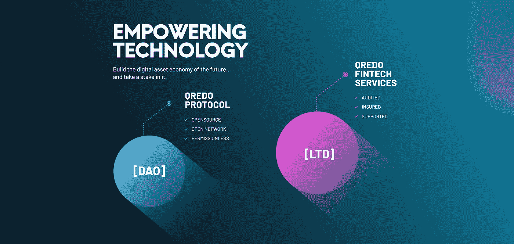****

****[**5.4 Qredo 实现 SOC2 Type 1 合规**](https://www.qredo.com/press/soc2-type-1-compliance?utm_source=twitter&utm_medium=organic&utm_campaign_type=corporate&utm_campaign=220317_soc2&utm_content=press_release&utm_content_type=text) (新 17/03/2022)****

****“由 [Insight Assurance](https://insightassurance.com/) 进行的审计证实，Qredo 的信息安全实践、政策和程序在整个业务中遵守 SOC2 Type 1，肯定了该公司作为实施行业领先安全标准的值得信赖的服务提供商的地位。”****

****6。结论****

****是的，我没有涵盖 Qredo 协议的每一个方面，但是在我看来，这篇文章能够重新整合网络的一些最重要的额外功能，而不会非常复杂，甚至更长。****

****Qredo 在竞争中具有巨大的优势，他们为机构或普通用户面临的各种问题创造了几个独特的解决方案，当加入 DeFi 时，他们肯定会有一个光明的未来，但这并不总是反映在价格上。****

****我认为，对 qredo 来说，令牌经济学在短期内可能是一个问题，是的，但让我解释一下为什么，今年 Qredo 几乎会在流通供应方面取得 x5，在市场不确定的一年里(尽管有 moonboys，我们可以走得更低)，对我来说，Qredo Network 只有在 mainnet v 2.0 的发布后才能实现他的全部潜力。 这是 Qredo 技术真正从传统保管解决方案中脱颖而出的时候，直到我不认为 Qredo 特定令牌组学系统能够胜过解锁系统。 但是从长远来看，如果 Qredo 团队提供了所有的功能(我确信他们会的)，以用户为中心的模型，良好的市场条件和巨大的采用(对协议至关重要)，你可以期待 Qredo 上一个真正出色的价格标签，即使 2b 令牌完全释放(这只会在 v 2.0 发布后的未来 25 年内发生)。****

****从整体市场状况、宏观经济形势、未来解锁以及该项目尚未实现最终形式这一事实来判断，我将非常高兴以更低的价格装满我的 Qredo 袋子。哪些价格？我很乐意将我的行李价格提高到 0.50 美元以下；理想情况下，如果它接近 0.225 将是一个很好的机会，我认为。你应该经常评估你的应收账款和 DYOR。****

****赞美诗:试想一个世界，网络的每一个参与者都是硬币的真正主人；在那里你可以看到无托管的交易所；执行原子互换，而没有在 DeFi 上可能面临的交易风险；没有主要的不安全感；一个分散的地方，同时完全可审计和合规；恶意代理人或头脑中带有独裁的政府代理人无法关闭网络；和更多的额外津贴，这是 Qredo 如何设想他们的协议。****