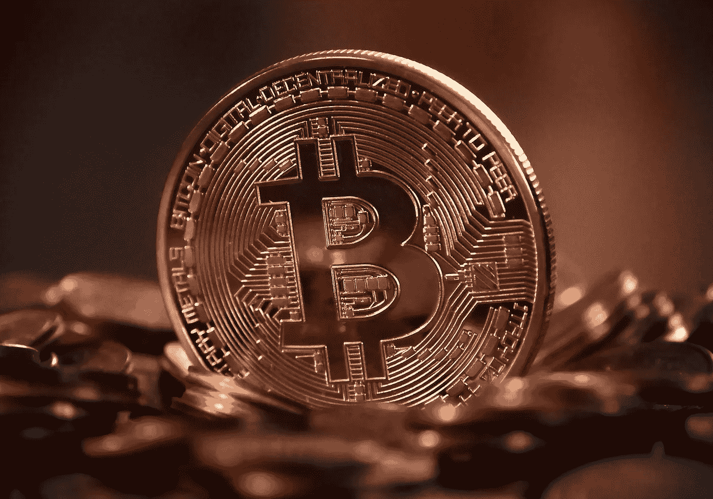

# 基础研究:通货膨胀和通货紧缩的资产

> 原文：<https://medium.com/coinmonks/fundamental-research-inflationary-and-deflationary-assets-20e57b181890?source=collection_archive---------49----------------------->

如果你想定期做出可靠的加密投资选择，你需要投入大量的时间和精力进行研究，基础研究是任何投资的顶峰。
说到密码，令牌组学经常被提及。这只是一种描述特定代币经济性的奇特方式。
一个项目的令牌组学通常可以在项目的网站或白皮书上找到。
首先要研究的是加密货币是通货膨胀还是通货紧缩。
“通货膨胀”一词仅仅是指硬币将继续被生产的事实。如果没有其他人购买，通货膨胀资产往往会随着时间的推移而贬值。除非有令人信服的刺激继续购买，否则价格会下降。例如，美元是通货膨胀的；他们不断发行更多的美钞，每年美钞都会贬值，这意味着买同样的东西要花更多的美元。例如，在它的开发者之一杰克逊·帕尔默于 2014 年 2 月取消了 1000 亿 DOGE 的硬性规定后，Dogecoin 现在有了无限的供应。因此，供给增长可能超过需求增长，从而随着时间的推移降低每只狗的价值。与此相反的是通货紧缩，这仅仅意味着硬币将开始在供给上贬值。假设没有其他市场变化，通货紧缩资产的价格通常会上涨，因为随着时间的推移，可购买的代币会减少。如果需求保持不变，价格就会上涨。
通货紧缩硬币的一个例子是币安硬币(BNB)。每个季度，币安加密货币交易所都会烧毁或摧毁 BNB，以减少代币的供应量，直到达到 1 亿 BNB。一些代币混合了通货膨胀和通货紧缩的因素。例如，比特币目前正在膨胀，因为矿工仍在制造更多的硬币。比特币协议以固定的比率减少新比特币的发行，在所有 2100 万个比特币被开采后，没有人可以再铸造任何比特币，因此比特币将不再具有通胀性。
这两点绝不是详尽无遗的，因为关于加密项目还有很多要做的研究，但是现在让我们就此打住。