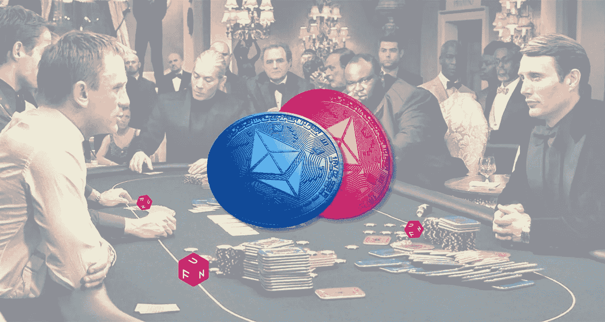

# FunFair (FUN):一个基于区块链的赌场平台

> 原文：<https://medium.com/coinmonks/funfair-fun-a-blockchain-based-casino-platform-a5e535203cf5?source=collection_archive---------12----------------------->

FunFair (FUN)加密令牌是一种专门为在线游戏和博彩业开发的资产。FunFair(有趣)加密令牌还结合了 [**以太坊区块链**](https://procommun.com/2021/10/technology/what-is-ethereum-and-how-is-it-different-from-bitcoin/) 的品质和尖端的技术堆栈，使 FunFair 加密令牌成为不同玩家、平台以及开发者等的强大而有价值的资源。

由于以下特性，它还支持数字游戏的新时代:

*   **FAST** 通过游戏内交易和快速钱包对钱包交易，最大限度地延长您的游戏时间。
*   透明的:在这里，交易是公开记录的，分散的，可跟踪的。
*   **无缝**:fun fair 加密令牌是一个 ERC20 令牌。此外，以太坊区块链使整个过程更容易和更快。
*   **开放**:这里的每个人，比如赌场、玩家和开发者，都可以利用 FunFair (FUN)加密令牌的力量。
*   **安全**:游乐场加密令牌的所有权是匿名的。现有的产品开发和扩展积极鼓励不同的游戏运营商利用 FunFair 加密令牌生态系统和玩家基础，增加令牌的使用。

目前的产品开发还包括一个新的赌场和其他使用 FunFair (FUN)加密令牌的游戏机会，该令牌旨在为最终用户提供简单明了的服务。

在加密货币的未来，FunFair Crypto token 打算推出一种比以太坊更便宜、性能更好的新票证。此令牌只能通过 1:1 [**桥接机制**](https://procommun.com/2022/05/news/crypto/is-there-a-protected-foreseeable-future-for-cross-chain-bridges/) 与 FunFair (FUN)加密令牌一起使用。用户将不得不托管令牌以获得新的令牌，从而减少交易供应并最终增加需求。链上点对点游戏，包括新令牌上的体育博彩、扑克和赌场，将实现无摩擦和快速操作。此外，FunFair 加密代币的战略刻录时间表确保了 Fun 代币在未来保持其价值。

# 是什么让 Funfair (FUN)加密令牌独一无二？

FunFair 加密令牌试图彻底改变一个蓬勃发展的行业。据该公司称，在线游戏领域很受欢迎，但随着这种区块链技术引入基本面，越来越多的人必将进入这一领域。此外，在区块链建立一个这样的游戏网站将允许向该平台引入各种加密资产，因此，使资金选择多样化。FunFair 加密令牌可以毫不费力地投资在线赌场和游戏中的加密资产。FunFair 加密令牌也是基于以太坊的，这意味着该平台是可扩展的，也可以整合分散的应用程序。这在传统游戏网站上是不可能的。

# Funfair 加密网络是如何保护的？

作为一种基于以太坊的 ERC 20 令牌，FunFair (FUN)加密令牌在 POS(赌注证明)共识方法下运行。这种发布方法是作为比特币 power(工作证明)共识的替代方案而创建的。虽然 POW 需要特定数量的处理能力来挖掘令牌，但是 POS 基于已经获得的令牌来分配挖掘能力。此外，许多分析师指出，利害关系证明是一种容易扩展的共识方法，允许在使用案例中有更大的灵活性。因此，这是近年来越来越流行的共识方法。

# 有多少好玩的代币在流通？

游乐场(娱乐)加密代币是预先铸造的，没有进一步的发行。在 2017 年 6 月 22 日的官方 FUN 预售中，创造了 170 亿个 FunFair (FUN)加密令牌的最大供应量。此外，在预售活动期间，超过 80%的 FunFair (FUN)加密令牌被分发给工业买家和投资者。这种铸造的 FunFair (FUN)加密令牌的 11.173B 被保留用于第二次预售，后来从整个过程中移除。超过一半的保留的游乐场加密代币，大约 55%，被烧毁，因为它们被归类为剩余。剩余的 47 亿代币被转移到一个冷藏钱包中，并被保护起来，以便将来出售给机构或大型代币购买者。

> 原载于

> **加入 Coinmonks [电报频道](https://t.me/coincodecap)和 [Youtube 频道](https://www.youtube.com/c/coinmonks/videos)了解加密交易和投资**

# **另外，阅读**

*   **[Bookmap 点评](https://coincodecap.com/bookmap-review-2021-best-trading-software) | [美国 5 大最佳加密交易所](https://coincodecap.com/crypto-exchange-usa)**
*   **[密码交易机器人](/coinmonks/crypto-trading-bot-c2ffce8acb2a) | [造币评论](https://coincodecap.com/coingate-review)**
*   **最佳加密[硬件钱包](/coinmonks/hardware-wallets-dfa1211730c6) | [Bitbns 评论](/coinmonks/bitbns-review-38256a07e161)**
*   **[新加坡十大最佳加密交易所](https://coincodecap.com/crypto-exchange-in-singapore) | [购买 AXS](https://coincodecap.com/buy-axs-token)**
*   **[红狗赌场评论](https://coincodecap.com/red-dog-casino-review) | [Swyftx 评论](https://coincodecap.com/swyftx-review)**
*   **[投资印度的最佳密码](https://coincodecap.com/best-crypto-to-invest-in-india-in-2021)|[WazirX P2P](https://coincodecap.com/wazirx-p2p)|[Hi Dollar Review](https://coincodecap.com/hi-dollar-review)**