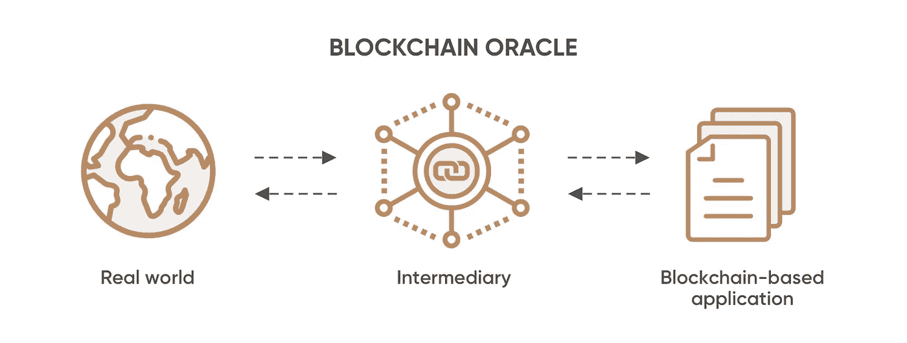

# 比特币区块链的进一步应用

> 原文：<https://medium.com/coinmonks/further-applications-in-the-bitcoin-blockchain-666d34381a26?source=collection_archive---------54----------------------->

比特币区块链提供了一个支持许多非货币应用的基础设施。我们想让读者熟悉一些核心概念，这些概念突出了公共区块链的优势，并展示了如何以一种与行业无关的方式使用它们。

*   **分散核查和证明**

比特币区块链可以被视为一个以分散方式管理的公共插接板。它可以用来保护任何信息。与普通插接板不同，信息不能随后被删除或更改。信息被添加到区块链的时间与作者的信息和笔名一起被记录。

*   **存在**

所谓的存在证明证明文件在特定时间点存在。该文件不必公开。为了证明存在，计算其散列值并将其包含在事务中就足够了。最终，事务在块中得到确认，从而链接到特定的时间点。该文件不必公开。为了证明存在，计算其散列值并将其包含在事务中就足够了。最终，事务在块中得到确认，从而链接到特定的时间点。

加密散列函数使得生成具有特定散列值的文档在计算上不可行。这意味着匹配的哈希值足以证明文档在其哈希值被记录在区块链中时存在。虽然存在证明不能提供类似于专利的法律保护，但它有许多令人兴奋的应用领域。

*   **诚信**

另一个可能的应用是保护一些数据的完整性。例如，如果有人希望确保合同的内容不会被更改，他们可以将合同的散列值嵌入到区块链中。对合同的每次更改都将不可避免地触发其哈希值的更改，因此它不再对应于记录在区块链中的哈希值。因此，任何操纵都会立即显现出来。这种保护数据的方法可以集成到业务流程中。

*   **真实性**

如果可以将公钥与公司、组织或个人相关联，那么也可以验证文档的真实性。如果一个组织签署了一个文档的散列，则可以合理地假定该文档也是由该组织发布或签署的。

*   **脚本语言**

比特币区块链只允许本地比特币单位的交易。然而，由于比特币网络的脚本语言允许将附加信息与交易联系在一起，因此支付承诺可以附在比特币单位的片段上。比特币碎片仅作为一种包装，允许支付承诺通过比特币网络进行交易。

这样一个比特币碎片的经济价值来源于附带的支付承诺。当然，这种承诺会受到发行方风险的影响。如果发出承诺的一方不能或不愿履行承诺，承诺就没有价值。比特币区块链无法执行这样的外部承诺；它只能跟踪谁拥有比特币碎片。

*   **彩色硬币**

彩色硬币是一种加密货币，通常是比特币，通过用元数据标记它来改变用途。彩色硬币通常被称为元硬币。可以创建彩色硬币来重新利用比特币或替代比特币(比特币的替代品)，以创建代表其他有价值事物的数字资产。

*   **智能物业**

智能财产是一种外部的、非本地的承诺，附在比特币碎片上或作为代币发行，可以通过区块链交易。然而，智能财产这一术语仅限于实物，即动产和不动产。智能属性将物理对象的使用绑定到加密签名。该物理对象向想要使用它的人发送一个密码质询，并且只有当该人能够解决该质询时才准许访问。

这种对象的典型例子是智能汽车。汽车的门将会打开，并且它的引擎将会为能够证明私有密钥所有权的人而启动，该私有密钥属于当前控制代表该资产的特定令牌的地址。

*   **抵押贷款**

加密货币支持贷款使用数字货币作为抵押品，类似于基于证券的贷款。基本原理就像抵押贷款或汽车贷款。您抵押您的加密资产来获得贷款，并在一段时间内还清。

*   **神谕**

区块链可以轻松处理本地数据。然而，如果合同包含依赖于外部数据的条件，事情会变得更加复杂。外部数据的例子包括体育比赛结果、股票市场价格或气象观测。这些数据点显然无法在链上观察到，需要所谓的 oracles，oracles 是提供数据的可信接口。

虽然提供这种类型的数据可以实现许多令人兴奋的应用程序，如赌博或保险合同，但执行取决于神谕。因此，很难说它是分散的。

使用 oracles 的契约可以用不同的方式实现。例如，合同双方可以将合同中规定的价值单位转移到 oracle 的地址，并记录必须满足的确切条件，以便释放交易。这种 oracle 的组织结构实际上是一个控制资产和合同执行的中央集权机构。在这种情况下，甲骨文有权单方面决定合同的结果，但也对资产有控制权。

**结论**

比特币区块链提供了一个支持许多非货币应用的基础设施。我们让读者熟悉了一些核心概念，这些概念突出了公共区块链的优势，并展示了如何以一种与行业无关的方式使用它们。

> 加入 Coinmonks [电报频道](https://t.me/coincodecap)和 [Youtube 频道](https://www.youtube.com/c/coinmonks/videos)了解加密交易和投资

# 另外，阅读

*   [最佳加密交换平台](https://coincodecap.com/best-crypto-swap-platforms) | [最佳加密交易所](https://coincodecap.com/crypto-exchange)
*   [购买比特币印度](/coinmonks/buy-bitcoin-in-india-feb50ddfef94) | [Pionex 评论](/coinmonks/pionex-review-exchange-with-crypto-trading-bot-1e459d0191ea) | [加密交易机器人](/coinmonks/crypto-trading-bot-c2ffce8acb2a)
*   [n ave 零点回顾](/coinmonks/ngrave-zero-review-c465cf8307fc) | [Phemex 回顾](/coinmonks/phemex-review-4cfba0b49e28) | [PrimeXBT 回顾](/coinmonks/primexbt-review-88e0815be858)
*   最佳[区块链分析](https://bitquery.io/blog/best-blockchain-analysis-tools-and-software)工具| [赚比特币](/coinmonks/earn-bitcoin-6e8bd3c592d9)
*   [Cloudbet 赌场评论](https://coincodecap.com/cloudbet-casino-review) | [点火赌场评论](https://coincodecap.com/ignition-casino-review)
*   [加密套利](/coinmonks/crypto-arbitrage-guide-how-to-make-money-as-a-beginner-62bfe5c868f6)指南| [如何做空比特币](/coinmonks/how-to-short-bitcoin-568a2d0b4ae5)