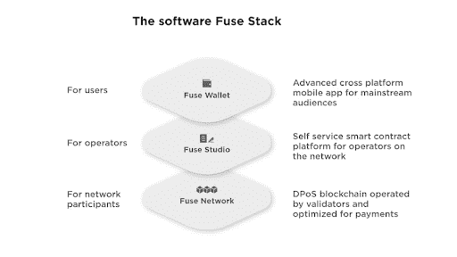

# 融合网络:促进加密应用的简单移动支付

> 原文：<https://medium.com/coinmonks/fuse-network-simple-mobile-payments-for-boosting-crypto-adoption-9b2af3062bd7?source=collection_archive---------10----------------------->

Fuse 允许来自世界各地的企业家和社区利用简化和廉价的移动支付。在定制数字令牌和钱包的支持下，Fuse 的基础设施帮助组织将其社区发展成为繁荣的微型经济体。让我们考虑一下当今移动支付的缺点，看看为什么 Fuse 解决方案可能成为这个利基的未来。

# 2022 年的移动支付

今天的移动用户面临着许多现有金融系统难以解决的问题。他们中的许多人无法获得快速廉价的支付、现代金融服务和被动收入机会。此外，全球数百万人很难获得优质的银行服务。他们常常不得不用不稳定且通胀率高的当地货币进行操作。

与此同时，非洲的手机覆盖率处于相对较好的水平:统计数据显示，使用手机上网的人比使用干净水的人多。一些加密服务已经试图利用这个市场，但是他们的解决方案对普通用户来说太复杂了。

缺乏简单的支付解决方案不仅仅是用户的问题。当任何一种企业或组织想要拥抱移动资金转移时，只有两种选择:使用收取高额费用且没有定制功能的 PayPal 或 Stripe，或者从零开始构建量身定制的解决方案(这意味着要花很多钱)。

# Fuse 提供了什么

Fuse 让企业和社区有机会构建定制的移动支付解决方案(数字代币和钱包)，并以非常低的金钱和时间成本接受 DeFi 服务。通过使用 Fuse 轻松创建移动优先的环境，组织可以将其受众从一个简单的社区转变为一个完整的微观经济体。最终用户从中受益:现在，他们终于可以利用快速廉价的移动支付(Fuse 交易的费用低于 1 美分)。

# 有没有这种社区的例子？

是的，确实有:自 2019 年以来，Fuse 一直在帮助组织实施其愿景。以下是一些例子:

*   [**GoodDollar**](https://www.gooddollar.org/) 是一个面向收益生成的 DeFi 协议，在全球范围内分发基本的数字收入。
*   [**Fuse Cash**](https://fuse.cash/) 是一种连接加密货币和法定货币的钱包:它允许在一个地方存储数字货币和传统货币，而银行账户的存款则给用户额外的 FuseDollar stablecoins，他们可以持有并赚取 5%的年利率
*   当地社区的一个例子是[**Peepl 网络**](https://itsaboutpeepl.com/)——一个总部位于英国的可持续经济项目，与有社会意识的企业合作，帮助他们整合新一代移动支付和激励系统。

# 保险丝网络由什么组成？

熔丝网络中的三个主要组件如下:

1.  **Fuse 区块链**——与以太坊虚拟机(用于在以太坊上创建去中心化应用的工具)兼容的分布式账本，以太坊是生态系统的核心元素。
2.  **Fuse Studio 和 Fuse Wallet** —一种技术堆栈，支持组织创建定制的移动优先基础设施。
3.  **DeFi 产品和工具** — stablecoins、staking platforms、rewards、Fuse Lending Network 和 FuseSwap DEX。

# Fuse 区块链

Fuse mainnet 是生态系统的核心，运行在 dPoS(授权利益相关证明)共识机制上。有两种类型的网络参与者——授权者和验证者。授权者持有 Fuse 的股份，并将其确认交易的权利授予验证者，验证者反过来通过引入 FUSE 改进建议(FIP)来确认区块并参与平台治理。

[**保险丝**](https://changenow.io/currencies/fuse-network) 是网络的原生令牌。这是用来付汽油费的，一般不到 0.01 美元。除了极低的网络费用，Fuse 拥有 5 秒的阻塞时间，区块链每秒处理 60 个交易(对于 ERC-20 资产)和 120 个基于 Fuse 的令牌。与以太坊虚拟机的兼容性使得开发人员可以轻松地在 Fuse 区块链上部署以太坊智能合约。

# Fuse 工作室

Fuse Studio 是企业用来构建令牌驱动环境的工具集合。它有三个主要组成部分:

1.  **工作室(游乐场)前端** —一个允许为社区构建自定义令牌的无代码解决方案。这是一项基本功能，可用于展示概念验证。
2.  **Studio 后端** —一个更复杂的工具，用于创建智能合同，在 Studio 服务器和 IPFS 节点上存储离线数据，以及资助社区成员。
3.  **Studio API 后端** —由 Studio dApps 用来请求 Fuse 区块链中的数据。

Fuse studio 中的另一个工具是一组**插件**，它们使更多的定制成为可能:它们可以帮助你为社区创造激励，让成员快速进行银行账户存款，等等。

# 保险丝钱包

当一个企业在 Fuse Studio 中创建一个自定义令牌并将其视为社区的骨干时，它还希望引入一个自定义钱包，用户可以在其中存储令牌。这可以通过 Fuse Wallet 代码库来实现:开发人员创建原始版本的分支，并添加自定义品牌。

Fuse wallet 是一款 iOS 和 Android 非托管 Web3 钱包——它可以在任何 EVM 兼容的区块链中使用，这可以防止 Fuse 令牌在一个网络中“孤岛化”。通过向社区引入这样的钱包，企业促进了自定义令牌的采用，因为不需要余额上有 ETH 的其他钱包。

# Fuse DeFi 产品和工具

定制钱包和令牌是基础，而 DeFi 产品扩大了 Fuse 使用案例的种类和与社区互动的方式。以下是最值得注意的几个:

*   [**FuseSwap**](https://app.fuse.fi/#/) 是一个分散的交易所，允许用户交换基于 Fuse 的资产和来自其他区块链的包装令牌。DEX 是 Uniswap V2 的分支，但利用了 Fuse 网络的高速度和低费用。
*   **FuseDollar (FUSD)** 是一种稳定的货币，有助于让不熟悉加密的用户适应:对那些只有使用法定货币经验的人来说，与美国挂钩的代币更容易理解。
*   [**Fuse Lending network**](https://app.ola.finance/networks/0x26a562B713648d7F3D1E1031DCc0860A4F3Fa340/markets)提供 WBTC、WETH、Fuse、stable 等城市的贷款和放款，如 FUSD、BUSD 和 USDC。
*   [**Fuse 奖励平台**](https://app.fuse.fi/#/farm/122) 是一个经典的流动性挖掘协议:Fuse 社区成员提供流动性，入股 LP 代币，赚取奖励。

# 熔丝令牌

FUSE 是生态系统的固有资产，用于多种目的。汽油费在 FUSE 中支付，您可以下注 token 来委托交易确认并获得奖励。如果您下注 100，000 FUSE 或更多，您可以成为验证者，并为 FUSE 改进提案投票(赌注越大，投票越有力)。最后，FUSE 可以作为生态系统中的支付手段，它的传输速度比任何其他资产都快，因为不涉及智能合同。

要开始下注 FUSE 或只是将其作为投资持有，欢迎您在 [**ChangeNOW**](https://changenow.io/currencies/fuse-network) 上用 300 多种加密货币中的任何一种购买代币。不需要注册，平均交换时间 5 分钟。要获得令牌，您也可以在 [FuseSwap](https://app.fuse.fi/#/) 中培育它。

# Fuse 团队的成员有哪些？

Fuse 的创始人兼首席执行官是马克·斯马贡(Mark Smargon)——一位来自以色列的 web 开发人员，在 UX 和电子商务领域工作多年。“导火索”小组的其余成员由来自世界各地的 13 名核心成员**组成。 [**Leon Prouger**](https://www.linkedin.com/in/leon-prouger-60646540/) 是自 2012 年进入该行业的 Fuse 技术主管。跟随球队，访问他们的社交媒体:[**Twitter**](https://twitter.com/Fuse_network)[**Medium**](https://medium.com/fusenet)[**Discord**](https://discord.com/invite/jpPMeSZ)，官网 [**Fuse.io**](https://changenow.io/blog/fuse.io) 。**

****

# **融合路线图**

**该项目的首席执行官马克·斯马贡最近宣布了 2022 年的路线图。他指出，对于“成长为充满活力的生态系统”的平台来说，2021 年是一个“疯狂的旅程”对于未来几年，Smargon 概述了一个雄心勃勃的目标，即在 Fuse 网络上达到至少 10 亿活跃用户。2022 年，该团队将专注于使 Fuse 网络更具互操作性，发布新的更高效的 FuseX stablecoin，创建去中心化的应用商店，提高平台的可扩展性，等等。**

# **摘要**

**各大洲的企业和社区都觉得已经准备好接受加密并构建自定义令牌驱动的环境，但迄今为止还没有能够促进这一过程的解决方案。与此同时，大众对分散式点对点数字支付解决方案的需求也在不断增长。**

**Fuse Network 正在通过提供 Fuse Studio 和 Fuse Wallet 等简单工具来解决这些问题。它们允许组织快速推出定制令牌和钱包，这反过来又有助于通过简化的移动支付和非托管令牌存储来创建微观经济。根据 Fuse 路线图，该团队充满信心，目标是在几年内达到 10 亿活跃用户。如果你对 FUSE 也感到乐观，请前往 [**ChangeNOW**](https://changenow.io/currencies/fuse-network) 查看我们提供的价格。**

> **加入 Coinmonks [电报频道](https://t.me/coincodecap)和 [Youtube 频道](https://www.youtube.com/c/coinmonks/videos)了解加密交易和投资**

## **也阅读**

*   **[分散交易所](https://coincodecap.com/what-are-decentralized-exchanges) | [比特 FIP](https://coincodecap.com/bitbns-fip) | [Pionex 评论](https://coincodecap.com/pionex-review-exchange-with-crypto-trading-bot)**
*   **[用信用卡购买密码的 10 个最佳地点](https://coincodecap.com/buy-crypto-with-credit-card)**
*   **[OKEx 评论](/coinmonks/okex-review-6b369304110f) | [Kucoin 交易机器人](/coinmonks/kucoin-trading-bot-automate-your-trades-8cf0ca2138e0) | [期货交易机器人](/coinmonks/futures-trading-bots-5a282ccee3f5)**
*   **[AscendEx Staking](https://coincodecap.com/ascendex-staking)|[Bot Ocean Review](https://coincodecap.com/bot-ocean-review)|[最佳比特币钱包](https://coincodecap.com/bitcoin-wallets-india)**
*   **[霍比评论](https://coincodecap.com/huobi-review) | [OKEx 保证金交易](https://coincodecap.com/okex-margin-trading) | [期货交易](https://coincodecap.com/futures-trading)**
*   **[Cloudbet 赌场评论](https://coincodecap.com/cloudbet-casino-review) | [点火赌场评论](https://coincodecap.com/ignition-casino-review)**
*   **[Godex.io 审核](/coinmonks/godex-io-review-7366086519fb) | [邀请审核](/coinmonks/invity-review-70f3030c0502) | [BitForex 审核](https://coincodecap.com/bitforex-review)**
*   **[Crypto.com 费用](/coinmonks/binance-fees-8588ec17965) | [僵尸加密审查](/coinmonks/botcrypto-review-2021-build-your-own-trading-bot-coincodecap-6b8332d736c7) | [替代品](https://coincodecap.com/crypto-com-alternatives)**
*   **[如何在 Bitbns 上购买柴犬(SHIB)币？](https://coincodecap.com/buy-shiba-bitbns) | [印度币安](https://coincodecap.com/binance-in-india)**
*   **[币安 vs 比特邮票](https://coincodecap.com/binance-vs-bitstamp) | [比特熊猫 vs 比特币基地 vs Coinsbit](https://coincodecap.com/bitpanda-coinbase-coinsbit)**