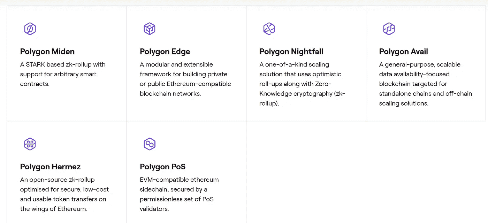

# 多边形的未来是光明的

> 原文：<https://medium.com/coinmonks/future-is-bright-for-polygon-10b38c9a304f?source=collection_archive---------24----------------------->

我一直看好 Polygon，这是一个专注于以太坊扩展的领先平台。在我看来，Polygon 是解决区块链可伸缩性、安全性和隐私问题的最具前瞻性和扩展性的方法之一。他们有一系列令人兴奋的创新区块链扩展解决方案，旨在实现更具互操作性和可持续性的 Web 3 环境。

多边形的使命是把世界带到以太坊。然而，以太坊第 1 层网络长期以来一直受到低交易吞吐量和高使用率导致的天然气费用飙升的困扰，特别是随着分散金融(DeFi)和不可替代令牌(NFT)的普及。

根据 Etherscan.io 的统计，截至 2021 年底，每天有 125 万笔交易，每天的燃气费高达 9840 万美元，同比分别增长 7.75%和近 25%，这将以太坊的网络容量扩展到了绝对极限。

为了解决近期和中期的交易吞吐量困难和不断上升的天然气成本，利用扩展解决方案将主要区块链协议的交易负担转移到**链外**架构。这就是多边形的由来。

**什么是多边形？**

[Polygon](https://medium.com/u/ea91a1cf958?source=post_page-----10b38c9a304f--------------------------------) 提供了一整套分散式扩展解决方案，如果你愿意，可以称之为瑞士军刀方案。它使用多管齐下的扩展策略，包括侧链以及第二层零知识(ZK)汇总和乐观汇总，目的是为 Web 3 开发者带来更高的安全性、成本效率和更快的交易速度。

**以太坊缩放:**

*侧链*

*   与以太坊主链平行运行的独立区块链。通过网桥连接到主链，在主链中，资产被锁定在第 1 层智能合同中，并在侧链上重新发布。处理链外事务的执行，并将状态根的快照发送到主链。
*   它不从以太坊主层获取安全性，有自己的共识机制和一组验证器节点，比以太坊少得多。因此，与以太坊相比，它没有那么分散和安全

*零知识汇总*

*   建立在以太坊第 1 层 mainnet 之上的第 2 层协议。继承主链的安全属性
*   允许一方证明其拥有特定信息而不泄露该信息的加密证明。
*   用于离线执行和批处理多个事务，这些事务将在第 1 层最终完成。
*   提交有效性证明以允许以太坊在不处理交易的情况下验证正确性，节省了大量的处理时间和能量

乐观汇总

*   使用故障证明来验证交易的第 2 层协议。继承主链的安全属性
*   乐观地假设所有的交易都是有效的，并且对于提交的交易批次没有给出初始证明。有一个质疑期，其他人可以发现并提出争议，声称某些交易是欺诈性的。如果出现欺诈交易，测序人员的赌注奖励可能会被削减。链上记录将恢复到特定事务发生之前的状态。

ZK 和乐观汇总各有利弊，总结如下:

*资料来源:街区研究*

**多边形缩放解决方案汇总:**

*1。多边形桩位证明*

*   EVM 兼容的第 1 层侧链，是目前使用最广泛的多边形解决方案，也是采用最广泛的侧链，每天处理多达 900 万笔交易，每天有 150 万个活动地址(超过 1 年)。
*   Polygon PoS 每秒最多可处理 7，000 笔交易，远远超过以太坊的平均 15 笔交易。相对于以太坊，汽油费非常低(约 0.01 美元对约 9 美元)
*   在交易被确认后遭受交易撤销的情况

*2。多边形赫米兹*

*   以太坊之上的第 2 层协议
*   使用零知识简洁的非交互式知识论证(ZK·斯纳克)汇总来展示并公开记录在以太坊区块链上处理的汇总转账的有效性和正确性。通过只存储一批传输的证明和压缩数据，网络的效率和吞吐量成倍增加。
*   2000 TPS 的高吞吐量
*   Hermez 于 2021 年 8 月被 Polygon 收购。主要设计用于 ERC 20 代币的支付和转账
*   工作中的 Polgygon Hermez 2.0。旨在支持智能合约功能

*3。多边形黄昏*

*   以隐私为重点的汇总，采用 ZK 和乐观汇总技术构建，面向企业
*   使用乐观汇总减少交易费用和隐私零知识证明
*   能够超过 100 txn/秒
*   支持高效、分散的业务交易，同时确保隐私
*   Polygon 与安永的合作

*4。多边形中点*

*   使用零知识可扩展的透明知识论证(ZK·斯塔克)汇总
*   分片前吞吐量高达 1，000+ TPS，分片后吞吐量高达 10，000+ TPS
*   隐私和缩放技术允许更快、更安全地验证证据
*   透明(无可信设置)和后量子安全

*5。多边形零点*

*   世界上最快的零知识汇总使用 Plonky 2，一个递归 ZK 证明
*   能够在 170 毫秒内生成 ZK 斯纳克证明
*   离线执行交易，并有效地向以太坊证明
*   12 月 21 日获得和平号协议，更名为零多边形

*6。多边形边缘*

*   面向开发者的开源模块化区块链开发框架
*   旨在帮助开发人员构建公共和私有 EVM 兼容侧链和第 2 层区块链
*   能够超过 100 txn/秒
*   在 EVM 的全力支持下稳健发展
*   支持利害关系证明和权威证明共识算法
*   将资产(如 ERC 20 代币、NFT 等)转移到任何 EVM 兼容网络，尤其是 Polygon 和以太坊主网络
*   采用区块链的快速通道超网

*7。多边形可用性*

*   专注于数据可用性的区块链，专为独立链、侧链和链外扩展技术而设计
*   允许开发人员谁想要建立自己的区块链外包网络安全，数据订购可用性

*来源:多边形*

**分析链上指标**

为了分析多边形的牵引力，让我们看看一些链上的指标。

Polygon 目前拥有 18.9 亿美元的第六大 DeFi TVL(2021 年初为 32.4 万美元)，在所有区块链协议中拥有 263 个协议，是第三大 DeFi 协议。一些最著名的 DeFi 协议，如 Aave、Curve、Uniswap 和 Sushiswap 都是在 Polygon 上实现的。

*资料来源:DeFiLlama*

Polygon 在 180 天内收入 1480 万美元，增长 83.7%，排名第九。在 365 天内，Polygon 增长了 13，2406%。

*来源:令牌终端*

自 1 月 22 日中旬以来，日活跃地址数量一直在 40 万的范围内稳定波动，而去年 5 月份仅为 2.6 万，去年 9 月份达到 150 万的峰值。每天的交易数量通常至少是以太坊的两倍。

自从 MATIC (Polygon 的本地治理令牌)在 405 天前部署以来，37%的令牌由 65%的地址持有 90 天到 365 天。大部分持有者(62%的令牌由 26%的地址持有)持有的时间已经超过了 1-2 年！

拥有 MATIC 的唯一地址的数量从一开始就一直在增加。现在有 44，916 个唯一地址，同比增长 276%。

Polygon plasma bridge 和 PoS ERC 20 bridge 分别是 161K 和 152K 的总存款人最多的桥。多边形 PoS bridge 以 261 亿排在第二位。

*资料来源:南森*

**前方的路**

链上指标已经清楚地表明，多边形的采用有增无减。一般市场，最重要的是，较大的男孩，正在显示 HODL 对多边形的行为，并看好其长期潜力。

目前，绝大多数的使用仍然主要停留在 PoS 侧链上。然而，以太坊规模的未来在 ZK，正如以太坊创始人 Vitalik Buterin 经常强调的那样，这是一个乐观的趋势。鉴于 Polygon 在各种扩展能力方面的巨大投资，这正是 Polygon 的优势所在。无论是用户、开发人员还是企业，Polygon 的全面扩展平台套件都有一个计划好的解决方案来满足不同的需求和需要，无论是更低的交易成本、更快的吞吐量、更高的安全性、更大的隐私性还是创建自己的区块链的能力。

目前，有 19，000 个 dApps——半年内增长了 6 倍——已经把 Polygon 当成了家。事实上，Polygon 已经在其基础设施上搭载了一些大牌用户，如易贝(电子商务)、Meta(社交网络)、杜嘉班纳(奢侈品)、Stripe(支付)、OpenSea (NFT 市场)和 Sandbox(游戏)，尤其是游戏将成为一个具有巨大潜力的重要垂直市场。它通过聘请 YouTube 游戏主管 Ryan Wyatt 担任 Polygon Studios 的首席执行官来建立其区块链 NFT 和游戏平台，表明了一个重要的意向声明。

另外，Polygon 开发者生态系统也经历了爆炸性增长，它从 Alchemy、Infura 和 Chainstack 等区块链基础设施服务提供商那里获得了开发者社区支持。为了进一步推动其网络的增长，Polygon 在著名风险投资家(如红杉资本、软银、老虎环球、信和环球、蜻蜓资本和银河数码等)的支持下，承诺投资 1 亿美元用于激励开发，特别是在 Polygon Edge 支持的超网链上。

同样值得注意的是，Polygon 承诺到 2022 年实现碳减排和环境友好，这不是很多区块链人能做到的。

所有这些计划的开发和活动都旨在为 Polygon 提供引人注目的优势，以区别于来自第 1 层区块链(如 Solana、NEAR 等)和其他第 2 层扩展协议(如 optimistry、Arbitrum、dYdX 等)的激烈竞争。

随着即将到来的以太坊合并及其向股权共识机制证明的转变最终将在 2022 年第三季度发生，这可能会推动以太坊的需求激增，由此延伸，Polygon 完全有可能从这一重大行业事件中受益。鉴于 Polygon 对尖端创新和可持续性的不断推动，Polygon 将 Web 3 大规模采用的使命前景光明。

如果你从这篇文章中发现了价值，请**尽情地鼓掌**，**尽情地分享**，[关注](/@JagFoo) 我在[中](/@JagFoo) & [推特](https://twitter.com/blocksaurus1152)。

> 加入 Coinmonks [电报频道](https://t.me/coincodecap)和 [Youtube 频道](https://www.youtube.com/c/coinmonks/videos)了解加密交易和投资

# 另外，阅读

*   [加密货币储蓄账户](/coinmonks/cryptocurrency-savings-accounts-be3bc0feffbf) | [加密交易机器人](https://coincodecap.com/best-crypto-trading-bots)
*   [BigONE 交易所评论](/coinmonks/bigone-exchange-review-64705d85a1d4) | [CEX。IO 审查](https://coincodecap.com/cex-io-review) | [交换区审查](/coinmonks/swapzone-review-crypto-exchange-data-aggregator-e0ad78e55ed7)
*   [最佳比特币保证金交易](/coinmonks/bitcoin-margin-trading-exchange-bcbfcbf7b8e3) | [比特币保证金交易](https://coincodecap.com/bityard-margin-trading)
*   [加密保证金交易交易所](/coinmonks/crypto-margin-trading-exchanges-428b1f7ad108) | [赚取比特币](/coinmonks/earn-bitcoin-6e8bd3c592d9)
*   [WazirX vs CoinDCX vs bit bns](/coinmonks/wazirx-vs-coindcx-vs-bitbns-149f4f19a2f1)|[block fi vs coin loan vs Nexo](/coinmonks/blockfi-vs-coinloan-vs-nexo-cb624635230d)