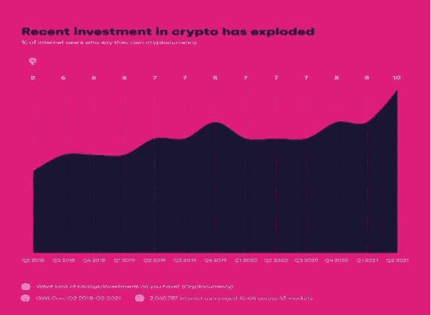

# 加密货币的未来

> 原文：<https://medium.com/coinmonks/future-of-cryptocurrency-c7a75403d79?source=collection_archive---------55----------------------->

加密货币在 2021 年大获成功之后，2022 年的下一步是什么？双子星座全球发展主管戴夫·艾伯纳说，2021 年是一个“突破”。美国等主要公司和州表达了对加密货币新规的兴趣。此外，这家美国银行最近创建了比特币托管服务，使对冲基金能够在这种神奇的数字货币中占有一席之地。

比特币也吸引了人们，他们对比特币的关注度飙升。对于投资者和这种流行文化来说，这是一个令人惊讶和最有趣的话题。

# 分析师得出结论，到 2030 年，加密货币全球市场将是现在的三倍:

一旦加密货币在反建制投资者的边缘群体中变得熟悉，它现在正成为一个非常家喻户晓的名字。到 2030 年，其全球市场将是现在的三倍，对其未来的评估约为 50 亿美元。谁也无法忽视加密货币的崛起浪潮。

# 人民的权力:

Investors of cryptocurrency are growing steadily all around the world, and its recent growth is explosive.

来源:GWI 核心 Q2 2018-Q2 2021 |基数:47 个市场中年龄在 16-64 岁的 2，045，787 名互联网用户|问题:你有哪种储蓄/投资？(加密货币)。

世界各地的许多立法者正试图建立法律和指导方针，使加密货币对投资者安全，并消除网络犯罪

如果不引入更严格的监管，加密货币的投资者可能会受到伤害。对加密货币的空前监管面临重重障碍。“有不同的机构，可能或可能没有管辖权来监督一切，”王(中国之王)说。

# 加密 ETFs 对投资者意味着什么:

首只加密 ETF 于去年 10 月在纽约交易所推出。这种新的发展方式代表了一种更有效、更传统的加密货币投资方式。

加密 ETF 是交易所交易基金，跟踪加密货币的价值及其在传统市场交易所的交易。它们允许投资者投资加密货币，而没有利用加密货币交易的任何不便，同时提供对其价格的控制。

# 工作原理:

加密 ETF 可能类似地工作，一份 ETF 的价格将随着加密货币的价格波动。如果加密货币的价值增加，ETF 的价值也会增加，vis_a_vis。此外，ETF 可以在纽约证券交易所或 TSX 交易所交易，而不是在加密货币交易所交易。

# 采用加密货币的广泛机构:

多个行业的流行和主流公司都对加密货币感兴趣，其中一些公司正在投资加密货币，即 AMC 宣布将在 2021 年底接受比特币支付，其他一些公司也对比特币支付感兴趣。

一些专家预测，很快全球公司将开始采用加密货币，并且他们正在寻求主流公司参与加密货币。

# 比特币的未来:

加密市场的一个很好的指标是比特币。因为比特币是市场上最大的加密货币。

比特币的价格在 2021 年飙升，11 月份超过 68000 美元，创下历史新高。另一位专家、《傻瓜加密货币投资》的作者 Kiana Danial 预测比特币将达到 10 万美元。

> 加入 Coinmonks [电报频道](https://t.me/coincodecap)和 [Youtube 频道](https://www.youtube.com/c/coinmonks/videos)了解加密交易和投资

# 另外，阅读

*   最佳[区块链分析](https://bitquery.io/blog/best-blockchain-analysis-tools-and-software)工具| [赚比特币](/coinmonks/earn-bitcoin-6e8bd3c592d9)
*   [Cloudbet 赌场评论](https://coincodecap.com/cloudbet-casino-review) | [点火赌场评论](https://coincodecap.com/ignition-casino-review)
*   [加密套利](/coinmonks/crypto-arbitrage-guide-how-to-make-money-as-a-beginner-62bfe5c868f6)指南| [如何做空比特币](/coinmonks/how-to-short-bitcoin-568a2d0b4ae5)
*   [如何在加拿大购买加密货币？](https://coincodecap.com/how-to-buy-cryptocurrency-in-canada)
*   [无聊猿游艇俱乐部(BAYC)回顾](https://coincodecap.com/bored-ape-yacht-club-bayc-review) | [拜比特 vs 比特币基地](https://coincodecap.com/bybit-vs-coinbase)
*   [5 款最佳加密交易终端](https://coincodecap.com/crypto-trading-terminals) | [最佳 DeFi 应用](https://coincodecap.com/best-defi-apps)
*   [比特币基地 vs 瓦济克斯](https://coincodecap.com/coinbase-vs-wazirx) | [比特鲁点评](https://coincodecap.com/bitrue-review) | [波洛涅克斯 vs 比特鲁](https://coincodecap.com/poloniex-vs-bittrex)