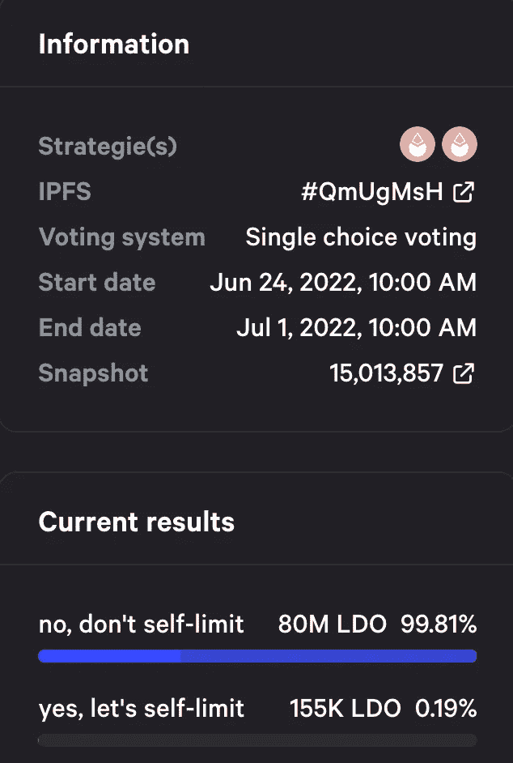
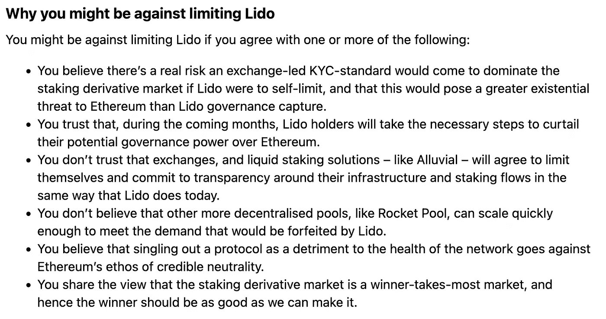
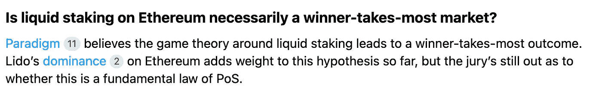
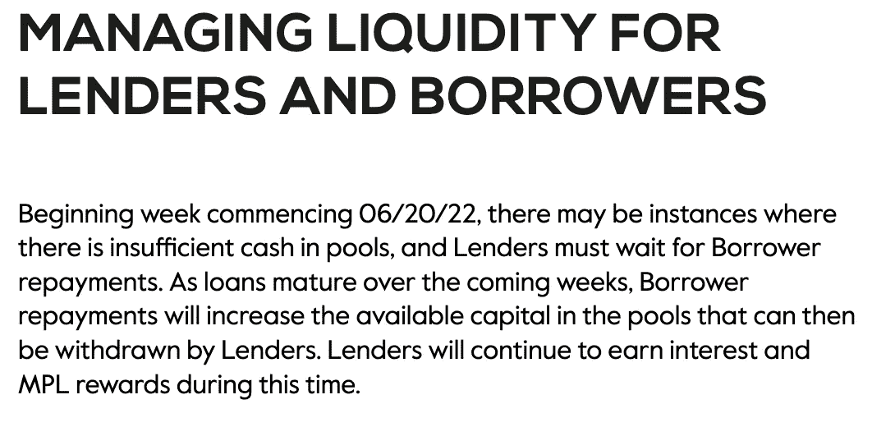
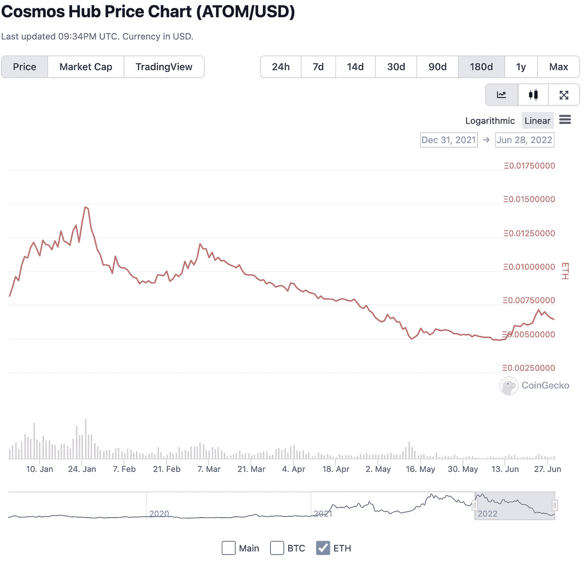
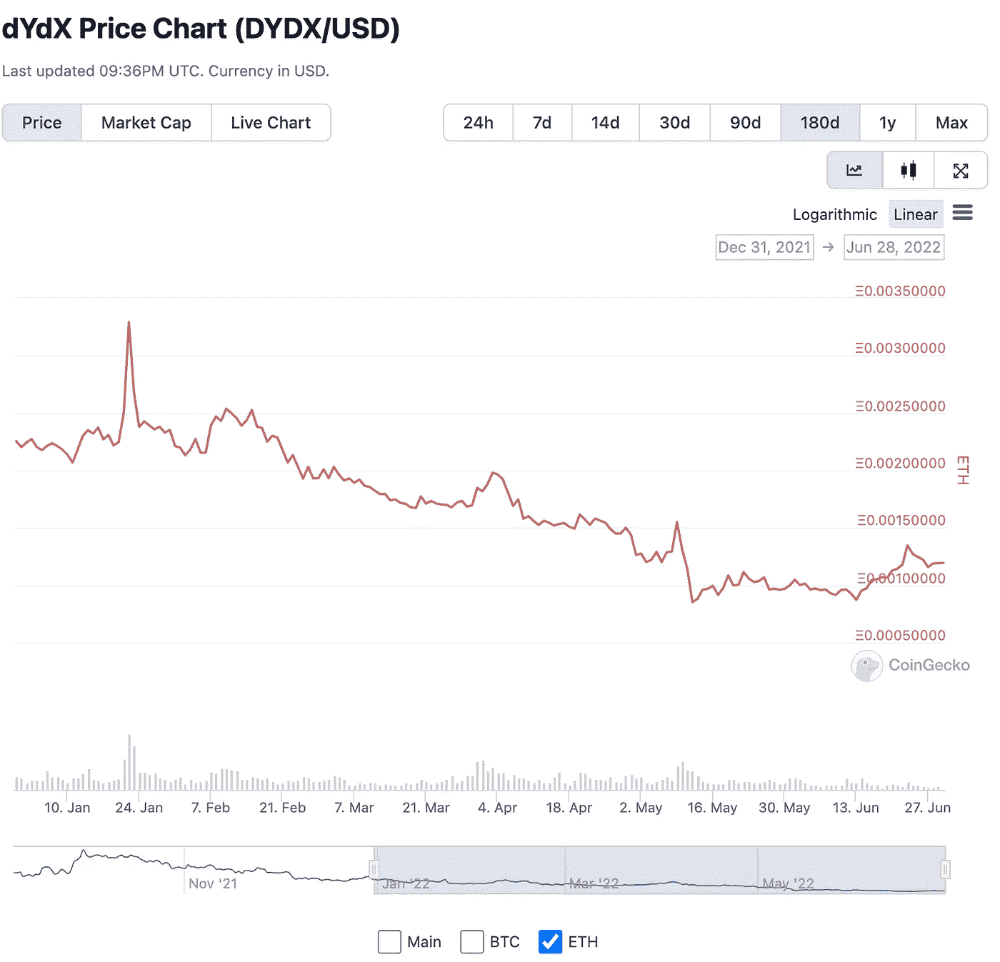

# 以太坊的未来:我一直在读的东西

> 原文：<https://medium.com/coinmonks/future-of-ethereum-what-ive-been-reading-ec97c2d6ccaa?source=collection_archive---------47----------------------->

嗨，伙计们，我还没有写一点，所以这里有一些链接到我一直在读的东西。

**以太坊的未来**

我关心的一件事是以太坊的健壮性——因为我认为以太坊是目前所有智能合同链中最安全的，我目前正在它的基础上进行构建。

> 交易新手？试试[密码交易机器人](/coinmonks/crypto-trading-bot-c2ffce8acb2a)或者[复制交易](/coinmonks/top-10-crypto-copy-trading-platforms-for-beginners-d0c37c7d698c)

我现在对以太坊的主要担忧是与灯塔链合并后的集中化风险。很简单，大多数赌注都是通过利多进行的——所以看起来以太坊的赌注链证明将比目前的工作证明版本更加集中。这方面的一些最新消息:

一..维塔利克在推特上建议演员应该自我限制，永远不要拥有超过 15%的股份:

[vitalik . eth @ VitalikButerin](https://twitter.com/VitalikButerin/status/1525301234516652032?s=20&t=ppyXMvOB1RUz-AcnQBimyQ)

[superphiz.eth🦇🔊🐼@superphiz](https://twitter.com/VitalikButerin/status/1525301234516652032?s=20&t=ppyXMvOB1RUz-AcnQBimyQ)

[我想知道，谁会是第一个公开承诺限制自己在链上不操作超过 22%的验证器的标桩提供商？你希望看到谁挺身而出，将健康置于利润之上？](https://twitter.com/VitalikButerin/status/1525301234516652032?s=20&t=ppyXMvOB1RUz-AcnQBimyQ)

[2022 年 5 月 14 日](https://twitter.com/VitalikButerin/status/1525301234516652032?s=20&t=ppyXMvOB1RUz-AcnQBimyQ)

[388 条转发 3066 个赞](https://twitter.com/VitalikButerin/status/1525301234516652032?s=20&t=ppyXMvOB1RUz-AcnQBimyQ)

2..丽都实际上[举行了一次投票](https://snapshot.org/#/lido-snapshot.eth/proposal/0x10abedcc563b66b1adee60825e78c387105110fa4a1e7354ab57bc9cc1e675c2)决定是否自我限制，这是非常不受欢迎的:

LIDO Snapshot latest results

3..来自丽都论坛的帖子，这里有一些反对丽都自限的理由:

我的观点是，即使丽都限制了他们的持股比例，也会有其他实体不会这样做。所以，这不是丽都特有的问题。

四..这是一句让人崩溃的话，还是来自丽都论坛的帖子(顺便说一下，这篇帖子不是丽都写的，而是论坛成员 vsh 写的，他没有透露 stEth 或丽都的所有权):

继续其他话题:

5..我看到枫叶金融公司(Maple Finance)为稳定的货币存款提供高收益，但有些储户在一段时间内无法提取存款。

6..喵是一个为使用 Maple finance 提供良好 UX 的平台，目标客户是企业客户。我刚去了他们的网站 Meow.co，没有任何最近的博客。喵没有管理基金的风险——据我所知，这是投资者的责任。我记得当时考虑把钱投在枫叶上。我看到像阿拉米达(FTX 的母公司)这样的公司以超过 10%的利率借贷资金。我只是不明白如何衡量这些高收益债券的信用风险，所以我无法放心去做。

七..dydx 是一个永久合约交易所。它目前在以太坊上运行。我没有任何 dydx，但它似乎是基于代码和文档质量的可靠协议(例如，通过 [DefiSafety](http://DeFiSafety.com) 的审查)。在重大新闻中，dydx 现在将使用宇宙区块链设计来构建他们的 v4。这并不意味着 dydx 会在 Cosmos 本身上(使用 Atom 令牌)，但是 dydx 会使用 Cosmos 架构构建自己的链。这就是 Terra 所做的——Terra 是一个基于宇宙的链条。

我真的很高兴人们在以太坊之外的其他链条上建造，因为——就像宇宙创始人伊桑·布赫曼一样——我担心会有一个以太坊帝国(这里有更多关于这个的)。

8..作为一个有趣的旁白，这里是如何宇宙枢纽区块链(即不是 Terra 版本或 dydx 版本)做了它的天然气令牌在过去半年与以太:

9..以下是 dydx 相对于乙醚的表现:

基本上，比特币崩溃了很多，以太崩溃了更多，其他大多数东西崩溃得更多。

这就是这周的内容。披露:我拥有比特币和以太。

> 加入 Coinmonks [电报频道](https://t.me/coincodecap)和 [Youtube 频道](https://www.youtube.com/c/coinmonks/videos)了解加密交易和投资

# 另外，阅读

*   [Bookmap 评论](https://coincodecap.com/bookmap-review-2021-best-trading-software) | [美国 5 大最佳加密交易所](https://coincodecap.com/crypto-exchange-usa)
*   [加密交易机器人](/coinmonks/crypto-trading-bot-c2ffce8acb2a) | [造币评论](https://coincodecap.com/coingate-review)
*   最佳加密[硬件钱包](/coinmonks/hardware-wallets-dfa1211730c6) | [Bitbns 评论](/coinmonks/bitbns-review-38256a07e161)
*   [新加坡十大最佳密码交易所](https://coincodecap.com/crypto-exchange-in-singapore) | [收购 AXS](https://coincodecap.com/buy-axs-token)
*   [红狗赌场评论](https://coincodecap.com/red-dog-casino-review) | [Swyftx 评论](https://coincodecap.com/swyftx-review)
*   [投资印度的最佳密码](https://coincodecap.com/best-crypto-to-invest-in-india-in-2021)|[WazirX P2P](https://coincodecap.com/wazirx-p2p)|[Hi Dollar Review](https://coincodecap.com/hi-dollar-review)