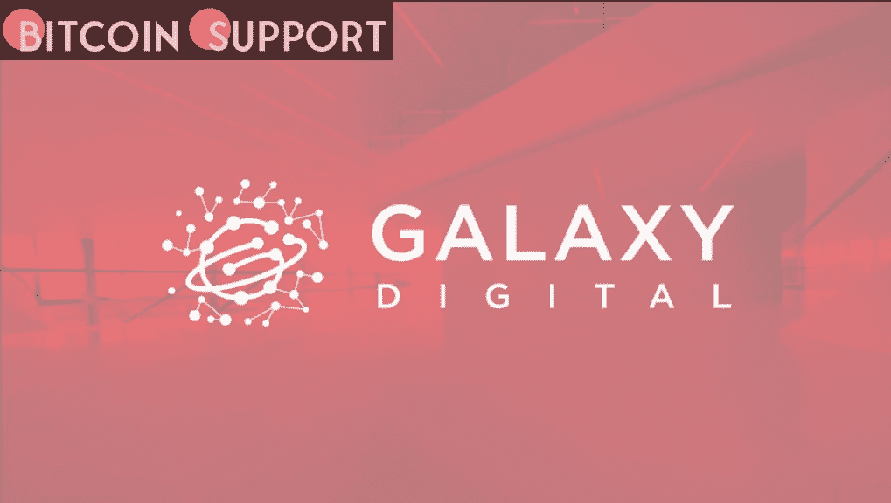
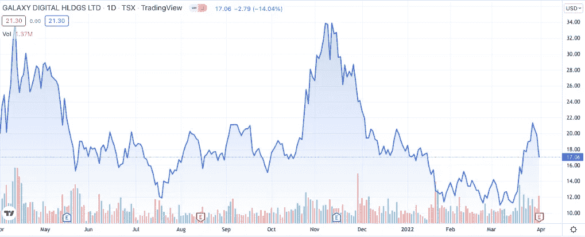

# 银河数码将收购 BitGo 的交易推迟至 2022 年晚些时候

> 原文：<https://medium.com/coinmonks/galaxy-digital-postpones-the-acquisition-of-bitgo-until-later-in-2022-2d43bd06fe2a?source=collection_archive---------29----------------------->

**Visit our website:-** [**https://bitcoinsupports.com/**](https://bitcoinsupports.com/)

该交易计划与银河公司在特拉华州的本土化同时进行，计划在 Q2 和 2022 年第四季度之间进行。

加密货币投资公司 Galaxy Digital 无法如期在 2022 年第一季度完成对数字资产托管公司 BitGo 的收购。银河数码已经修改了收购 BitGo 的条件，首席执行官 Mike Novogratz 在周四的电话会议上表示。诺沃格拉茨说:“为了反映 BitGo 的增长，我们对交易做了一些小小的改动。”他指出，自去年 5 月公司签署协议以来，BitGo 已经增加了大约 150 名员工。他表示，Galaxy 仍然致力于“整合 BitGo 并建立一个机构加密货币平台”，两家公司将继续在整合方面进行合作。根据一份官方声明，银河数码和 BitGo 已经重新谈判收购事宜，收购将在银河数码成为特拉华州公司后“立即”进行。该公司补充说，本土化计划在 Q2 和 2022 年第四季度之间生效，并须经美国证券交易委员会批准。公告称，如果交易未能在 2022 年底前完成，银河娱乐同意支付高额费用。

**“如果交易未能在 2022 年 12 月 31 日之前完成，银河数码将在特定情况下向 BitGo 支付 1 亿美元的反向终止费，受特定限制。”银河公司打算在 Q1 2022 年年底前完成对 BitGo 的收购，支付 3380 万股新发行的银河股票，即 1 2 亿美元，此外还有 2.65 亿美元的现金。

根据银河数码 3 月 30 日收盘价，新的收购条件包括 4480 万股新鲜发行的股票和 2.65 亿美元现金，反映整体交易价值约为 11.58 亿美元。银河公司预计将于 2022 年前三个月在美国上市，与收购 BitGo 同时进行。2018 年 8 月，该公司首次在多伦多 TSX 风险交易所上市。自从该公司宣布收购 BitGo 以来，Galaxy 的股价急剧下跌，从 2022 年 1 月的 30 美元以上跌至 12 美元以下。TradingView 的数据显示，该股目前交易价为 17 美元，过去 24 小时下跌了 14%。**

**Visit our website:-** [**https://bitcoinsupports.com/**](https://bitcoinsupports.com/)

银河公司还宣布净综合收入增长 55%，从 2021 年第三季度的约 3.36 亿美元增长到 2021 年第四季度的 5.21 亿美元。与此同时，该公司预计净综合收益将亏损 1.1 亿美元至 1.3 亿美元，总计约为 24.5 亿美元。这家公司近年来一直遭受巨额亏损。银河公司在 2021 年第二季度亏损约 1.76 亿美元，尽管 Novogratz 表示，该公司在 2021 年上半年仍“大幅盈利”，净综合收入总计 6.84 亿美元。

**访问我们的网站:-**[**https://bitcoinsupports.com/**](https://bitcoinsupports.com/)

**免责声明:以上为作者观点，不应视为投资建议。读者应该自己做研究。**

> 加入 Coinmonks [电报频道](https://t.me/coincodecap)和 [Youtube 频道](https://www.youtube.com/c/coinmonks/videos)了解加密交易和投资

# 另外，阅读

*   [有哪些交易信号？](https://coincodecap.com/trading-signal) | [Bitstamp vs 比特币基地](https://coincodecap.com/bitstamp-coinbase) | [买索拉纳](https://coincodecap.com/buy-solana)
*   [ProfitFarmers 回顾](https://coincodecap.com/profitfarmers-review) | [如何使用 Cornix Trading Bot](https://coincodecap.com/cornix-trading-bot)
*   [十大最佳加密货币博客](https://coincodecap.com/best-cryptocurrency-blogs) | [YouHodler 评论](https://coincodecap.com/youhodler-review)
*   [my constant Review](https://coincodecap.com/myconstant-review)|[8 款最佳摇摆交易机器人](https://coincodecap.com/best-swing-trading-bots)
*   [MXC 交易所评论](/coinmonks/mxc-exchange-review-3af0ec1cba8c) | [Pionex vs 币安](https://coincodecap.com/pionex-vs-binance) | [Pionex 套利机器人](https://coincodecap.com/pionex-arbitrage-bot)