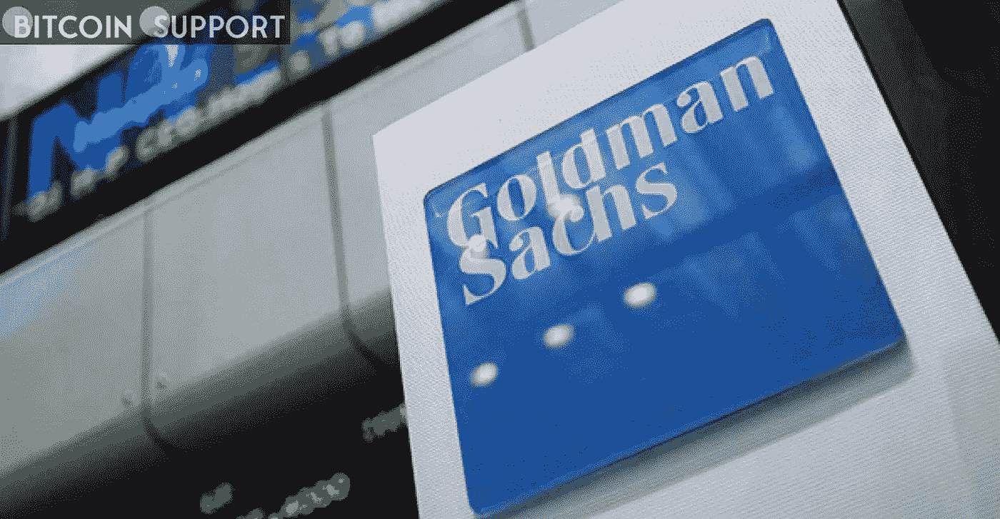
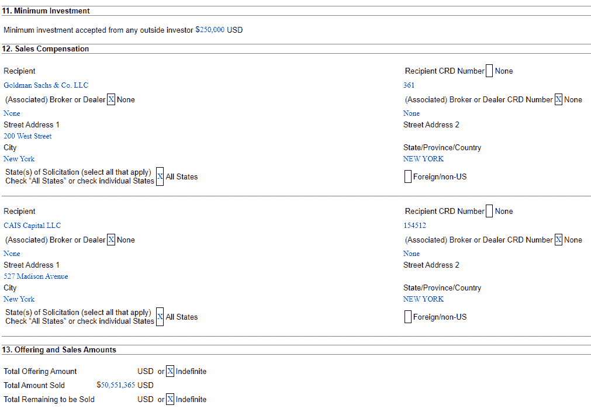

# 高盛正在向客户推销银河数码的 ETH 基金

> 原文：<https://medium.com/coinmonks/galaxy-digitals-eth-fund-is-being-marketed-by-goldman-sachs-to-its-clients-2a188e554937?source=collection_archive---------70----------------------->

**Visit our website:-** [**https://bitcoinsupports.com/**](https://bitcoinsupports.com/)

高盛(Goldman Sachs)和银河数码(Galaxy Digital)再次联手，帮助前者的客户获得后者擅长的加密业务。

根据一份新的证券交易委员会文件，高盛一直通过银河数码旗下的以太坊基金向客户出售对 ETH 的敞口。

想当场投资以太坊(ETH)的高盛客户，已经被银河的 ETH 基金提供了一个位置。在一份日期为 3 月 8 日的银河文件中，高盛被指收取介绍费，向该基金介绍客户，披露了这种做法。

银河数码是一家专注于加密的金融服务公司，由亿万富翁迈克·诺沃格拉茨创立。截至 2021 年第四季度末，它管理着 28 亿美元的资产(AUM)。高盛客户的实际购买金额不得而知，尽管每位投资者的最低投资额为 25 万美元。报告显示，银河娱乐的 ETH 基金自成立以来，销售额略高于 5050 万美元。

**Visit our website:-** [**https://bitcoinsupports.com/**](https://bitcoinsupports.com/)

银河数码的 ETH 基金现在被高盛推荐。
在诉状中，独立资产管理公司 CAIS 资本也被指为配售费的收取方，原因是该公司将客户介绍给银河娱乐的 ETH 基金。高盛的介绍费和 CAIS 的介绍费没有透露。这并不是高盛和银河数码的第一次合作。高盛于 6 月份开始通过芝加哥商业交易所集团比特币期货交易比特币(BTC)期货，银河数码提供流动性。高盛的员工也对加密货币越来越感兴趣。高盛高管罗杰·巴特利特(Roger Bartlett 月 25 日透露，他将离开这家传统金融机构，加入比特币基地加密货币交易所。在 LinkedIn 的一篇文章中，他表示，他将监管全球金融业务，以“拥抱数字资产及其生态系统提供的机会。”高盛资深董事长劳埃德布兰克费恩同样对加密领域感兴趣。鉴于异常高的通货膨胀率和世界各地被冻结的个人银行账户，他在 3 月 7 日想知道为什么加密货币没有“一刻”。

[https://Twitter . com/lloydblankfein/status/1500645134597345280](https://twitter.com/lloydblankfein/status/1500645134597345280)

**访问我们的网站:-**[**https://bitcoinsupports.com/**](https://bitcoinsupports.com/)

**免责声明:以上为作者观点，不应视为投资建议。读者应该自己做研究。**