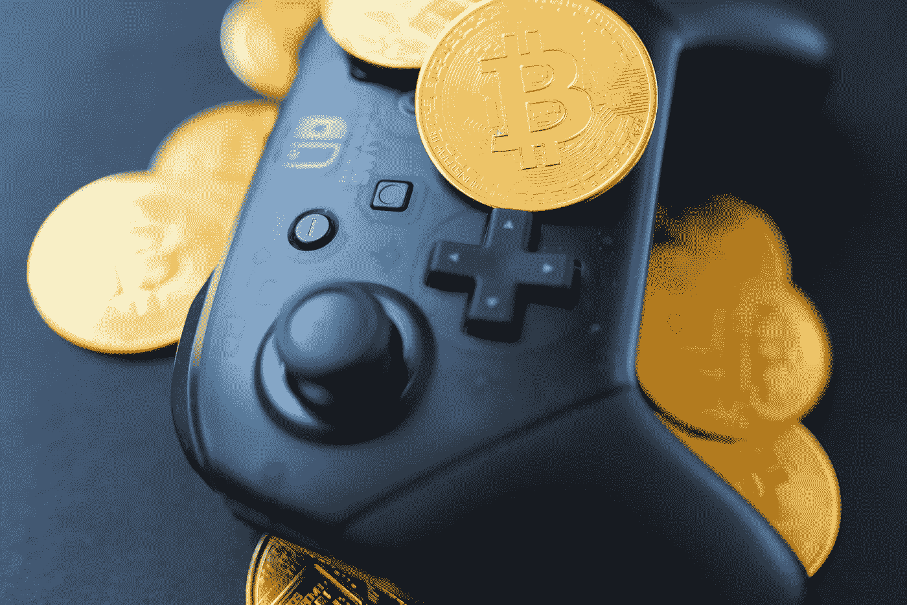

# Game-Fi 和 P2E 都将改变游戏产业

> 原文：<https://medium.com/coinmonks/game-fi-and-p2e-are-all-set-to-change-the-gaming-industry-4f727014d5c4?source=collection_archive---------35----------------------->

2016 年见证了流行游戏的发布。特别是这些游戏，它们在推出后的两个月内聚集了超过 4000 万用户，将增强现实时代带入了游戏领域。手机游戏在印度非常受欢迎。Pokemon Go 的推出吸引了大量玩家，导致开发商对该国进行地理封锁，因为其服务器无法处理玩家的涌入。

智能手机、平板电脑和游戏机的非凡进步从根本上改变了我们的日常活动，而说到数字游戏，它也极大地影响了手机游戏的本质。在智能手机上玩手机游戏已经变得非常流行，并且正在改变视频游戏的设计和运行方式。

**什么是 GameFi？**

GameFi 是“游戏”和“金融”两个词的组合。GameFi 已经成为当今加密货币行业最热门的趋势之一。它融合了加密货币、区块链、NFTs 和游戏机制，创建了一个玩家可以参与并赚钱的虚拟环境。GameFi 采用“玩赚”或 P2E 模式运营

**P2E 博彩模式是什么？**

P2E 模式的工作原理是让玩家拥有和控制游戏中的资产，通常是加密货币和不可替代的代币(NFT)。游戏玩家通过完成游戏中的任务来增加他们的“财富”，例如喂养虚拟宠物、与 NFT 人物战斗等。这些任务可以是任何事情。通过购买资产、完成工作和发展社区来促进游戏内经济，游戏玩家增加了他们所携带的加密资产的价值。主要思路是你入股游戏平台，开始玩，边玩边赚。基本上，P2E 游戏模式需要预先投资，你有机会使用加密货币创造替代收入流。

Crypto 不仅仅是比特币，也不仅仅是钱。分散金融(DeFi)革命改变了游戏规则。以太坊是一种加密资产，允许开发人员在加密资产的“智能合约”功能内构建整个平台。

**NFTs、加密和 P2E 博彩**

DeFi 是一个虚拟的全球经济，人们可以创造任何东西，从 NFT 人物到完整的游戏，并通过加密市场和交易所进行交易以获利。此外，人们可以建造和控制他们想要的任何东西，价值来自使用虚拟经济资产的玩家。没有中央管理机构，用户可以完全控制和自由管理虚拟经济的基础设施。

P2E 奥运会在许多发展中国家，如菲律宾、巴西、越南和柬埔寨受到了广泛关注。P2E 加密游戏在这些国家流行的原因可能是他们的公共文化，在那里信息和趋势可以传播得非常快。在其他几个国家，疫情导致封锁，造成数百万人失业，并开放通过游戏赚钱。随着失业率的波动，从玩到赚的游戏 Axie Infinity 大受欢迎。他们引起了媒体的广泛关注。

**通过 P2E 博彩网上赚钱**

从玩到赚的游戏模式正在极大地改变人们的生活。例如，“Axie Infinity”是领先的 P2E 游戏之一。一些报告显示，在菲律宾和越南，有人辞去全职工作去玩 Axie Infinity，因为他们赚的钱比体力工作多。Axie Infinity 的普通玩家玩这个游戏每月能赚 800 到 1200 美元，这比世界上那个地区大多数人真正工作的收入还要多。Axie Infinity 的一些玩家每五天的收入也超过 7 万美元，菲律宾国税局(BIR)宣布，Axie Infinity 玩家必须注册纳税。它展示了正确的 P2E 游戏模式的可能性。

Axie Infinity 是加密世界中最受欢迎的 NFT 游戏。它的灵感来自其他一些流行的游戏，如口袋妖怪 Go 等。玩家可以收集繁殖、战斗、饲养和交易被称为 Axies 的象征性生物。每个轴都是不可替代的象征，我们称之为 NFT，具有不同的属性和优势。

**结论**

GameFi 项目采用先玩后赚的机制，随着玩家在游戏中的进步和加密应用的增加，该机制会在经济上奖励玩家。印度 2016 年申报收入 5.43 亿美元，这个数字估计会上升到 8.81 亿美元。在游戏市场，受《糖果粉碎传奇》、《地铁冲浪者》和《神庙逃亡 2》等游戏的影响，仅在 2016 年第二季度，印度玩家就下载了超过 3 亿款移动游戏，截至 2020 年，印度在移动游戏下载数量方面排名世界第五。同一份报告还发现，市场上的这一数字是由于低价智能手机的可用性增加。

> 加入 Coinmonks [电报频道](https://t.me/coincodecap)和 [Youtube 频道](https://www.youtube.com/c/coinmonks/videos)了解加密交易和投资

# 另外，阅读

*   最好的比特币[硬件钱包](/coinmonks/hardware-wallets-dfa1211730c6) | [BitBox02 回顾](/coinmonks/bitbox02-review-your-swiss-bitcoin-hardware-wallet-c36c88fff29)
*   [BlockFi vs Celsius](/coinmonks/blockfi-vs-celsius-vs-hodlnaut-8a1cc8c26630)|[Hodlnaut 点评](/coinmonks/hodlnaut-review-best-way-to-hodl-is-to-earn-interest-on-your-bitcoin-6658a8c19edf) | [KuCoin 点评](https://coincodecap.com/kucoin-review)
*   [Bitsgap 审查](/coinmonks/bitsgap-review-a-crypto-trading-bot-that-makes-easy-money-a5d88a336df2) | [Quadency 审查](/coinmonks/quadency-review-a-crypto-trading-automation-platform-3068eaa374e1) | [Bitbns 审查](/coinmonks/bitbns-review-38256a07e161)
*   [密码本交易平台](/coinmonks/top-10-crypto-copy-trading-platforms-for-beginners-d0c37c7d698c) | [Coinmama 审核](/coinmonks/coinmama-review-ace5641bde6e)