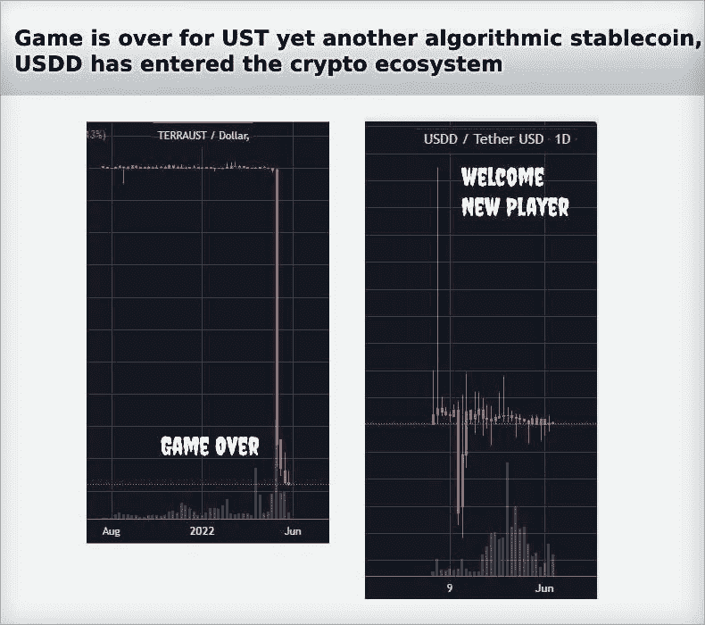

# UST 的游戏结束了，另一个算法稳定器 USDD 进入了加密生态系统

> 原文：<https://medium.com/coinmonks/game-is-over-for-ust-yet-another-algorithmic-stablecoin-usdd-has-entered-the-crypto-ecosystem-480ec1f580ee?source=collection_archive---------30----------------------->

# 卢娜-UST 的传奇结束了，但它激励创-USDD 填补了这一真空

不久前，Terra Luna 有过辉煌的日子，记得我们不断得到消息说，Terra 的 UST 是加密领域第三大分散稳定中心，仅次于 USDT 和 USDC 的集中稳定中心。

我们直言不讳的 Terra 首席执行官 Do Kwon 不断制造新闻，我们所有关注该空间的人都记得，Do Kwon 购买了如此多的比特币，以至于他是第三大比特币持有者，所有人都声称要建立 100 亿美元的比特币储备，以在危机情况下保护 UST 的联系汇率。

所有这些消息在 UST 的秘密领域引起了轩然大波。在这段时间里，似乎没有人梦见 UST 和卢娜崩溃的可能性，就像一对对悲剧情侣携手坠入死亡的漩涡。相反，像我这样的投资者非常看好 Luna，因为 UST 的大量采用，Tron protocol 的 Justin Sun 宣布了他推出 USDD 算法稳定币的计划。

是的，Tron 的 USDD 于 5 月推出，在卢娜-UST 死亡螺旋的几周前，与现在已经死亡的算法 stablecoin UST 非常相似。

# 一种似曾相识的感觉让卢娜——UST·雷克特持有算法稳定的 USDD 币

[USDD’s twitter banner](https://twitter.com/usddio)

是的……当 USDD 盯住美元的汇率低于 1 美元时，[套利交易者用价值 1 美元的特隆](https://decrypt.co/101643/tron-becomes-defi-third-largest-blockchain-thanks-terra-like-stablecoin)烧掉贴现的 USDD，然后在市场上卖出，赚取利润。当 USDD 的挂钩汇率超过 1 美元时，其供应量就会增加，从而铸造更多的 USDD，因为套利交易者会用价值 1 美元的创兑换 USDD，从而获得少量利润。

换句话说，USDD 维持其 1 美元联系汇率的基本机制，与 UST 维持其联系汇率的方式非常相似——通过焚烧和铸造来维持与卢纳的联系汇率平衡。

是的，是的。对于卢娜-UST 的持有人来说，这整件事是令人害怕的，但是让我们更进一步，把过去失败的投资故事抛在脑后，但是似曾相识的感觉又出现了，不禁让人回忆起来。

此外，创道计划建立一个 100 亿美元的储备基金，就像卢娜一样，用于在危机期间保护 USDD 的稳定。

# Tron Defi 中的 USDD 产量导致 Tron 生态系统中的 TVL 呈指数增长

[DefiLama](https://defillama.com/chains) DAta

*从五月 USDD 号发射后，突然创下的 TVL 成倍增长！！*

无论如何，有趣的是，在 Tron 推出这种算法稳定币之后，USDD 在 Tron 的 Defi 协议中锁定的总价值(TVL)经历了大幅上升。现在，Tron 是仅次于以太坊和币安智能链的 TVL 第三大区块链。

Tron 最受欢迎的 DEFI 借贷平台 JustLend 在 5 月 14 日之后经历了锁定其资产的用户大量增加。

*Data from* [*DefiLama*](https://defillama.com/protocol/justlend)

自 5 月 24 日以来，Tron 的稳定硬币交换、产量农业平台 Sun.io 在 TVL 也经历了大幅增长。

Data from [DefiLama](https://defillama.com/protocol/sun.io)

## 在流行的 Tron DEFI 协议中 USDD 沉积物的 APY 产量

让我们看看 USDD 持有者在这些协议中获得了多少 APY 产量，也许这就是 TVL 在 Tron 协议中突然上升的原因。

[**恰借**](https://justlend.just.network/#/market)

在 Just Lend 中，供应 USDD 的基础 APY 利率为 3.79%，而借入的 APY 利率仍高于 4.99%。在这里，APY 以 USDD 货币分配给供应商和借款人。

[JustLend](https://justlend.just.network/#/marketDetail?jtokenAddress=TX7kybeP6UwTBRHLNPYmswFESHfyjm9bAS)

*请注意，利率是由 Just Lend 团队评估 USDD 数据的供给和借入而定期变化的*

然后是供应矿业 APY，这是分布在 JST 和 USDD 货币，总计 14.11%。

[**孙**](https://sun.io/#/home)
在孙看来， ***的 LP*** 组合似乎给的 APYs 高达 50%！！耸耸肩。

[Sun USDD-TRX LP](https://sun.io/#/stake?search=TSJWbBJAS8HgQCMJfY5drVwYDa7JBAm6Es)

USDD 和 USDT 的 LP 组合给了 USDD 14%的 APY。

[Sun USDD-USDT LP](https://sun.io/#/stake?search=TNLcz8A9hGKbTNJ6b6C1GTyigwxURbWzkM)

总的来说，在这两个 Tron DEFI 协议中锁定 USDD 的 APY 收益似乎不错，这可能是 Tron 生态系统在 TVL 经历如此大规模上升的原因。

# 最大的问题是——USDD 是一个安全、分散、稳定的投资中心吗？！

然而，问题是 USDD 会持续下去吗，因为在 UST 的死亡螺旋崩溃之后，算法稳定的预测是可怕的？。

我不知道。

我浏览了一下 USDD 的白皮书，我看到 Tron 的超级代表将承担稳定 USDD 联系汇率的重任，他们将从 USDD 和 Tron 之间的套利交易互换中获得报酬。

你可以阅读[白皮书](https://usdd.io/USDD-en.pdf)，更深入地了解 USDD，我打算这样做，不是投资，而是了解 USDD 硬币的机制，因此可以理解风险，现在，我可以自信地说，我不熟悉 USDD 机制，对此进行评论。

***https://usdd.io/USDD-en.pdf 的白皮书-***

## USDD 持有者必须知道如何快速退出，以防 USDD 面临 depeg 问题！！

我只是给 USDD 投资者一些建议，以及我对 ust 崩溃的经验。请了解必要时将你的 USDD 转换成正常稳定硬币的机制。对于 UST，有曲线+ 3 池，在曲线金融的协议中，人们可以将 UST 交换到 USDC 或 USDT。

对于 USDD，Sun 有一个 USDD-USDT LP 池，您可以在需要时将 USDD 换成 USDT。因此，如果 USDD 开始失去盯住美元，你可以退出，迅速换成另一种稳定的货币。

不幸的是，USDD- USDC LP 池不存在，因为 USDC 是最值得信赖的中央稳定货币，有证据表明其 1:1 的储备支持其盯住美元。Tether 的审计透明度不高，因此公众怀疑它可能没有 1:1 的必要准备金来维持 1 美元的挂钩汇率。

无论如何，很有可能 USDD——USDC，或 3 池类池将很快在太阳发射。

然而，最近 USDD 在 BTSE 平台得到支持，那里有 USDD-USDC 的交易和互换对！！我在 USDC 的推特频道上看到了这个更新！！

[Twitter Tweet](https://twitter.com/usddio/status/1532383555711475713?s=20&t=Mv_Af9g7lGJIDJHd5-_rqg)

在脱钩危机时期，熟悉从 USDD 到另一个稳定的地方的可用出口路线是必不可少的！！

# 创和 USDD 有机会创造一个成功的算法稳定币

然而，我觉得奇怪的是，在 [UST 垮台](/@kikctikcy/understanding-the-death-spiral-finish-of-ust-from-the-lastest-crypto-market-crash-chapter-85205ea36e11)之后，另一个算法稳定币 USDD 由于体面的 APY 奖励而流行起来。这是 Tron 创造终极算法稳定币的一个机会，这种币被证明能成功地维持其 1 美元的固定汇率！！

创是超级受欢迎的 USDT 在创区块链被很好地使用，因为 USDT ERC -20 令牌转移是昂贵的。

*Tron Blockchain is well used for its USDT TRC20 tokens transfers!!*

USDT 创令牌也在许多加密交换中得到了很好的支持，这使得它成为 USDT 创令牌传输的一个被广泛采用的网络。

***感谢阅读！！***

> 加入 Coinmonks [电报频道](https://t.me/coincodecap)和 [Youtube 频道](https://www.youtube.com/c/coinmonks/videos)了解加密交易和投资

# 另外，阅读

*   [最佳加密交换平台](https://coincodecap.com/best-crypto-swap-platforms) | [最佳加密交易所](https://coincodecap.com/crypto-exchange)
*   [购买比特币印度](/coinmonks/buy-bitcoin-in-india-feb50ddfef94) | [Pionex 评论](/coinmonks/pionex-review-exchange-with-crypto-trading-bot-1e459d0191ea) | [加密交易机器人](/coinmonks/crypto-trading-bot-c2ffce8acb2a)
*   [n ave 零点回顾](/coinmonks/ngrave-zero-review-c465cf8307fc) | [Phemex 回顾](/coinmonks/phemex-review-4cfba0b49e28) | [PrimeXBT 回顾](/coinmonks/primexbt-review-88e0815be858)
*   最佳[区块链分析](https://bitquery.io/blog/best-blockchain-analysis-tools-and-software)工具| [赚比特币](/coinmonks/earn-bitcoin-6e8bd3c592d9)
*   [Cloudbet 赌场评论](https://coincodecap.com/cloudbet-casino-review) | [点火赌场评论](https://coincodecap.com/ignition-casino-review)
*   [加密套利](/coinmonks/crypto-arbitrage-guide-how-to-make-money-as-a-beginner-62bfe5c868f6)指南| [如何做空比特币](/coinmonks/how-to-short-bitcoin-568a2d0b4ae5)