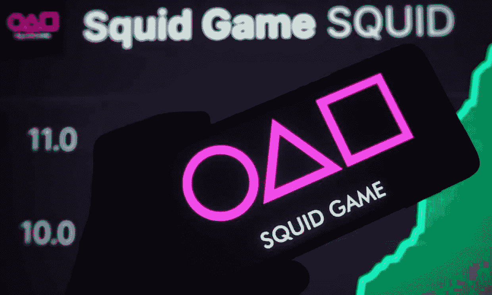

# GameFi…

> 原文：<https://medium.com/coinmonks/gamefi-72fef68d72b9?source=collection_archive---------16----------------------->

## 无意拉地毯？

Photo from: [https://www.theguardian.com/technology/2021/nov/01/squid-game-cryptocurrency-scam-fears-investors](https://www.theguardian.com/technology/2021/nov/01/squid-game-cryptocurrency-scam-fears-investors)

DeFi 可能是近代史上最引人注目的金融革命。鉴于其相对较新的地位和宽松的法规，加密市场也很容易受到地毯拉。

一些项目，由不知名的创始人从投资者那里收钱，然后带着钱跑路，从一开始就打算做地毯。然而，大多数丑闻都是缺乏经验的创始人无法实现对投资者的承诺的结果。如何识别这些项目？让我们来分析一个从一开始就注定失败的正在进行的项目——阿芬([https://www.affyn.com)](https://www.affyn.com/)。

**问题 1:没有 MVP**

根据 Affyn 的网站，Affyn 是一个“游戏赚钱的元宇宙，虚拟和现实世界汇聚于此。”我简单浏览了一下它的白皮书(【https://affyn.docsend.com/view/u2rx9ie7j9buvqe6】T4)，里面给出了几个名为 Nexus 的游戏模型。从这份白皮书来看，Nexus 似乎是一个沙盒/分散的版本，在那里可以购买 NFT 和令牌。因此，这是一个由市场上两个主要玩家验证的概念——没有错，除了在他们的路线图上(第 57/71 页),人们会看到游戏根本没有开发——甚至没有完整的演示；阿尔法阶段将于 2022 年第三季度在 Q2 开发。这是什么意思？这意味着，投资人是在购买团队在游戏创作上的实力，希望团队能让梦想成真(这个会在问题 3 中解决)。

**问题 2:没有领投人**

Affyn 在销售这个梦想方面做得很好，筹集了超过 10 亿美元的代币。在早期的一次沟通中，Affyn 声称得到了 50 多家风投、机构投资者和合作伙伴的支持([https://bitcoinist . com/the-new-face-of-America-gaming-with-sustainable-economy-and-ar-sees-Affyn-raise-2000 万)/](https://bitcoinist.com/the-new-face-of-metaverse-gaming-with-sustainable-economy-and-ar-sees-affyn-raise-20-million/) )。50 多家风险投资公司和 700 万美元……相当于每家风险投资公司 14 万美元。什么风险投资公司投资 14 万美元？！这是什么意思？这意味着，风险投资者向 Affyn 投入少量资金，以涉足元宇宙市场——玩钱。这些所谓的风投和机构投资者几乎与游戏无关，他们不会在乎钱是否损失，也不会努力让 Affyn 成为一个更好的游戏/投资/什么的。这就像我们普通人买 10 美元的彩票——无论发生什么，都会发生。

**问题 3:没有可信的团队**

游戏开发需要几十年的经验和对不同类型游戏玩家的深刻理解。例子:沙盒创始人 Sebastian Borget 在创建沙盒之前，有 10 年的手机游戏经验，其中 3 年在区块链从事游戏。相反，Affyn 的团队直到 2021 年底都没有游戏经验。他们现在的首席开发官从 2006 年开始，在过去的十年里一直担任游戏制作人(不像 Affyn 网站上声称的 20 年)。深入研究 Affyn 的《CDO 》,并不能发现他制作的任何值得注意的游戏。

**问题 4:记号问题**

令牌组学在密码领域极其重要，因为它评估令牌的价值。评估令牌组学时有几个因素，我将只提到我在 Affyn 中注意到的 3 件事:

1.  令牌分配—令牌如何从售前分发给 ICO。出售代币的预售收入通常用于构建游戏的基本功能。在 Affyn 的情况下，仍然没有游戏建成，即使他们已经过了预售阶段。
2.  总供应量和最大供应量-总供应量是他们已经分发的代币数量，而最大供应量是将被创建的最大代币数量。我总是质疑没有最大供应量的项目，因为这意味着他们总是可以印刷更多的纸(制造更多的代币)并使你现有的代币贬值——就像我们印刷更多的美元一样。当然，Affyn 在其白皮书中没有说明最大供应量。
3.  Affyn 声称其令牌是实用令牌；在其白皮书中，Affyn 还列出了许多令牌用例。然而，还没有提到具体的合作伙伴或渠道，这意味着，到目前为止，这些令牌的效用为 0，因此应该按此估价。

**问题五:历史可疑的创始人**

Affyn 的创始人 Lucaz Lee 声称，他在“2018 年初……[帮助]启动并领导了一家预测基因组学初创公司，将个人遗传学带给全球消费者。在被纳斯达克上市公司成功收购之前，该公司在不到两年的时间里从零增长到 2000 万美元的收入。

经过短暂的谷歌搜索，我能够找到这家初创公司是 MaVie，这是一家 MLM 公司，在与 Uforia Science 合并之前一直受到诉讼的困扰([https://behind MLM . com/companies/world ventures-sue-ariix-MaVie-over-fair-competition/](https://behindmlm.com/companies/worldventures-sue-ariix-mavie-over-unfair-competition/))。鉴于此人担任 MaVie 的国际总裁，我很难将此视为一次成功的收购，并质疑此人是否参与了 MaVie 的所有事务。事实上，Affyn 的一个顾问被个人起诉。

据称，除了创始人和顾问之外，Affyn 的创始团队还有几名成员来自 Worldventures，这是一家 MLM 公司，被认为是一个传销组织。

秘密项目很容易成为 MLM，甚至传销。对于一个在 MLM 有可疑过去的创始人，我会不惜一切代价远离这个项目。

声明:所有观点均为本人观点，纯属主观。它们不是投资建议，我也不提供投资建议。

> 加入 Coinmonks [电报频道](https://t.me/coincodecap)和 [Youtube 频道](https://www.youtube.com/c/coinmonks/videos)了解加密交易和投资

# 另外，阅读

*   [用于 Huobi 的加密交易信号](https://coincodecap.com/huobi-crypto-trading-signals) | [HitBTC 审核](/coinmonks/hitbtc-review-c5143c5d53c2)
*   [如何在 FTX 交易所交易期货](https://coincodecap.com/ftx-futures-trading) | [OKEx vs 币安](https://coincodecap.com/okex-vs-binance)
*   [OKEx vs KuCoin](https://coincodecap.com/okex-kucoin) | [摄氏替代品](https://coincodecap.com/celsius-alternatives) | [如何购买 VeChain](https://coincodecap.com/buy-vechain)
*   [ProfitFarmers 点评](https://coincodecap.com/profitfarmers-review) | [如何使用 Cornix 交易机器人](https://coincodecap.com/cornix-trading-bot)
*   [如何匿名购买比特币](https://coincodecap.com/buy-bitcoin-anonymously) | [比特币现金钱包](https://coincodecap.com/bitcoin-cash-wallets)