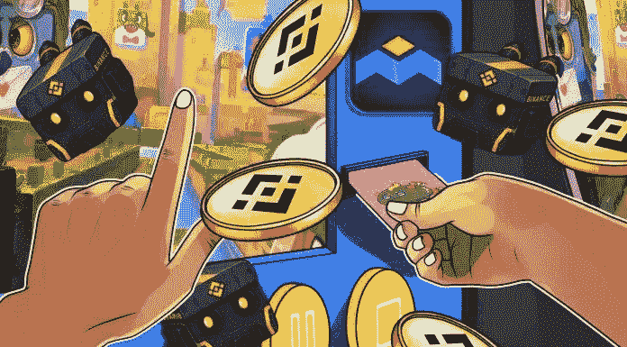
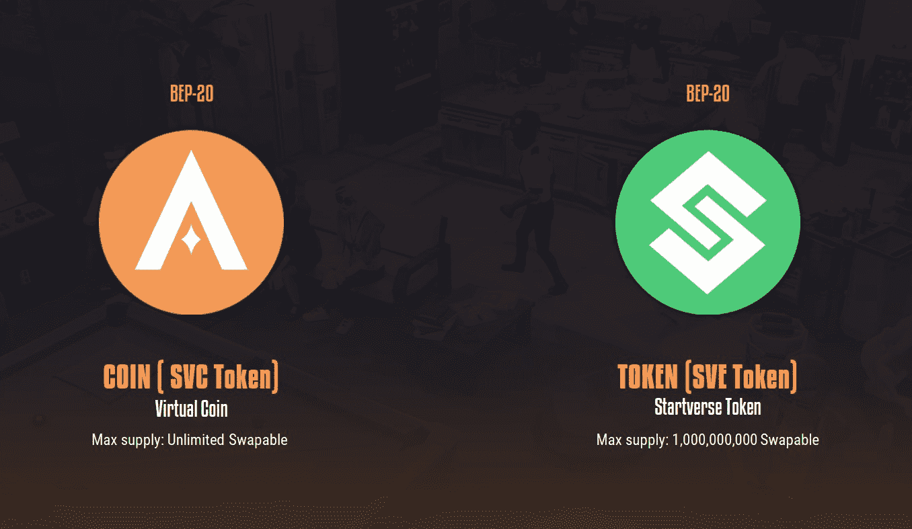
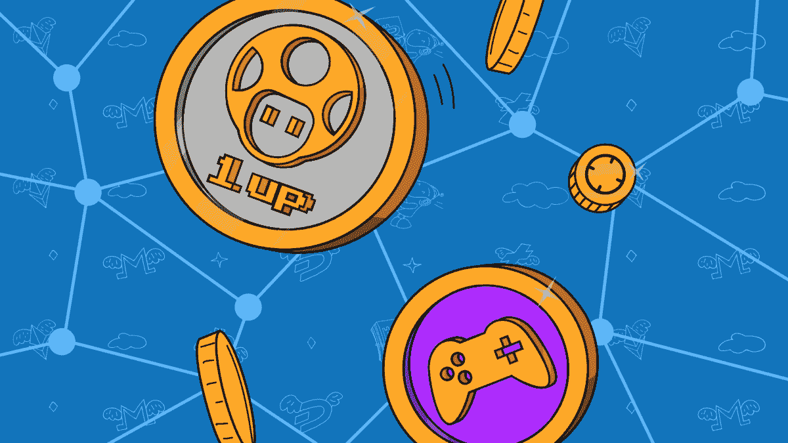
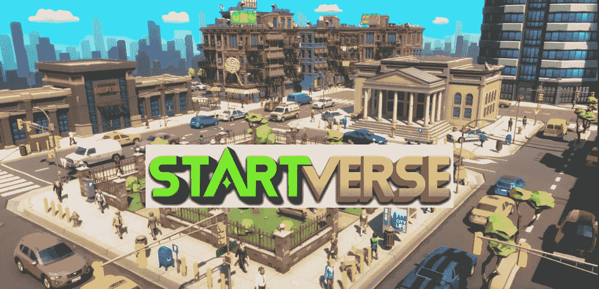

# GameFi:游戏和金融的结合

> 原文：<https://medium.com/coinmonks/gamefi-a-combination-of-gaming-and-finance-b3da99037481?source=collection_archive---------73----------------------->

## 下一代游戏

游戏业务现在的价值超过 1750 亿美元，预计到 2023 年将接近 2000 亿美元。另一方面，加密货币在不断变化和增加。如此大的市场份额和加密货币的适应性，这两种趋势碰撞成为 GameFi 只是时间问题。

**GameFi 到底是什么？**

简单说，GameFi 是游戏(游戏)和金钱(金融)的混合体。这是一个人们可以通过玩游戏赚钱的网站。GameFi 不局限于任何一种技术或平台，因为它包含了广泛的游戏、规则和结构。

GameFi 游戏旨在让玩家赚钱，但他们必须首先在钱包中拥有游戏或合作伙伴的原生加密货币形式的资产。新用户可以开始玩游戏，并从各种活动中受益，如完成任务或从游戏中的资产中赚钱。他们也可以通过使用 DeFi 服务获得被动收入。

**GameFi 的结构**

GameFi 应用程序有各种形状和大小，但它们都有一些基本的构建模块:

**Play2Earn**

玩家可以使用 Play2Earn 赚取游戏内资产。然而，与传统游戏不同的是，GameFi 的钱可以通过比特币转账转移到现实世界。

玩家通过参与游戏的生态系统和花费他们的本地资金来帮助创作者和其他玩家。这些游戏的可转让价值越高，它们就越受欢迎。同时，玩家在游戏中获得的东西越多，他或她能够卖出的硬币就越多。

在 CoinEx 平台上交易的受欢迎的 GameFi 代币的价值飙升了 400%，表明有几种盈利方式。

**不可替换令牌(NFT)**

在几个 GameFi 游戏中，NFT 被用作游戏中的角色或资产，为独特的 NFT 交换创造了机会。然后这些 NFT 可以在像 OpenSea 这样的网站上交换，创造一个繁荣的收藏家市场。

**DeFi 的特点**

除了 Play2Earn 功能之外，一些 GameFi 计划还提供被动收入。他们使用的一些 DeFi 功能包括赌注、产量农业和流动性开采。

**原始令牌**

每个游戏都有自己的令牌，用于操作游戏、分配奖励和保存 GameFi 项目的价值。例如，Startverse 使用两个代币:一个用于管理 Startverse 硬币(SVC ),另一个用于奖励 Startverse 代币(SVE)。

**Startverse’s Tokens**

**区块链技术**

比特币区块链被用来创建第一个 GameFi 游戏。然而，当 GameFis 的规模和复杂性增加时，他们开始使用像以太坊这样的 DApp 区块链。主要问题是以太坊的收费仍然过高，而且处理速度很差。因此，许多 GameFi 应用程序，如 Wax 和 Solana，都位于速度更快的区块链上。

**GameFi 有能力建立长期经济趋势吗？**

GameFi 平台有很大的改进空间，包括:

● GameFi 的价值和用户群正在稳步上升，从而创造出新的资产。Axie Infinity 是一个受欢迎的 NFT GameFi 平台，在 2021 年 8 月成为第一个令牌总销售额达到 10 亿美元的区块链游戏，日用户超过 100 万。

●随着游戏世界变得越来越大，它们开始包含真正的赚钱属性。

例如，游戏玩家可以购买虚拟土地并建造一个赌场，其他玩家可以使用加密令牌下注。GameFi 应用程序也通过利用 DApp 支持的区块链打开了无限的发展机会。

●除了上面列出的职位，GameFi 还为世界各地的人们创造了更多的职业机会，包括设计师、软件工程师和经理等。

**GameFi 的未来**

GameFi 为玩家提供了一种新的方法，既能在加密领域获利，又能享受乐趣。根据对游戏时“快乐荷尔蒙”多巴胺产生的研究，再加上对游戏的热情，用户可能会大幅增长。

此外，通过拥抱 DeFi 和 NFTs 等增长领域，GameFi 已经做好了从这些机会中获益的准备。如果一个人能在一个游戏中聚集不常见的 NFT，尤其是 NFT，他们会在游戏中投入更多，并要求其他人加入。

GameFi 是一个集成游戏，包括各种流行和有利可图的加密领域，如 DeFi 和 NFT。对于用户和创作者来说，这似乎是一个美好的赚钱前景，有这么多的人对此感兴趣并渴望花费时间和金钱。大型科技企业也可能有兴趣投资这一领域。

另一个可能推动增长的因素是该公司未来去中心化的目标。个人将能够真正改变游戏的玩法，从而提高参与度。

最后，一个有趣的概念是未来职业在 GameFi 上的实现。由于新冠肺炎，世界最近已经过渡到在线工作的生活方式，使得像看医生或在虚拟现实中在线咨询这样的事情更加便宜。患有焦虑症、害怕失忆的人，或者只是喜欢呆在家里参加某项活动的人可能会觉得这很有吸引力。

在 GameFi 中，我们可以期待看到很多新的开发和升级。它有很多进一步发展的可能性，因为它有能力与趋势多样化，并纳入新的 DeFi 和 DAO 计划。

**Startverse GameFi**

Startverse 是一款元宇宙游戏，GameFi 面向所有想要建立自己的创业公司的人。在这里，你可以成为老板、著名的艺术家、英俊的披萨外卖员，你甚至可以成为赌场的老板，或者建立一个专门从事土地承包的行会，随心所欲地经营你的帝国！

要在游戏中成功，你必须在事业和人际关系两方面都成功。玩家必须满足他们的需求，平衡睡眠、饮食、工作、健身，就像真正的人类一样。他们还需要找工作或建立自己的公司来赚钱。游戏的真正目标是帮助你的角色用他梦想的职业获得成功。

最新的虚拟现实技术被实施到 Startverse 中，以在虚拟世界中带来独特的 3D 体验。我们的游戏将支持运行于:

●移动端:安卓、IOS。

● WebGL 和 PC。

游戏流派:模拟，管理，VR。

年龄:9 岁以上

希望这篇文章给你提供了有用的信息。如果你有任何问题或者想和 **Startverse** 讨论这个帖子，请在下面留下评论！

*在****Startverse****加入来自世界各地的创业公司、老板、土地所有者的社区，同时接收最新的项目新闻，享受特别内容:*

[网站](https://startverse.io/) | [脸书](https://www.facebook.com/Startverse-Global-102077955725659/) | [推特](https://twitter.com/StartverseGame) | [不和](https://discord.gg/cfUSrHUvSz) | [电报](https://t.me/StarverseGlobal) | [白皮书](https://whitepaper.startverse.io/)