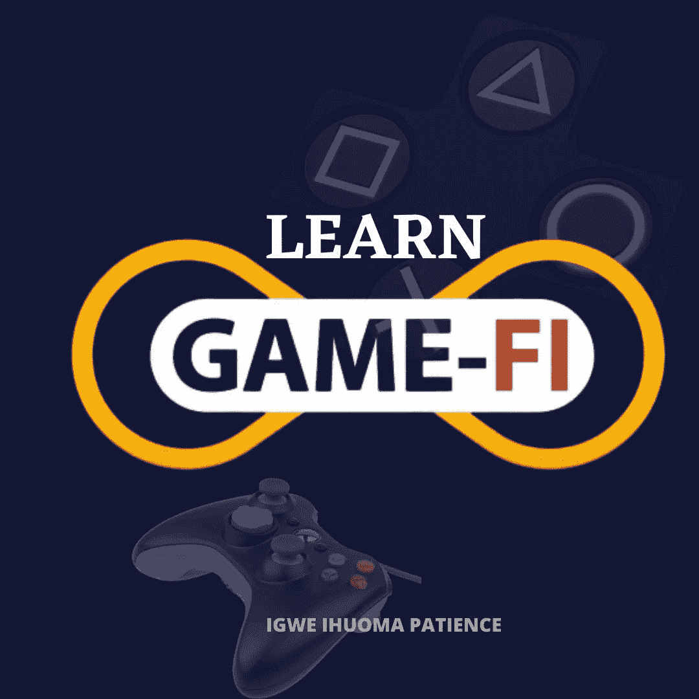

# GAMEFI——通过区块链挣钱

> 原文：<https://medium.com/coinmonks/gamefi-earn-money-through-blockchain-3d911ad4fcce?source=collection_archive---------31----------------------->

# **GAMEFI 的一般概念**

在继续之前，理解“gamefi”的一般概念是很重要的。首先，gamefi 是游戏和 fi 两个词的内涵。为了更好地理解，我们将分别解释这两个隐含的词。简单地说，游戏是我们为了娱乐和消遣而进行的活动。因此，游戏可以以各种方式、形式或模式出现，但最终目标是为玩家提供乐趣。

第二个含义世界“fi”简单地代表金融，这是所有关于钱。把这两个词连在一起给了我们 Gamefi。根据上面的解释，我们现在可以将“gamefi”称为“fun-money”。

人类生活被如此多的活动所包围，尤其是那些倾向于改善我们生活财务状况的活动，然后我们几乎没有时间休闲。因此，Gamefi 的出现不仅仅是为了增加收入，也是为了确保我们在享受的同时做到这一点。换句话说，gamefi 让我们在娱乐的同时赚钱，让我们的思想和灵魂保持活跃。这只是区块链工业带给世界的突破性创新之一。

## 现在什么是 Gamefi？

从上面我们已经解释的 gamefi 的一般概念来看，我们现在可以看到 Gamefi 非常容易理解。这只是一种简单的活动，通过玩游戏和娱乐来赚钱。惊讶吗？这是实地的现实。就像传统游戏一样，Gamefi 有很多种形式，因此玩家在玩游戏时产生收入的技术也各不相同。

## GameFi 的历史

Gamefi 现在已经有一段时间了，可以说和比特币一样古老。尽管这个词最近才开始流行，GameFi 的历史几乎和比特币一样早。这是我们考虑 Bombermine 和 P2P 服务等活动的时候，这些活动使游戏玩家能够利用比特币将主流游戏货币化。这代表了我们现在认为的 GameFi 领域的一些最早的努力。

然而，当区块链游戏发布平台 MixMarvel 的创始人在 2019 年 11 月在中国举行的乌镇世界区块链大会上发表演讲时，Gamefi 全面登场。这些演讲是关于加密货币的技术如何能够彻底改变视频游戏行业。更著名也是最近，这个词显然是由 Andre Cronje 首先使用的，他是渴望的创始人，在他的一条推文中。从那以后，这个术语被更加清晰和确定地用来描述由区块链技术支持的金融元素的游戏。2015 年，以太坊凭借其编程语言的复杂性为视频游戏开发者提供了新的机会。这意味着程序第一次可以在链上存储和执行，从而能够创建应用程序。例如，像 CryptoKitties 这样的区块链游戏，以不可替换令牌(NFT)的形式利用游戏中的资产，代表了这个行业的一个巨大创新。

现在，我们已经开始看到这些努力的成果，区块链游戏正在世界舞台上零星地成长。这在 Axie Infinity 的成功中显而易见(不考虑最近的黑客攻击)。2021 年 8 月，Axie Infinity 成为第一款代币总销售额超过 10 亿美元的区块链游戏。它还拥有超过 100 万的每日活跃玩家，进展令人兴奋。但是它是如何工作的呢？

# GameFi 游戏如何工作

就像其他传统的区块链技术驱动的活动一样，Gamfi 使用分布式账本技术。这不仅对帮助玩家提供可验证的资产所有权很重要，对建立游戏内外的交易市场也很重要。

在这项创新中，所有对象都被表示为区块链网络上的令牌。因此，在这个基于区块链的游戏中，每一把剑、盔甲和其他数字资产都可以归你或任何人所有。换句话说，在基于区块链的游戏中，每个玩家既是参与者又是所有者。玩好游戏可以让你积累更多的游戏币。这里的关键是，一旦你获得了你的资产，你就可以用它们在市场上兑换其他加密货币——或者像美元这样的法定货币——来获得可支配收入。

一般来说，游戏中的物品是不可替换的令牌(NFT)。它们通常以各种形式出现。你拥有你获得的任何一个，它们就成为你的资产。玩家在游戏中获得这些物品，并可以在 NFT 市场进行交易。

除了在游戏中提高你的等级和获得奖励，你还可以通过许多其他方式在 GameFi 中赚外快。有一些项目可以让你在赌比赛的同时通过预测赚钱。其他一些允许你收购，像土地和其他项目可以出租。此外，用户可以通过参加比赛来增加他们的游戏收入。GameFi 生态系统是安全的，因为所有关于奖励、成就和所有权等信息都存储在公共区块链中。这种机制允许用户完全拥有和控制游戏资产，而不是由第三方控制。

# 在 GAMEFI 中赚钱的方法

在 gamefi 中有很多赚钱的方法，但我们现在只限于其中最重要或最常见的两种。他们是

*   **先玩后赚(P2E) :** 这是最受欢迎的模式。游戏玩家在完成游戏目标/要求后获得奖励。这种模式带来的回报来自智能合约中的本地令牌储备。
*   **资产所有权:**在这种游戏模式中，玩家有能力在游戏中创造一些独特的东西，他们可以轻松地出售，出租给其他有意或愿意的用户，从而赚些钱。比特币通过区块链引入了数字稀缺，以太网的 NFT 技术在此基础上进行扩展。NFT 可以灵活地表示所有种类的资产，无论其性质和特征如何。因此，这使得用户可以很大程度上控制你的产品，在这里，你的才华发挥了作用，你不仅有能力成为一名玩家，也有能力成为一名创造者，你可以决定你的作品在数字市场上的销量。

还有很多其他方式可以通过 gamefi 赚钱，比如采矿、赌博等。

# 玩区块链游戏之前要做的第一件事

每一场区块链比赛都有其独特之处。我们将关注你可以开始使用 Gamefi 的基本方法。

*   首先，你需要创建一个 web 3.0 钱包。这是因为大多数区块链游戏没有利用我们常用的用户名和密码帐户模型。因此，玩家必须通过使用 Web 3.0 钱包来识别和控制事物。点击[这里](https://www.linkedin.com/pulse/web30-evolution-internet-patience-igwe/?trackingId=gFJ2szkVQ5iEJtzWbZN2yA%3D%3D)了解更多关于 web3.0 的信息
*   其次，你必须知道你的幻想或你真正想要的是什么，这将使你能够决定你感兴趣的游戏的性质和类型，然后你去做。

注意:一定要仔细阅读指导每场比赛的规则，因为每场比赛的规则都不一样。

# 结论

从我们对 so for 的讨论中，我们已经很清楚的解释了 gamefi 到底是怎么回事，也就是概念，历史，在这个平台上怎么玩，怎么赚。Gamefi 简单地代表了你在玩游戏的过程中，在最大限度地控制一切的情况下，通过乐趣和幻想的结合来赚钱的能力。这是另一项独特的创新，表明区块链技术不仅是世界经济的未来，也是人类生活方式的未来。你玩得越努力、越聪明，你肯定会赚得越多。努力地玩，聪明地玩，玩得开心，然后赚钱。

那么，你还在等什么开始赚钱呢？此外，不要犹豫，放下你对你所学到的东西和你希望我接下来写的主题的评论。

谢了。

# 关于作者

Igwe Ihuoma Patience 是一名自学成才的创意和行业特定内容作家，加密货币爱好者，拥有 2 年多的经验和不断发展的区块链空间的知识。

我擅长内容创作、文案写作、字幕管理、视频编辑和手机图形设计，我教其他人如何在加密货币和区块链领域起步，我的目标是让区块链的学习和更新易于任何人理解。

> 加入 Coinmonks [电报频道](https://t.me/coincodecap)和 [Youtube 频道](https://www.youtube.com/c/coinmonks/videos)了解加密交易和投资

# 另外，阅读

*   [Bookmap 点评](https://coincodecap.com/bookmap-review-2021-best-trading-software) | [美国 5 大最佳加密交易所](https://coincodecap.com/crypto-exchange-usa)
*   最佳加密[硬件钱包](/coinmonks/hardware-wallets-dfa1211730c6) | [Bitbns 评论](/coinmonks/bitbns-review-38256a07e161)
*   [新加坡十大最佳加密交易所](https://coincodecap.com/crypto-exchange-in-singapore) | [购买 AXS](https://coincodecap.com/buy-axs-token)
*   [红狗赌场评论](https://coincodecap.com/red-dog-casino-review) | [Swyftx 评论](https://coincodecap.com/swyftx-review) | [CoinGate 评论](https://coincodecap.com/coingate-review)
*   [投资印度的最佳密码](https://coincodecap.com/best-crypto-to-invest-in-india-in-2021)|[WazirX P2P](https://coincodecap.com/wazirx-p2p)|[Hi Dollar Review](https://coincodecap.com/hi-dollar-review)