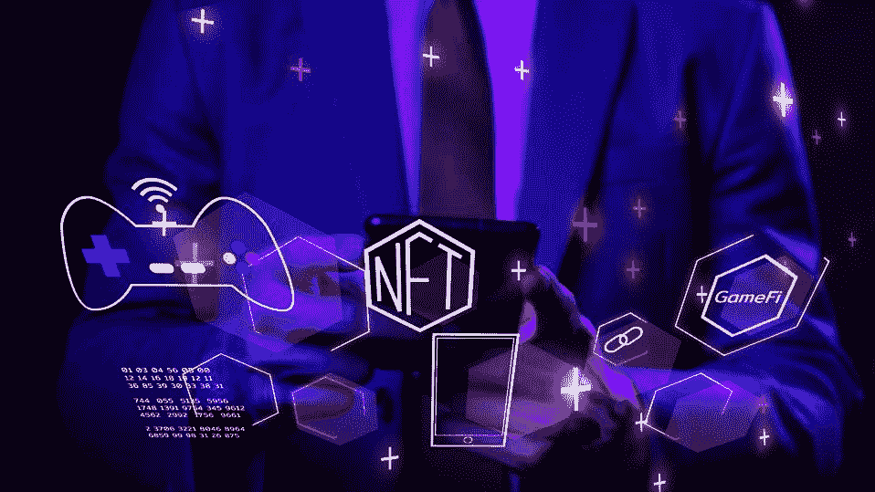
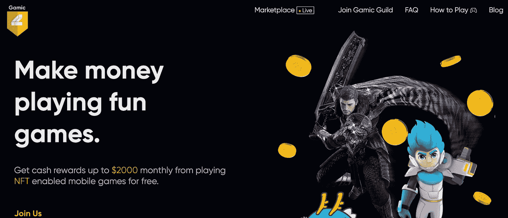

# GameFi 新一代游戏

> 原文：<https://medium.com/coinmonks/gamefi-the-new-generation-of-gaming-d9e011c71f0a?source=collection_archive---------13----------------------->

Image from [https://www.forbes.com/](https://www.forbes.com/)

> GameFi 是什么？GameFi 是如何工作的？玩游戏怎么赚？？？
> 
> 这是对基于区块链技术的 GameFi 和玩赚游戏的介绍。玩家现在可以通过玩他们最喜欢的游戏和将游戏内资产(NFT 和游戏内代币)兑换成现金来建立职业生涯并实时赚取收入。
> 
> 不要忘记点击关注按钮来阅读更多类似本文的简化文章；-)

对竞争力、更高收入、放松和其他因素的不断增长的需求导致了全世界玩家数量的大幅增长，产生了近年来游戏意识的激增。超过 30 亿人玩游戏，超过世界人口的 40%，这个行业得到了很多关注，据估计目前价值超过 3000 亿美元。

2020 年的新冠肺炎封锁极大地促进了在线游戏行业的发展。这导致了游戏玩家数量的增加，因为许多人都在寻找方法来打发封锁期间的时间。人们会认为游戏玩家的数量会大幅下降，因为封锁现在已经解除，但事实并非如此，因为该行业仍在继续扩张。

目前世界人口超过 78 亿，65 岁及以下人口占总人口的 90%以上，可以说世界上的人口都是年轻人。2021 年 7 月进行的一项[调查显示，美国超过 80%的电子游戏玩家年龄在 54 岁以下。这总是意味着大多数对游戏感兴趣的人是年轻人。](https://www.statista.com/statistics/189582/age-of-us-video-game-players/)

# DeFi 和 GameFi 的关系

加密货币行业是另一个近年来备受关注的领域。随着他们巨大的接受和扩张，DeFi，NFTs 和 GameFi 继续席卷全球。NFT 增长的主要驱动力之一是该行业转化为创作者和所有者价值的潜力，如视频游戏(GameFi)等创新用例所示。

GameFi 体现了两个词的组合，游戏和[去中心化金融(DeFi)](https://coinmarketcap.com/alexandria/glossary/defi) ，它将区块链技术融入到游戏中，从而在游戏中实现去中心化。GameFi 利用 DeFi 产品，如[【NFT】(不可替代的代币)](https://coinmarketcap.com/alexandria/glossary/non-fungible-token)、、借贷，在某些情况下，还为游戏内资产提供了一个集成市场。

游戏玩家可以使用 GameFi 同时玩游戏和接受奖励，GameFi 是游戏和 DeFi 的混合体。玩家在虚拟世界的在线比赛中竞争，通过努力获得代币和 NFT 形式的现金奖励。

# 从玩到赚(P2E)，新的标准

在传统游戏中，玩家的游戏内资产在游戏网站之外没有任何价值。玩家把钱投入到这些资产中，但是他们对这些资产没有完全的控制权，也没有任何实际价值。GameFi 使用区块链技术、DeFi 解决方案和 NFTs 来解决这个问题。

通过奖励用户玩他们喜欢的游戏，GameFi 让游戏变得有利可图。这些奖励可以是游戏中的代币、游戏中的资产(土地、爱情、特殊角色等等)，或者是在游戏中可以获得的简单明了的 NFT。

GameFi 通过确保玩家而非创作者拥有和管理所有游戏内资产来实现权力分散。因为所有交易都在区块链上验证和处理，所以这种方法消除了对任何形式的服务器基础设施的需要，并消除了游戏黑客或作弊的机会。

**一些 GameFi 平台及其工作原理**

GameFi 平台目前在这个婴儿领域举足轻重的例子有 [Axie Infinity](https://axieinfinity.com/) 、 [CryoWar](https://cryowar.com/) 、 [GodsUnchained](https://godsunchained.com/) 、 [Thetan arena](https://thetanarena.com/) 等。

*   **Axie Infinity**——Axie Infinity 是一款基于区块链的游戏，玩家通过繁殖、培养和对抗 Axie(怪物)来获得奖励。拥有 Axie 是在平台上赚钱的一个选择，因为每个 Axie 都有作为不可替代令牌(NFTs)的内在价值。它们也可能繁殖，导致一个新轴的诞生。这只是你在玩 Axie infinity 游戏中获得的众多方式中的两种。
*   CryoWar 是一款基于虚幻引擎的多人 PVP 竞技场 NFT 游戏，在 Solana 网络上运行。这是一场全力以赴的技能之战，最伟大的玩家争夺资源、领土和世界主导权。你可以玩 PVP 的最后一个人站着，其中赢家获得所有的奖励；PVP 死斗，只有一个玩家存活；PVP 时间模式，5 分钟内得分最高的玩家被宣布获胜；PVP 战斗竞技场，玩家被分组并与对方或人工智能战斗，以及其他选项来赚取$CWAR，这是冰冻战争生态系统的原生公用令牌。
*   **《被解放的神》** —《被解放的神》是一款在线游戏。它的交易卡是不可替代的代币(NFT ),具有基于神代币的真实世界价值。有两种基本的方法来赚取上帝的释放。您可以通过出售您在升级时获得的卡(NFT)和在活动中获得的卡来赢取奖励。第二种方式是通过上帝的令牌空投奖品。
*   **Thetan Arena** — Thetan Arena 是一个位于区块链的电子竞技竞技场。只有你的才华，你可能会召集你的朋友，建立一个团队，与他人作战，并产生收入。这支越来越疯狂的 mode 小队冲向对方的基地去摧毁他们的 nexus(塔)。你可以通过各种方式玩 Thetan Arena 来赚钱。你可以利用免费(普通)英雄参与战斗，并赚取足够的游戏内 Thetan 硬币($THC)继续玩。你也可以同时使用$THC 和$THG 来解锁箱子并获得额外的英雄。高级英雄允许玩家将游戏时间用于升级，并可能以$THC 进行交易。此外，你可以雇佣额外的英雄来参加许多特殊的活动，以赚取额外的$THC 和$THG。

## **游戏公会；他们在帮助你建立成功的 GameFi 职业生涯中的角色**

随着对 P2E 游戏的需求大幅增加，游戏公会最近变得很受欢迎。游戏公会由投资者、游戏玩家和管理员组成，这些管理员为无力负担游戏内资产(如 NFT 形式的土地)的玩家充当托管人。公会获得这些资产，然后将它们借给成千上万的玩家，这些玩家通过在各自的虚拟世界中使用这些游戏资产来赚取回报。

大多数公会收取公会费用，他们作为一个公会从中获利，也分享借用公会资产的玩家实现的利润。大部分收益都被投入到游戏公会的发展中。顶级加密 P2E 游戏公会的一个例子是 Gamic。

**关于游戏公会你需要知道的一切**

Gamic Guild 是非洲最大的游戏公会，在 Discord 社区拥有超过 15000 名会员。Gamic 是一个顶级游戏公会，为玩家提供多样化的 NFT 游戏选择，同时也为他们提供了额外的收入来源。

[https://gamic.app/](https://gamic.app/)

Gamic 的主要目标是成为 play2earn 在非洲大陆的入口，其使命是为非洲人提供一个在 21 世纪创造财富的平台。

公会提供类似 Lazo 的独特服务。Lazo 是一个实体游戏社区中心，学生可以利用提供的电脑玩 P2E 电脑游戏。Gamic 现在正在与非洲大陆各地的网吧和游戏中心合作开发 Lazos，为这些公司提供新的收入来源。

Gamic 还提供其他功能/服务，如 Gamic 子公会和公会即服务(GAAS)。子公会功能使任何人都可以开始、发展和有效地运行公会，而 GAAS 功能是一个用户友好、简单和清晰的解决方案，用于支持、管理和扩展公会。使用 Gamic guild 提供的 GAAS 功能，可以租借游戏资产，检查玩家分析，跟踪收入，资产使用率，现金出口(受支持的位置)，等等。

Gamic 也是非洲 [Thetan arena](https://thetanarena.com/) 的主要推动者。公会向大量买不起游戏的人介绍和提供玩游戏所需的工具和资源，并指导他们完成游戏的机制。

你可以查看[游戏公会网站](https://gamic.app/)，或者点击[链接来访问你需要知道的关于游戏公会的一切](https://linktr.ee/gamicguild)。

**最终想法**

GameFi 行业仍然是一个婴儿，许多投资者正在投入他们的信念和资源，确保该行业继续增长。玩家现在可以在家中舒适地玩游戏，赚取真正的收入。如果您没有玩这些游戏并从中获利所需的资源，加入游戏公会可能会让您的旅程更轻松、更美好。

> 如果你还有任何问题，请留下评论，或者更好的是，在 Twitter 上直接给我发消息( [@lanre_aderemi](http://twitter.com/lanre_aderemi) )，我会尽快回复。感谢您的阅读，如果您能为我鼓掌，那就太好了！

不要忘了点击关注按钮来阅读更多像这样的故事；-)

> 加入 Coinmonks [电报频道](https://t.me/coincodecap)和 [Youtube 频道](https://www.youtube.com/c/coinmonks/videos)了解加密交易和投资

# 另外，阅读

*   [3 商业评论](/coinmonks/3commas-review-an-excellent-crypto-trading-bot-2020-1313a58bec92) | [Pionex 评论](https://coincodecap.com/pionex-review-exchange-with-crypto-trading-bot) | [Coinrule 评论](/coinmonks/coinrule-review-2021-a-beginner-friendly-crypto-trading-bot-daf0504848ba)
*   [莱杰 vs n rave](/coinmonks/ledger-vs-ngrave-zero-7e40f0c1d694)|[莱杰 nano s vs x](/coinmonks/ledger-nano-s-vs-x-battery-hardware-price-storage-59a6663fe3b0) | [币安评论](/coinmonks/binance-review-ee10d3bf3b6e)
*   [Bybit Exchange 审查](/coinmonks/bybit-exchange-review-dbd570019b71) | [Bityard 审查](https://coincodecap.com/bityard-reivew) | [Jet-Bot 审查](https://coincodecap.com/jet-bot-review)
*   [3 commas vs crypto hopper](/coinmonks/3commas-vs-pionex-vs-cryptohopper-best-crypto-bot-6a98d2baa203)|[赚取加密利息](/coinmonks/earn-crypto-interest-b10b810fdda3)
*   最好的比特币[硬件钱包](/coinmonks/hardware-wallets-dfa1211730c6) | [BitBox02 回顾](/coinmonks/bitbox02-review-your-swiss-bitcoin-hardware-wallet-c36c88fff29)