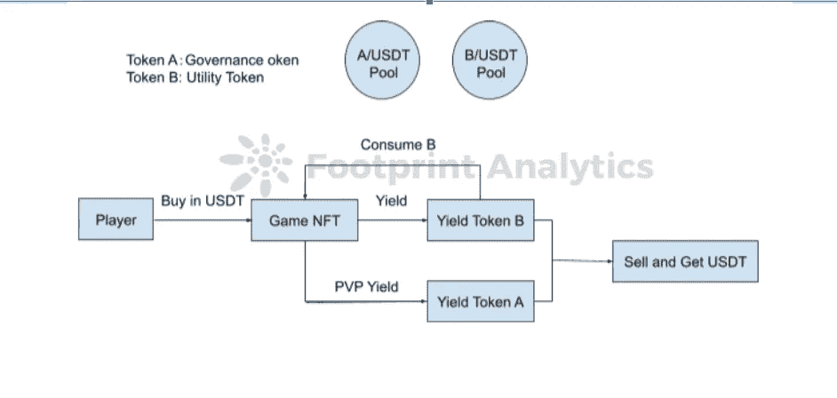
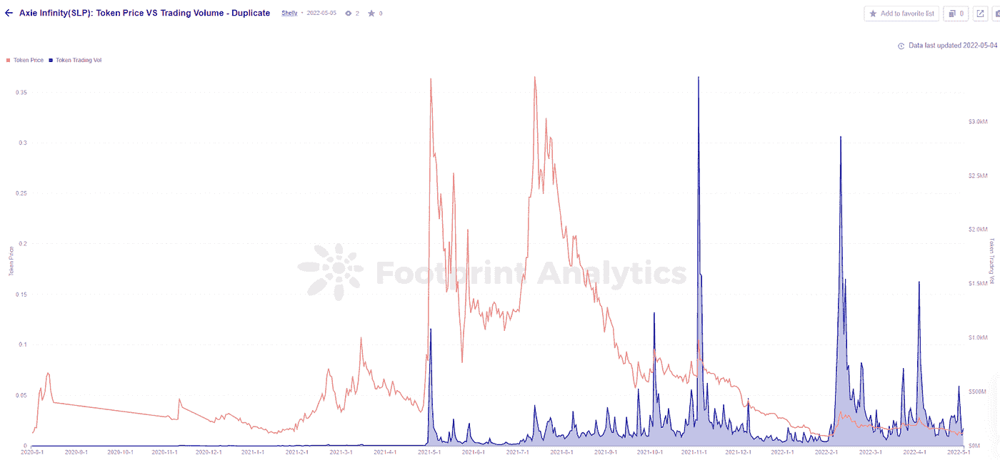

# 游戏币组学 101:双游戏币区块链游戏

> 原文：<https://medium.com/coinmonks/gamefi-tokenomics-101-dual-token-blockchain-games-44225d911759?source=collection_archive---------25----------------------->

在[之前的文章](https://cryptoslate.com/gamefi-tokenomics-101-single-token-blockchain-games/)中，我们介绍了单令牌区块链游戏的三种令牌组学模型及其各自的优缺点。

在本文中，我们将讨论双令牌项目，这是继目前最流行的单令牌游戏之后的一项创新。

双令牌模式出现在 2020 年上半年，当时 Axie Infinity 推出了 SLP(流畅的爱情药水)，以减少对 Axie Infinity 最初的游戏令牌 AXS 的销售压力。

从那以后，几乎所有的主要品牌都有了双令牌经济。

**为了理解双令牌游戏是如何工作的以及为什么这种模式存在，我们应该看看** [**Axie**](https://www.footprint.network/@Leslie/Axie-Infinity-Dashboard) **是如何推出 SLP 的。**

在引入 SLP 之前，Axie 是一个单令牌 GameFi，玩家输入美元并获得游戏令牌 AXS。随着巨大的用户增长和来自许多支持市场的私募股权基金的资金，Axie 成功地在一个令牌上运行了一年多。

然而，Axie 不难意识到新用户对项目的重要性。一旦新的资金停止流入，死亡螺旋就会开始。

为了减轻 AXS 的抛售压力，阿谢在2020 **推出了 SLP。**AXS 被用于治理和赌注奖励，玩家可以使用游戏内的效用令牌 SLP 来培育新的 Axies，赚取更多的 SLP。开发小组增加了繁殖所需的 AXS -- SLP 的比例，并增加了繁殖所需的 SLP 的数量。

起初，新模式按计划运行。根据 Footprint Analytics 的数据， [AXS 的价格](https://www.footprint.network/guest/chart/Axie-Infinity-Token-Price-%26-Trading-Vol-Duplicate-fp-0f484713-5030-4a34-a63f-e82e2bc3c4a9)在 [SLP](https://www.footprint.network/guest/chart/Axie-infinity(SLP)%3A-Token-Price-VS-Trading-Volume-Duplicate-fp-b63a0329-b3ca-4bd3-8ca6-0aa0b4db46d5) 被带到游戏中之后就开始飙升，而 SLP 的代币价格在几个月内都低于 0.1 美元。自 GameFi 夏季以来，SLP 已经看到了新来者的上升趋势。

然而，这种趋势没有持续很久，SLP 很快陷入了死亡漩涡。Axie 团队的回应是改变社区治理结构，变得更加分散。他们还删除了 SLP，因为游戏的 PVE(玩家与环境)在 2 月 9 日产生了收益，以减少 SLP 的造币厂和供应。随着这些变化，SLP 的价格上涨了。

双令牌模型已经固化，其中一个令牌主要用于治理，拥有更多令牌可以让持有者在社区投票中对项目拥有更多投票权，另一个令牌用于游戏内功能，即公用设施令牌。在今天的大多数游戏中，玩家在通常价值较低的效用币中获得大部分收益，在治理币中获得一点额外收益，例如，如果他们拥有有价值的 NFT。

除了 Axie，其他几个流行的 GameFi 项目，如 [BinaryX](https://www.footprint.network/guest/dashboard/GameFi-BinaryX-Dashboard-fp-539cadd9-3836-4791-b37a-54b18a16f320) 和 [Starsharks](https://www.footprint.network/guest/dashboard/Address-Analysis-of-Starsharks-fp-9e4fe33d-cba4-4706-824a-438b3bbd7857?gamefi_name=starsharks) 也使用双令牌模型。

**两种不同类别的双代币 GameFi**

新发布的双令牌 GameFi 项目大多采用“输入游戏令牌，输出游戏令牌”的模式。

例如，BinaryX 玩家使用治理令牌开始游戏并产生效用令牌作为回报，而 Starsharks 玩家在游戏中开始并产生效用令牌。

从上一篇文章中我们知道，在这个模型中，成本和回报都与代币价格高度相关。与基于美元价值的模型相比，使用双重令牌，无需集中调整，就可以更容易地调整令牌模型。基于美元的模型要求 oracle 指定相应令牌的数量，这使得双令牌模型变得复杂。

在这篇文章中，我们提供了一种划分不同类别的双令牌 GameFi 的分析方法:在出售《创世纪 NFT》之后，项目所有者使用什么方法来增加市场上的 NFT 数量，以满足新玩家对 NFT 的需求？

在一开始，GameFi 的大部分项目都会在官方平台或合作伙伴平台如币安 NFT 或 Opensea 上销售《创世纪 NFT 》,以积累初始玩家。然后，他们有几种机制来铸造更多的非功能性食物，同时刺激代币消费。其中包括:

1.  **养殖模式:**该模式中，二代 NFT 及后续 NFT 均来自 Genesis NFTs 的养殖，不再有盲箱出售。这种机制需要燃烧/花费代币来铸造新的 NFTs，这允许游戏根据铸造的价格来影响代币的销售压力。
2.  **盲箱模式:**与育种模式相比，盲箱简单。游戏中 NFT 的数量是团队定的，行情好或者消费上去了，玩家卖的多。这抬高了代币的价格，因为他们需要代币来购买 NFT。

然而，所有雄心勃勃、目光长远的项目都将宣布，盲盒销售的大部分资金，无论是 USDT 还是公用事业代币，都将直接进入社区国库或被烧掉。Starsharks 之所以如此受欢迎，是因为它宣布烧掉盲盒销售中 90%的效用令牌。

**双令牌 GameFi 令牌组学概述**

[Tokenomics](https://www.footprint.network/@rogerD/Tokenomics-of-(Token)?token_address=0x26193c7fa4354ae49ec53ea2cebc513dc39a10aa) 是 GameFi 项目的重要组成部分，此外还有新玩家数量、活跃玩家数量以及产出和消费之间的对比等指标。

随着 GameFi 的发展，每个周期都会出现新的经济模式和创新，每种模式都有自己的优缺点。认真的投资者还可以学习在特定的 tokenomic 模型中发现趋势，以确定底部时间，预测 FOMO 通胀，在底部稳定期间产生收益，以及其他策略。

[一篇文章](https://mirror.xyz/iamwgg.eth/VHpC5kG5GurbKgC8CsuP5p1lGpz74ho5qNumJgvSY4E)由西瓜游戏公会原创，由[足迹分析](https://www.footprint.network/dashboards)社区编辑。

Footprint 社区是一个世界各地的数据和加密爱好者相互帮助了解和获得关于 Web3、元宇宙、DeFi、GameFi 或区块链世界任何其他地区的见解的地方。在这里，你会发现活跃的、不同的声音相互支持，推动着社区向前发展。