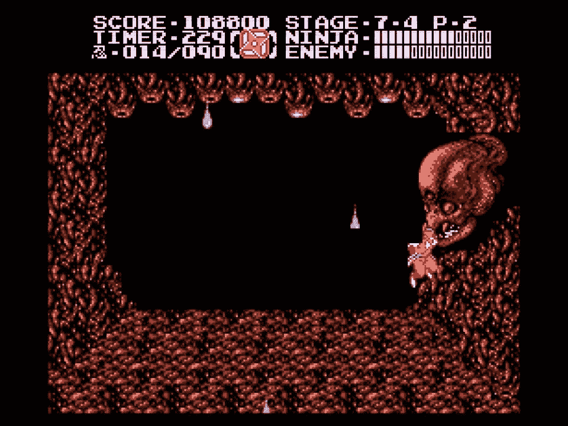

# 随着年龄的增长，游戏不再是你的概念

> 原文：<https://medium.com/coinmonks/gaming-as-we-age-not-a-you-concept-b0f7e0d6ca27?source=collection_archive---------34----------------------->

曾经很难的事现在变得轻而易举！

My ‘bully’ at 11 years old!

曾经很难的事情现在变得轻而易举，曾经令人哭泣的游戏现在变成了一个大笑话。我在 YouTube 上给我的游戏音乐列表添加了一些音乐，于是我有了写这篇文章的想法。

我记得当我 11 岁的时候，我在 NES 玩忍者外传 2。伟大的游戏，可怕的挑战和整体优秀的游戏性。杰奎奥，我是谁…